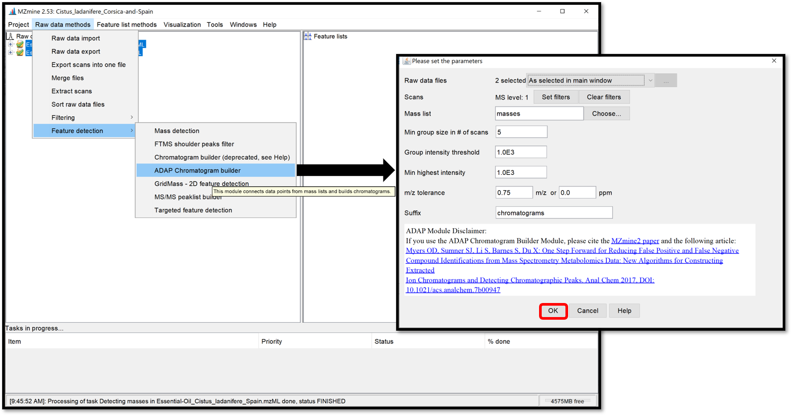
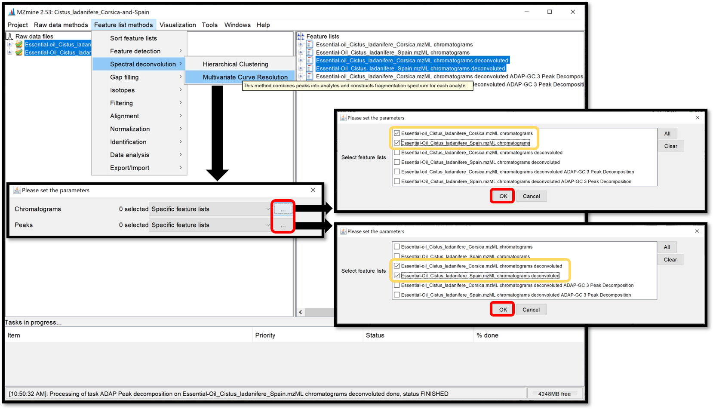
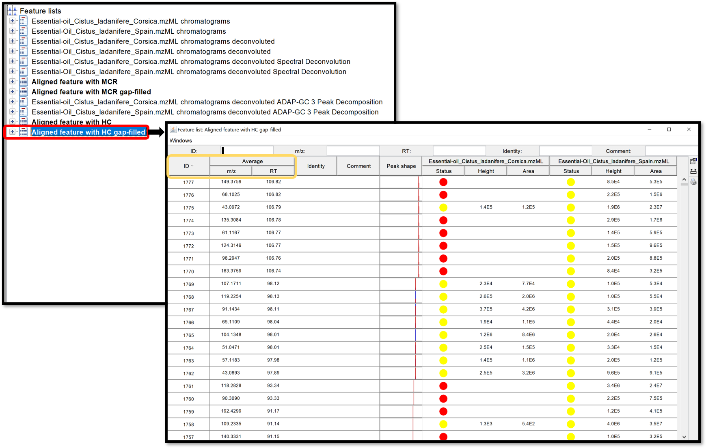
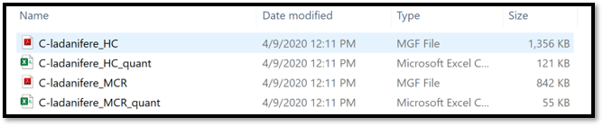

Below, we describe briefly how to perform pre-processing GC-MS data. To do that, the following steps are required:

1. the detection of mass from the .mzML files to build extracted ion chromatograms

2. the detection of peaks from the built chromatograms

3. the spectral deconvolution with two differents path (two spectral deconvolution algorithm)

4. 1. Hierarchical Clustering
   2. Multivariate Curve Resolution

5. the alignment of the peak lists

6. the missing peaks search

For detailed instructions and more information about parameters used in the steps 1/2/4, see the section of pre-processing LC-MS data, and for the step 3, see the section pre-processing GC-MS data available in [ADAP user manual](https://mzmine.github.io/ADAP_user_manual.pdf).

Before starting, files from GC-MS analysis must be converted from proprietary vendor formats to .mzML file formats. Also, if the GC-MS data is in the profile mode, then it has to be centroided. To convert and centroid data, please see our[ conversion guide](https://ccms-ucsd.github.io/GNPSDocumentation/fileconversion/). Then, download the latest version of [Mzmine2](https://mzmine.github.io/documentation.html). Once you have your .mzML files and MZmine2 opened, import your files into a project by following “Raw data methods / raw data import” and select your files. Your .mzML files are now in the “Raw data” window. 

****

Save your current project by clicking on “Project / Save project as”. It is important to save your project regularly.

********

The **masses detection** is going to detect individual ions in each scan and to generate a mass list of each scan. Select your .mzML files of interest on the “Raw data” window, then go to “Raw data methods / Feature detection / Mass detection” and set a *Noise level* as shown in the following picture. Make sure your threshold is not too high by clicking on “Show preview”. Then click “ok” to process. 

****

Open the **chromatogram builder** window by following “Raw data methods / Feature detection / ADAP Chromatogram builder”. This module is going to connect data points from the previously created mass lists of each scan, and generate an extracted ion chromatograms. Set the parameters accordingly to the instrument used. Click “Help” at the bottom of the pop-up window, or go on each parameter to see the details and how to set the parameters properly. When it is finished, click “OK”.

****

The **chromatogram deconvolution** consists of the detection and the separation of individual peaks in each chromatogram. After selecting your previously generated chromatograms in the “Feature list” window, open the parameter window by following “Feature list methods / Feature detection / Chromatogram deconvolution”, then select *Wavelets (ADAP)* for the “Algorithm”. 

****

Then, by clicking on the ellipse, a parameter window opens. Choose *Wavelet Coeff. SN*, and set the parameters accordingly to the instrument used and previous parameters used to generate chromatograms. Go on each parameter to see the details and how to set it properly. The *RT wavelet range* parameter is chosen by looking at the peak-detection results when clicking on “Show preview”. By trying several different values, see when the picks-detection (colored picks) is optimal in some *Chromatogram* for each *Feature list*. Then click on the “ok” button. 

This step of peak-detection could take a while. 

****

During the **spectral deconvolution**, similar peaks are combined and then, a fragmentation spectrum is built, using peaks intensities. Two spectral deconvolution algorithms are available: **Hierarchical Clustering** and **Multivariate Curve Resolution**. 

The **Hierarchical Clustering** is fast but requires users to specify multiple parameters It can be run by following “Feature list methods / Spectral deconvolution / Hierarchical Clustering” when your previously generated chromatograms deconvoluted are selected. Check the box “Show preview” to preview the first clustering parameters (top right), and peaks that passed the filter with the second clustering parameters (bottom right), by selecting *Cluster list* from your *Feature list*. The first parameters *Min cluster distance* / *Min cluster size* / *Min cluster intensity* refer to the ability to combine peaks based on the proximity of their retention times. The filtering parameters are *Find shared peaks* / *Min edge-to-height ratio* / *Min delta-to-height ratio* / *Min sharpness* / *Exclude m/z values*.The last parameter *Shape-similarity tolerance (0..90)*, involve in the second clustering step, which refines the clusters by calculating the similarity of the peak’s shapes. Finally, the module “Model based on” allows to take the highest *Sharpness* or *M/Z value* passed peaks to propose as a model peak. Go on each parameter to see the details and how to set it properly, then process by clicking on “OK”.

****

The **Multivariate Curve Resolution** is slower but only few parameters are used. Its model peaks can have arbitrary shape. Open the parameters window by following “Feature list methods / Spectral deconvolution / Multivariate Curve Resolution”. Because of the spectral deconvolution uses “Chromatograms” and detected “Peaks” previously generated, the user must select them either using the “Specific feature lists” option for both, click on the ellipsis button, and check the boxes of the chromatograms and peaks list of interest, or using the “Feature list name pattern” option. After all parameters are set, click “Ok”.

****

When the selection is finished, cross “Show preview”, allowing to see the influence of the parameters on the *Clusters* for each *Feature list*. See the preview plot (top right) for the *Deconvolution window tolerance width* parameter and the model peaks (right bottom) for *Retention time tolerance* and *Minimum Number of Peaks* parameters. Go on each parameter to see the details and how to set it properly, then process with the “Ok” button.

****

The **ADAP alignment** module calculates similarity between fragmentation mass spectra in order to find the best alignment. When the previously generated spectral deconvolution lists are selectioned, set the alignment parameters in the window which opens when following “Feature list method / Alignment / ADAP Aligner (GC)”. Click “Ok”, and the aligned feature list appears in the “Feature lists” window. 

****

Finally, a module named “**Peak finder** (multithreaded)”, available in “Feature list methods / Gap filling / Peak finder (multithreaded)” is used to search and find missing peaks in the feature list previously generated from the peaks in the raw data. Select your aligned feature list, then apply peak finder parameters by clicking “Ok”.

****

Open the generated aligned table by double clicking on it. Taking a look at this table can help to define if the used parameters are good enough. This table can, not only be ordered by the ID, giving information about the number of detected features, but also by the m/z, or the RT.

****

Once your table is ready, select it, then **export** it by following “Feature list methods / Export/Import / Export to GNPS-GC-MS (with ADAP)”. In the open window, complete the *filename* and press “Ok”.

****

The exported files are the .mgf file containing the deconvolved EI spectra and the .csv feature quantification table.

****

The exported .mgf file with spectra and .csv feature table can be used for the GNPS library search/molecular networking workflow directly, without any modifications. They need to be provided as input files by adding to the: “Deconvolved EI Spectra MGF File” and “Feature Quantification Table” correspondingly. 

****

