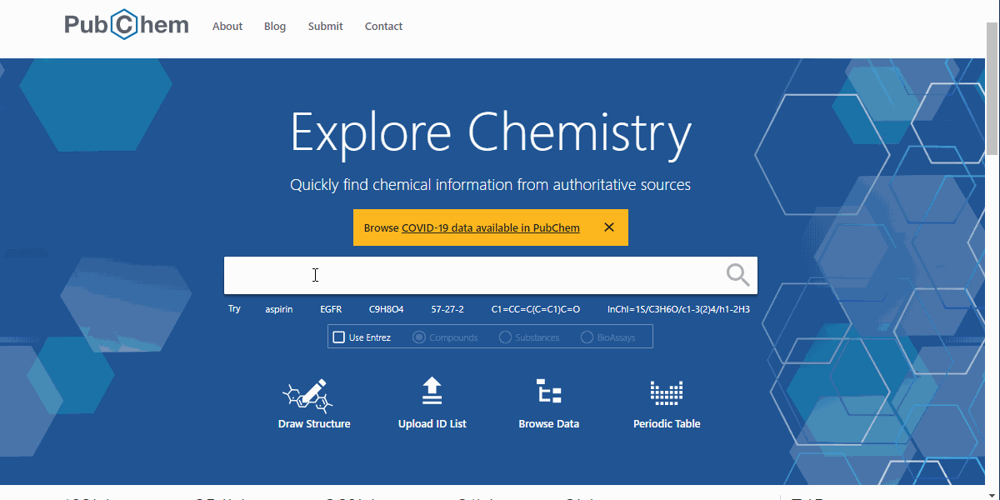
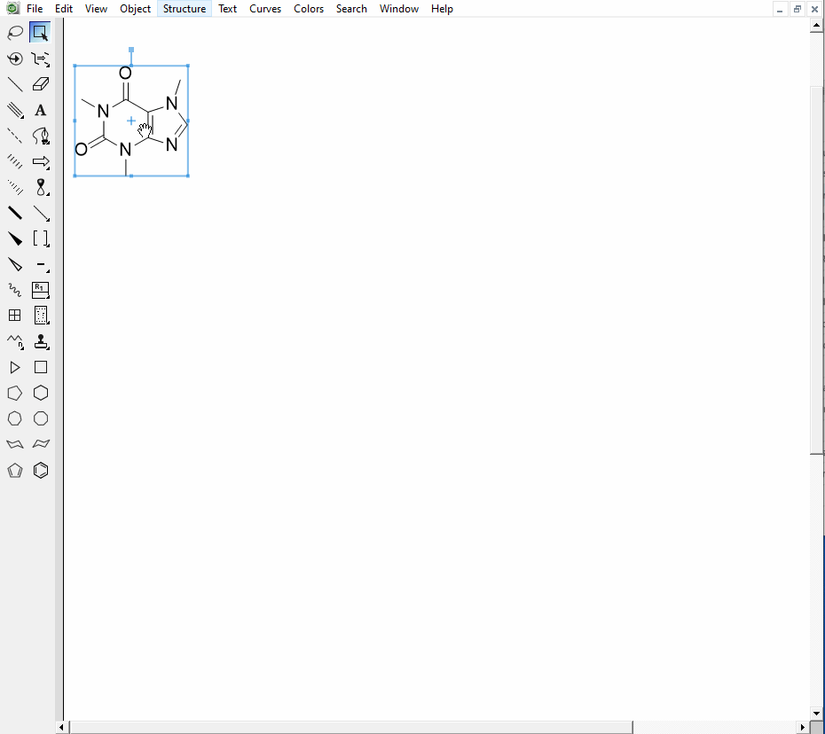

# How to Find InChI?

!!! info "What is an InChI?"
		You can find more info at InChI Trust - [link here](https://www.inchi-trust.org/technical-faq-2/#2.1)

There are many places to find InCHIs - there are a few here [link here](https://www.inchi-trust.org/technical-faq-2/#2.11). **We recommend finding the InChI via PubChem or generating it with a structure drawing software such as ChemDraw.**

???+ example "How to Find an InChI on PubChem"
		
	
???+ example "How to Generate an InChI using ChemDraw"
		

# how to Find a Planar InChIKey?

!!! info "What is an InChIKey?"
		You can find more info at InChI Trust - [link here](https://www.inchi-trust.org/technical-faq-2/#2.7) and [link here](https://www.inchi-trust.org/technical-faq-2/#13.1).

The InChIKey's first hash block reflects the connectivity of the chemical structure - aka the planar structure (the second and third hash blocks are the same for all structure, -UHFFFAOYSA-N). GNPS uses this information to collect Tags and other information in a consistent manner. More about the meaning of the InChiKey can be found here - [link here](https://www.inchi-trust.org/technical-faq-2/#13.1).

???+ example "The InChIKey and Planar InChIKey for Caffeine"
		Name = Caffeine
		InChI = InChI=1S/C8H10N4O2/c1-10-4-9-6-5(10)7(13)12(3)8(14)11(6)2/h4H,1-3H3
		InChIKey = RYYVLZVUVIJVGH-UHFFFAOYSA-N
		InChIKey-Planar (used in GNPS) = RYYVLZVUVIJVGH
