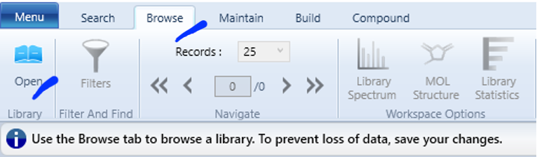
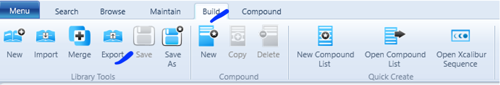

This page highlights how you can export from a Thermo mzVault spectral library and import it into GNPS


## Exporting mzVault libraries to the .msp format for import into GNPS

**Versions and compatibilities**

mzVault 2.3 (Thermo Fisher Scientific), compatible with TraceFinder 5.0/5.1+ and Compound Discoverer 3.0/3.2+ (March 2021)


### Exporting libraries in mzVault to the .msp format

* Go to the ‘Browse’ tab and click ‘Open’.
* Select the correct .db file (.db is the default format of spectral libraries built in mzVault) 



* Go to the ‘Build’ tab and click ‘Export’.



* Export to the .msp format

!!! note "Inspect the .msp file in a text editor program (e.g Notepad++, TextEdit, BBEdit)"
    ```
    MS:1009003|Name = TYRAMINE
    MS:1009001|Spectrum index = 1
    MS:1000894|RetentionTime = 2,04000
    MS:1000864|Formula = C8H11NO
    MS:1002894|InChiKey = DZGWFCGJZKJUFP-UHFFFAOYSA-N
    MS:1009100|CASNo = 51-67-2
    MS:1000868|Smiles = NCCC1=CC=C(O)C=C1
    MS:1009101|CompoundClass = 5610
    MS:1000744|Selected Ion m/z = 138,09134
    MS:1000045|Collision_energy = 20.0
    Precursor_type = M+H
    MS:1000073|Electrosprary ionization
    MS:1000130|Positive scan
    MS:1009006|number of peaks = 183
    50,1005 71,18
    50,2260 52,07
    ```
    NOTE: that you cannot choose which fields are exported. If you wish you can add information of your choice to the predefined fields. E.g. here we added information on ‘Adduct’ and ‘PubChemID’ to the ‘Precursor_type’ and ‘CompoundClass’ fields respectively. During inspection of the .msp file in a text editor program, you can manually replace the field names to ensure clarity in the final .msp file.


### Converting to GNPS Compatible Formats

Use the GNPS workflow for this [here](https://gnps.ucsd.edu/ProteoSAFe/index.jsp?params=%7B%22workflow%22:%22LIBRARY_CONVERSION%22,%22library_on_server%22:%22d.speclibs;%22%7D). 


### Edit libraries through SQLite Studio

- If you wish you can edit your .msp library in SQLite Studio (free, open-source software, downloadable here) and:
    - Export compound or spectra tables in various formats
    - Copy a table into a spreadsheet
    - Paste lists of values into the database
    - Access hidden fields such as ‘percursor type’ in the spectra table (useful since it’s exported in the .msp files).
- You need to click the green ‘Commit’ button to commit and validate your changes, which will then be visible in mzVault when you open the file again.

## Page Contributors

Anna Abrahamsson, Julie Courraud, Madeleine Ernst


