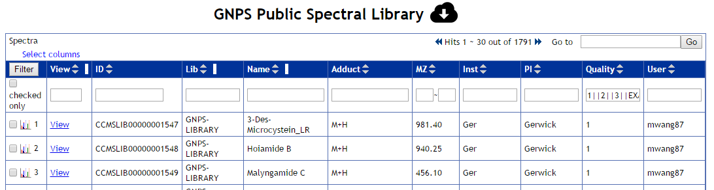
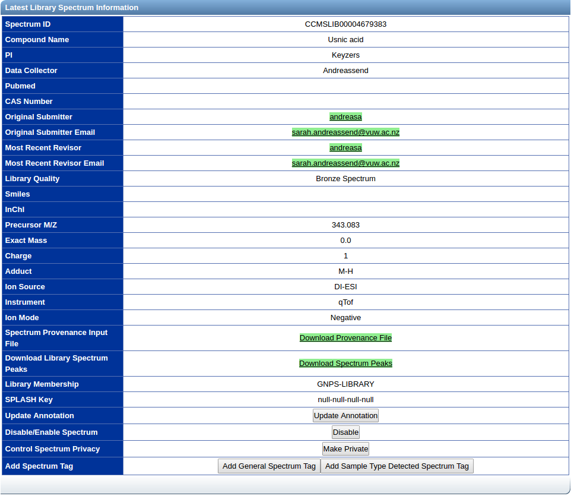
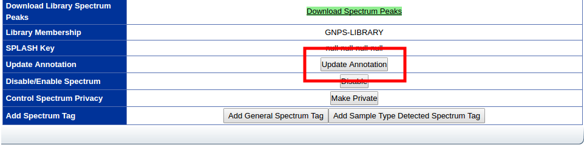
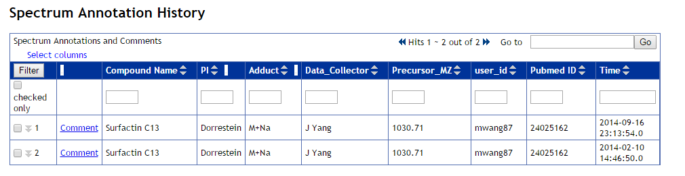
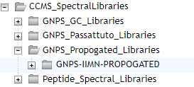

## GNPS Community Spectral Libraries

The GNPS public spectral libraries can be browsed, explored, and downloaded. The list of all public spectral libraries is listed [here](https://gnps.ucsd.edu/ProteoSAFe/libraries.jsp). The most up to date libraries can be [downloaded here](https://gnps-external.ucsd.edu/gnpslibrary) in mgf, msp, or json format, also providing aggregated libraries with all reference entries with or without propagated library spectra. 

### GNPS Community Library

There are several spectral libraries available at GNPS. They are either imported from the community (e.g. [Massbank](https://gnps.ucsd.edu/ProteoSAFe/gnpslibrary.jsp?library=MASSBANK) ), provided directly to GNPS as a large collection of annotated spectra (e.g. [Pesticide Library](https://gnps.ucsd.edu/ProteoSAFe/gnpslibrary.jsp?library=GNPS-COLLECTIONS-PESTICIDES-POSITIVE) ), or aggregated from single MS/MS additions from the entire community (e.g. [GNPS-Community](https://gnps.ucsd.edu/ProteoSAFe/gnpslibrary.jsp?library=GNPS-LIBRARY) ).

Clicking on a library brings users to a list of all MS/MS spectra that are in that library. The most up to date annotation is listed.

### Most Recent Contributions

At the bottom of the list of all spectral library, the most recent contributions of annotation library spectra are listed in reverse chronological order. These generous contributions from members of the community are just the latest amongst the thousands of MS/MS spectra deposited at GNPS.

### Library Spectrum List

Users will be presented with a list of all spectra in the library. Each line represents a different entry in the library and displays the most recent annotation for that particular spectrum.



Users are able to download the update to date version of each particular library by clicking the download icon next to the library header.

### Individual Spectrum View

Users will be presented with a spectrum page that includes at the top an interactive spectrum viewer as well as the most recent spectrum information.



#### Updating Spectrum Annotation

In the event that annotations are incomplete or incorrect, users have the option to correct/update annotations of the library spectra. On each library spectrum page there is an update button to update the annotation.



#### Spectrum Annotation History

Revision history of the spectrum. Sorted in reverse chronological order, with most recent revisions first. To comment on a specific revision of the annotations, users can click the comment button for each annotation row. To view comments on each annotation, users can click the double down arrow at the left of the row.



### Using Spectral Libraries in GNPS Analysis

The default spectral libraries are located in the speclibs folder in GNPS. 

Additionally, separate libraries that are not selected by default are located for example:

```
CCMS_SpectralLibraries/GNPS_Propogated_Libraries
```



These are propagated spectral libraries that inherently are less confident but this provides an avenue to give more identifications.

#### Nearest neighbor suspect spectral library

The nearest neighbor suspect spectral library is a propagated spectral library that has been compiled in a data-driven fashion from molecular networking of hundreds of millions of public MS/MS spectra. Rather than by measuring standards with known molecular identities, entries in the suspect library are related to a known compound with a specific modification, characterized by the precursor mass difference, to provide structural hypotheses.

Follow these steps to include the nearest neighbor suspect spectral library to your GNPS analyses:

1. Browse to the "GNPS-SUSPECTLIST" folder in the file selector.
2. Click on "Library Files" to add the nearest neighbor suspect spectral library.
3. Verify that the library now appears in the "Selected Library Files" category in the selection panel.


### License

All GNPS Reference spectra contributed directly to GNPS by default will have the [CC0](https://creativecommons.org/publicdomain/zero/1.0/) license.

Third party libraries imported may not conform to the CC BY license and should be verified by users. 

## Page Contributions

{{ git_page_authors }}
