## Chemical Directionality (ChemDir)

The Chemical Directionality (ChemDir) concept applied here is defined by relative abundance changes between two neighbouring nodes within a molecular network. By taking advantage of the [feature-based molecular network workflow (FBMN)](https://www.biorxiv.org/content/10.1101/812404v1.full), we used the raw peak area across the longitudinal (or spatial) data series as a measure of the abundance for each detected feature among events. ChemDir facilitates the prioritisation of putative transformations in tandem mass spectrometry (MS/MS) data using the Global Natural Products Social Molecular Network [(GNPS)](https://gnps.ucsd.edu/ProteoSAFe/static/gnps-splash.jsp) environment.

!!! note "FBMN Version Compatibility"
    We require a FBMN that is release_18 or newer. If your job is older than that, simply clone to latest to get the latest version and it should be compatible with ChemDir

**Workflow** 
Make sure you select the ChemDir workflow 

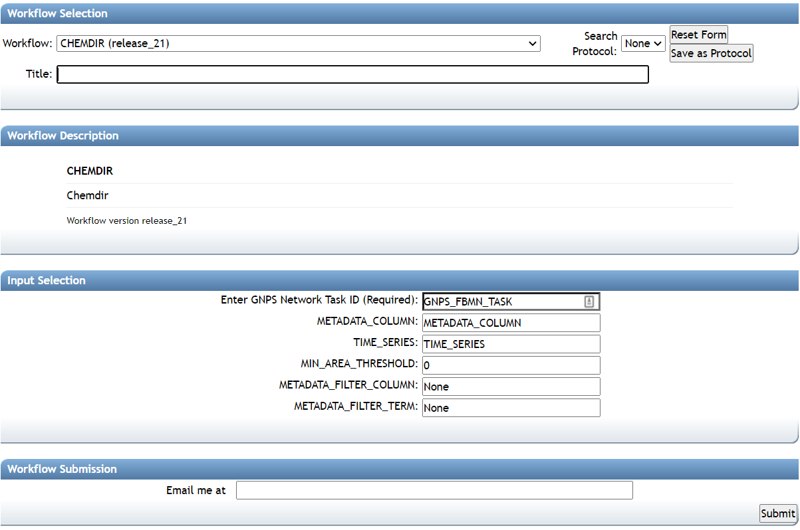
 
**Title** 
Name your job to be easily recognize by yourself as it will be available in your jobs tab

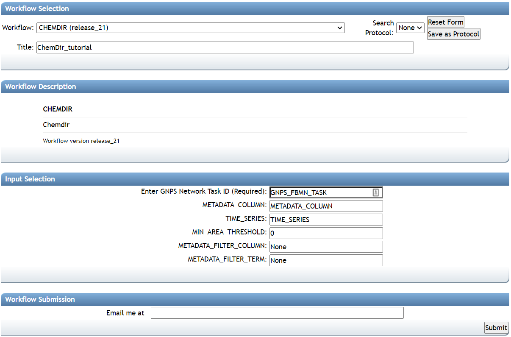

**Enter GNPS Network Task ID (Required)**
Copy and paste the FBMN task ID from your previous FBMN  job

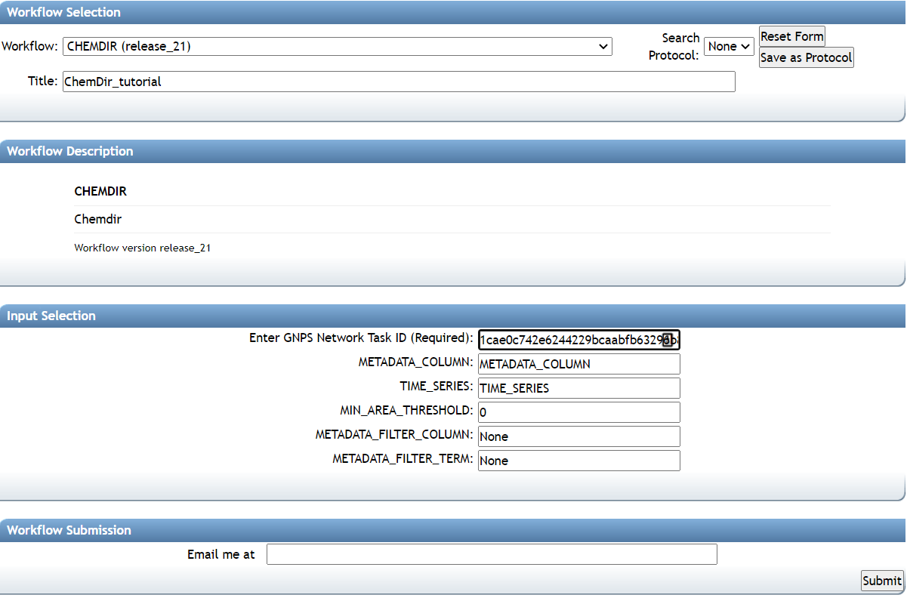

**METADATA_COLUMN**
Define a metadata column header based on the exact metadata table provided for the FBMN job ID you are using in this ChemDir workflow

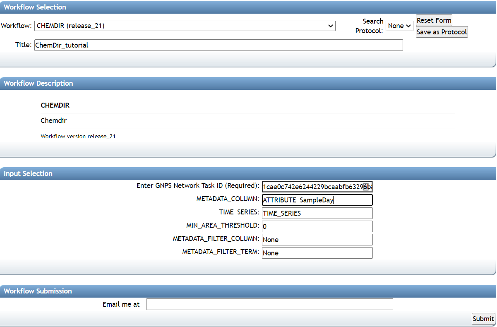

**TIME_SERIES**
Provide the variables that you are interested in based on your longitudinal analysis. Example: 0,1,2,3; comma separated values, can be integers or strings; no spaces between variables. The variables provided here must match entries from the metadata column specified in METADATA_COLUMN.

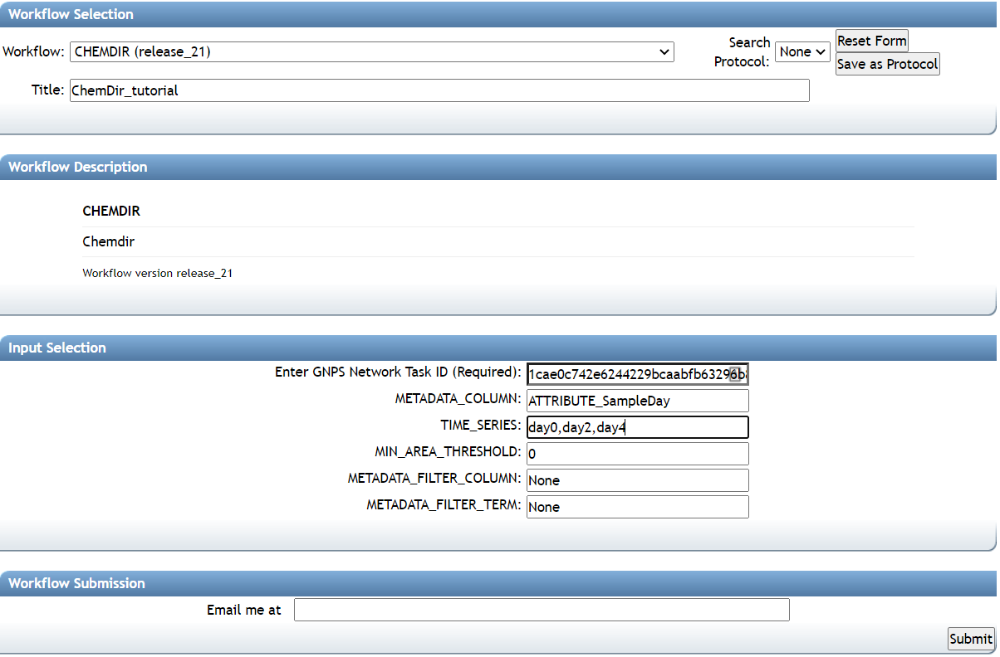

**MIN_AREA_THRESHOLD** 
Min peak area; defined during feature finding; job specific. The value used here will replace any 0 value from your dataset for ChemDir.

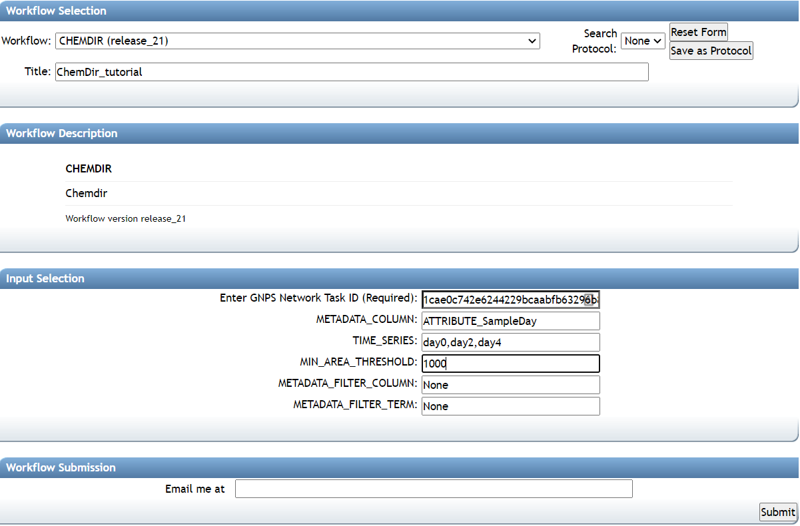

**METADATA_FILTER_COLUMN**
It is possible to filter the dataset based on the columns of interest. 

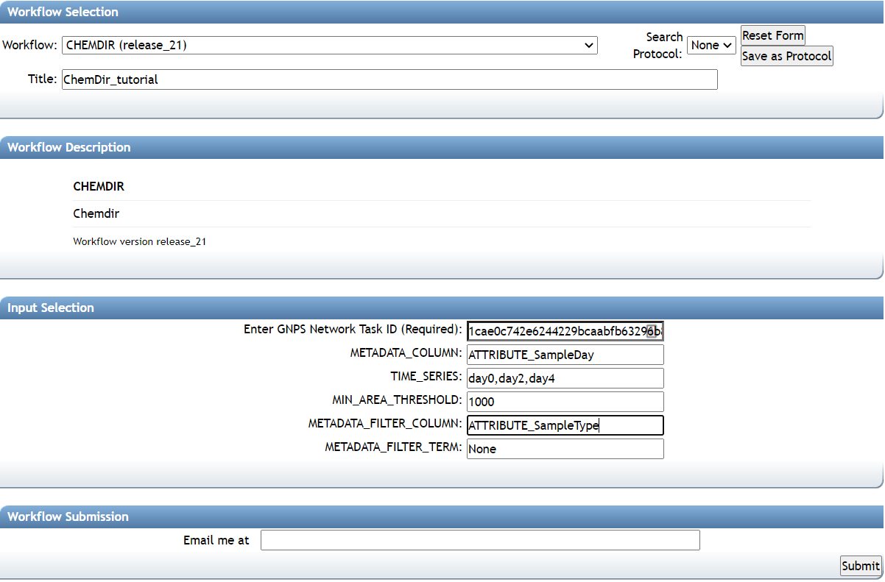

**METADATA_FILTER_TERM**
It is possible to filter the column used from your dataset based on the specific term of interest for the analysis.

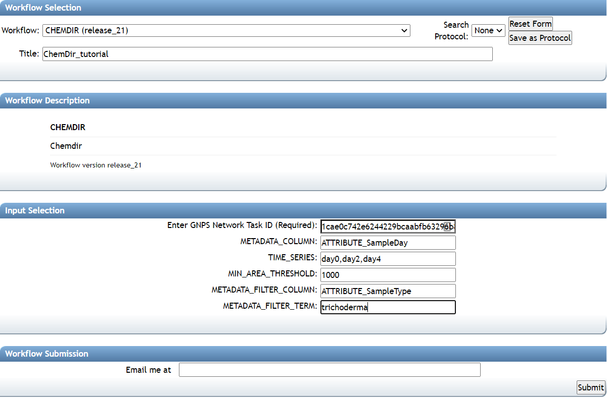

**Job status**
Once your job is finished, you will be able to explore the results.

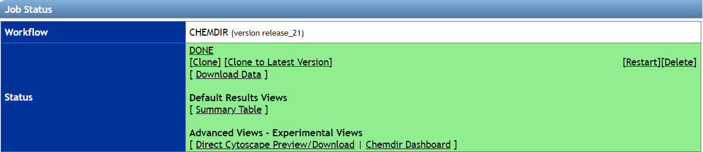

**Summary table**
This table provides the general overview of every pair node compared via ChemDir.  

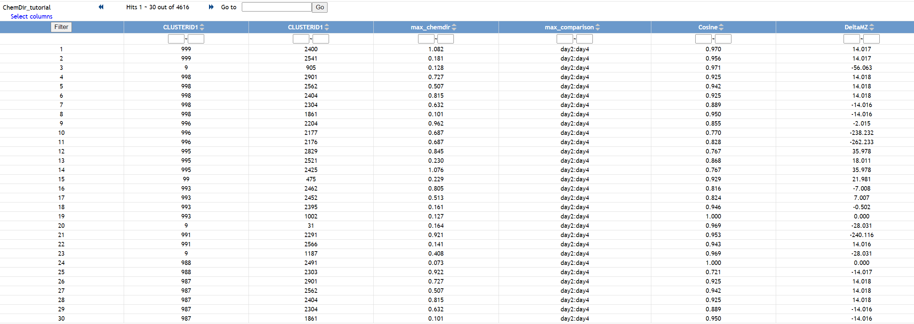

**Direct Cytoscape preview**
This enables you to directly download and explore the data in Cytoscape.

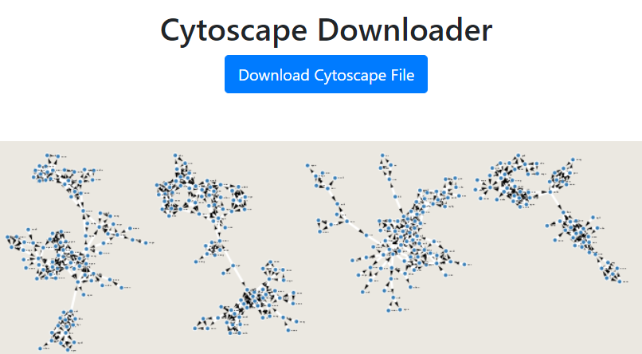

**ChemDir dashboard**
This enables you to quickly explore the maximum ChemDir scores and their correspondent DeltaMZ observed from your dataset.

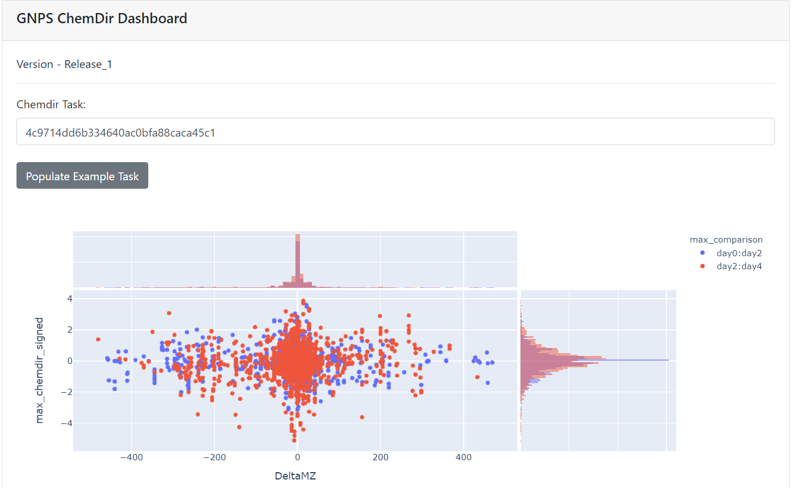

## Development
Source code
There are two portions of the ChemDir infrastructure: [ChemDir GNPS/ProteoSAFe workflow](https://github.com/mwang87/ChemDir) and the [ChemDir Results Exploration Dashboard](https://github.com/mwang87/ChemDir_Dashboard). 

## Citation
To be updated

## Page Contributions

{{ git_page_authors }}
