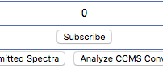
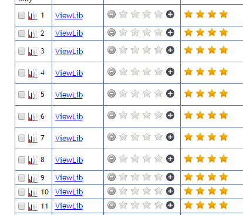
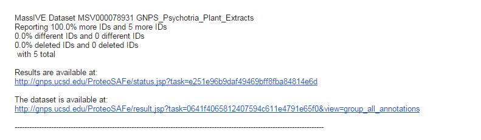

## Continuous Identification

GNPS' continuous identification aims to bring datasets to life. Traditionally, after manuscript publication, mass spectrometry datasets remain static and are never heard from again, silo'd in data cemeteries. GNPS' approach is different, we aim to

1. Automatically make new discoveries within each dataset
2. Aid future analyses by putting new data in the context of all previously existing datasets

GNPS achieves the first goal by periodically reanalyzing each and every public dataset. With ever expanding reference spectral libraries, GNPS makes new identifications within datasets in an automatic fashion, recording this growth in identifications, and reports it back to the community.

GNPS achieves the second goal by enabling users to "BLAST" MS/MS spectra against the entire GNPS set of datasets (see [MASST Search](masst.md)).

## Exploring Current Continuous Identifications

On each dataset page (See [datasets](datasets.md)) the list of all continuous identifcations is listed under the "Continuous Identification" section. This list of all analyses shows the growth of identifications over time as well as how the identifications changed over time. For example, the 3D molecular skin cartography dataset (See [MSV000078556](https://gnps.ucsd.edu/ProteoSAFe/result.jsp?task=6b9dcff3899e4d5f89f0daf9489a3a5e&view=advanced_view)) grew from 94 (April 9, 2014) identifications in the initial continuous identification to 860 (June 1, 2018).

## Dataset Subscriptions

Whenever new identifications are made in a dataset, subscribers are automatically notified via email. To be subscribed to a dataset of interest, click the subscribe button on the dataset page:

## Continuous Identification Ratings

Help us improve Continuous Identification by rating the matches returned on the "All Identifications Page". For each identification made, please rate each match according to the following rubric

| Rating        | Description           |
| ------------- |-------------|
| 4 stars | correct match as context is right (i.e., molecule is known/expected to be in the sample) |
| 3 stars | compound class match – at least part of the structure makes sense to match |
| 2 stars | cannot tell – might be correct from the spectrum match and context but there is not enough information to tell |
| 1 star | incorrect: molecule does not make sense in this context |

Users will be able to both add their own rating, add a comment for their given rating, as well as view the average rating of the identification.

## Continuous ID Subscription Email

This example continuous identification email informs subscribers that the dataset of interest has more IDs in the most recent round of continuous identifications. It will first list the title of the dataset, then the changes in identification counts, and finally direct links to explore the data. Users can go directly to the search results and view the new, different, and deleted identifications as well as go straight to the dataset page itself.

## Download

To download all the information related to continuosu ID, please refer [here](api.md#gnps-continuous-id-data). 

## Page Contributions

{{ git_page_authors }}