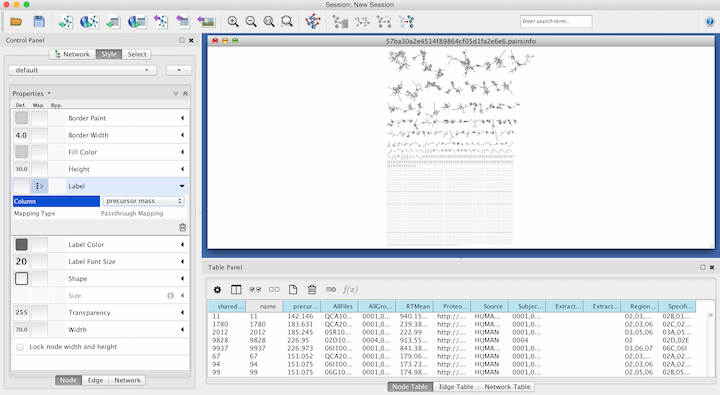
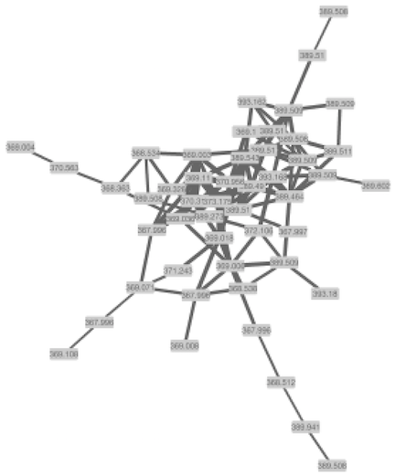

# Network Visualization in Cytoscape

While we do provide in-browser visualization for networks, these are limited to a single component at a time. Using Cytoscape, we can start visualizing the entire molecular network at once.

Cytoscape is an open source software platform for visualization and annotation of networks. Cytoscape is available for download from [here](http://www.cytoscape.org). The instructions below assume that you have installed Cytoscape 3.6.X.

## Cytoscape 3.6 Analysis (Quick)

To quickly get started with your molecular network in Cytoscape, we have an easy export module from GNPS that previews the molecular network and provides a pre-formatted Cytoscape file. This feature is very much experimental, but from the status page, click the "Direct Cytoscape Preview/Download"

This will bring you to a new interface where you will see a preview and a download link.

## Cytoscape 3.6 Analysis (Recommended)

### Downloading Cytoscape Import Files

The first step is to download the correct input to import into Cytoscape. From the results page of molecular networking, you will need to download the graphML file for Cytoscape.

Unzip the content of the zip file. The content will look like this:

### Importing Network into Cytoscape

Now open Cytoscape 3.6.1. From the Toolbar go to File / Import / Network / File (or cmd + L) and then select the .graphml file in the root of the unzipped job folder.

The network has been opened and will look like this.

### Creating a Cytoscape Style

In Cytoscape 3.6.1, create a new Cytoscape style. As shown below, click on "Create New Style" and provide a name.

### Node Styling

#### Node Label to Spectrum Property

Within the Node menu, you will be able to apply a label to each of your nodes, you may select the Attribute from the drop down menu to use as a label and then select Passthrough Mapping as the Mapping Type. Typically Parent mass or Precursor mass is selected for node labels of networks generated using GNPS.

#### Visualizing Group Abundances as Pie Charts

If you organized your data into cohorts of samples, we can visualize the relative abundance (as measured by spectral counts which is psuedo-quantitative) with pie charts across these groups.

#### Visualizing Structures

The Cytoscape plugin ChemViz2 can visualize the chemical structure of GNPS spectral library annotation in the nodes. The ChemViz2 plugin can be be installed in the toolbar Apps /Apps manager / and type "ChemViz2" to find and install it.

To visualize chemical structures, select the nodes of interest and do right-click, Apps / Cheminformatics tools / Paint structure on selected nodes.

Also check out their [website](http://www.cgl.ucsf.edu/cytoscape/chemViz2/index.shtml).

### Edge Styling

#### Edge Thickness based on Spectral Similarity

To aid in the visualization of individual node relatedness within a cluster, the cosine score is used. This value will determine the thickness of the edge between related nodes. The thicker the edge, the higher the cosine score and therefore the more related the two individual nodes are to each other.

Again working within the Style Tab, select the Edge menu. From the Width drop down menu, select Cosine for the Column and Continuous Mapping for the Mapping Type.

Double click on the Continuous Mapping area of the menu to adjust the thickness of the edge. Click OK to apply the setting changes.

Below is a zoomed in portion of a network demonstrating the use of Cosine score for edge width determination.

##Cytoscape 2.8 Analysis (Legacy)

See [legacy documentation](https://bix-lab.ucsd.edu/display/Public/Cytoscape+2.8.X+Visualization+and+Analysis+Documentation)
