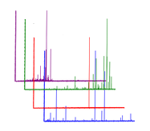

# MassIVE Datasets

MassIVE is an online repository for publicly available datasets. MassIVE provides a location for researchers to access datasets that have been made available by others, oftentimes alongside publication. The datasets available remain alive long after publication. At GNPS, users will be able to browse datasets, download datasets, and comment on datasets. These comments can be accompanied with new data or new analysis that enriches the MassIVE dataset. Additionally, users can subscribe to specific datasets. While the underlying data may not change, the analysis and understanding of the data will continue to improve. To enhance the analysis, datasets submitted to MassIVE through GNPS will be periodically searched against the ever growing annotated spectral libraries and new putative identifications within those datasets are reported to subscribers. Beyond new identifications within a dataset, subscribers will also be made aware of other datasets that exhibit chemical similarities to the subscribed dataset. This allows for users to be connected via their research interest to similar datasets.


Here we will describe how to upload data into MassIVE specifically for GNPS.

For more detailed information about general MassIVE dataset submission see [here](http://proteomics.ucsd.edu/service/massive/documentation/submit-data/).


## Submitting GNPS-MassIVE Datasets

At the [GNPS splash screen](https://gnps.ucsd.edu/ProteoSAFe/static/gnps-splash.jsp), users can click this icon



to create a MassIVE dataset.

Login with your GNPS login and hit Submit Data.

### GNPS Submission specifics

The title is the display that users will use primarily to filter datasets. For GNPS datasets, a specific title format is required.

```
GNPS - <Title of Paper or Short Description>
```

The GNPS prefix is required for GNPS datasets. If this is not provided GNPS-MassIVE datasets are not shown to GNPS users.


### Example Recommended Description

```
Paper title: Molecular networking as a dereplication strategy.
Author List: Yang JY, Sanchez LM, Rath CM, Liu X, Boudreau PD, Bruns N, Glukhov E, Wodtke A, de Felicio R, Fenner A, Wong WR, Linington RG, Zhang L, Debonsi HM, Gerwick WH, Dorrestein PC.
Citation: J Nat Prod. 2013 Sep 27;76(9):1686-99. doi: 10.1021/np400413s
PubMedID: 24025162
Brief description of the data submitted: RAW Files used to generate Figure 4. Bacterial network with a cosine similarity score cutoff of 0.65. This network was generated from direct infusion of extracts or direct
```

### Making Dataset Public

After submitting your dataset to MassIVE, you must explicity make the dataset public.


## Social Networking with Datasets

The public MassIVE datasets are complete datasets that published at massive.ucsd.edu optionally alongside paper publications. The MassIVE repository provides a location for researches to access datasets that have been made available by others. However, these MassIVE repository will not merely function as a file server and a data graveyard.

These datasets remain alive long after publication. At GNPS, users will be able to browse datasets, download datasets, and comment on datasets. These comments can be accompanied with new data or new analysis that enriches the MassIVE dataset. Additionally, users can subscribe to specific datasets, for while the underlying data might not be changing, the understanding of the data will. To continuously learn more about each dataset, each is searched against the ever growing public reference annotated spectral libraries and new identifications are reported to subscribers. Beyond new identifications within a dataset, subscribers will also be made aware of other datasets that exhibit similarities to the subscribed dataset. This allows for users to be connected via their interest in similar datasets.
