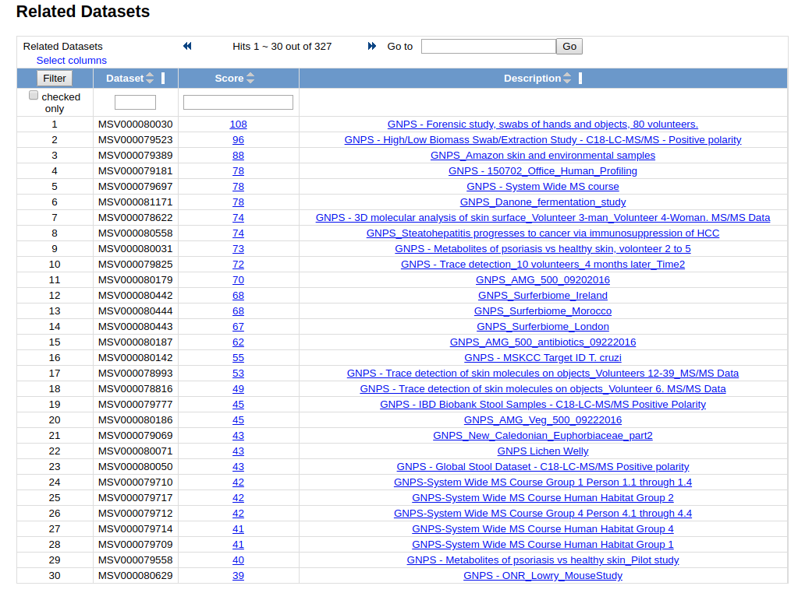

## MassIVE Datasets

MassIVE is an online repository for publicly available datasets. MassIVE provides a location for researchers to access datasets that have been made available by others, oftentimes alongside publication. The datasets available remain alive long after publication. At GNPS, users will be able to

1. Browse datasets - Explore all public GNPS datasets
2. Download datasets - Download full dataset for offline processing/reanalysis
3. Re-Analyze datasets - Online reanalysis with GNPS tools. Compare public data to your own
4. Comment on datasets - Make public comments on public datasets to start a community discussion
5. Subscribe to datasets - Subscribe to updates to datasets, e.g. Updated data from submitter, new identifications/analogs by Continuous Identification

To enhance the analysis, datasets submitted to MassIVE through GNPS will be periodically searched against the ever growing annotated spectral libraries and new putative identifications within those datasets. Beyond new identifications within a dataset, subscribers will also be made aware of other datasets that exhibit chemical similarities to the subscribed dataset. This allows for users to be connected via their research interest to similar datasets.

## Submitting GNPS-MassIVE Datasets

Here we will describe how to upload data into MassIVE specifically for GNPS.

For more detailed information about general MassIVE dataset submission see [here](http://proteomics.ucsd.edu/service/massive/documentation/submit-data/).

At the [GNPS splash screen](https://gnps.ucsd.edu/ProteoSAFe/static/gnps-splash.jsp), users can click this button


to create a MassIVE dataset.

Login with your GNPS login and hit Submit Data.

### GNPS Submission specifics

The title is the display that users will use primarily to filter datasets. For GNPS datasets, a specific title format is required.

```
GNPS - <Title of Paper or Short Description>
```

The GNPS prefix is required for GNPS datasets. If this is not provided GNPS-MassIVE datasets are not shown to GNPS users.


### Example Recommended Description

```
Paper title: Molecular networking as a dereplication strategy.
Author List: Yang JY, Sanchez LM, Rath CM, Liu X, Boudreau PD, Bruns N, Glukhov E, Wodtke A, de Felicio R, Fenner A, Wong WR, Linington RG, Zhang L, Debonsi HM, Gerwick WH, Dorrestein PC.
Citation: J Nat Prod. 2013 Sep 27;76(9):1686-99. doi: 10.1021/np400413s
PubMedID: 24025162
Brief description of the data submitted: RAW Files used to generate Figure 4. Bacterial network with a cosine similarity score cutoff of 0.65. This network was generated from direct infusion of extracts or direct
```

### Making Dataset Public

After submitting your dataset to MassIVE, you must **explicity** make the dataset public, by clicking the make public button:


## [Continuous Identification](continuousid.md)

A unique feature at GNPS is the continuous and automated reanalysis of public datasets. GNPS analyzes these datasets with molecular networking and library to make new identifications as the public community spectral libraries increase due to community contributions.

Users may subscribe to datasets to receive email notifications of new identifications made to datasets of interest.

## Browsing Datasets

To browse all public datasets, click the "Datasets" link at the top menu bar. This brings users to a list of all public GNPS-MassIVE datasets.


### Downloading Dataset Contents

To download the contents of a dataset, you can reach the FTP url of each dataset by click the FTP link.


## Reanalyze Datasets

Dataset data can be re-analyzed with the tools at GNPS. In order to import the dataset into your own workspace to select files, please refer to [this documentation](networking.md#selecting-files-to-analyze).

## Social Networking with Datasets

### Dataset Comments

Users may make a comment on a dataset by clicking the "Comment on Dataset Link":


To browse all comments per dataset, a table is shown


### Finding Related Datasets

Users can find related MassIVE datasets to the current one. Currently relatedness of datasets is determine by the number of shared identified compounds between the two. Users can see a view like this:



## Page Contributions

{{ git_page_authors }}