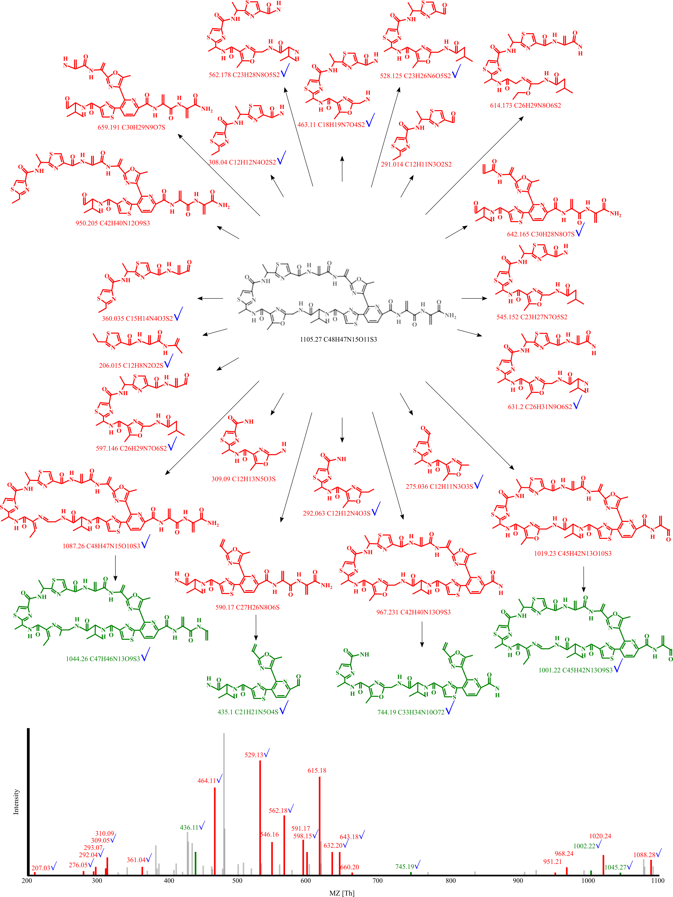
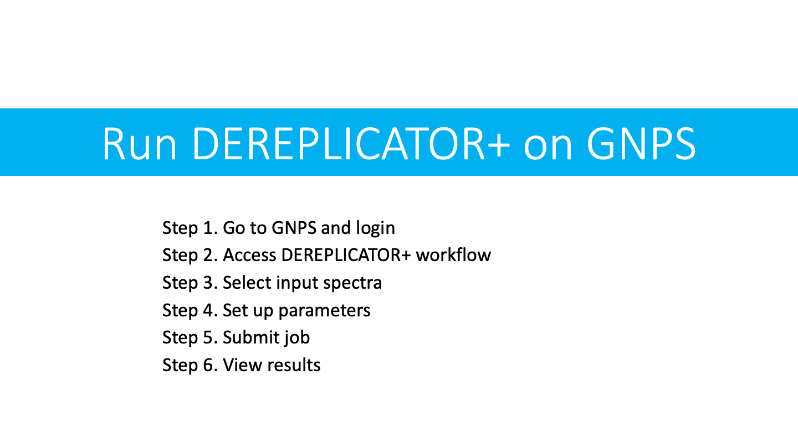
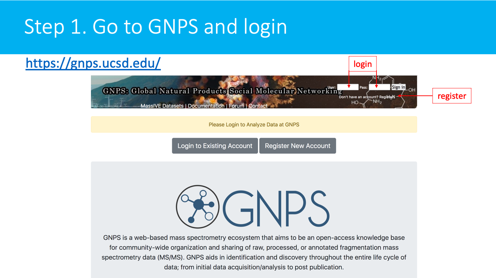
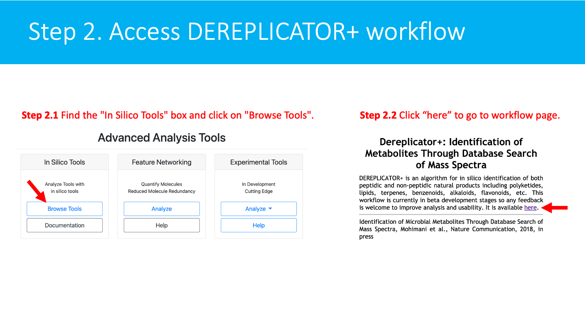
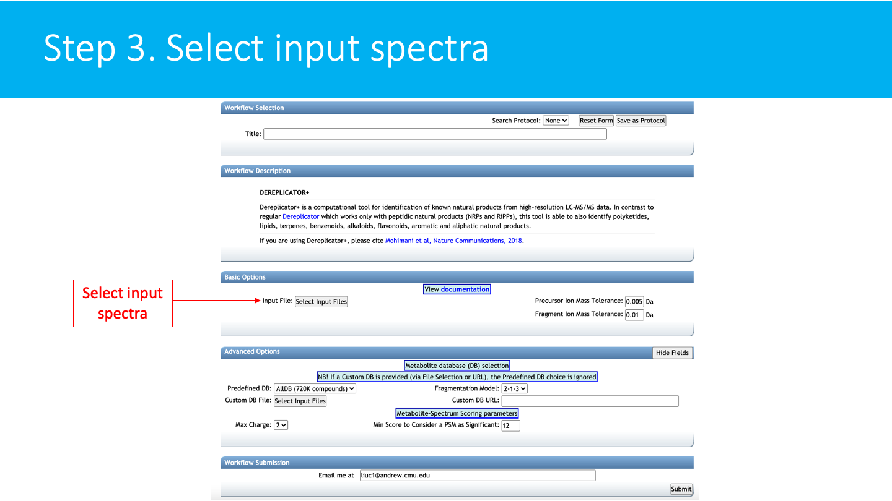
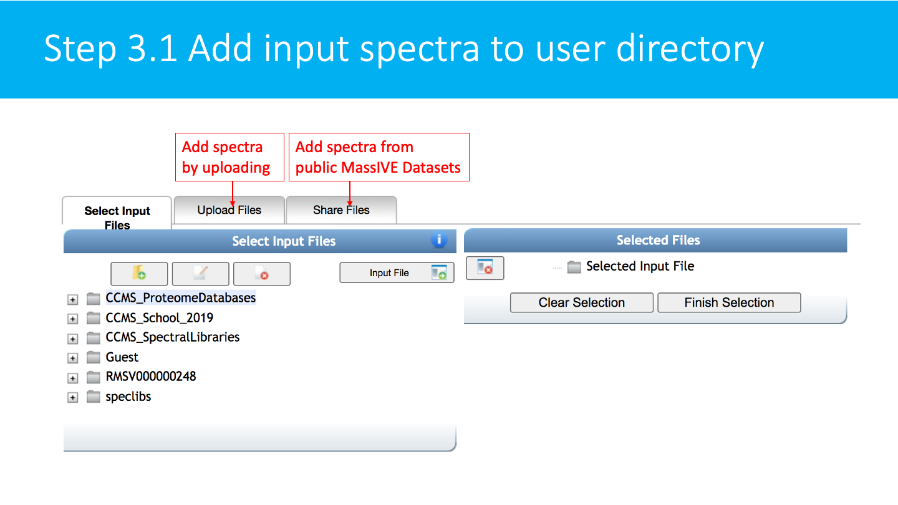
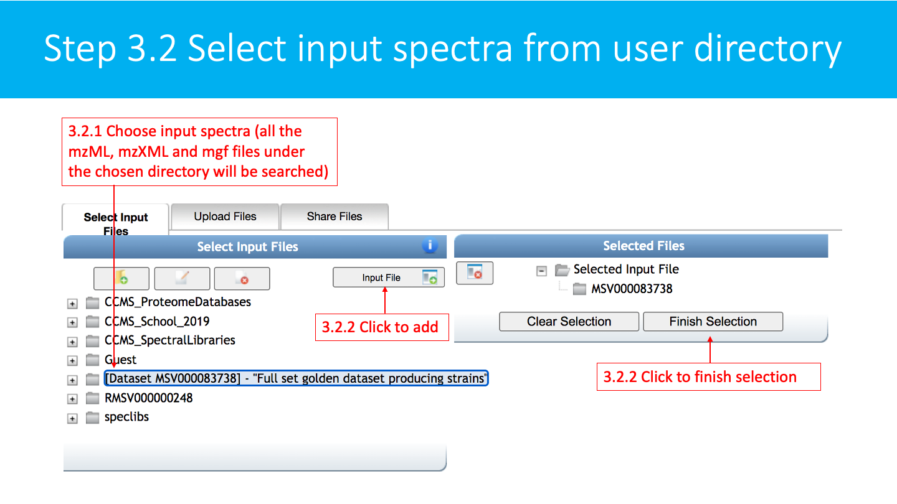
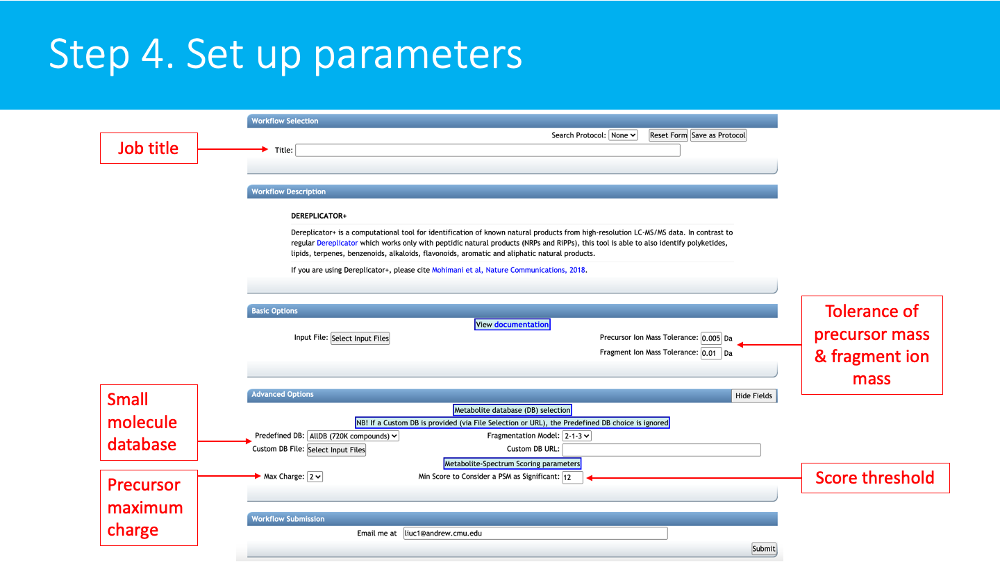
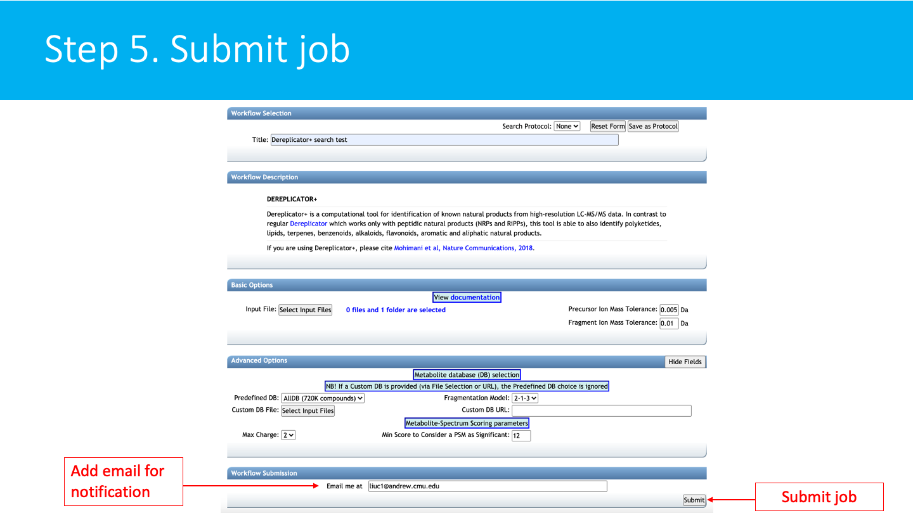
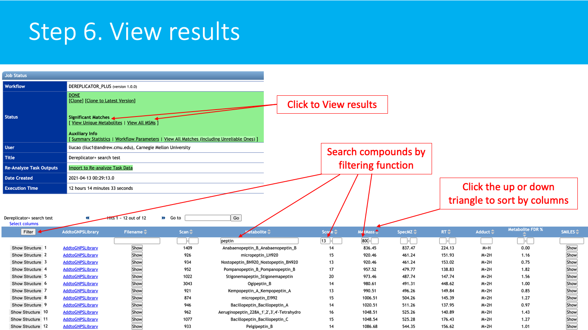

## DEREPLICATOR+ - in silico database search of MS/MS

- [DEREPLICATOR+ - in silico database search of MS/MS](#dereplicator---in-silico-database-search-of-msms)
- [Introduction](#introduction)
- [Manuscripts and Citations](#manuscripts-and-citations)
- [Development](#development)
- [Accessing DEREPLICATOR+ workflow on GNPS](#accessing-dereplicator-workflow-on-gnps)
  - [STEP 1: Go to GNPS and login](#step-1-go-to-gnps-and-login)
  - [STEP 2: Access DEREPLICATOR+](#step-2-access-dereplicator)
  - [STEP 3: Select input spectra](#step-3-select-input-spectra)
  - [STEP 4: Set up parameters](#step-4-set-up-parameters)
    - [BASIC OPTIONS:](#basic-options)
    - [ADVANCED OPTIONS:](#advanced-options)
  - [STEP 5: Submit a job](#step-5-submit-a-job)
  - [STEP 6: View results](#step-6-view-results)
- [Feedback and Bug Reports](#feedback-and-bug-reports)
- [Contribute to the Documentation](#contribute-to-the-documentation)
- [Page Contributions](#page-contributions)

## Introduction ##
**DEREPLICATOR+** is an in silico database search tool that allows the annotation of metabolites in MS/MS data using in silico fragmentation graph. It generalizes [**DEREPLICATOR**](https://ccms-ucsd.github.io/GNPSDocumentation/dereplicator/) by

1. considering O–C and C–C bonds for fragmentation in addition to N-C bonds
2. allowing multi-stage fragmentation in addition to single-stage.

As a result, **DEREPLICATOR+** not only improves the annotation of peptidic natural products, but also expanded the annotation to general metabolites and natural products such as polyketides and terpenes. 

The following figure is an example of radamycin match by **DEREPLICATOR+**. Fragments and peaks that are annotated by **DEREPLICATOR+** but not by **DEREPLICATOR** are marked with bluechecks. The score of the match increases from 9 to 25, and the p-value drops from $3×10^{−17}$ to $3×10^{−46}$.

**DEREPLICATOR+** algorithm and software are developed in collaboration of [Saint Petersburg State University](http://cab.spbu.ru) (Russia), 
[University of California San Diego](http://cseweb.ucsd.edu/~ppevzner/) (CA, USA) 
and [Carnegie Mellon University](http://mohimanilab.cbd.cmu.edu) (PA, USA).

## Manuscripts and Citations

**DEREPLICATOR+**: Mohimani, H. et al. Dereplication of microbial metabolites through database search of mass spectra. *Nature Communication* 9, 4035 (2018). [https://doi.org/10.1038/s41467-018-06082-8](https://doi.org/10.1038/s41467-018-06082-8)

## Development

The [GitHub repository](https://github.com/ablab/npdtools) provides latest source code and release. 

## Accessing DEREPLICATOR+ workflow on GNPS

The **DEREPLICATOR+** are available on GNPS on the [in silico tools page](https://gnps.ucsd.edu/ProteoSAFe/static/gnps-theoretical.jsp).

### STEP 1: Go to GNPS and login
Go to [http://gnps.ucsd.edu](https://gnps.ucsd.edu/ProteoSAFe/static/gnps-splash.jsp), and create/login to your account.

### STEP 2: Access DEREPLICATOR+
Derectly go to the [workflow page](https://gnps.ucsd.edu/ProteoSAFe/index.jsp?params=%7B%22workflow%22:%22DEREPLICATOR_PLUS%22%7D) or find the workflow page by Step 2.1 and Step 2.2 at [main page](http://gnps.ucsd.edu):

### STEP 3: Select input spectra
**Select/Import a mass spectrometry file**:
The input format accepted are mzML/mzXML/MGF. Note that have the option to import an existing GNPS dataset (by clicking on "Share Files") or upload your own data (by clicking on "Upload Files"). See the corresponding GNPS documentation for FTP upload.

After getting done with selecting files, click on Finish Selection.

### STEP 4: Set up parameters
**Set up the parameters for the DEREPLICATOR+ job**:
Select a title for your job, and adjust parameters depending on your data and the mass spectrometer used.

#### BASIC OPTIONS:

  -- **Precursor Ion Mass Tolerance**:  This value specifies how much fragment ions can be shifted from their expected m/z values. Default value is ± 0.005 Da.

  -- **Fragment ion Mass Tolerance**: This value specifies how much fragment ions can be shifted from their expected m/z values. Default value is ± 0.01 Da.

#### ADVANCED OPTIONS:

  -- **Predifined database** : the default small molecule structure database is AllDB, which contains 720K compounds.

  -- **Custom DB file** : if a custom database is provided (via File selection or URL), the predefined DB choice is ignored.

  -- **Max charge**: Maximum charge allowed. The default is 2.

  -- **Fragmentation Model**: the default model is 2-1-3, which indicates there will be at most two bridges, one 2-cut, and three cut in total.

  -- **Min score to consider an MSM as significant**: the minimum score (number of shared peaks between a experimental spectrum and a theoretical spectrum) to report a significant metabolite spectrum match. The default value is 12.

### STEP 5: Submit a job
Select an email. Then click on submit.

You will soon get an email with the link to the results when your job is finished. You can also check the status of your job in "Jobs" section.

### STEP 6: View results
**See the DEREPLICATOR+ job status:**
The status of the job can be vizualized in your account job list, and through the link in provided in email you will received when the job is done.

The job can be *Cloned*, for further parameters modifications. Summary Statistics and Workflow Parameters can be consulted on the respective links.

Click on *View Unique Metabolites* (recommended), to have get the list of annotated molecules.

Click on the *View All MSM* (Metabolites-Spectrum Match) to have detailed view of the Metabolites-spectrum matches.

**Explore the DEREPLICATOR+ annotations:**
Annotations are sorted by score (default), mass, compound name, etc. These fields can also be searched with the filter function.

## Feedback and Bug Reports

We will be thankful if you help us make **DEREPLICATOR+** better by sending your comments, bug reports, and suggestions to <npdtools.support@cab.spbu.ru> or posting them on our [GitHub repository tracker](https://github.com/ablab/npdtools/issues).

## Contribute to the Documentation

- For informations/feature request, please open an "Issue" on the [*CCMS-UCSD/GNPSDocumentation*](https://github.com/CCMS-UCSD/GNPSDocumentation) GitHub repository.
- To contribute directly to the GNPS documentation, fork the [*CCMS-UCSD/GNPSDocumentation*](https://github.com/CCMS-UCSD/GNPSDocumentation) repository, and make a "Pull Request".

## Page Contributions

{{ git_page_authors }}
