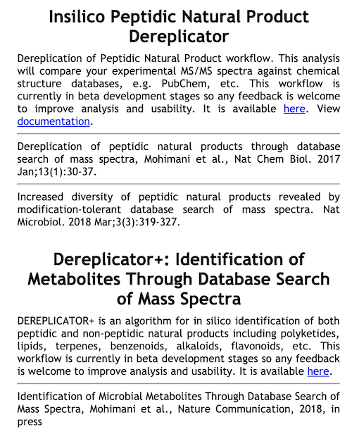

## DEREPLICATOR - Insilico Peptidic Natural Products Tools

- [DEREPLICATOR - Insilico Peptidic Natural Products Tools](#dereplicator---insilico-peptidic-natural-products-tools)
- [Manuscripts and Citations](#manuscripts-and-citations)
- [Development](#development)
- [Accessing the DEREPLICATOR tools on GNPS](#accessing-the-dereplicator-tools-on-gnps)
    - [STEP 1: Go to GNPS](#step-1-go-to-gnps)
    - [STEP 2: Access DEREPLICATOR](#step-2-access-dereplicator)
    - [STEP 3: SELECT YOUR FILES](#step-3-select-your-files)
    - [STEP 4: CONFIGURE](#step-4-configure)
      - [BASIC OPTIONS:](#basic-options)
      - [ADVANCED OPTIONS:](#advanced-options)
      - [ADVANCED DEREPLICATOR OPTIONS:](#advanced-dereplicator-options)
      - [ADVANCED VARQUEST OPTIONS:](#advanced-varquest-options)
    - [STEP 5: VIEW RESULTS](#step-5-view-results)
    - [STEP 6: ANALYSE](#step-6-analyse)
    - [STEP 7: MAP ANNOTATIONS ON MOLECULAR NETWORKS](#step-7-map-annotations-on-molecular-networks)
    - [STEP 8: VALIDATE](#step-8-validate)
      - [Validating a DEREPLICATOR annotation:](#validating-a-dereplicator-annotation)
- [Other in silico database search tools](#other-in-silico-database-search-tools)
- [Contribute to the Documentation](#contribute-to-the-documentation)
- [Page Contributions](#page-contributions)

The Insilico Peptidic Natural Products **DEREPLICATOR** is a bioinformatic tool available on GNPS that allows the annotation of known peptidic natural products in MS/MS data using in silico fragmentation tree.

The introduction of **DEREPLICATOR VarQuest** made possible to search variants of known peptidic natural products on GNPS.

The introduction of **DEREPLICATOR+ (PLUS)** and **MOLDISCOVERY** improved the confidence in the annotation from the DEREPLICATOR, and expanded annotations to non-peptidic natural products on GNPS. 

These algorithms and software are developed in collaboration of [Saint Petersburg State University](http://cab.spbu.ru) (Russia), 
[University of California San Diego](http://cseweb.ucsd.edu/~ppevzner/) (CA, USA) 
and [Carnegie Mellon University](http://mohimanilab.cbd.cmu.edu) (PA, USA).

## Manuscripts and Citations

If you used DEREPLICATOR tools, please cite the corresponding manuscripts:

**DEREPLICATOR:**
Mohimani et al., Dereplication of Peptidic Natural Products Through Database Search of Mass Spectra, *Nature Chemical Biology*, 13, 30–37 (2017). [https://doi.org/10.1038/nchembio.2219](https://doi.org/10.1038/nchembio.2219).

**DEREPLICATOR VarQuest**: Gurevich, A. et al. Increased diversity of peptidic natural products revealed by modification-tolerant database search of mass spectra. *Nature Microbiology* 3, 319–327 (2018). [https://doi.org/10.1038/s41564-017-0094-2](https://doi.org/10.1038/s41564-017-0094-2)

**DEREPLICATOR+**: Mohimani, H. et al. Dereplication of microbial metabolites through database search of mass spectra. *Nature Communication* 9, 4035 (2018). [https://doi.org/10.1038/s41467-018-06082-8](https://doi.org/10.1038/s41467-018-06082-8)

## Development

The [GitHub repository](https://github.com/ablab/npdtools) provides latest source code and release. 

## Accessing the DEREPLICATOR tools on GNPS

The **DEREPLICATOR (VarQuest)**, and **DEREPLICATOR+** are available on GNPS on the [in silico tools page](https://gnps.ucsd.edu/ProteoSAFe/static/gnps-theoretical.jsp).

#### STEP 1: Go to GNPS
Go to [http://gnps.ucsd.edu](https://gnps.ucsd.edu/ProteoSAFe/static/gnps-splash.jsp), and create/login to your account.

#### STEP 2: Access DEREPLICATOR
Find the "In Silico Tools" box and click on "Browse Tools".

Choose either DEREPLICATOR (VarQuest) or DEREPLICATOR+.

#### STEP 3: SELECT YOUR FILES
**Select/Import a mass spectrometry file**:
The input format accepted are mzML/mzXML/MGF. Note that have the option to import an existing GNPS dataset (by clicking on "Share Files") or upload your own data (by clicking on "Upload Files"). See the corresponding GNPS documentation for FTP upload.

After getting done with selecting files, click on Finish Selection.

#### STEP 4: CONFIGURE
**Configure the parameters for the DEREPLICATOR job**:
Select a title for your job, and adjust parameters depending on your data and the mass spectrometer used.

##### BASIC OPTIONS:

  -- **Precursor Ion Mass Tolerance**:  This value specifies how much fragment ions can be shifted from their expected m/z values. Default value is ± 0.02 Da for high-resolution instruments (q-TOF, q-Orbitrap) and ± 0.5 Da for low-resolution instruments (ion traps, QqQ).

  -- **Fragment ion Mass Tolerance**: This value specifies how much fragment ions can be shifted from their expected m/z values. Default value is ± 0.02 Da for high-resolution instruments (q-TOF, q-Orbitrap) and ± 0.5 Da for low-resolution instruments (ion traps, QqQ).

  -- **Search analog (VarQuest)** [RECOMMENDED TO USE]: The VarQuest algorithm can search for analogs of known natural products in MS/MS data using Dereplicator. VarQuest is a modification-tolerant database search tool that discovers unexpected modifications in a blind mode. Since the computational space for variable PNP identification is computationally expensive, VarQuest first constructs a set of feasible PSM using a simple scoring approach and further filters out this set using a rigorous scoring method. Using VarQuest will increase the job time. The use of VarQuest analogs option is recommended as it expands the search space, and it reduces the overall run time.

##### ADVANCED OPTIONS:

  -- **PNP database** : a choice of two databases Regular/Extended (Extended one is more informative but 2 times larger, i.e. two times slower processing)

  -- **Mimimum number of AA**: Dereplicator is able to search for short peptides. This parameter determines what is the minimum number of amino acids, we consider for the compounds that are considered in Dereplicator search.

  -- **Accurate P-values** : accurate (but slow) algorithm for P-value computation (MS-DPR), by default raw estimation is used.

  -- **Max charge**: Maximum charge allowed.

##### ADVANCED DEREPLICATOR OPTIONS:

  -- **Max Isotopic Shift**: When working with molecules with 1000 Da  or higher masses, mass spectrometers commonly predict the precursor mass 1 or 2 Da higher than the monoisotopic mass due to the isotopic pattern. Setting Maximum isotopic shift to higher than 0 allows Dereplicator to consider these shifts in the precursor mass.

 -- **Adducts** : Dereplicator can search in addition to protonated adducts, sodiated and potassium adducts.

##### ADVANCED VARQUEST OPTIONS:

  -- **Max Allowed Modification Mass** : Maximum difference allowed between the precursor ion of an unknown modified peptide and the (dereplicated) known peptide.

  -- **Min Matched Peaks with Known Compound** : Minimum number of common peaks between the MS/MS spectrum of an unknown modified peptide and the (dereplicated) known peptide.

Select an email. Then click on submit.

You will soon get an email with the link to the results when your job is finished. You can also check the status of your job in "Jobs" section.

#### STEP 5: VIEW RESULTS
**See the DEREPLICATOR job status**:

The status of the job can be vizualized in your account job list, and through the link in provided in email you will received when the job is done.

The job can be *Cloned*, for further parameters modifications. Summary Statistics and Workflow Parameters can be consulted on the respective links.

Clic on *View Unique Peptides* (recommended), to have get the list of annotated molecules.

Clic on the *View All PSM* (Peptide-Spectrum Match) to have detailed view of the peptides-to-spectrum matches.

#### STEP 6: ANALYSE 
**Explore the DEREPLICATOR annotations:**
Annotations can be sorted using various column (usually the score or the p-value), or a compound name can be searched with the filter function.

Clic on *Show Annotation* to see the experimental spectrum and the matching with the fragmentation tree of the Dereplicator database.

The experimental MS/MS spectrum can be viewed in the left panel. The blue peaks are fragment ions that matched the fragmentation tree of peptidic natural products in the database.

The structure of the molecule is displayed on the right.

In the Annotated fragments table, lists the ion fragments that matched with the fragmentation tree, along with their mass error, charge and intensities.

Click on a blue peak to highlighted the corresponding fragment on the molecular structure, along with its properties.

#### STEP 7: MAP ANNOTATIONS ON MOLECULAR NETWORKS
**Map and Explore the DEREPLICATOR annotations in the networks:**
1. Run a classical or feature-based molecular networks with the spectral data (Files format can be mzML/mzXML/MGF). [See the following documentation](networking.md). Note that the [Feature-Based Molecular Network workflow](featurebasedmolecularnetworking.md) can run the **DEREPLICATOR VarQuest** automatically (with default parameters only).

2. If you run a classical molecular networking job, download the clustered spectra (.MGF file). Click on *Download Clustered Spectra as MGF*. If you run feature-based molecular network, uses the same MS/MS spectral summary file (.MGF file).

4. Upload the MGF file for the clustered spectra or the MS/MS spectral summary, and run a DEREPLICATOR job (see present documentation).

5. When the job is completed click on *View Unique Peptides*.

6. Click on *View unique Peptide*, or *View all PSM (Peptide-Spectrum Matches)*. On the annotation results page, click on download with Download button and unzip the file on your computer.

7. Open the corresponding molecular networks with Cytoscape. [See documentation here](cytoscape.md), and here for [Feature-Based Molecular Networking](featurebasedmolecularnetworking.md)

8. In Cytoscape, import the .TSV table as *attribute table*. In Cytoscape go to *File / Import / Table / File* and select the .TSV annotation file for the dereplicator (see above).

9. In the preview window, click on the *Scan* header to set the meaning to *Key*. The value in that column corresponds to the "shared name" or "ClusterIdx" in the molecular network.

10. Select/Unselect column as needed, and eventually change the name for table header if they are already in the molecular networks (otherwise, they will be replaced with the new table imported).

11. Change the column header name from *SMILES* into *SMILES_derepl*

12. Click on import. Now the attribute table is mapped into the networks.

13. The structures can be viewed directly into Cytoscape with the ChemViz2 plugin. See the [Network Annotation Propagation](nap.md) documentation for more details.

14. Explore Dereplicator annotations in the network with the [select function of Cytoscape](https://ccms-ucsd.github.io/GNPSDocumentation/featurebasedmolecularnetworking-cytoscape/#the-select-function).

#### STEP 8: VALIDATE
**Validate a DEREPLICATOR annotation**:
More than 60% of Dereplicator annotations on GNPS Massive datasets (April 2016) were manually curated.

##### Validating a DEREPLICATOR annotation:

Ideally the annotation should be validated by comparing the fragmentation spectra and other properties (retention time, cross-colision section, ...) of an authentic reference compound analyzed in the same LC-MS/MS conditions. The MS/MS spectrum and retention time should be identical between the observed and reference MS/MS spectra (co-injection can be done to verify retention time). \
In practice, the confidence in the annotation can be increased by:
1) comparing with a fragmentation spectra obtained in other experimental condition (i.e. other mass spectrometry plateform).\
2) using other computational annotations tools. \
3) examining if the main fragment ions are consistent with the structure proposed by the DEREPLICATOR.
4) if genome sequence(s) are available, observing a biosynthetic gene cluster associated with the molecule.

In any cases the following are recommended:
- The MS/MS spectrum from the raw file must be inspected (consistency, noise level, ...)

- The adducts detected must be confirmed using the MS1 spectrum (mono-charged, di-charged ?, protonated adduct ?, ...). This can be done MZmine2.

- The molecular formula should be verified. [Sirius](https://bio.informatik.uni-jena.de/software/sirius/) can be used for that (only for single-charged compounds).

- Look at the biological source(s) (species) for the peptidic natural product (Google scholar, Dictionnary of Natural Products, AntiMarin, MarinLit, ...), to see if it is consistent with the sample.

## Other in silico database search tools
- The DEREPLICATOR+ and molDiscovery are advanced in silico database search tool that can handle more bond types and search general metabolites in addition to short peptides. See the documentations of [DEREPLICATOR+](dereplicator+.md) and [MOLDISCOVERY](molDiscovery.md).

## Contribute to the Documentation

- For informations/feature request, please open an "Issue" on the [*CCMS-UCSD/GNPSDocumentation*](https://github.com/CCMS-UCSD/GNPSDocumentation) GitHub repository.
- To contribute directly to the GNPS documentation, fork the [*CCMS-UCSD/GNPSDocumentation*](https://github.com/CCMS-UCSD/GNPSDocumentation) repository, and make a "Pull Request".

## Page Contributions

{{ git_page_authors }}
