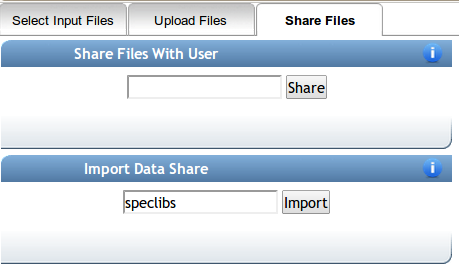

## Data Privacy

Q: Will MassIVE datasets that I create be public by default?

A: No, when creating a MassIVE dataset, it is not public by default. On the input form page, you are able to set a password to access the MassIVE dataset. There is a Make Public link to make your dataset open to the public and documentation can be found here here. Such a feature is very useful because users can create a MassIVE dataset prior to publication submission that is private and password protected. The MassIVE dataset link can be provided to reviewers along with the password so to provide better transparency and increase probability of manuscript acceptance.

## Data Organization

Q: How does the MassIVE data differ from the GNPS spectral libraries?

A: MassIVE datasets consist of raw data. GNPS spectral libraries consist of spectra that have been individually assigned an identification.

Q: Can I create my own private spectral libraries?

A: Yes, but it is not recommended. Please [contact](contact.md) administrators for further details.

## Spectral Libraries

Q: How do I get access to the public spectral libraries?

A: On the select input files popup, click on the shared files tab, and enter speclibs as an import share.

## Analyzing Data

Q: Can I select more than one file at a time for each group in molecular networking?

A: Yes. Within each group you can select multiple files, even folders of spectra. Simply highlight the multiple files/folders you want to select and then add to the appropriate group.

## Browser Support

We officially test on the latest Chrome browser. Other browsers, e.g. Firefox, Internet Explorer, Opera, Edge, are not officially supported but likely will not have any issues with GNPS.
