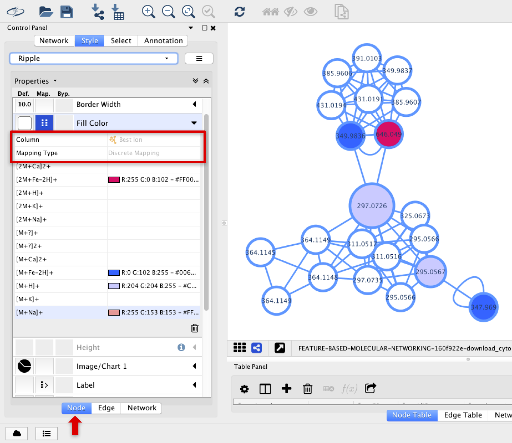

# IIN with MZmine2

## Introduction

Ion Identity Network (IIN) is a computational method based on Pearson correlation that allows to correlate the different ions, including adducts, multimers and in-source fragmentation, that can be formed from the same molecule during the ESI ionization. This is an advanced option one might choose while processing data for [Feature Based Molecular Network (FBMN)](https://ccms-ucsd.github.io/GNPSDocumentation/featurebasedmolecularnetworking/). The supported tools for IIN are: MZmine, XCMS, and MS-DIAL.

You can find more information about IIN in this [playlist](https://www.youtube.com/playlist?list=PL4L2Xw5k8ITyxSyBdrcv70LDKsP8QNuyN).

## Development and Installation

For Ion Identity Network, download the MZmine software (MZmine-2.37.corr17.7_kai_merge2 version) available [here](https://github.com/robinschmid/mzmine2/releases).

## Data Processing with MZmine for FBMN and IIN
The sequence of steps for data processing in MZmine are essentially the same described in Data Processing with MZmine for FBMN in the standard workflow (from 1. data import, to 7. gap filling / 8. normalization),
however, before exporting to GNPS, some steps for IIN should be included for the edge annotations.
The scheme below shows the steps involved in the IIN workflow with MZmine.

## 9. Ion Identity Networking (IIN)

Once the last step for Feature Based Molecular Networking has been completed, this peak list must be selected to continue. Initially, metaCorrelate should be selected, which will be used to search for the same features in different samples, scan events and MS levels.
 
Go to Menu: Peak list methods > Row grouping > metaCorrelate.

Another window will show up, and information regarding the RT tolerance, min height and noise level should be entered considering the sample set selected and equipment used. Select box “Correlation grouping” and set the parameters according to what would fit better in the dataset.
IMPORTANT: make sure that PEARSON measurement is selected. <-- check it.

Click on OK and a new feature list will be generated on the right panel.
 
At this point, the Ion Identity Networks should be built (it will be searching for adducts, in-source fragments and clusters in the dataset).
 
Go to Menu: Peak list methods > Identification > Ion Identity Networks > Ion Identity Networking.

The “Check” parameter presents three options that can be used to check for adduct identities.
The ion identity library can be used to select the adducts of interest and the molecules’ modifications. Click on “Reset Positive/Negative” and on “Reset Mods” to have access to the list available in MZmine. At this point, the ones more appropriate for each dataset should be selected.

In the case that, in addition to the most common adducts ([M+Na]+, [M+K]+, [M+H]+, [2M+H]+, etc), more specific ions are observed in the dataset and are not included in the software’s list, it is possible to create new ones by clicking in “Add…” and filling the required information. It is also possible to combine adducts to create a new customized one clicking in “Combine…”. In the case of a combination, the adducts present in the list should be added to the right panel, selected and then added again to the previous list.

These steps can also be followed to add or combine modifications (in-source fragmentations) that might be more specific than the most common ones ([M-H2O], [M-CO], etc).
 
## 10. Feature export for GNPS:

In this step, the 3 files required for running a job on GNPS are going to be exported:
·      The feature quantification table (.CSV file format), with LC-MS feature intensities;
·      The MS/MS spectral summary (.MGF file), with a representative MS/MS spectrum per LC-MS feature. The MS/MS spectrum correspond either to the most intense MS/MS found for the feature, or to the merged spectrum;
·      The annotation edge file (.CSV file), containing the additional edges annotated by IIN.
 
Go to Menu: Peak list methods > Export/Import > Export for/Submit to GNPS.

Name the filename in .mgf format and choose filter rows only with MS2 data.

Note: The additional steps included in MZmine for IIN can not be saved when you save your project, therefore, once the data was processed, you have to export the files, otherwise, only the feature quantification table (.CSV file format), and the MS/MS spectral summary (.MGF file) will be exported.

## Cytoscape visualization – IIN

The additional edges that IIN identified as adducts and in-source modifications can also be observed in Cytoscape.
 
The different types of ions can be observed in different node colors if the Best Ion option is chosen in Fill Color, and Discrete Mapping type is selected.

The lines connecting the nodes can be deferred if the connection represents a cosine or a MS1 annotation from INN. In the Line Type option, select EdgeType with Discrete Mapping.

The annotation of the adducts or in-source fragmentations connected in the MS1 level can be annotated in the edges connecting the corresponding nodes. In the Label option, select Edge Annotation with Passthrough Mapping.

Specific types of adducts’ edges can be colored differently by selecting Stroke Color (Unselected) section, and choosing Edge Annotation and Discrete Mapping.

## Citations

This work builds on the efforts of our many colleagues, please cite their work:

**For IIN**: Schmid et al. In preparation.

**For FBMN**: Nothias, L.F. et al [Feature-based Molecular Networking in the GNPS Analysis Environment](https://www.biorxiv.org/content/10.1101/812404v1) bioRxiv 812404 (2019).

## Page Contributors
Helena Mannochio Russo (UNESP), Anelize Bauermeister (USP), Daniel Petras (UCSD), Allegra Aron (UCSD).
