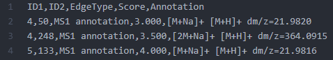

# Ion Identity Networking (IIN)

## Introduction

The **Ion Identity Networking** (IIN) workflow complements the [Feature-Based Molecular Networking (FBMN)](featurebasedmolecularnetworking.md) by grouping MS2 spectra not only through similarity of MS2 spectra, but also of MS2 spectra whose precursor ions fulfill the retention time, peak shape, user-defined parameters. It enables the visualization of patterns of ion species and brings together subnetwork from the same molecule to create an ion identity molecular family. IIN can be performed with [MZmine](fbmn-iin-mzmine.md), [XCMS-CAMERA](fbmn-iin-xcms.md), or [MS-DIAL](fbmn-iin-msdial.md).

You can find more information about IIN in this [playlist](https://www.youtube.com/playlist?list=PL4L2Xw5k8ITyxSyBdrcv70LDKsP8QNuyN).

Note that the IIN documentation is under construction. 

## Citations

This work builds on the efforts of our many colleagues, please cite their work:

**For IIN**: Schmid R., Petras D., Nothias LF, et al. [Ion Identity Molecular Networking in the GNPS Environment](https://www.biorxiv.org/content/10.1101/2020.05.11.088948v1) bioRxiv 088948 (2020).

**For FBMN**: Nothias, L.F., Petras D., Schmid R, et al. [Feature-based Molecular Networking in the GNPS Analysis Environment](https://www.biorxiv.org/content/10.1101/812404v1) bioRxiv 812404 (2019).

**For GNPS**: Wang, M., Carver J, Phelan V.V., et al. [Sharing and community curation of mass spectrometry data with Global Natural Products Social Molecular Networking](https://doi.org/10.1038/nbt.3597). Nat. Biotechnol. 34, 828–837 (2016).

And the tools you used to process your data.

## Running the IIN workflow

The Ion Identity Networking workflow is run throught the [FBMN workflow](featurebasedmolecularnetworking.md) by providing Supplementary Annotation/Pairs files in the "Advanced Extras" panel of the standard [FBMN workflow interface](featurebasedmolecularnetworking.md).

Alternatively, the [quickstart interface for FBMN ](https://gnps-quickstart.ucsd.edu/featurebasednetworking) can also be used:

Note that multiple Supplementary Pairs files can specified. Their content will be added.

## Generating Supplementary Pairs

The Supplementary Annotations/Pairs files can be generated with the following software:

- **MZmine**: [See the documentation](fbmn-iin-mzmine.md)
- **XCMS-CAMERA**: [See the documentation](fbmn-iin-xcms.md)
- **MS-DIAL**: [See the documentation](fbmn-iin-msdial.md)

Alternatively, the results of other software could be used as long as the LC-MS feature identifier (ID) matches the "SCANS=" number in the MGF file.

#### Supplementary pairs

The Supplementary Pairs is a .CSV format file (coma separated), and must contains the following columns:

| Header        | Description |
| ------------- |-------------|
| ID1 | Node ID 1 matching the row IDs |
| ID2 | Node ID 2 matching the row IDs |
| EdgeType | Any string describing the type of edge |
| Score | A numerical value for the score (cannot be empty) |
| Annotation | A string annotation |

See an example of the Supplementary Pairs used in the Ion Identity Networking (IIN) workflow

## Exploring the IIN workflow in Cytoscape

The additional edges that IIN identified as adducts and in-source modifications are visualized in Cytoscape.
 
The different types of ions can be observed in different node colors if the Best Ion option is chosen in Fill Color, and Discrete Mapping type is selected.

The lines connecting the nodes can be deferred if the connection represents a cosine or a MS1 annotation from INN. In the Line Type option, select EdgeType with Discrete Mapping.

The annotation of the adducts or in-source fragmentations connected in the MS1 level can be annotated in the edges connecting the corresponding nodes. In the Label option, select Edge Annotation with Passthrough Mapping.

Specific types of adducts’ edges can be colored differently by selecting Stroke Color (Unselected) section, and choosing Edge Annotation and Discrete Mapping.

## Page contributors
Robin Schmid (WWU, Münster, Germany), Daniel Petras (UCSD), Louis Felix Nothias (UCSD), Ming Wang (UCSD).
