## Introduction to FBMN

The **Feature-Based Molecular Networking** (FBMN) is a computational method that bridges popular mass spectrometry data processing tools for LC-MS/MS and molecular networking analysis on [GNPS](http://gnps.ucsd.edu). The tools supported are: [MZmine2](featurebasedmolecularnetworking-with-mzmine2.md), [OpenMS](featurebasedmolecularnetworking-with-openms.md), [MS-DIAL](featurebasedmolecularnetworking-with-ms-dial.md), [MetaboScape](featurebasedmolecularnetworking-with-metaboscape.md), and [XCMS](featurebasedmolecularnetworking-with-xcms3.md).

The main documentation for Feature-Based Molecular Networking [can be accessed here:](featurebasedmolecularnetworking.md)

The documentation for Feature-Based Molecular Networking and Cytoscape is provided below.

## Feature-Based Molecular Networking in Cytoscape

Cytoscape is an open source software platform used to visualize, analyze and annotate molecular networks from GNPS. Cytoscape is available for download from [here](http://www.cytoscape.org). The instructions were created with Cytoscape 3.7, but should work for subsequent versions.

Shannon, P., et al. (2003). Cytoscape: a software environment for integrated models of biomolecular interaction networks. _Genome Res, 13_(11), 2498-2504. [doi:10.1101/gr.1239303](doi:10.1101/gr.1239303)

### Downloading Cytoscape Files from GNPS

The first step is to download the input file (.graphML file format) for import into Cytoscape. From the job status page in the Feature-Based Molecular Networking workflow, click on _Download Cytoscape Data_. Save and unzip the downloaded file.  

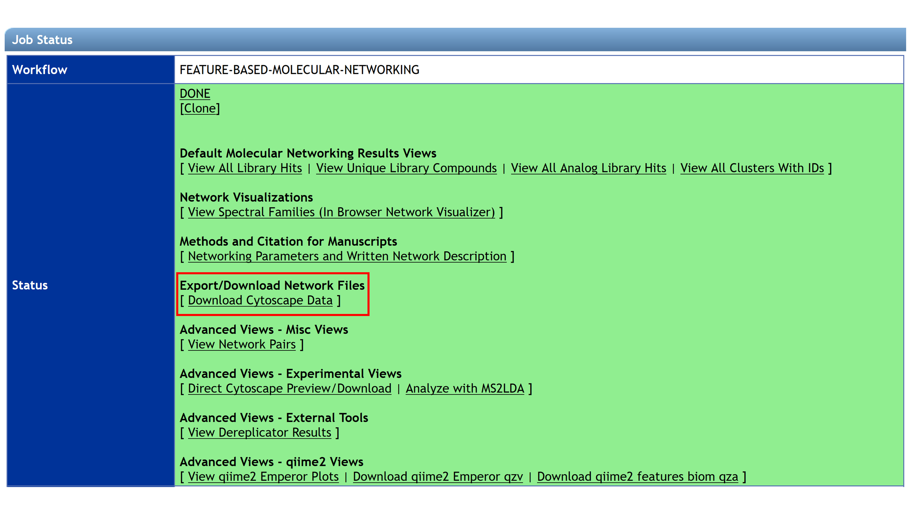

Unzip the file and the resulting folder will look like this:

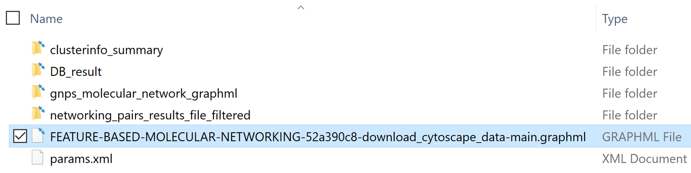

### Importing Files from GNPS to Cytoscape

To import the network file into Cytoscape:
*    in Cytoscape click on _Import Network from File System_ and then choose the _.graphml_ file. 
*   Alternatively, you can drag and drop the .graphml file into Cytoscape.

The imported network will be displayed in the main window. In the _Control Panel_ (left panel), in the _Network_ tab, rename the network with right-click and select _Rename Network_.

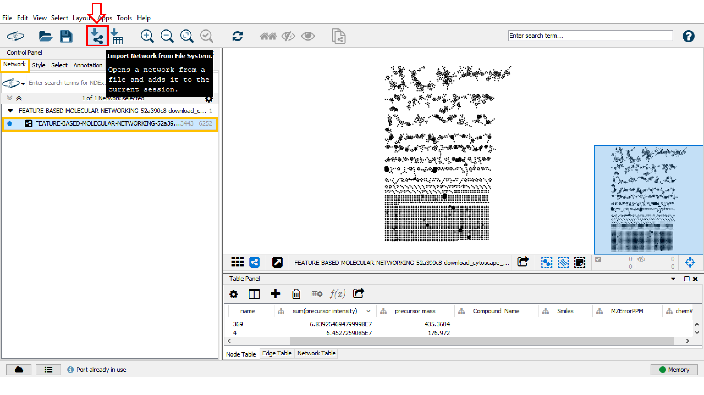

You can import the table file into Cytoscape, click on Import Table from File System and then choose into the “DB_result” folder the .csv file. Then, click on OK in the opened window.

## Rotation of the Network

To rotate the entire molecular network choose the tab _Layout_ and click on _Node Layout tool_. In the opened window, unclick the box _Selected Only_ to rotate the entire network and move the blue bar to 90. You can also select specific subnetworks and rotate them by clicking the box _Selected only_.

### Table Panel Visualization Data

For advance network visualisation and data analysis, you may click on _Table Panel_ and select node or edge column information (network metadata) to be displayed. For example,  in the _Node Table_, you can select the "_Compound_name"_ (name of the spectral library match), the "_parent mass"_ (precursor ion mass), the "_RTconsensus"_ (retention time for the node), "_MZErrorPPM"_ (ppm error with the spectral library match) and any attributes of interest in your in _Node Table_ (node metadata).

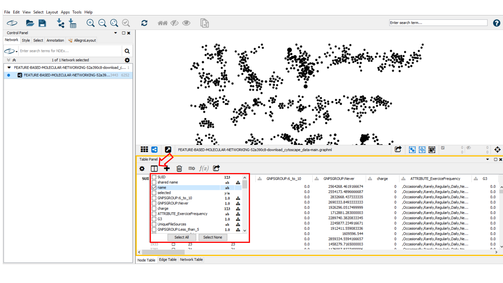

### Create a New Style

A style can be created by clicking on _Create New Style_ and a style name can be specified (e.g. "High vs Low Plant Consumer"). The created style can be exported by going in the main menu to _File _>_ Export _>_ Styles to File_, or a previous style can be imported by clicking on _Import_ > _Style From File_ in the _File_ section. 

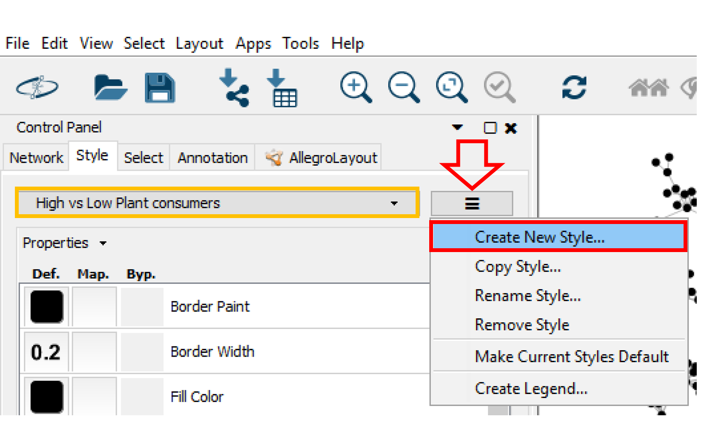

### Edit the Style

#### Node Styling

##### Label

In the  _Control Panel_ (left panel), go to the _Style_ tab. Within the _Node_ sub-tab, the properties of the node style can be modified. For example, you can choose the _precursor mass_ as node label for the molecular networks [you need to select  _Passthrough Mapping_ as the _Mapping Type_]. Go to _Properties_ to display more style properties. 

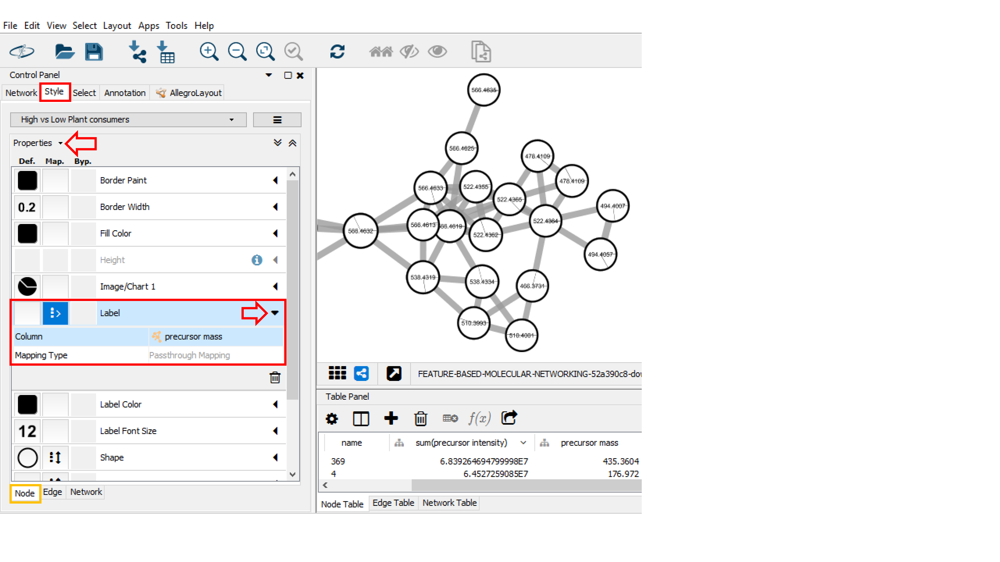

##### Size

In order to match the label size to the node size, go into _Style panel_, at _Label Front Size_ option, select “_SumPeakIntensity_” or the “_number of spectra_” (as selected for node size) as _Column and Continuous Mapping_ as _Mapping Typ_e. As described above, begin by setting the value for minimum and maximum node size value with the button Set Min and Max, then choose the same continuous mapping as used for the node size.

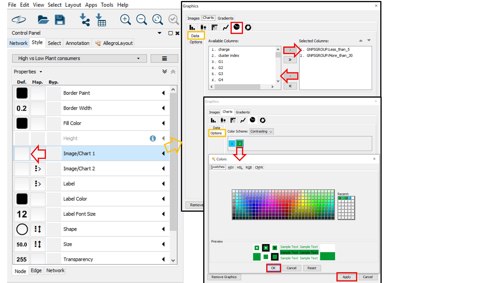

##### Pie charts

If you used a metadata table, the node table will contain group columns for each group specified in the metadata table. The group columns starts with "_GNPSGROUP__" and will consist of the mean (default and recommended) or summed intensity of the ion across the group's samples based on the MS1 feature table (LC-MS peak area). This group columns can be used to visualize groups as pie charts in the network.

To start visualizing pie charts on node for the groups, click on the left box (_Def_ column) for the  _Image/Chart1_ node property. Choose the Charts tab and select the _Pie Chart Icon_. Now, in the _Data_ sub-tab, select the group columns you are interested in visualizing in the _Select Columns_ box (e.g. "_GNPSGROUP: Less_than 5"_ (low plant consumers) and "_GNPSGROUP:More_than_30" _(high plant consumers)). Click on _Options_ (below _Data_) to choose colors for the Groups (groups are numerized based on their position in the _Selected Columns_ box). Click _Apply_ when you are done with your selection.

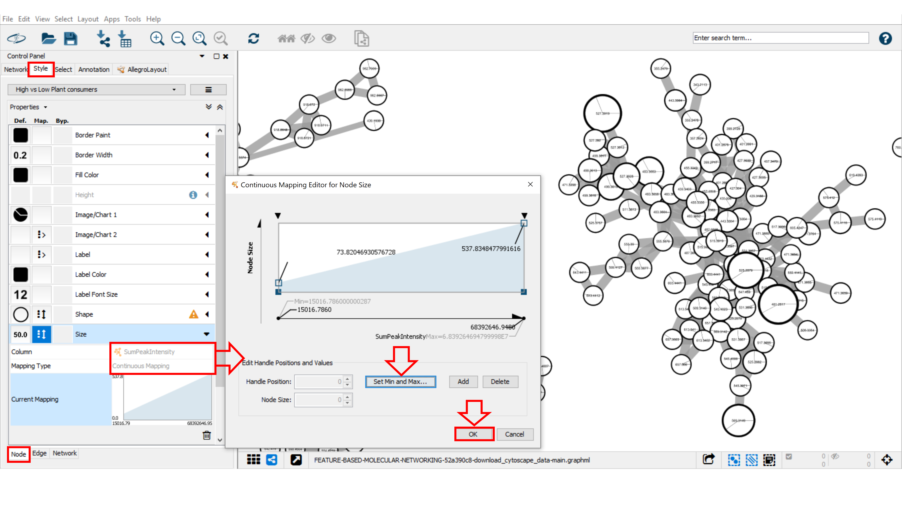

#### Edge Styling

##### Width

To aid in the visualization of individual node relatedness within a cluster, the cosine score is displayed as an edge. The cosine scores define similarity between two MS/MS spectra. Scores ranging from 0 (totally dissimilar) to 1 (identical). The edge thickness can be used to visualize the cosine score value between related nodes. For this we will use the cosine score based continuous mapping for the edge thickness. Go to the _Style_ tab, and the _Edge_ sub-tab. From the _Width_ property drop down menu, select "_cosine_score"_ for the _Column_ and _Continuous Mapping_ for the _Mapping Type_. Double click on the _Continuous Mapping_ area of the menu to adjust the thickness of the edge. Click OK to apply the setting changes. Optimise the minimum and maximum value for the continuous mapping.

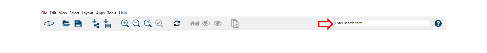

### Mining information in the network

### Sub-network creation

To separate one or multilple specific desired network(s), press “ctrl” or “command” (windows or MacOS, respectively) at the same time drag the mouse to select the network(s). Then, click on the symbol as shown below. Automatically, the sub-network is created. For going back to the main network, go into the _Control Panel_, select _Network_ and then choose the main network.

#### The Toolbar function

The Cytoscape's toolbar can be used to search nodes or edge metadata (e.g., "_shared name_"). Note that this feature is very slow, especially with large network. The list of nodes in the Note Table will be updated. You can select nodes of interest, perform right-click for _Select nodes_ and then click on the _+ magnifier_ in the main menu to perform a zoom on the selected node.

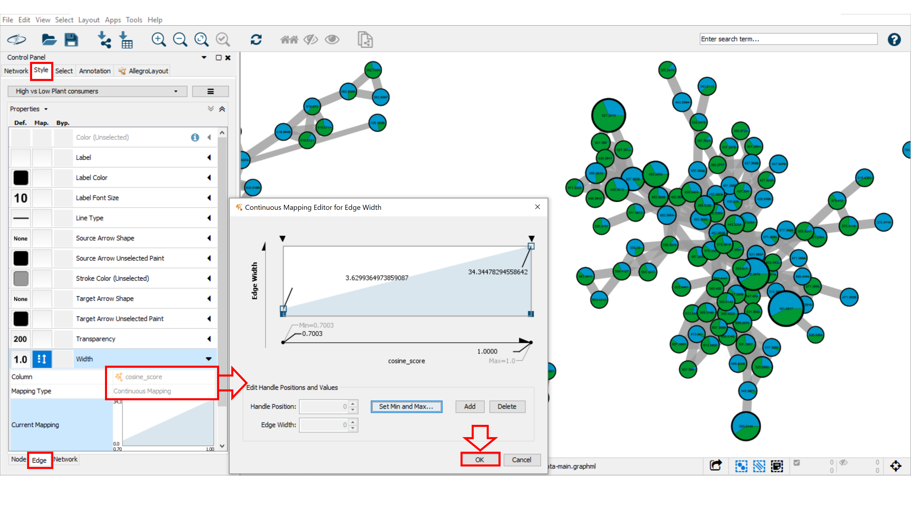

#### The Select function

The Select function can be used to create a selection of nodes and/or edges based on their metadata and/or network topology. Go to the _Control Panel_ and click on _Select_ tab. Then, click on the "_+_" button and choose between column, degree, or topology filter(s) to add different filter properties. The "_x_" button deletes the corresponding property. For each filter property, various options are provided depending on the column type (numeric column:  _is_, _is not_, _between_; for string column: _contains_ and _does not contain_. Here, we create _annotation filter_ who selects nodes with a spectral library match with 10 ppm maximum error between precursor ions ("_MZErrorPPM_" from 0 to 10). By default, the filter should be automatically applied to the network, otherwise click on _Apply_. Below Filter tab, the number of nodes meeting the filter property variables (here 160 nodes) will be selected. These nodes are automatically selected and highlighted in yellow in the network.

Filters are very powerful network analysis tools that can be modified, saved and exported. To rename, remove, create a new filter, or other options, click on the right button beside the Filter list menu. The list of available Filters will appear in the top part of the panel. 

For more details and options, follow this [link](http://manual.cytoscape.org/en/stable/Finding_and_Filtering_Nodes_and_Edges.html#filters). 

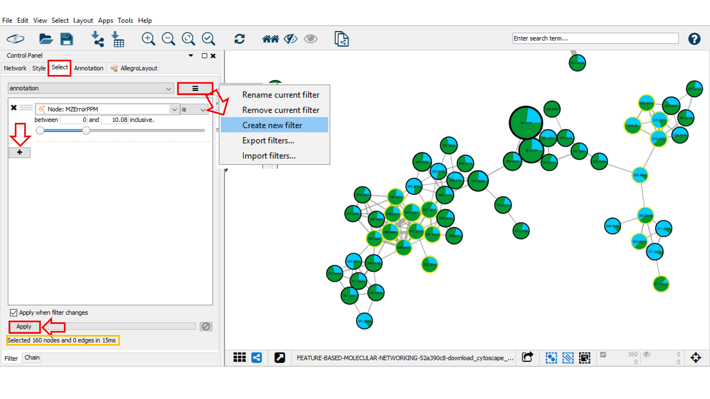

### Bypass mode for style property

A bypass could be applied on selected nodes and/or edged by going into the  _Style_ panel, and clicking on the _Byp. _column for the property you want to change such as _Border paint_ and _Border Width_. For modifying or removing the bypass property, select the nodes concerned, click right and choose _Remove Bypass_ or _set Bypass_ option. 

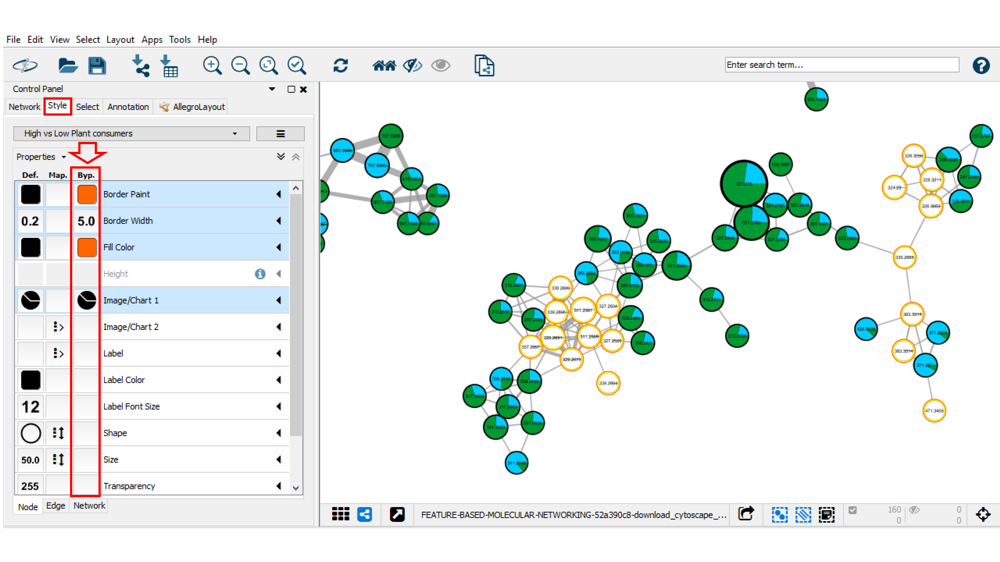

### Drawing structure in nodes

The chemical structures can be visualized in the node using chemViz2 bioinformatics plugin for Cytoscape ([http://www.cgl.ucsf.edu/cytoscape/chemViz/](http://www.cgl.ucsf.edu/cytoscape/chemViz/)). First the chemViz2 plugin has to be installed. To do that, in the main menu, go to _Apps_ tab then open _App Manager_. In the _Install Apps_ click on _chemViz2_ and install it by clicking on the _Install_ button. For more information about chemViz2, refer to the information available in the following [chemViz2 website link](http://www.cgl.ucsf.edu/cytoscape/chemViz/). 

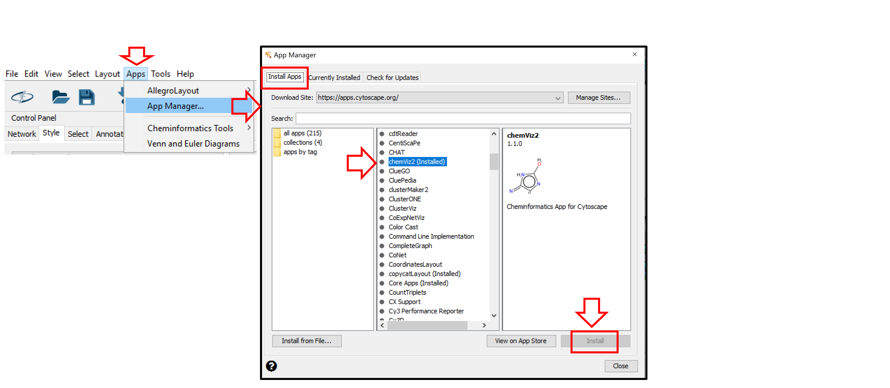

Once installed, chemViz2 can be used to display chemical structures on nodes. First, you will have to verify that the chemViz2 is properly parameterized. Select _Apps_ in the main menu, go to _Cheminformatics Tools_ and click on _Setting_. In _Attribute Settings_, choose for the _SMILES Attribute_ the _node.Smiles_ value and/or for _InCHI Attribute_ the _node.INCHI_ value. Apply it by clicking on the _OK_ button. 

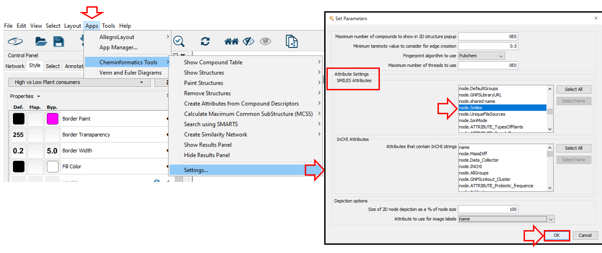

Finally, to draw structures in nodes, return to _Apps_ and _Cheminformatics Tools_ to go to _Paint Structures_ and select _on all nodes_ or _on selected nodes_. Visualize the results. If needed, create a dedicated style to facilitate structure visualization. 

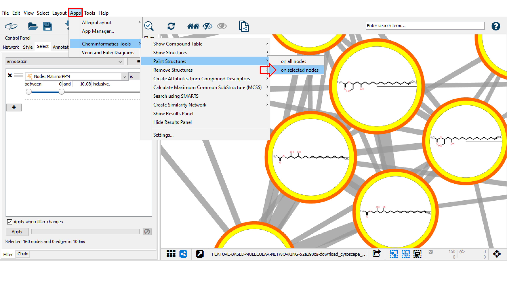

## Video Tutorial FBMN and Cytoscape

Our [tutorial on running a FBMN analysis on GNPS including a Cytoscape demo](tutorials/featurebasedgnps.md).

<iframe width="600" height="375" src="https://www.youtube.com/embed/NTkQ0fS1aug"> </iframe>

See our [tutorial on using MZmine2](tutorials/americangutmzmine.md) for FBMN analysis of a cohort from the [American Gut Project] (http://humanfoodproject.com/americangut/).

## Page contributors
Melissa Esposito (UCSD), Irina Koester (SIO, UCSD), Christian Martin (INDICASAT), Louis Felix Nothias (UCSD).

## Contribute to the Documentation

- For informations/feature request, please open an "Issue" on the [*CCMS-UCSD/GNPSDocumentation*]((https://github.com/CCMS-UCSD/GNPSDocumentation)) GitHub repository.
- To contribute directly to the GNPS documentation, fork the [*CCMS-UCSD/GNPSDocumentation*]((https://github.com/CCMS-UCSD/GNPSDocumentation)) repository, and make a "Pull Request".