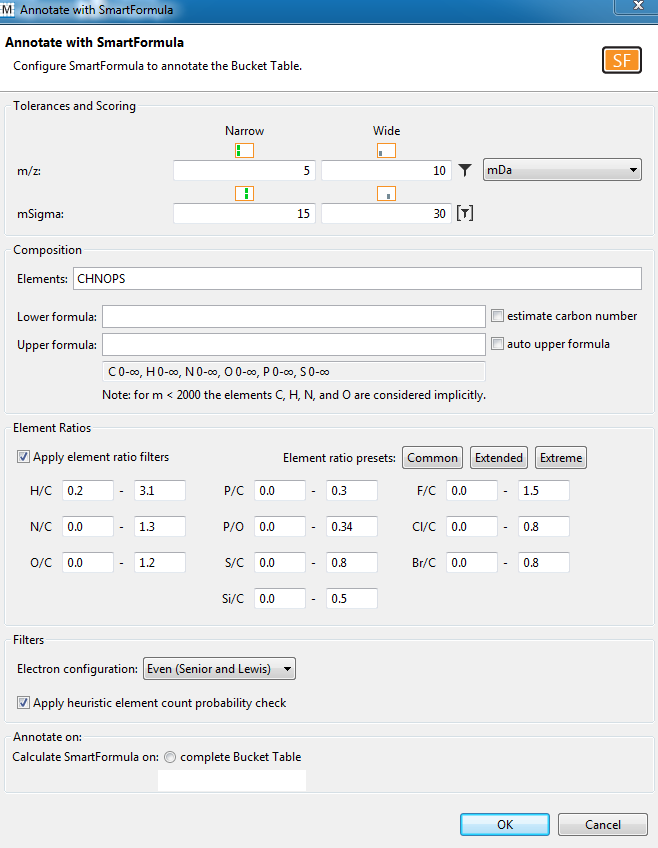
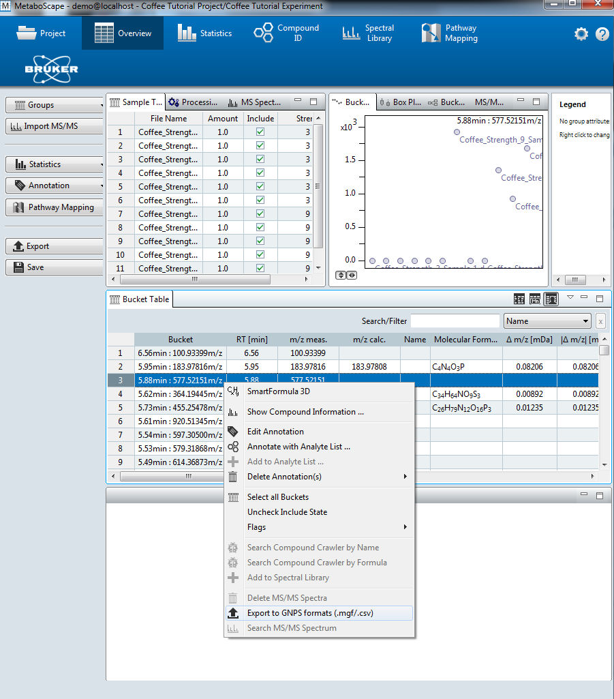
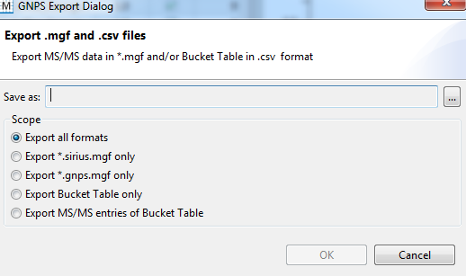
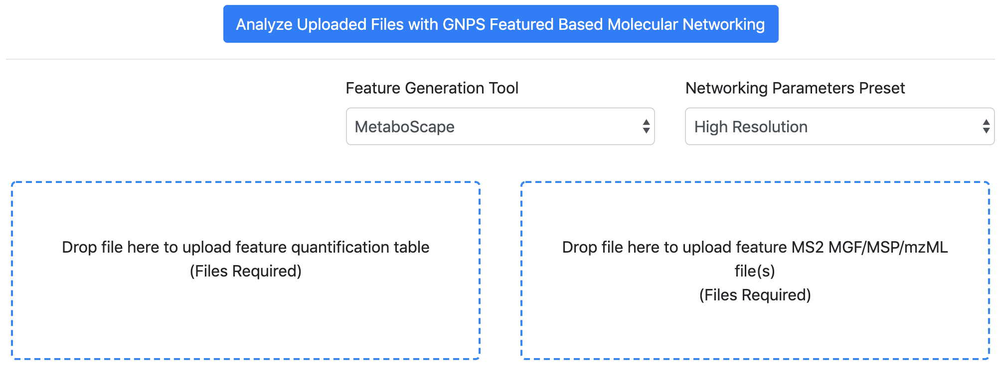
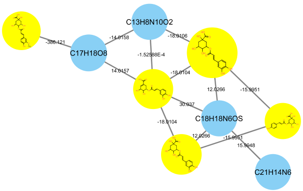

## Introduction

The main documentation for **Feature-Based Molecular Networking** (FBMN) [can be accessed here](featurebasedmolecularnetworking.md). See [our preprint on bioaRxiv](https://www.biorxiv.org/content/10.1101/812404v1).

Below we describe how to use **MetaboScape** with the FBMN workflow on GNPS.

## Citations and development

This work builds on the efforts of our many colleagues, please cite their work:

Nothias, L.F. et al [Feature-based Molecular Networking in the GNPS Analysis Environment](https://www.biorxiv.org/content/10.1101/812404v1) bioRxiv 812404 (2019).

Wang, M. et al. [Sharing and community curation of mass spectrometry data with Global Natural Products Social Molecular Networking](https://doi.org/10.1038/nbt.3597). Nat. Biotechnol. 34, 828–837 (2016).

## Using MetaboScape and FBMN

MetaboScape can be used to process LC-MS/MS Bruker Daltonics data files (i.e. *.d files). After the processing with MetaboScape, the output files can be used to run the Feature-Based Molecular Networking workflow on GNPS either using the [Superquick FBMN start page] (http://dorresteinappshub.ucsd.edu:5050/featurebasednetworking) or [the standard interface of the FBMN workflow](https://gnps.ucsd.edu/ProteoSAFe/index.jsp?params=%7B%22workflow%22:%22FEATURE-BASED-MOLECULAR-NETWORKING%22,%22library_on_server%22:%22d.speclibs;%22%7D) (you need to be logged in to GNPS first).

**Requirements:** 
Install [MetaboScape](https://www.bruker.com/products/mass-spectrometry-and-separations/ms-software/metaboscape/overview.html) (at least version 2.0) and get a valid license. 

### A. Perform Feature Detection with Profile Analysis

#### Nontargeted LC-MS/MS
1. Open *Profile Analysis* and perform feature detection on your data following *Profile Analysis* documentation to generate an ion feature bucket table.
2. Define groups and/or attributes to enhance downstream data analysis (see **3.3.4** in the **MetaboScape 2.0 tutorial documentation**). The groups and/or attributes defined in *Profile Analysis* will be visualized in the molecular networks using pie chart diagram.
3. **IMPORTANT**: Create one common group named 'SAMPLE' for all the samples. It will be used for molecular networking visualization.
4. Export the bucket table to MetaboScape (see **3.1** in the **MetaboScape 2.0 tutorial documentation**).

### B. Use MetaboScape to Annotate MS/MS spectra
1. Open MetaboScape.
2. Open the project in MetaboScape (see **3.7** in **MetaboScape 2.0 tutorial documentation**).
3. Assign MS/MS spectra to the bucket table (see **3.7** in **MetaboScape 2.0 tutorial documentation**).
4. Sort buckets based on the presence of MS/MS.
5. Select only the buckets that have MS/MS associated with them.
6. Perform *Automatic molecular formula generation using SmartFormula* (see **3.11.1** in **MetaboScape 2.0 tutorial documentation**) on these buckets. Make sure to select *Selected buckets only*.
7. Search molecular formula with **SmartFormula**.

8. Right-click on the bucket table and select *Export to GNPS format* (.MGF/.CSV).

9. Select *Export all formats*.

10. The **MS/MS spectral summary** (.MGF file) and the **feature quantification table** (.CSV file) will be used to perform a FBMN job on GNPS (see below).

#### Processing IMS Data (PASEF)

The FBMN supports Ion Mobility Spectrometry (IMS) Data acquired in data-dependent acquisition mode using Parallel Accumulation-Serial Fragmentation (PASEF) and processed with MetaboScape (ver. 5.0). Process the IMS data following the MetaboScape documentation and do *Export to GNPS format* as indicated above. The cross collission section values and other annotations can be subsequently mapped in Cytoscape.

See a representative [FBMN job](https://gnps.ucsd.edu/ProteoSAFe/status.jsp?task=0d89db67b0974939a91cb7d5bfe87072) made from PASEF data (timsTOF) processed with MetaboScape (ver. 5.0). The Bruker files are available on the following MassIVE deposition ([MSV000084402](https://gnps.ucsd.edu/ProteoSAFe/result.jsp?task=36fea50f5e7b4a049d336f28c5884ff9&view=advanced_view))

### C. Perform FBMN Job on GNPS
Go to GNPS and perform a FBMN job. [Refer to that documentation](featurebasedmolecularnetworking.md).

### D. Map MetaboScape Annotation in Cytoscape
See the [step-by-step tutorial using MetaboScape 2.0 and the FBMN](tutorials/coffee-tutorial-metaboscape.md) for more details.

## Step-by-Step Tutorial
See the [step-by-step tutorial using MetaboScape 2.0 and the FBMN](tutorials/coffee-tutorial-metaboscape.md) for the Coffee tutorial (part of the **MetaboScape 2.0 documentation**).

### Page contributors
Louis Felix Nothias (UCSD), Tam Dang (Tech. Univ. Berlin), Kevin Ngoc (UCSD), Ivan Protsyuk (EMBL, Heidelberg, Germany).

### Join the GNPS Community !

- For feature request, or to report bugs, please open an "Issue" on the [*CCMS-UCSD/GNPS_Workflows* GitHub repository](https://github.com/CCMS-UCSD/GNPS_Workflows).
- To contribute to the GNPS documentation, please use GitHub by forking the [*CCMS-UCSD/GNPSDocumentation*]((https://github.com/CCMS-UCSD/GNPSDocumentation)) repository, and make a "Pull Request" with the changes.