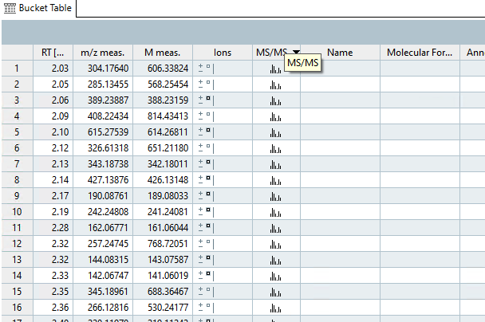
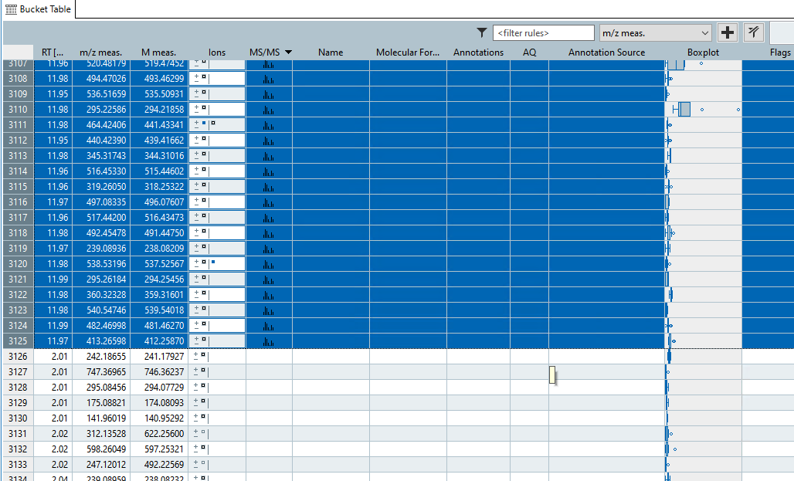
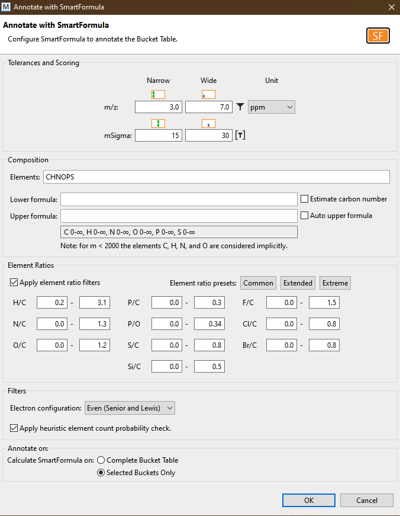
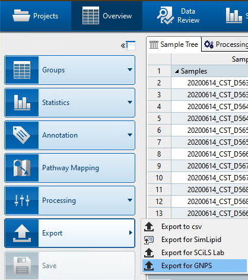
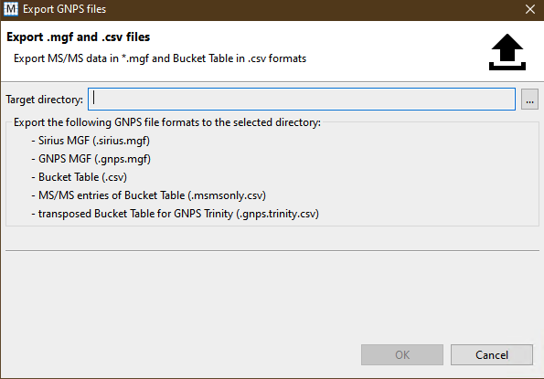
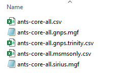
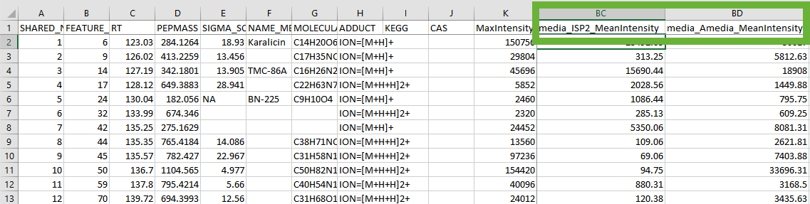
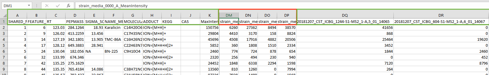

## Introduction

The main documentation for **Feature-Based Molecular Networking** (FBMN) [can be accessed here](featurebasedmolecularnetworking.md). See [our preprint on bioaRxiv](https://www.biorxiv.org/content/10.1101/812404v1).

Below we describe how to use **MetaboScape** with the FBMN workflow on GNPS.

## Citations and development

This work builds on the efforts of our many colleagues, please cite their work:

Nothias, L.F. et al [Feature-based Molecular Networking in the GNPS Analysis Environment](https://www.biorxiv.org/content/10.1101/812404v1) bioRxiv 812404 (2019).

Wang, M. et al. [Sharing and community curation of mass spectrometry data with Global Natural Products Social Molecular Networking](https://doi.org/10.1038/nbt.3597). Nat. Biotechnol. 34, 828–837 (2016).

## Using MetaboScape and FBMN

MetaboScape can be used to process LC-MS/MS Bruker Daltonics data files (i.e. *.d files). After the processing with MetaboScape, the output files can be used to run the Feature-Based Molecular Networking workflow on GNPS either using the [Superquick FBMN start page](https://gnps-quickstart.ucsd.edu/) or [the standard interface of the FBMN workflow](https://gnps.ucsd.edu/ProteoSAFe/index.jsp?params=%7B%22workflow%22:%22FEATURE-BASED-MOLECULAR-NETWORKING%22,%22library_on_server%22:%22d.speclibs;%22%7D) (you need to be logged in to GNPS first).

**Requirements:** 
Install [MetaboScape](https://www.bruker.com/products/mass-spectrometry-and-separations/ms-software/metaboscape/overview.html) (version 2.0 or higher) and get a valid license.

!!! note
    If you installed Metaboscape v5.0, then please [skip to this section](###-a2.-perform feature-detection-and-annotation-with-metaboscape-v5.0) instead.  

### A. Perform Feature Detection with Profile Analysis

#### Nontargeted LC-MS/MS
1. Open *Profile Analysis* and perform feature detection on your data following *Profile Analysis* documentation to generate an ion feature bucket table.
2. Define groups and/or attributes to enhance downstream data analysis (see **3.3.4** in the **MetaboScape 2.0 tutorial documentation**). The groups and/or attributes defined in *Profile Analysis* will be visualized in the molecular networks using pie chart diagram.
3. **IMPORTANT**: Create one common group named 'SAMPLE' for all the samples. It will be used for molecular networking visualization.
4. Export the bucket table to MetaboScape (see **3.1** in the **MetaboScape 2.0 tutorial documentation**).

### B. Use MetaboScape to Annotate MS/MS spectra
1. Open MetaboScape.
2. Open the project in MetaboScape (see **3.7** in **MetaboScape 2.0 tutorial documentation**).
3. Assign MS/MS spectra to the bucket table (see **3.7** in **MetaboScape 2.0 tutorial documentation**).
4. Sort buckets based on the presence of MS/MS.
5. Select only the buckets that have MS/MS associated with them.
6. Perform *Automatic molecular formula generation using SmartFormula* (see **3.11.1** in **MetaboScape 2.0 tutorial documentation**) on these buckets. Make sure to select *Selected buckets only*.
7. Search molecular formula with **SmartFormula**.

8. Right-click on the bucket table and select *Export to GNPS format* (.MGF/.CSV).

9. Select *Export all formats*.

10. The **MS/MS spectral summary** (.MGF file) and the **feature quantification table** (.CSV file) will be used to perform a FBMN job on GNPS (see below).

### A2. Perform Feature Detection and Annotation with Metaboscape v5.0
1. Open Metaboscape and setup a new project, add an experiment, and then generate a bucket table containing ion features. This is outlined in the Metaboscape v5.0 User Manual - Section 3.
2. If you wish to annotate your MS2 features using a custom feature list or by SmartFormula, first sort your features by clicking on the MS/MS column.  

3. Next, select the buckets that contain MS/MS features  

4. Finally perform feature annotation using SmartFormula by clicking on the `Annotation` button on the left and then setting appropriate parameters for annotation. Don't forget to click `Selected Buckets Only` at the bottom!  

### B2. Export your data for GNPS using Metaboscape v5.0  

1. Click on the `Export` button on the left to export your data for GNPS.  

2. Select a target directory to export the files. As shown below, this will export all the features required for GNPS analyses. 

3. You should have these files once you have successfully exported your bucket table.

4. Finally, you will need to modify the `msmsonly.csv` file to ensure that it meets the requirements of the current FBMN workflow. This will be most likely be automated in a future version of FBMN. You will need a spreadsheet tool like MS Excel. Metaboscape v5.0 exports extra columns depending on the metadata you define during your experiment setup. For example, if you define a metadata grouping as `media` with different kinds of media, then your excel file will look somewhat similar to this (note the columns boxed in green):

You must edit your file to get rid of these extra columns. In the screenshot shown below, the columns containing your sample intensities start at `DQ`. **You must delete all columns between  `MaxIntensity` and your first sample column.** In the screenshots, delete columns between `Column K` and `Column DQ`. _Do not delete `MaxIntensity` or your sample columns!_ 

In the example below, delete the columns in red but keep the columns in green.

#### Processing IMS Data (PASEF)

The FBMN supports Ion Mobility Spectrometry (IMS) Data acquired in data-dependent acquisition mode using Parallel Accumulation-Serial Fragmentation (PASEF) and processed with MetaboScape (ver. 5.0). Process the IMS data following the MetaboScape documentation and do *Export to GNPS format* as indicated above. The cross collission section values and other annotations can be subsequently mapped in Cytoscape.

See a representative [FBMN job](https://gnps.ucsd.edu/ProteoSAFe/status.jsp?task=0d89db67b0974939a91cb7d5bfe87072) made from PASEF data (timsTOF) processed with MetaboScape (ver. 5.0). The Bruker files are available on the following MassIVE deposition ([MSV000084402](https://gnps.ucsd.edu/ProteoSAFe/result.jsp?task=36fea50f5e7b4a049d336f28c5884ff9&view=advanced_view))

### C. Perform FBMN Job on GNPS
Go to GNPS and perform a FBMN job. [Refer to that documentation](featurebasedmolecularnetworking.md). For metadata format supported, see [this page](metadata.md)

### D. Map MetaboScape Annotation in Cytoscape
See the [step-by-step tutorial using MetaboScape 2.0 and the FBMN](tutorials/coffee-tutorial-metaboscape.md) for more details.

## Step-by-Step Tutorial
See the [step-by-step tutorial using MetaboScape 2.0 and the FBMN](tutorials/coffee-tutorial-metaboscape.md) for the Coffee tutorial (part of the **MetaboScape 2.0 documentation**).

### Join the GNPS Community !

- For feature request, or to report bugs, please open an "Issue" on the [*CCMS-UCSD/GNPS_Workflows* GitHub repository](https://github.com/CCMS-UCSD/GNPS_Workflows).
- To contribute to the GNPS documentation, please use GitHub by forking the [*CCMS-UCSD/GNPSDocumentation*](https://github.com/CCMS-UCSD/GNPSDocumentation) repository, and make a "Pull Request" with the changes.

## Page Contributions

{{ git_page_authors }}
