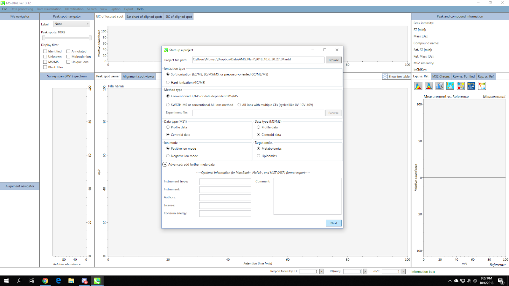
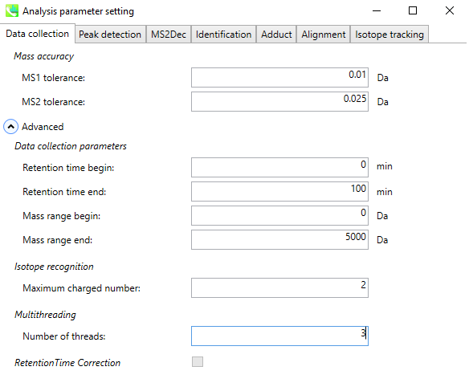
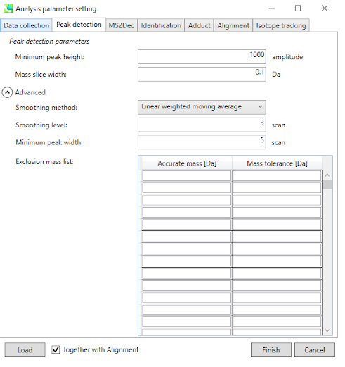
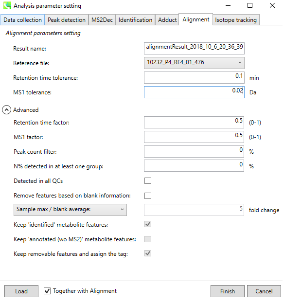
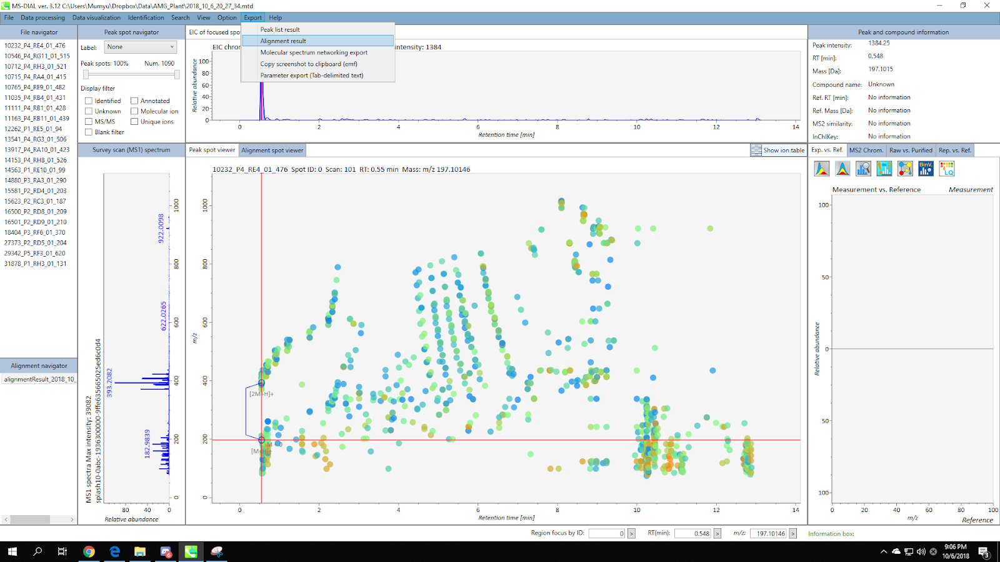
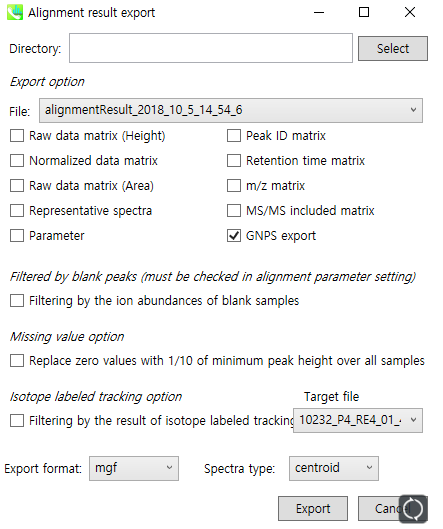

## Introduction

The **Feature-Based Molecular Networking** (FBMN) is a computational method that bridges popular mass spectrometry data processing tools for LC-MS/MS and molecular networking analysis on [GNPS](http://gnps.ucsd.edu). The tools supported are: [MZmine2](featurebasedmolecularnetworking-with-mzmine2.md), [OpenMS](featurebasedmolecularnetworking-with-openms.md), [MS-DIAL](featurebasedmolecularnetworking-with-ms-dial.md), [MetaboScape](featurebasedmolecularnetworking-with-metaboscape.md), [XCMS](featurebasedmolecularnetworking-with-xcms3.md), and [Progenesis QI](featurebasedmolecularnetworking-with-progenesisQI.md).

The main documentation for Feature-Based Molecular Networking [can be accessed here:](featurebasedmolecularnetworking.md)

Below we are describing how to use MS-DIAL with the FBMN workflow on GNPS.

## Mass spectrometry processing with MS-DIAL

Download the latest version of MS-DIAL software at [http://prime.psc.riken.jp/Metabolomics_Software/MS-DIAL](http://prime.psc.riken.jp/Metabolomics_Software/MS-DIAL).

### Citations and development

This work builds on the efforts of our many colleagues, please cite their work:

Tsugawa, H., Cajka, T., Kind, T., Ma, Y., Higgins, B., Ikeda, K., Kanazawa, M., VanderGheynst, J., Fiehn, O. & Arita, M. [MS-DIAL: data-independent MS/MS deconvolution for comprehensive metabolome analysis.](http://dx.doi.org/10.1038/nmeth.3393) Nature Methods 12, 523-526 (2015).

Lai, Z., Tsugawa, H., Wohlgemuth, G., Mehta, S., Mueller, M., Zheng, Y., Ogiwara, A., Meissen, J., Showalter, M., Takeuchi, K., Kind, T., Beal, P., Arita, M. & Fiehn, O. [Identifying metabolites by integrating metabolome databases with mass spectrometry cheminformatics.](http://dx.doi.org/10.1038/nmeth.4512) Nature Methods 15, 53-56 (2018).

### Mass Spectrometry Data Processing with MS-DIAL

In MS-DIAL, a sequence of steps is performed to process the mass spectrometry data. Here we will present key steps required to process LC-MS/MS data acquired in non-targeted mode (data dependent acquisition). For conveniency we are also providing a batch file (XML format) that can be imported directly in MS-DIAL.

**IMPORTANT:** MS-DIAL parameters will vary depending on the mass spectrometer, the acquisition parameters, and the sample studied. The following documentation serves a basic guideline for using MS-DIAL with the Feature-Based Molecular Networking workflow.

Please consult these resources for more details on MS-DIAL processing:

- The official [MS-DIAL tutorial](http://prime.psc.riken.jp/Metabolomics_Software/MS-DIAL/MSDIAL-tutorial.pdf)
- The video tutorial about [MS-DIAL processing for Feature Based Molecular Networking](tutorials/americangut-ms-dial.md).

### Convert your LC-MS/MS Data to Open Format
MS-DIAL accepts different input formats. Note that we recommand to first convert your files to mzML format before doing MS-DIAL processing. [See the documentation here](https://ccms-ucsd.github.io/GNPSDocumentation/fileconversion/).

#### Processing Steps

Below is a walk through of all the steps

#### 1. Make a New Project

Go to Menu: File / New Project

Select proper parameters (ionization type / method type / data type / ion mode / target omics) for your dataset.

Click “next” button.

#### 2. Import Files

Click “browse” and open the dropdown menu for file types, and select “mzML file(*.mzml)”. The other available options are .abf or .cdf files.

[Note] Data files should be placed at the same folder with the project file.

Select files and click the “open” button. You will see the list of selected files.

Click the “next” button.

#### 3. Set Parameters - Data Collection

Set the MS1/MS2 tolerance and data collection parameters.

If you are dealing with a large dataset, you can reduce the running time by setting multithreading option in the “advanced” menu.

#### 4. Set Parameters - Peak Detection

Set the MS1 peak detection parameters. You should set a appropriate peak height threshold.

As a rule of thumb, the value should at least correspond to the minimum value set for the triggering of the MS2 scan event.

If you want to remove some specific ions (e.g. known contaminants), you can make an exclusion list here.

#### 5. Set Parameters - MS2Deconvolution

You should set a appropriate MS/MS abundance cutoff. Make sure to set an intensity threshold representative of noise level in the MS2 spectrum.

This is typically lower than for MS1. If you have any doubt, set it to 0.

#### 6. Set Parameters - Alignment

Set appropriate Retention time / MS1 tolerance for alignment.

If you have any QC sample data, it will be a nice candidate to be the reference file.

Click the “finish” button, then MS-DIAL will perform all the feature finding process.

### Export or/and submit the files needed for Feature-Based Molecular Networking on GNPS:

- a *feature quantification table* with ion intensities (.CSV file format)

- a list of the MS/MS spectra (MS/MS spectral summary file in .MGF format) (the most intense MS/MS per feature is selected).

Menu: Export / Alignment result

Select the “GNPS export” option, and make the spectra type to “centroid”.

Set the directory and file name, then click “export”. As a result, you will acquire a .mgf file and a feature abundance table.

[Note] GNPS export module of MS-DIAL will create a feature table based on MS1 peak height.

If you want a feature table based on peak area, check the “Raw data matrix (Area)”.

See an example of files outputted by the export module using the workflow:
[here](https://github.com/CCMS-UCSD/GNPSDocumentation/tree/master/docs/tutorials/AG_tutorial_files/)):

### Running the FBMN with MS-DIAL

After the processing with MS-DIAL, the output files can be used to run the Feature-Based Molecular Networking workflow on GNPS either using the [Superquick FBMN start page] (http://dorresteinappshub.ucsd.edu:5050/featurebasednetworking) or [the standard interface of the FBMN workflow](https://gnps.ucsd.edu/ProteoSAFe/index.jsp?params=%7B%22workflow%22:%22FEATURE-BASED-MOLECULAR-NETWORKING%22,%22library_on_server%22:%22d.speclibs;%22%7D) (you need to be logged in GNPS first).

More information on the Feature Based Molecular Networking workflow on GNPS [can be obtained on that documentation page](featurebasedmolecularnetworking.md)

Basically, you will need to upload the files ouputted by the MS-DIAL processing (test files are accessible [here](https://github.com/CCMS-UCSD/GNPSDocumentation/tree/master/docs/tutorials/AG_tutorial_files/)):

1. A *feature quantification table* (see above)
2. A *MS/MS spetral summary* file (see above)
3. A *metadata table* - requirements are described [here](networking.md#metadata), but note that **important** note below:

**IMPORTANT FOR METADATA WITH MS-DIAL**: the "filename" in the metadata files for FBMN with MS-DIAL should not contain the file extension (ex: "sample1.mzML" must be "sample1").

Here is an example MS-DIAL networking [job](https://proteomics2.ucsd.edu/ProteoSAFe/status.jsp?task=4102bb6f394f4710a56f5fe1c7490f1e) from a subset of the American Gut Project.

## Tutorials

See our [MS-DIAL tutorial](tutorials/americangut-ms-dial.md) on using Feature Based Molecular Networking for the American Gut Project sample.

## Page contributors
Kyo Bin Kang (affiliation), Heejung Yang (affiliation) Louis Felix Nothias (UCSD)

## Contribute to the Documentation

- For informations/feature request, please open an "Issue" on the [*CCMS-UCSD/GNPSDocumentation*]((https://github.com/CCMS-UCSD/GNPSDocumentation)) GitHub repository.
- To contribute directly to the GNPS documentation, fork the [*CCMS-UCSD/GNPSDocumentation*]((https://github.com/CCMS-UCSD/GNPSDocumentation)) repository, and make a "Pull Request".
