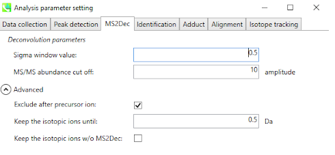

## 1. Introduction

**Feature-Based Molecular Networking** (FBMN) is a computational method that bridges popular mass spectrometry data processing tools for LC-MS/MS and molecular networking analysis on [GNPS](http://gnps.ucsd.edu). The supported tools are: [MZmine](featurebasedmolecularnetworking-with-mzmine2.md), [OpenMS](featurebasedmolecularnetworking-with-openms.md), [MS-DIAL](featurebasedmolecularnetworking-with-ms-dial.md), [MetaboScape](featurebasedmolecularnetworking-with-metaboscape.md), [XCMS](featurebasedmolecularnetworking-with-xcms3.md), [Progenesis QI](featurebasedmolecularnetworking-with-progenesisQI.md), and the [mzTab-M format](featurebasedmolecularnetworking-with-mztab-m.md).

The main documentation for Feature-Based Molecular Networking [can be accessed here:](featurebasedmolecularnetworking.md)

Below we are describing how to use MS-DIAL with the FBMN workflow on GNPS.

## 2. Mass spectrometry processing with MS-DIAL

Download the latest version of MS-DIAL software at [http://prime.psc.riken.jp/Metabolomics_Software/MS-DIAL](http://prime.psc.riken.jp/Metabolomics_Software/MS-DIAL).

### Citations and development

This work builds on the efforts of our many colleagues, please cite their work:

Tsugawa, H., Cajka, T., Kind, T., Ma, Y., Higgins, B., Ikeda, K., Kanazawa, M., VanderGheynst, J., Fiehn, O. & Arita, M. [MS-DIAL: data-independent MS/MS deconvolution for comprehensive metabolome analysis.](http://dx.doi.org/10.1038/nmeth.3393) Nature Methods 12, 523-526 (2015).

Lai, Z., Tsugawa, H., Wohlgemuth, G., Mehta, S., Mueller, M., Zheng, Y., Ogiwara, A., Meissen, J., Showalter, M., Takeuchi, K., Kind, T., Beal, P., Arita, M. & Fiehn, O. [Identifying metabolites by integrating metabolome databases with mass spectrometry cheminformatics.](http://dx.doi.org/10.1038/nmeth.4512) Nature Methods 15, 53-56 (2018).

### Mass Spectrometry Data Processing with MS-DIAL

In MS-DIAL, a sequence of steps is performed to process the mass spectrometry data. Here we will present key steps required to process LC-MS/MS data acquired in non-targeted mode (data dependent acquisition). MS-
DIAL can process LC-MS/MS data performed in non-targeted mode, but also in MSE and now with Ion Mobility Spectrometry. For convenience we also provide a batch file (XML format) that can be imported directly in MS-DIAL.

**IMPORTANT:** MS-DIAL parameters will vary depending on the mass spectrometer, the acquisition parameters, and the samples studied. In this page we present a basic guideline for using MS-DIAL with the FBMN on GNPS.

#### Documentation
Please consult these resources for more details on MS-DIAL processing:

- See the [MS-DIAL documentation on LC-MS/MS data processing](https://mtbinfo-team.github.io/mtbinfo.github.io/MS-DIAL/tutorial#chapter-3)
- See the [MS-DIAL documentation for MSE data processing](https://mtbinfo-team.github.io/mtbinfo.github.io/MS-DIAL/tutorial#chapter-8)
- See the [MS-DIAL documentation on Ion Mobility Spectrometry data processing](https://mtbinfo-team.github.io/mtbinfo.github.io/MS-DIAL/tutorial#chapter-10-)

#### Video Presentation and Tutorials

- The presentation/tutorial [about MS-DIAL](https://youtu.be/SOJvPhCsubQ?t=127) from the Leibniz Institute of Plant Biochemistry.
- This video [from the WCMC about MS-DIAL](https://www.youtube.com/watch?v=yPawtF1qJ5E)
- The video tutorial about [MS-DIAL processing for FBMN on GNPS](tutorials/americangut-ms-dial.md).
<iframe width="600" height="350" src="https://www.youtube.com/embed/hxk40jwAkcc" frameborder="0" allow="accelerometer; autoplay; encrypted-media; gyroscope; picture-in-picture" allowfullscreen></iframe>

### Convert your LC-MS/MS Data to Open Format
MS-DIAL accepts different input formats. Note that we recommend first to convert your files to mzML format before doing MS-DIAL processing. [See the documentation here](https://ccms-ucsd.github.io/GNPSDocumentation/fileconversion/).

#### Processing Steps for non-targeted LC-MS/MS

Below is a walk-through of all the steps

#### 1. Make a New Project

Go to Menu: File / New Project

Select appropriate parameters (ionization type / method type / data type / ion mode / target omics) for your dataset. Click “Next”.

#### 2. Import Files

Click “browse” and open the dropdown menu for file types, and select “mzML file(*.mzml)”. The other available options are .abf or .cdf files.

[Note] Data files should be placed at the same folder with the project file.

Select files and click “Open”. You will see the list of selected files. Click “Next”.

#### 3. Set Parameters - Data Collection

Set the MS1/MS2 tolerance and data collection parameters. 

If you are dealing with a large dataset, you can reduce the running time by setting multithreading option in the “Advanced” menu.

#### 4. Set Parameters - Peak Detection

Set the MS1 peak detection parameters. You should set a peak height threshold that is adapted to the mass spectrometer.

As a rule of thumb, the value should at least correspond to the minimum value set for the triggering of the MS2 scan event.

If you want to remove some specific ions (e.g. known contaminants), you can make an exclusion list here.

#### 5. Set Parameters - MS2Deconvolution

You should set an appropriate MS/MS abundance cutoff. Make sure to set an intensity threshold representative of the noise level in MS2 spectra.

This is typically lower than for MS1. If you have any doubt, set it to 0.

#### 6. Set Parameters - Alignment

Set appropriate Retention time / MS1 tolerance for alignment.

If you have any quality control (QC) sample data, it is a nice candidate to be the reference file.

Click “Finish”, then MS-DIAL will perform all the feature detection and alignment process.

#### Processing Steps for MSE data

- See the [MS-DIAL documentation for MSE data processing](https://mtbinfo-team.github.io/mtbinfo.github.io/MS-DIAL/tutorial#chapter-8).

#### Processing Steps for Ion Mobility Spectrometry data
- See the [MS-DIAL documentation on Ion Mobility Spectrometry data processing](https://mtbinfo-team.github.io/mtbinfo.github.io/MS-DIAL/tutorial#chapter-10-).

### Export the files for GNPS FBMN

To run FBMN after MS-DIAL processing, two files have to be exported:

- The **feature quantification table** (TXT file) containing compound intensity and annotation.

- The **MS/MS spectral summary** (MGF file) containing the list of representative MS/MS spectra (the most intense MS/MS spectrum).

Go to Menu: Export / Alignment result

Make sur the “GNPS export” box is checked, and set the spectra type to “centroid”.

Set the directory and file name, then click “Export”. As a result, you will acquire a MS/MS spectral summary and the feature quantification table.

[Note] The GNPS export option of MS-DIAL will create a feature table based on MS1 peak height. If you want a feature table based on peak area, check the “Raw data matrix (Area)”.

See example of files generated by MS-DIAL and used for the FBMN by the export workflow
[here](https://github.com/CCMS-UCSD/GNPSDocumentation/tree/master/docs/tutorials/AG_tutorial_files/).

## 3. Running the FBMN with MS-DIAL

After the processing with MS-DIAL, the output files can be used to run the Feature-Based Molecular Networking workflow on GNPS either using the [Superquick FBMN start page] (http://dorresteinappshub.ucsd.edu:5050/featurebasednetworking) or [the standard interface of the FBMN workflow](https://gnps.ucsd.edu/ProteoSAFe/index.jsp?params=%7B%22workflow%22:%22FEATURE-BASED-MOLECULAR-NETWORKING%22,%22library_on_server%22:%22d.speclibs;%22%7D) (you need to be logged in GNPS first).

See the main documentation for more details about the [FBMN workflow on GNPS](featurebasedmolecularnetworking.md).

Basically, you will need to upload the files produced by MS-DIAL:

- The **feature quantification table** (.TXT file)
- The **MS/MS spetral summary** file (.MGF file)
- (Optional) The metadata table - requirements are described [here](networking.md#metadata). 

**IMPORTANT WHEN USING A METADATA TABLE WITH MS-DIAL**: "filename" in the metadata files for FBMN with MS-DIAL should not contain file extensions (ex: "sample1.mzML" must be "sample1").

Here is an example MS-DIAL networking [job](https://gnps.ucsd.edu/ProteoSAFe/status.jsp?task=501aee83c98940f8a076d40d29ccc1f4) from a subset of the American Gut Project.

### Tutorials

See our [MS-DIAL tutorial](tutorials/americangut-ms-dial.md) on using Feature Based Molecular Networking for the American Gut Project sample.

### Page contributors
Kyo Bin Kang (Sookmyung Women's University), Heejung Yang (Kangwon National University) Louis Felix Nothias (UCSD), Ivan Protsyuk (EMBL, Heidelberg, Germany).

### Join the GNPS Community !

- For informations/feature request, please open an "Issue" on the [*CCMS-UCSD/GNPSDocumentation*]((https://github.com/CCMS-UCSD/GNPSDocumentation)) GitHub repository.
- To contribute to the GNPS documentation, please use GitHub by forking the [*CCMS-UCSD/GNPSDocumentation*]((https://github.com/CCMS-UCSD/GNPSDocumentation)) repository, and make a "Pull Request" with the changes.
