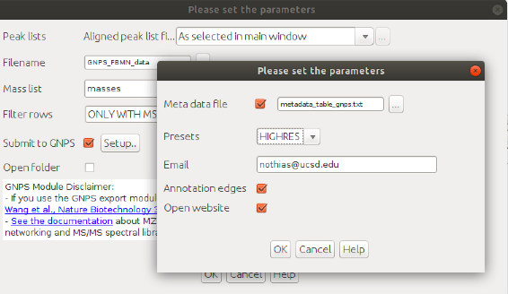

## Introduction

The main documentation for **Feature-Based Molecular Networking** [can be accessed here](featurebasedmolecularnetworking.md). See [our article](https://www.nature.com/articles/s41592-020-0933-6).

Below we describe how to use **MZmine2 v2.51** with the FBMN workflow on GNPS. We have previously written the documentation for v2.33 and have noted differences in the software versions. 

## Mass spectrometry processing with MZmine

### Citations and development

!!! quote "Recommended Citations"
    This work builds on the efforts and tools from our many colleagues, please cite their work:
    
    Nothias, L.-F., Petras, D., Schmid, R. et al. [Feature-based molecular networking in the GNPS analysis environment](https://www.nature.com/articles/s41592-020-0933-6). Nat. Methods 17, 905–908 (2020).

    Wang, M. et al. [Sharing and community curation of mass spectrometry data with Global Natural Products Social Molecular Networking](https://doi.org/10.1038/nbt.3597). Nat. Biotechnol. 34, 828–837 (2016).

    Katajamaa, M., Miettinen, J. & Oresic, M. [MZmine: toolbox for processing and visualization of mass spectrometry based molecular profile data.](https://doi.org/10.1093/bioinformatics/btk039) Bioinformatics 22, 634–636 (2006).

    Pluskal, T., Castillo, S., Villar-Briones, A. & Oresic, M. [MZmine 2: modular framework for processing, visualizing, and analyzing mass spectrometry-based molecular profile data.](https://doi.org/10.1186/1471-2105-11-395) BMC Bioinformatics 11, 395 (2010).

    The development of the features used in the pipeline is [publicly accessible here](https://github.com/mzmine/mzmine2).

### Installation 

Download the latest version of MZmine software (version MZmine v2.33 minimum) at [https://github.com/mzmine/mzmine2/releases](https://github.com/mzmine/mzmine2/releases).

### Data Processing with MZmine for FBMN

In MZmine, a sequence of steps are performed to process the mass spectrometry data. Here we will present key steps required to process LC-MS/MS data acquired in non-targeted mode (data dependent acquisition). For convenience we also provide a batch file (XML format) that can be imported directly in MZmine.

!!! warning 
    MZmine parameters will vary depending on the instrument used, the acquisition parameters, and samples studied. The following documentation serves a basic guideline for using MZmine with the FBMN workflow.

Please consult the resources below for more details on MZmine processing:

- The official documentation [http://mzmine.github.io/documentation.html](http://mzmine.github.io/documentation.html),
- The [MZmine tutorial](http://www.pharmacognosie-parisdescartes.fr/pdf/150420_MZmine_Tutorial_UNIGE.pdf) by Pierre-Marie Allard and Joelle Houriet from the University of Geneva.
- [ADAP User Manual](https://mzmine.github.io/ADAP_user_manual.pdf)
- The video tutorial below about [MZmine2 processing for Feature Based Molecular Networking](tutorials/americangutmzmine.md). **Note that this video is slighlty outdatted**, so please refer to the steps described in this documentation.

<iframe width="600" height="350" src="https://www.youtube.com/embed/5jjMllbwD-U"> </iframe>

- The video tutorial below about Quick MZMine2 Export to GNPS for FBMN

<iframe width="600" height="350" src="https://www.youtube.com/embed/vFcGG7T_44E"> </iframe>

### Convert your LC-MS/MS Data to an Open Format
MZmine accepts different input formats. Note that we recommand to first convert your files to mzML format before doing MZmine2 processing. [See the documentation here](fileconversion.md).

#### Processing Steps

Below is the schematic representation of the LC-MS/MS data processing steps with MZmine (thanks Daniel Petras !):

Below is the overview of the LC-MS/MS data processing steps in the MZmine batch mode:

#### Batch Import

Here are some MZmine batch that are compatible with the FBMN workflow. These batch files can be imported into MZMine (Batch mode):

| Instrument  | Gradient Length | Matrix Type | Sample Size | Download |
| ------------- |-------------| ----- | ----- | ----- |
| Bruker Maxis HD qTof | 10 Min | Stool | 20 | [Batch](static/maxis_12min_stool_20.xml) |
| Please contribute a send batch file for various instruments|  |  |  | [Batch](static/maxis_12min_stool_20.xml) |

#### Processing Steps

Below is a walk-through of all the steps

#### 1. Import Files

Go to Menu: *Raw data methods > Raw data import > Select the files*

#### 2. Mass Detection

This step creates mass lists from your raw LC-MS/MS data (non-targeted mode).

Perform mass detection on MS level 1: Menu: *Raw data methods > Feature Detection > Mass detection > Set filters: MS level 1.*

(version 2.33)
Menu: Raw data methods > Mass detection > Set filter : MS level 1

!!! important 
    Set an appropriate intensity threshold. You can use the preview window to assess the right threshold on your data. As a rule of thumb, the value should at least correspond to the minimum value set for the triggering of the MS2 scan event. (Example: MAXIS-QTOF: 1E3, Q-Exactive 1E4)

Perform mass detection on MS level 2. The same mass list name must be used.

Go to Menu: *Raw data methods > Feature Detection > Mass detection > Set filters: MS level 2.*

(version 2.33)
Go to: *Raw data methods > Mass detection > Set filter : MS level 2.*

!!! important 
    Make sure to set an intensity threshold representative of noise level in the MS2 spectra. This is typically lower than for MS1. (Example: maXis QTOF: 1E2; LTQ-XL Orbitrap 1E4, Q-Exactive: 0). If you have any doubt, set it to 0.

#### 3. Build Chromatogram (LC-MS feature detection part 1)
Starting with MZmine 2.39, the original Chromatogram builder is considered deprecated. It has been replaced with the ADAP Chromatogram Builder. The ADAP Module includes parameters for the Min group size # of scans and Group intensity threshold. Further explanation for these parameters can be found in the [ADAP Tutorial](http://mzmine.github.io/documentation.html). If you use the ADAP Chromatogram Builder, please cite the publication below.

Myers, O.D. et al, [One Step Forward for Reducing False Positive and False Negative Compound Identifications from Mass Spectrometry Metabolomics Data: New Algorithms for Constructing Extracted Ion Chromatograms and Detecting Chromatographic Peaks](https://pubs.acs.org/doi/abs/10.1021/acs.analchem.7b00947). Anal. Chem. 89, 17, 8696-8703 (2017).

Go to: *Raw data methods > Feature Detection > Chromatogram builder OR ADAP Chromatogram builder*

(version 2.33)
Go to: *Raw data methods > Chromatogram builder*

#### 4. Deconvolve the Chromatogram (LC-MS feature detection part 2)
Go to Menu: *Feature list methods > Feature detection > Chromatogram deconvolution*

(version 2.33)
Go to Menu: *Peak list methods > Peak detection > Chromatogram deconvolution*

!!! important 
    tick both options "m/z range for MS2 scan pairing (Da)" and "RT range for MS2 scan pairing (min)". The values have to be defined according to your experimental setup (expected MS mass accuracy and chromatographic peak width).

Example for a UHPLC colum (1.7 µm C18, 50 × 2.1 mm, flow rate of 0.5 mL/min):

- maXis-QTOF: 12 min gradient, 0.02 Da and 0.15 min

- Q-Exactive: 5 min gradient, 0.01 Da and 0.1 min

#### 5. Group isotopes and co-eluting ions

Use the "Isotopic peaks grouper" [recommended] or other alternative (such as the CAMERA module).

Go to Menu: *Feature list methods > Isotopes > Isotopic peaks grouper*

(version 2.33)
Go to Menu: *Peak list methods > Isotopes > Isotopic peaks grouper.*

!!! important 
    This depends on your expected peak shapes, duty cycle time and the MS mass accuracy. (Example: MAXIS-QTOF, 10 min gradient, 0.1 min, 0.02 m/z; Q-Exactive, 5 min gradient, 0.05 min, 0.01 m/z)

#### 6. Order the peaklists

Go to Menu: *Peak list methods > Order peak lists*.

!!! important 
    This is to ensure the reproducibility of the processing. Indeed, the aligned peak list will change slighlty if that step is not performed. 

#### 7. LC-MS feature alignement (Peaklist alignement)

In this step, the peak lists from each sample will be aligned in one aligned peak list. The alignement is performed iteratively using the first peak list selected (see MZmine documentation). For that reason, make sure the first sample is adapted (not a negative control) or to manually put an representative peaklist in the first position.

Go to Menu: *Feature list methods > Alignment > Join aligner*

(version 2.33)
Go to Menu: *Peak list methods > Alignment > Join aligner*

#### 8. (Optional) Detect Missing Peaks / Gap Filling

Gap filling enables to retrieve the intensity of a peak in all the samples, even if it was not detected in a previous processing step.
Go to Menu: *Feature list methods > Gap filling > Peak finder (multi-threaded)*.

(version 2.33)
Go to Menu: *Peak list methods > Gap filling > Peak finder (multi-threaded)*.

!!! important 
    This step is optional. Use the multi-threaded peak finder for fast processing.

#### 9. (Optional) Filter the Peaklist to MS/MS Peaks

Depending on the number of features in the aligned peaklist, it is possible to filter the peaklist to keep only features with minimum number of occurences ("Minimum peaks in a row") or a mininum number of isotopic peaks for the feature ("Minimum peaks in an isotope pattern"), or to "Keep only peaks with MS2 scan (GNPS)".

Go to Menu: *Feature list methods > Filtering > Feature list rows filter > Select the filters*

(version 2.33)
Go to Menu: *Peak list methods > Filtering > Peak list row filter > Select the filters*

!!! important 
    if you use a filter, we recommend using the filter "Reset the peak number ID"

!!! important 
    Note that this step was mandatory in the prototype versions of FBMN with MZmine, now the filter "Keep only peaks with MS2 scan (GNPS)" is optional.

#### 10. Use the GNPS Export module

Use the dedicated module "*Submit to/Export for GNPS*" in MZmine under *Feature list methods > Export/Import*  to export the needed file:

- the **feature quantification table** (.CSV file format) with LC-MS feature intensities.
- the **MS/MS spectral summary** (.MGF file), with a representative MS/MS spectrum per LC-MS feature. The MS/MS spectrum correspond either to the most intense MS/MS found for the feature, or to the merged spectrum (new feature !)

Select the lastest "filtered aligned peaklist" generated and Go to Menu: *Peak list methods > Export > Export for/Submit to GNPS*

See an example of files generated by the export module using the workflow:
[here](https://github.com/CCMS-UCSD/GNPSDocumentation/tree/master/docs/tutorials/AG_tutorial_files).

##### The files can be uploaded to the GNPS web-platform and Feature-Based Molecular Networking job can be directly launched

**IMPORTANT:** While the possibility to submit the files directly to GNPS and launch a FBMN job on the fly is really convenient for quick data analysis, the files will not be saved in your personal account on GNPS and are periodically deleted, which will prevent future cloning of the jobs. If you do not provide username/password, and you are limited to basic presets of parameters. For that reason, we recommend to upload your files with the FTP uploader [(see documentation)](fileupload.md) and prepare your job [directly on GNPS](https://gnps.ucsd.edu/ProteoSAFe/index.jsp?params=%7B%22workflow%22:%22FEATURE-BASED-MOLECULAR-NETWORKING%22,%22library_on_server%22:%22d.speclibs;%22%7D) (you must be logged in first).

In the "*Export for/Submit to GNPS*" module, select the option: "*Submit to GNPS*"

- [Optional] Metadata file: specify the path to the metadata table in GNPS format. [See documentation here](metadata.md)

- Select the parameters presets for the GNPS job.

- [Optional] Email: specify the email to forward the job link

- [Optional] Annotation edges (Experimental feature that will described later).

- [Optional] Open website: if ticked, will open the job webpage.

ADDITIONAL NOTES: The feature table must contain at least the row ID, the row m/z, and row retention time, along with the sample columns. It is currently mandatory for the sample name headers to have the following format: "filename Peak area". Depending on the steps used in MZmine the sample name header can be "filename baseline-corrected Peak area", but this has to be changed back to "filename Peak area".

### Video Tutorial - Quick MZMine Export to GNPS for FBMN.

The workflow for Feature Based Molecular Networking in GNPS is different from the classic molecular networking workflow. [Access the FBMN workflow here](https://gnps.ucsd.edu/ProteoSAFe/index.jsp?params=%7B%22workflow%22:%22FEATURE-BASED-MOLECULAR-NETWORKING%22,%22library_on_server%22:%22d.speclibs;%22%7D) (You need to be logged in first !)

<iframe width="600" height="350" src="https://www.youtube.com/embed/vFcGG7T_44E"> </iframe>

### FBMN in GNPS

The main documentation of the Feature Based Molecular Networking workflow on GNPS [can be consulted on that page](featurebasedmolecularnetworking.md). The workflow for Feature Based Molecular Networking in GNPS is different from the "classic" molecular networking workflow. [Access the FBMN workflow here](https://gnps.ucsd.edu/ProteoSAFe/index.jsp?params=%7B%22workflow%22:%22METABOLOMICS-SNETS-MZMINE%22,%22library_on_server%22:%22d.speclibs;%22%7D) (You need to be logged in first !).

Basically, you will need to upload the files produced by MZmine (test files are accessible [here](https://github.com/CCMS-UCSD/GNPSDocumentation/tree/master/docs/tutorials/AG_tutorial_files)):

- The *feature quantification table* (.CSV file format).
- The *MS/MS spectral summary* (.MGF file format)
- [Optional] The *metadata table* - described [here](metadata.md)

There are several additional normalization options specifically for feature detection. We can normalize the features per LC/MS run and aggregate by groups with either a sum or average (recommended).

[Here is an example FBMN](https://gnps.ucsd.edu/ProteoSAFe/status.jsp?task=52a390c8eb654b7fa8d61a1c7a4aaab5) job with files resulting from MZmine2 processing of a subset of the [American Gut Project](http://humanfoodproject.com/americangut/).

ADDITIONAL NOTES: In case you want to run the Feature-Based Molecular networking with just part of the samples you processed in MZmine, it is possible to filter the exported files (.csv and .mgf) to keep only the features of interest. In the case of the .csv file, the rows of specific features can just be deleted. For the .mgf file, there are two options of Python scripts to filter the file. One of them can be run in the [Terminal](https://github.com/Zquinlan/Python_scripts/blob/master/Metabalomics/parse_mgf_by_feature_ID.py), while to other can be run in a [Jupyter notebook](https://github.com/helenamrusso/Python_scripts/blob/main/Filter%20mgf%20files%20Mzmine.py).

### Video Tutorial - Analyze FBMN jobs in GNPS

This video presents 
<iframe width="800" height="500" src="https://www.youtube.com/embed/NTkQ0fS1aug"> </iframe>

### FBMN in Cytoscape

Cytoscape is an open source software platform used to visualize, analyze and annotate molecular networks from GNPS. [See the documentation here](featurebasedmolecularnetworking-cytoscape.md)

## Tutorials

See our [tutorial on using MZmine2](tutorials/americangutmzmine.md) for FBMN analysis of a cohort from the [American Gut Project](http://humanfoodproject.com/americangut/), and our [tutorial on running a FBMN analysis on GNP](tutorials/featurebasedgnps.md).

### Join the GNPS Community !

- For feature request, or to report bugs, please open an "Issue" on the [*CCMS-UCSD/GNPS_Workflows* GitHub repository](https://github.com/CCMS-UCSD/GNPS_Workflows).
- To contribute to the GNPS documentation, please use GitHub by forking the [*CCMS-UCSD/GNPSDocumentation*](https://github.com/CCMS-UCSD/GNPSDocumentation) repository, and make a "Pull Request" with the changes.

## Page Contributors

{{ git_page_authors }}
