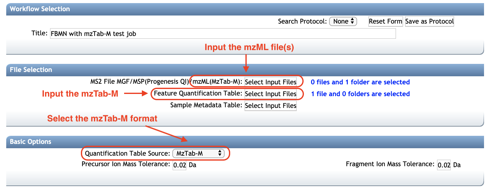

# Introduction

**Feature-Based Molecular Networking** (FBMN) is a computational method that bridges popular mass spectrometry data processing tools for LC-MS/MS and molecular networking analysis on [GNPS](http://gnps.ucsd.edu). The supported tools are: [MZmine](featurebasedmolecularnetworking-with-mzmine2.md), [OpenMS](featurebasedmolecularnetworking-with-openms.md), [MS-DIAL](featurebasedmolecularnetworking-with-ms-dial.md), [MetaboScape](featurebasedmolecularnetworking-with-metaboscape.md), [XCMS](featurebasedmolecularnetworking-with-xcms3.md), [Progenesis QI](featurebasedmolecularnetworking-with-progenesisQI.md), and the [mzTab-M format](featurebasedmolecularnetworking-with-mztab-m.md).

The main documentation for Feature-Based Molecular Networking [can be accessed here:](featurebasedmolecularnetworking.md)

Below follows a description on how to use mz-Tab-M format with the FBMN workflow on GNPS.

# Using the mzTab-M format with FBMN

## Introduction 

The **mzTab-M** format is a standardized output designed for the report of metabolomics MS-data processing results.

## Citation and development

Hoffman et al. mzTab-M: A Data Standard for Sharing Quantitative Results in Mass Spectrometry Metabolomics [Anal. Chem. 2019 9153302-3310](https://pubs.acs.org/doi/abs/10.1021/acs.analchem.8b04310)

See the GitHub repository for jmzTab-M: [https://github.com/lifs-tools/jmzTab-m](https://github.com/lifs-tools/jmzTab-m)

 
## FBMN with mzTab-M

The FBMN workflow now supports the mzTab-M format (2.0, release 1.0.5). The **mzTab-M** file has to be inputed along with the related **mzML** files. 

Basically, the **mzTab-M** is used to retrieve for each LC-MS/MS feature:

- The abundance of the LC-MS/MS feature in each sample.
- The filename (**mzML**) and index of the associated MS/MS spectrum. 

After inputing the mzTab-M and mzML file(s), GNPS will automatically extract the MS/MS spectra from the mzML file and generate internally an **MS/MS spectral summary** that will be used for FBMN analysis.

So far only **mzTab-M** from **XCMS** have tested, please let us know if you have difficulties running FBMN jobs from **mzTab-M** files exported with **OpenMS**, **MS-DIAL**, **MZmine**, and others.

See an example job with mzTab-M and mzML files [here](https://gnps.ucsd.edu/ProteoSAFe/status.jsp?task=7a8cf0b8ddc442fc978f2145c221f364).

## Running FBMN with an mzTab-M 
The mzTab-M file and the associated mzML file(s) can be uploaded to the GNPS web-platform and a FBMN job can be launched only from the [standard interface of the FBMN workflow](https://gnps.ucsd.edu/ProteoSAFe/index.jsp?params=%7B%22workflow%22:%22FEATURE-BASED-MOLECULAR-NETWORKING%22,%22library_on_server%22:%22d.speclibs;%22%7D) (you need to be logged in GNPS first).

- Select the mzML file(s). See the screenshot below.
- Select the mzTab-M file as *Feature Quantification Table*.
- (EXPERIMENTAL) Select the metadata table. Requirements are described [here](networking.md#metadata).  

More information on the FBMN on GNPS can be obtained at [this documentation page](featurebasedmolecularnetworking.md).

### Page contributors

Louis Felix Nothias (UCSD), Steffen Neunmann (Leibniz Insitute for Plant Biochemistry), and Ming Wang (UCDS). 

### Join the GNPS Community !

- For feature request, or to report bugs, please open an "Issue" on the [*CCMS-UCSD/GNPS_Workflows* GitHub repository](https://github.com/CCMS-UCSD/GNPS_Workflows).
- To contribute to the GNPS documentation, please use GitHub by forking the [*CCMS-UCSD/GNPSDocumentation*]((https://github.com/CCMS-UCSD/GNPSDocumentation)) repository, and make a "Pull Request" with the changes.
