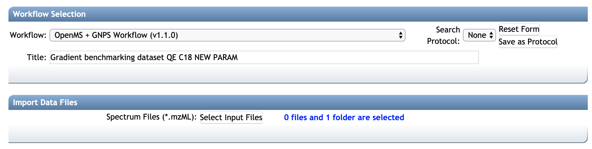
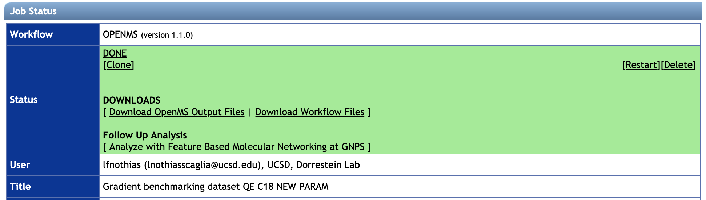

## Introduction to FBMN with OpenMS

**Feature-Based Molecular Networking** (FBMN) is a computational method that bridges popular mass spectrometry data processing tools for LC-MS/MS and molecular networking analysis on [GNPS](http://gnps.ucsd.edu). The supported tools are: [MZmine](featurebasedmolecularnetworking-with-mzmine2.md), [OpenMS](featurebasedmolecularnetworking-with-openms.md), [MS-DIAL](featurebasedmolecularnetworking-with-ms-dial.md), [MetaboScape](featurebasedmolecularnetworking-with-metaboscape.md), [XCMS](featurebasedmolecularnetworking-with-xcms3.md), [Progenesis QI](featurebasedmolecularnetworking-with-progenesisQI.md), and the [mzTab-M format](featurebasedmolecularnetworking-with-mztab-m.md).

The main documentation for Feature-Based Molecular Networking [can be accessed here:](featurebasedmolecularnetworking.md)

Below we are describing how to use OpenMS with the FBMN workflow on GNPS.

### Citations

This work builds on the efforts of our many colleagues, please cite their work:

Röst, H. L. et al. OpenMS: a flexible open-source software platform for mass spectrometry data analysis. Nat. Methods 13, 741–748 (2016). [https://doi.org/10.1038/nmeth.3959](https://doi.org/10.1038/nmeth.3959)

Wang, M. et al. Sharing and community curation of mass spectrometry data with Global Natural Products Social Molecular Networking. Nat. Biotechnol. 34, 828–837 (2016). [https://doi.org/10.1038/nbt.3597](https://doi.org/10.1038/nbt.3597)

### Development

The OpenMS website at [https://www.openms.de/](https://www.openms.de/)

The GNPSExport TOPP tool code can be found on [OpenMS GitHub repository](https://github.com/OpenMS/OpenMS) and the lastest version on [this fork repository](https://github.com/Bioinformatic-squad-DorresteinLab/OpenMS/blob/develop/src/topp/GNPSExport.cpp).

The code for the Open-GNPS pipeline (ProteoSAFe workflow and python wrappers) is available on [this GitHub repository](https://github.com/Bioinformatic-squad-DorresteinLab/openms-gnps-workflow).

## Feature Detection with OpenMS for the FBMN

We have developed an OpenMS-GNPS pipeline that can be used for the processing of metabolomics LC-MS data with OpenMS and Feature Based Molecular Networking (FBMN). This pipeline uses OpenMS tools and the GNPSExport (part of OpenMS TOPP tools).

In brief, after running an *OpenMS "metabolomics" pipeline*, the *GNPSExport TOPP tool* can be used on the consensusXML file and corresponding mzML files to generate the files needed for FBMN on GNPS. These two files are:

- The MS2 spectral data file (.MGF format) which is generated with the GNPSExport tool.
- The feature quantification table (.TXT format) which is generated with the TextExport tool.

### Running the OpenMS-GNPS pipeline on GNPS web-platform
The OpenMS-GNPS pipeline is an experimetal workflow deployed currently on *proteomics2.ucsd.edu* [https://proteomics2.ucsd.edu/ProteoSAFe/]). The job can be configured as follows:



1. Connect to [https://proteomics2.ucsd.edu/ProteoSAFe/](https://proteomics2.ucsd.edu/ProteoSAFe/) (You will have to be logged in to *proteomics2.ucsd.edu* first).
2. Select the workflow: `OpenMS + GNPS workflow`
3. In Import Data Files, select the input mzML files (prefered) or mzXML files (not recommended, because the pipeline would have to perform conversion to mzML)
4. Select the parameters from the presets `HPLC-Q-Exactive, UHPLC-Q-Exactive, HPLC-QTOF, UHPLC-Q-Exactive`.
The corresponding OpenMS configuration files (.INI files) are available from that [GitHub repository] (https://github.com/Bioinformatic-squad-DorresteinLab/openms-gnps-workflow/presets/)). Alternatively, you can upload your OpenMS TOPP tool *parameter file* (.INI files). Note that *parameter files* can be updated with a text editor or with the *INIFileEditor* TOPP tool.
5. Wait for the job to complete. You will get a notification.
6. Download the main output files with "Download OpenMS Output Files" and/or all the files with "Download Workflow Files".
7. Unzip the archive.
8. Examine the consensusXML file (in the *filefilter* folder) with TOPPAS.
9. The `gnpsexport` folder contains the *MS/MS spectral summary file* (.MGF file)
10. The `textexporter` folder contains the *feature quantification table* (.TXT file).
11. Click a FBMN workflow on GNPS by clicking on "*Run a Feature-Based Molecular Networking at GNPS*" Note that you have to be logged in to GNPS first, [https://gnps.ucsd.edu](https://gnps.ucsd.edu)). See documentation for [the FBMN workflow on GNPS](https://ccms-ucsd.github.io/GNPSDocumentation/featurebasedmolecularnetworking/).
12. Alternatively, upload these files via FTP for [FBMN on GNPS](https://ccms-ucsd.github.io/GNPSDocumentation/featurebasedmolecularnetworking/), or use them for other annotation tools ([DEREPLICATOR](dereplicator.md), [Mass2Motif](ms2lda.md), [NAP](nap.md).



### Running the OpenMS-GNPS pipeline with OpenMS TOPP tools

##### Installation and requirement

Installing OpenMS TOPP tools: See the OpenMS website at [https://www.openms.de/](https://www.openms.de/)

##### Representative OpenMS-GNPS workflow
A representative OpenMS-GNPS workflow would sequencially use these OpenMS TOPP tools:

  1. Input the mzML files.
  2. Run the *FeatureFinderMetabo* tool on the mzML files.
  3. Run the *IDMapper* tool on the featureXML and mzML files.
  4. Run the *MapAlignerPoseClustering* tool on the featureXML files.
  5. Run the *MetaboliteAdductDecharger* tool on the featureXML files.
  6. Run the *FeatureLinkerUnlabeledKD* tool or *FeatureLinkerUnlabeledQT*, on the featureXML files and output a consensusXML file.
  7. Run the *FileFilter* tool on the consensusXML file to keep only consensusElements with at least MS/MS scan (peptide annotation).  
  8. Run the *GNPSExport* tool on the "filtered consensusXML file" to export an .MGF file.
  9. Run the *TextExport* tool on the "filtered consensusXML file" to export a .TXT file.
  10. Upload your files to GNPS and run the Feature-Based Molecular Networking workflow. See the main documentation for [using FBMN on GNPS](https://ccms-ucsd.github.io/GNPSDocumentation/featurebasedmolecularnetworking/).

##### Requirements for the OpenMS-GNPS pipeline
- The *IDMapper* has to be run on the featureXML files, in order to associate MS2 scan(s) (peptide annotation) with each feature. These peptide annotations are used by the GNPSExport.
- The *FileFilter* has to be run on the consensusXML file, prior to the GNPSExport, in order to remove consensusElements without MS2 scans (peptide annotation).

#### The GNPSExport TOPP tool

The *GNPSExport TOPP tool* can be run on the consensusXML file and corresponding mzML files to generate a MS/MS spectral file (MGF format) and corresponding feature quantification table (.TXT format) that contains LC-MS peak area intensities.

For each *consensusElement* in the consensusXML file, *GNPSExport* produces one representative *consensus MS/MS spectrum* (named *peptide annotation* in OpenMS jargon) saved to the *MS/MS spectral summary file* (.MGF file). Several modes for the generation of the *consensus MS/MS spectrum* are available and described below. Note that these parameters are defined in the GNPSExport parameters file (.INI file, [available with that link](openms_gnpsexport/GNPSExport.ini)).

##### Usage and Options for GNPSExport TOPP tool:

`GNPSExport --help`

```
GNPSExport -ini iniFile-GNPSExport.ini
		   -in_cm filefilter.consensusXML
           -in_mzml inputFile0.mzML inputFile1.mzML
           -out GNPSExport_output.mgf
```

##### Options for the consensus MS/MS spectra: `output_type`

- **Merge [RECOMMENDED]**: `merged_spectra` - For each *consensusElement*, the GNPSExport will merge all eligible MS/MS scans into one representative *consensus MS/MS spectrum*. Eligible MS/MS scans have a pairwise *cosine similarity* with the MS/MS scan of highest precursor intensity above the *Cosine Similarity Treshold*. The fragment ions of merged MS/MS scans are binned in m/z (or Da) range defined by the *Binning width* parameter.

	- **Cosine Similarity Treshold**: `merged_spectra:cos_similarity` (float, default: 0.9) - Parameter that defines *Cosine Similarity Treshold* for the pairwise *cosine similarity* between the MS/MS scan with the highest precursor intensity and the other MS/MS scans.
	- **Binning width**: `merged_spectra:ms2_binned_size` (float, default: 0.02 Daltons) -  Parameter that defines the *Binning width* of fragment ions during the merging of eligible MS/MS spectra.

- **Most intense**: `most_intense` - For each *consensusElement*, the GNPSExport will output the *most intense* MS/MS scan (with the highest precursor ion intensity) as *consensus MS/MS spectrum*.

- **All MS/MS**: `full_spectra` - For each *consensusElement*, the GNPSExport will output *All MS/MS scans*.

Note that *mass accuracy* and the *retention time window* for the pairing between MS/MS scans and a LC-MS feature orconsensusElement is defined at the *IDMapper tool* step.


### Running the FBMN workflow with OpenMS files

After the processing with OpenMS, the output files can be used to run the Feature-Based Molecular Networking workflow on GNPS either using the [Superquick FBMN start page] (http://dorresteinappshub.ucsd.edu:5050/featurebasednetworking) or [the standard interface of the FBMN workflow](https://gnps.ucsd.edu/ProteoSAFe/index.jsp?params=%7B%22workflow%22:%22FEATURE-BASED-MOLECULAR-NETWORKING%22,%22library_on_server%22:%22d.speclibs;%22%7D) (you need to be logged in GNPS first).

Make sure to select the correct table source (OpenMS).

The main documentation for FBMN [can be accessed here](featurebasedmolecularnetworking.md).

### Page contributors
Louis Felix Nothias (UCSD), Abinesh Sarvepalli (UCSD), Ivan Protsyuk (EMBL, Heidelberg, Germany).

### Join the GNPS Community !

- For feature request, or to report bugs, please open an "Issue" on the [*CCMS-UCSD/GNPS_Workflows* GitHub repository](https://github.com/CCMS-UCSD/GNPS_Workflows).
- To contribute to the GNPS documentation, please use GitHub by forking the [*CCMS-UCSD/GNPSDocumentation*]((https://github.com/CCMS-UCSD/GNPSDocumentation)) repository, and make a "Pull Request" with the changes.