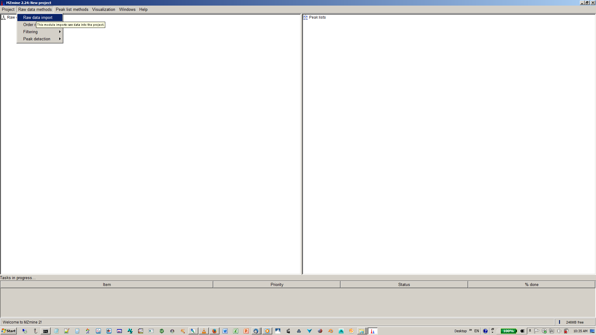

## Introduction to FBMN

The Feature-Based Molecular Networking (FBMN) is a computational method that bridges popular mass spectrometry data processing tools for LC-MS/MS and molecular networking analysis on [GNPS](http://gnps.ucsd.edu). The tool supported are: [MZmine2](featurebasedmolecularnetworking-with-mzmine2), [OpenMS](featurebasedmolecularnetworking-with-OpenMS), [MS-DIAL](featurebasedmolecularnetworking-with-ms-dial), [XCMS](https://github.com/sneumann/xcms), and [MetaboScape](featurebasedmolecularnetworking-with-metaboscape), [XCMS](featurebasedmolecularnetworking-with-XCMS3).

The main documentation for Feature-Based Molecular Networking [can be accessed here:](featurebasedmolecularnetworking)

The Feature-Based Molecular Networking workflow on GNPS [can be accessed here](https://gnps.ucsd.edu/ProteoSAFe/index.jsp?params=%7B%22workflow%22:%22FEATURE-BASED-MOLECULAR-NETWORKING%22,%22library_on_server%22:%22d.speclibs;%22%7D) (you need to be logged in GNPS first).

Below we are describing how to use MZmine2 with the FBMN workflow on GNPS.

### Citations

This work builds on the efforts of our many colleagues, please cite their work:

Röst, H. L. et al. OpenMS: a flexible open-source software platform for mass spectrometry data analysis. Nat. Methods 13, 741–748 (2016). [https://doi.org/10.1038/nmeth.3959](https://doi.org/10.1038/nmeth.3959)

Wang, M. et al. Sharing and community curation of mass spectrometry data with Global Natural Products Social Molecular Networking. Nat. Biotechnol. 34, 828–837 (2016). [https://doi.org/10.1038/nbt.3597](https://doi.org/10.1038/nbt.3597)

### Development

The GNPSExport UTIL code can be found on [OpenMS GitHub repository](https://github.com/OpenMS/OpenMS). 

The code for the Open-GNPS pipeline (ProteoSAFe workflow and python wrappers) is available on [this GitHub repository](https://github.com/Bioinformatic-squad-DorresteinLab/openms-gnps-workflow).

## Mass spectrometry processing with OpenMS

We have developed an OpenMS-GNPS pipeline that can be used for LC-MS/MS data processing with OpenMS and Feature Based Molecular Networking (FBMN) with GNPS. This pipeline uses OpenMS TOPP and required the development of the GNPSExport (OpenMS UTILS).

In brief, after running an *OpenMS "metabolomics" pipeline*, the *GNPSExport UTIL* can be used on the consensusXML file to generate files needed for FBMN on GNPS. These two files are:

- The MS2 spectral data file (.MGF format) which is generated  with the GNPSExport UTIL.
- The feature quantification table (.TXT format) which is generated with the TextExport TOOL.

### Running the OpenMS-GNPS pipeline on GNPS web-platform
The OpenMS-GNPS pipeline has been deployed on GNPS (experimental feature). The job can be configured as follow:
1. Input the mzML (prefered) or mzXML files (not recommended, because the pipeline would have to perform conversion to mzML)
2. Select the parameters from the presets (QTOF, Q-Exactive, UHPLC, HPLC). The corresponding OpenMS  configuration files (.INI files) are available from that [GitHub repository] (https://github.com/Bioinformatic-squad-DorresteinLab/openms-gnps-workflow/presets/)) 

### Running the OpenMS-GNPS pipeline 

A representative OpenMS-GNPS workflow has the following steps:
  1. Input mzML files
  2. Run the FeatureFinderMetabo tool on the mzML files.
  3. Run the IDMapper tool on the featureXML and mzML files.
  4. Run the MapAlignerPoseClustering tool on the featureXML files.
  5. Run the MetaboliteAdductDecharger on the featureXML files.
  6. Run the FeatureLinkerUnlabeledKD tool or FeatureLinkerUnlabeledQT, on the featureXML files and output a consensusXML file.
  8. Run the FileFilter on the consensusXML file to keep only consensusElements with at least MS/MS scan (peptide identification).  
  9. Run the GNPSExport on the "filtered consensusXML file" to export an .MGF file.
  10. Run the TextExport on the "filtered consensusXML file" to export an .TXT file.
  11. Upload your files to GNPS and run the Feature-Based Molecular Networking workflow. Instructions are here:
https://ccms-ucsd.github.io/GNPSDocumentation/featurebasedmolecularnetworking/

#### Requirements for OpenMS-GNPS pipeline
- The IDMapper has to be ran on the featureXML files, in order to associate MS2 scan(s) (peptide identification) with each features. These peptide identifications are used by the GNPSExport.
- The FileFilter has to be ran on the consensusXML file, prior to the GNPSExport, in order to remove consensusElements 
without MS2 scans (peptide identification).

### The GNPSExport UTILS
**Parameters for GNPSExport UTILS **:
 - Cosine Score Treshold @Abi please describe what is is doing EXACTLY 
- Binning @Abi please describe what is is doing EXACTLY

Options for the GNPSExport spectral processing are:
	- Most intense: the GNPSExport will output the MS/MS scan with the highest precursor ion intensity 
	as a representative MS/MS scan per consensusElement in the .MGF file.
	- Merge: the GNPSExport will first merge all the MS/MS scans for a consensusElement, 
	using the user-specified parameters (cosine score threshold, binning width), and output 
	the merged MS/MS scan as as a representative MS/MS scan per consensusElement in the .MGF file.
	- All MS/MS: the GNPSExport will output all the MS/MS scan(s) for consensusElements in the .MGF file.

	
#### 
The GitHub for that ProteoSAFe workflow and an OpenMS python wrappers is available here:
https://github.com/Bioinformatic-squad-DorresteinLab/openms-gnps-workflow

An online version of the OpenMS-GNPS pipeline for FBMN running on CCMS server (http://proteomics.ucsd.edu/) is available on GNPS:
https://ccms-ucsd.github.io/GNPSDocumentation/featurebasedmolecularnetworking-with-OpenMS

GNPS (Global Natural Products Social Molecular Networking, https://gnps.ucsd.edu/ProteoSAFe/static/gnps-splash2.jsp)
is an open-access knowledge base for community-wide organisation and sharing of raw, processed
or identified tandem mass (MS/MS) spectrometry data. 
The GNPS web-platform makes possible to perform spectral library search against public MS/MS spectral libraries, 
as well as to perform various data analysis such as MS/MS molecular networking, Network Annotation Propagation 
Network Annotation Propagation (http://journals.plos.org/ploscompbiol/article?id=10.1371/journal.pcbi.1006089)
and the DEREPLICATOR (https://www.nature.com/articles/nchembio.2219)
The GNPS paper is available here (https://www.nature.com/articles/nbt.3597)

Download the latest version of MZmine2 software (version MZmine v2.33 minimum) at [https://github.com/mzmine/mzmine2/releases](https://github.com/mzmine/mzmine2/releases).

### Citations and development

This work builds on the efforts of our many colleagues, please cite their work:

Katajamaa, M., Miettinen, J. & Oresic, M. [MZmine: toolbox for processing and visualization of mass spectrometry based molecular profile data.](https://doi.org/10.1093/bioinformatics/btk039) Bioinformatics 22, 634–636 (2006).

Pluskal, T., Castillo, S., Villar-Briones, A. & Oresic, [M. MZmine 2: modular framework for processing, visualizing, and analyzing mass spectrometry-based molecular profile data.](https://doi.org/10.1186/1471-2105-11-395) BMC Bioinformatics 11, 395 (2010).

The development of the features used in the pipeline is [publicly accessible here](https://github.com/mzmine/mzmine2).

### Mass Spectrometry Data Processing with MZmine2: step-by-step documentation

In MZmine2, a sequence of steps are performed to process the mass spectrometry data. Here we will present key steps required to process LC-MS/MS data acquired in non-targeted mode (data dependent acquisition). For conveniency we are also providing a batch file (XML format) that can be imported directly in MZmine2.

**IMPORTANT:** MZmine2 parameters will vary depending on the instrument used, the acquisition parameters, and the sample studied. The following documentation serves a basic guideline for using MZmine2 with the Feature-Based Molecular Networking workflow.

Please consult these resources for more details on MZmine2 processing:

- The official documentation [http://mzmine.github.io/documentation.html](http://mzmine.github.io/documentation.html),
- The [MZmine tutorial](http://www.pharmacognosie-parisdescartes.fr/pdf/150420_MZmine_Tutorial_UNIGE.pdf) by Pierre-Marie Allard and Joelle Houriet from the University of Geneva.
- The video tutorial about [MZmine2 processing for Feature Based Molecular Networking](tutorials/americangutmzmine/).

<iframe width="700" height="400" src="https://www.youtube.com/embed/5jjMllbwD-U"> </iframe>

### Download the MZmine2 software
Download the latest version of MZmine2 software (version MZmine v2.33 minimum) at [https://github.com/mzmine/mzmine2/releases](https://github.com/mzmine/mzmine2/releases).

### Convert your LC-MS/MS Data to Open Format
MZmine2 accepts different input formats. Note that we recommand to first convert your files to mzML format before doing MZmine2 processing. [See the documentation here](https://ccms-ucsd.github.io/GNPSDocumentation/fileconversion/).

#### Processing Steps

##### Below is the schematic representation of the LC-MS/MS data processing steps with MZmine2:

##### Below is the overview of the LC-MS/MS data processing steps in the MZmine2 batch mode:

#### Batch Import

Here are some MZmine2 batch that are compatible with the Feature-Based Molecular Networking workflow. These batch files can be imported into MZMine2 (Batch mode):

| Instrument  | Gradient Length | Matrix Type | Sample Size | Download |
| ------------- |-------------| ----- | ----- | ----- |
| Bruker Maxis HD qTof | 10 Min | Stool | 20 | [Batch](static/maxis_12min_stool_20.xml) |

<!-- The prototype batch method for Bruker Maxis HD qTof can be [downloaded](static/qtof_batch.xml) and imported into MZmine2. -->

#### Processing Steps

Below is a walk through of all the steps

#### 1. Import Files

Go to Menu: Raw data methods / Raw data import / "Select the files"

#### 2. Mass Detection

This step creates mass lists from your raw data.

Perform mass detection on MS level 1: Menu: Raw data methods / Mass detection / Set filter : MS level 1

**IMPORTANT** Set an appropriate intensity threshold. You can use the preview window to assess the right threshold on your data. As a rule of thumb, the value should at least correspond to the minimum value set for the triggering of the MS2 scan event. (Example: MAXIS-QTOF: 1E3, Q-Exactive 1E4)

Perform mass detection on MS level 2. The same mass list name must be used.

Go to Menu: Raw data methods / Mass detection / Set filter : MS level 2.

**IMPORTANT:** Make sure to set an intensity threshold representative of noise level in the MS2 spectra. This is typically lower than for MS1. (Example: maXis QTOF: 1E2; LTQ-XL Orbitrap 1E4, Q-Exactive: 0). If you have any doubt, set it to 0.

#### 3. Build Chromatogram

Go to Menu: Raw data methods / Chromatogram builder

#### 4. Deconvolve the Chromatogram

Go to Menu: Peak list methods / Peak detection / Chromatogram deconvolution

**IMPORTANT:** tick both options "m/z range for MS2 scan pairing (Da)" and "RT range for MS2 scan pairing (min)". The values have to be defined according to your experimental setup (expected chromatographic peak width and the MS mass accuracy).

Example for a UHPLC colum (1.7 µm C18, 50 × 2.1 mm, flow rate of 0.5 mL/min):

- maXis-QTOF: 12 min gradient, 0.02 Da and 0.15 min

- Q-Exactive: 5 min gradient, 0.01 Da and 0.1 min

#### 5. Group isotopes and co-eluting ions

Use the "Isotopic peaks grouper module" [recommended] or other alternative (such as the CAMERA module).

Go to Menu: Peak list methods / Isotopes / Isotopic peaks grouper.

**IMPORTANT:**  This depends on your expected peak shapes, duty cycle time and the MS mass accuracy. (Example: MAXIS-QTOF, 10 min grdainet, 0.1 min, 0.02 m/z; Q-Eaxtive, 5 min gradient, 0.05 min, 0.01 m/z)

#### 6. Order the peaklists

Go to Menu: Peak list methods / Order peak lists.

**IMPORTANT:** This is to ensure reproducibility of results. Indeed, the aligned peaklist will change slighlty if that step is not performed.

#### 7. Align Features

In this step, the peak lists from each samples will be aligned in one aligned peak list.

Go to Menu: Peak list methods / Alignment / Join aligner

#### 8. Detect Missing Peaks / Gap Filling (Optional)

Gap filling enables to retrieve the intensity of a peak in all the samples, even if it was not detected in a previous processing step.
Go to Menu: Peak list methods / Gap filling / Peak finder (multi-threaded).

**IMPORTANT:** This step is optional. Use the multi-threaded peak finder for fast processing.

#### 9. Filter the Peaklist to MS/MS Peaks (Optional)

Depending on the number of features in the aligned peaklist, it is possible to filter the peaklist to keep only features with minimum number of occurences ("Minimum peaks in a row") or a mininum number of isotopic peaks for the feature ("Minimum peaks in an isotope pattern"), or to "Keep only peaks with MS2 scan (GNPS)".

Go to Menu: Peak list methods / Filtering / Peak list row filter / Select the filters

**IMPORTANT:** if you use a filter, we recommend using the filter "Reset the peak number ID"

**NOTE** that this step was mandatory in the previous version of FBMN with MZmine2, now it is now optional.

#### 10. Export the Feature Table and MGF file

##### Export or/and submit the files needed for Feature-Based Molecular Networking on GNPS:

- a feature table with ion intensities (.CSV file format)

- a list of the MS/MS spectra (.MGF file format) (the most intense MS/MS per feature is selected).

Select the last "filtered aligned peaklist" and Go to Menu: "Peak list methods" / "Export" / "Export for/Submit to GNPS"

See an example of files outputted by the export module using the workflow:
[here](tutorials/AG_tutorial_files/).

##### The files can be uploaded to the GNPS web-platform and Feature-Based Molecular Networking job can be directly launched

**IMPORTANT:** While the possibility to submit the files directly to GNPS and launch a FBMN job on the fly is really convenient for quick data analysis, the job and files will not be saved to your personal account on GNPS, and you are limited to basic presets of parameters. For that reason, we recommend to upload your files with the FTP uploader [(see documentation)] (https://ccms-ucsd.github.io/GNPSDocumentation/fileupload/) and prepare your job [directly on GNPS](https://gnps.ucsd.edu/ProteoSAFe/index.jsp?params=%7B%22workflow%22:%22FEATURE-BASED-MOLECULAR-NETWORKING%22,%22library_on_server%22:%22d.speclibs;%22%7D) (you must be logged in first).

In the "Export for/Submit to GNPS" module, select the option: "Submit to GNPS"

- [Optional] Metadata file: specify the path to the metadata table in GNPS format. [See documentation here] (networking/#metadata)

- Select the parameters presets for the GNPS job.

- Email: specify the email to forward the job link

- Annotation edges (Experimental): that option can be ignored.

- Open website: if ticked, will open the job webpage.

ADDITIONAL NOTES: The feature table must contain at least the row ID, the row m/z, and row retention time, along with the sample columns. It is currently mandatory for the sample name headers string to have the following format: "filename Peak area". Depending on Note that depending on the steps used in MZmine the sample name header can be "filename baseline-corrected Peak area", but this has to changed back to "filename Peak area".

### Feature Based Molecular Networking in GNPS

The workflow for Feature Based Molecular Networking in GNPS is different from the classic molecular networking workflow. [Access the FBMN workflow here](https://gnps.ucsd.edu/ProteoSAFe/index.jsp?params=%7B%22workflow%22:%22METABOLOMICS-SNETS-MZMINE%22,%22library_on_server%22:%22d.speclibs;%22%7D) (You need to be logged in first !)

More information on the Feature Based Molecular Networking workflow on GNPS [can be obtained on that documentation page](featurebasedmolecularnetworking)

Basically, you will need to upload the files ouputted by the MZmine2 processing (test files are accessible [here](https://github.com/CCMS-UCSD/GNPSDocumentation/tree/master/docs/tutorials/AG_tutorial_files)):

1. Feature Table from above
2. MGF for MS/MS from above
3. Metadata table - described [here](networking#metadata)

There are several additional normalization options specifically for feature detection. We can normalize the features per LC/MS run and aggregate by groups with either a sum or average (recommended).

### Demo GNPS job of Feature Based Molecular Networking
[Here is an example FBMN](https://gnps.ucsd.edu/ProteoSAFe/status.jsp?task=52a390c8eb654b7fa8d61a1c7a4aaab5) job with files resulting from MZmine2 processing of a subset of the [American Gut Project] (http://humanfoodproject.com/americangut/).

## Tutorials

See our [tutorial on using MZmine2](tutorials/americangutmzmine) for FBMN analysis of a cohort from the [American Gut Project] (http://humanfoodproject.com/americangut/), and our [tutorial on running a FBMN analysis on GNP](tutorials/featurebasedgnps).

## Citation

This work builds on the efforts of our many colleagues, please make sure to cite the papers for their processing tools and the GNPS paper:

Wang, M. et al. [Sharing and community curation of mass spectrometry data with Global Natural Products Social Molecular Networking](https://doi.org/10.1038/nbt.3597). Nat. Biotechnol. 34, 828–837 (2016)
