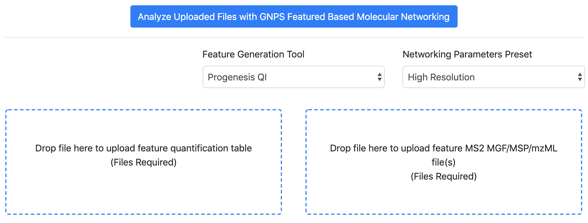
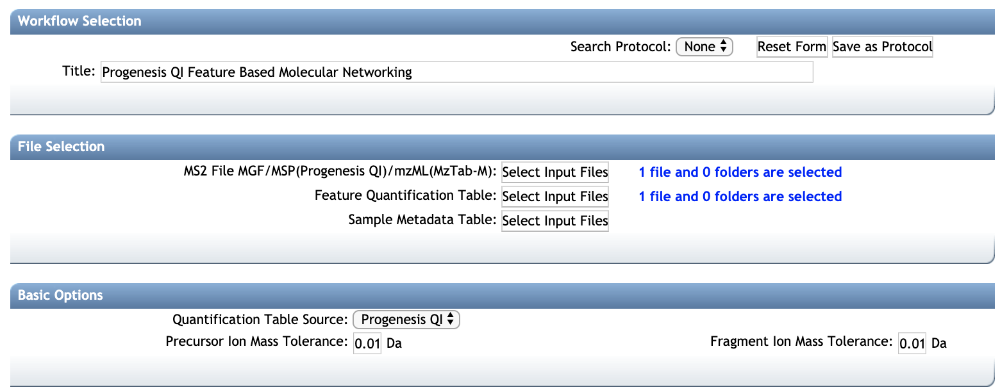

## Introduction

The main documentation for **Feature-Based Molecular Networking** (FBMN) [can be accessed here](featurebasedmolecularnetworking.md). See [our preprint on bioaRxiv](https://www.biorxiv.org/content/10.1101/812404v1).

Below we describe how to use **Progenesis QI** with the FBMN workflow on [GNPS](http://gnps.ucsd.edu).

## Using Progenesis QI and the Feature-Based Molecular Networking on GNPS

Progenesis QI is a proprietary LC-MS feature detection and alignment software developed by [Nonlinear Dynamics](http://www.nonlinear.com/progenesis/qi/) that is compatible with Waters file format and other proprietary and open mass spectrometry format.

Progenesis QI can perform feature detection, alignment and annotation of non-targeted LC-MS/MS data acquired either **in data-dependent analysis (DDA)** or **MSE data independent analysis (DIA)**, and can also uses the **ion mobility spectrometry (IMS) dimension**. Feature-based molecular networking (FBMN) can be performed on **any of these data types processed with Progenesis QI**.

## Citations and development

This work builds on the efforts of our many colleagues, please cite their work: 

Nothias, L.F. et al [Feature-based Molecular Networking in the GNPS Analysis Environment](https://www.biorxiv.org/content/10.1101/812404v1) bioRxiv 812404 (2019).

Wang, M. et al. [Sharing and community curation of mass spectrometry data with Global Natural Products Social Molecular Networking](https://doi.org/10.1038/nbt.3597). Nat. Biotechnol. 34, 828–837 (2016).

## Running Progenesis QI for molecular networking on GNPS

For more information on Progenesis QI, please refer to the official documentation at: [http://www.nonlinear.com/progenesis/qi/](http://www.nonlinear.com/progenesis/qi/).

##### 1. Import and process the mass spectrometry data
- In Progenesis QI (ver. 2.4, Nonlinear Dynamics), **import RAW data** from Waters QTof data-independent acquisition (DIA) modes such as SONAR, MSE or HDMSE. 
- **Processed data** with Progenesis QI and export the results for GNPS analysis as indicated below. See the [Progenesis QI LC-MS tutorial](http://www.nonlinear.com/products/progenesis/lc-ms/tutorial/) and the [tutorial videos](https://www.youtube.com/watch?v=hurottpvEO8&list=PLKkdMSX1HQ-UD8WVe9T9pcEWMzyw20FUi) for more informations.

##### 2. Export the processing results

In the menu, under the “Identify Compounds” tab:

- Select **“Export Compound Measurement”** to export the **feature quantification table** (CSV file) containing compound intensity and annotation can be exported (see below).
- Select **“Export fragment database”** to the export the **MS/MS spectral summary** (MSP file) containing the list of representative MS/MS spectra (see below). **NOTE: Do not select tags to export**

###### Additional notes
Alternatively, the Symphony software can be used the ion peaks in the entire RAW file can be detected, centroided, and deconvoluted, and converted to a suitable open-source data formats such as Mascot generic format (mgf), mzML, mzXML. More info on in the following note: [See more information in the Nov. 2018 Waters Technology Brief](https://www.waters.com/webassets/cms/library/docs/720006415en.pdf). These files can be processed by other softwares supported FBMN, or can be used for classical molecular networking analysis. 

## Running a molecular network on GNPS

FBMN with Progenesis QI results can be performed using the using Superquick or the standard interface:

- **Use the Superquick FBMN interface**: 
	- Go to [https://gnps-quickstart.ucsd.edu/featurebasednetworking](https://gnps-quickstart.ucsd.edu/featurebasednetworking).
	- Select the **"Progenesis QI"** option for the "Feature Quantification Table Source".
	- Drag and drop the **feature quantification table** (.CSV file) into the left box.
	- Drag and drop the **MS/MS spectral summary** (.MSP file) into the right box.
	  

- **Use the standard FBMN interface**:
	-	Refer to the [main FBMN documentation](featurebasedmolecularnetworking.md) for more informations.

## Mapping Progenesis QI annotations in Cytoscape
Progenesis QI annotations or metadata can be mapped in Cytoscape as node attribute into the molecular networks. [See the Cytoscape documentation for FBMN](featurebasedmolecularnetworking-cytoscape.md). For metadata format requirement, see [this page](metadata.md).

Helped is wanted to describe in detail the import procedure in Cytoscape.

### Page contributors
Louis Felix Nothias (UCSD), Ming Wang (UCSD), Bindesh Shrestha (Waters), Giorgis Isaac (Waters and Jonathan McSayles (Waters).

### Join the GNPS Community !

- For feature request, or to report bugs, please open an "Issue" on the [*CCMS-UCSD/GNPS_Workflows* GitHub repository](https://github.com/CCMS-UCSD/GNPS_Workflows).
- To contribute to the GNPS documentation, please use GitHub by forking the [*CCMS-UCSD/GNPSDocumentation*](https://github.com/CCMS-UCSD/GNPSDocumentation) repository, and make a "Pull Request" with the changes.
