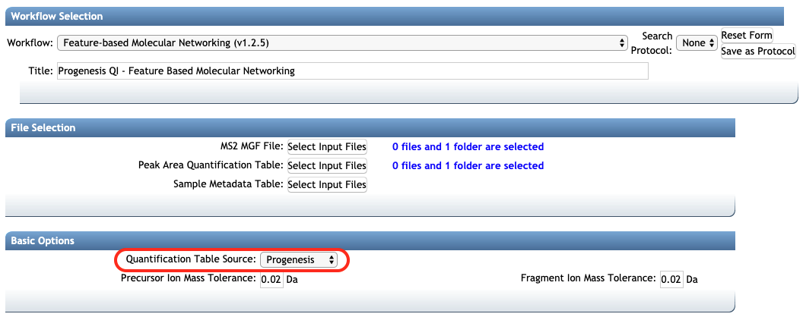

## Introduction

The **Feature-Based Molecular Networking** (FBMN) is a computational method that bridges popular mass spectrometry data processing tools for LC-MS/MS and molecular networking analysis on [GNPS](http://gnps.ucsd.edu). The tools supported are: [MZmine2](featurebasedmolecularnetworking-with-mzmine2.md), [OpenMS](featurebasedmolecularnetworking-with-openms.md), [MS-DIAL](featurebasedmolecularnetworking-with-ms-dial.md), [MetaboScape](featurebasedmolecularnetworking-with-metaboscape.md), [XCMS](featurebasedmolecularnetworking-with-xcms3.md), and [Progenesis QI](featurebasedmolecularnetworking-with-progenesisQI.md).

The main documentation for FBMN [can be accessed here](featurebasedmolecularnetworking.md).

Below we describe how to use MetaboScape with the FBMN workflow on GNPS.

## Using Progenesis QI and the Feature-Based Molecular Networking

Progenesis QI is a proprietary LC-MS feature detection and alignment software developed by Nonlinear Dynamics (Waters, [http://www.nonlinear.com/progenesis/qi/](http://www.nonlinear.com/progenesis/qi/) that is compatible with various proprietary and open mass spectrometry format. 

Progenesis QI can perform feature detection, alignment and annotation of non-targeted LC-MS/MS data acquired either in data-dependent analysis (DDA) or MSE data independent analysis (DIA), and can also uses the ion mobility spectrometry (IMS) dimension. Feature-based molecular networking can be performed on any of these data types processed with Progenesis QI by exporting the *feature quantification table* (.TXT file format) and *MS/MS spectral summary* (.MGF file format) and uploading these files on GNPS for FBMN analysis.

## Running Progenesis QI

Please refer to the official documentation for Progenesis QI at: [http://www.nonlinear.com/progenesis/qi/v2.4/user-guide/](http://www.nonlinear.com/progenesis/qi/v2.4/user-guide/)

## Running a FBMN with Progenesis QI files

FBMN with Progenesis QI can be performed either using the [Superquick FBMN start page] (http://dorresteinappshub.ucsd.edu:5050/featurebasednetworking) or [the standard interface of the FBMN workflow](https://gnps.ucsd.edu/ProteoSAFe/index.jsp?params=%7B%22workflow%22:%22FEATURE-BASED-MOLECULAR-NETWORKING%22,%22library_on_server%22:%22d.speclibs;%22%7D) (you need to be logged in GNPS first).

Upload your Progenesis QI exported files (*feature quantification table* and *MS/MS spectral summary*) to GNPS and select the "Progenesis QI" option in the "Feature Quantification Table Source".

Refer to the [main FBMN documentation](featurebasedmolecularnetworking.md). for more information.

## Page contributors
Ming Wang (UCSD) and Louis Felix Nothias (UCSD).

## Contribute to the Documentation

- For informations/feature request, please open an "Issue" on the [*CCMS-UCSD/GNPSDocumentation*]((https://github.com/CCMS-UCSD/GNPSDocumentation)) GitHub repository.
- To contribute directly to the GNPS documentation, fork the [*CCMS-UCSD/GNPSDocumentation*]((https://github.com/CCMS-UCSD/GNPSDocumentation)) repository, and make a "Pull Request".
