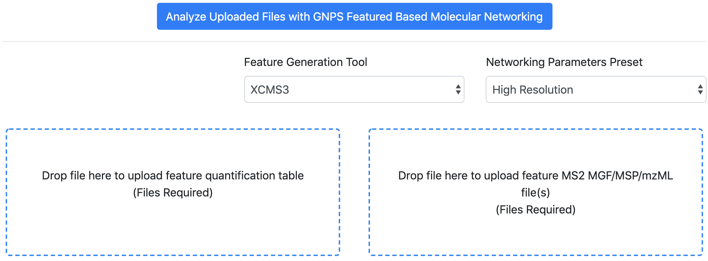

## Introduction

The main documentation for **Feature-Based Molecular Networking** (FBMN) [can be accessed here](featurebasedmolecularnetworking.md). See [our preprint on bioaRxiv](https://www.biorxiv.org/content/10.1101/812404v1).

Below follows a description on how to use **XCMS** (ver. >= 3) with the
FBMN workflow on GNPS.

## Mass spectrometry processing with XCMS

### Citations and development

This work builds on the efforts of our many colleagues, please cite their work: 

Nothias, L.F. et al [Feature-based Molecular Networking in the GNPS Analysis Environment](https://www.biorxiv.org/content/10.1101/812404v1) bioRxiv 812404 (2019).

Wang, M. et al. [Sharing and community curation of mass spectrometry data with Global Natural Products Social Molecular Networking](https://doi.org/10.1038/nbt.3597). Nat. Biotechnol. 34, 828–837 (2016).

XCMS3 GitHub repository: [https://github.com/sneumann/xcms](https://github.com/sneumann/xcms)

Tautenhahn R, Boettcher C, Neumann S. [Highly sensitive feature detection for
high resolution LC/MS](https://doi.org/10.1186/1471-2105-9-504) BMC
Bioinformatics, 9:504 (2008).

Smith, C.A., Want, E.J., O'Maille, G., Abagyan,R., Siuzdak, G. [XCMS: Processing
mass spectrometry data for metabolite profiling using nonlinear peak alignment, matching and identification.](https://pubs.acs.org/doi/10.1021/ac051437y)
Analytical Chemistry, 78, 779–787 (2006).

### Installation

**1** - Install the latest version of XCMS3 from Bioconductor (ver. >= 3.4) in R with:
	

```
install("BiocManager")
BiocManager::install("xcms")
```

Alternatively, see the [xcms Bioconductor package] (https://www.bioconductor.org/packages/release/bioc/html/xcms.html).

**2** - Retrieve the custom utility function from the *XCMS-GNPS-TOOLS* GitHub repository
[https://github.com/jorainer/xcms-gnps-tools](https://github.com/jorainer/xcms-gnps-tools).


### Mass Spectrometry Data Processing with XCMS.

#### 1. Introduction 

Below we are presenting the key steps required to process with XCMS
non-targeted LC-MS/MS data collected using data dependent acquisition. For more information on XCMS, consult these resources:

- The official [XCMS
  tutorial](https://bioconductor.org/packages/release/bioc/vignettes/xcms/inst/doc/xcms.html)
  (also provided as `xcms` vignette with the `xcms` R package).
- XCMS workshop from the Metabolomics 2018 conference:
  [xcms-preprocessing](https://jorainer.github.io/metabolomics2018/xcms-preprocessing.html)
  and [github repository](https://github.com/jorainer/metabolomics2018).
- The Canadian Bioinformatics Workshop video on XCMS at [https://www.youtube.com/watch?v=cdIb7EyIiBI](https://www.youtube.com/watch?v=cdIb7EyIiBI)

**SCRIPT AVAILABILITY:** Example of XCMS scripts are accessible as *Jupyter
notebook* and *RCommander script* on
[https://github.com/DorresteinLaboratory/XCMS3_FeatureBasedMN](https://github.com/DorresteinLaboratory/XCMS3_FeatureBasedMN).

**IMPORTANT:** XCMS parameters will vary depending on the mass spectrometer,
the acquisition parameters, and the samples investigated. The following
documentation serves as a basic guideline for using XCMS with the Feature-Based
Molecular Networking workflow.

#### 2. Convert your Data

XCMS accepts different input formats. Note that we recommand to convert
your files to the mzML format before using XCMS for processing. [See the
documentation here](fileconversion.md). This will simplify the subsquent use of other mass spectrometry tools and data deposition on a public repository like [MassIVE](datasets.md) or [MetaboLights](https://www.ebi.ac.uk/metabolights/).

#### 3. Process with XCMS

These are typical steps used for the processing of non-targeted LC-MS/MS data with XCMS:

1. Import data (`readMSData`)
2. Peak picking (`findChromPeaks`)
3. Retention time alignment (`adjustRtime`).
4. Peak grouping (`groupChromPeaks`).
5. Gap filling (`fillChromPeaks`).
6. Run CAMERA for adduct annotation (`xsAnnotate`).
6. Export the results file for FBMN on GNPS:
	- **Option A** - Export a **feature quantification table** and a **MS/MS spectral summary file**:
		-	Export a **feature quantification table** with ion intensities (.TXT file format) (`writeMgfData`).
		-  	Export a **MS/MS spectral summary file** (.MGF file format). Note that it is recommended to use the maxTIC option for the MGF export. (`write.table`)
	- **Option B** - Export an **mzTab-M file**:
 
 		- Export and select the **mzTab-M file** in the interface. The use of the mzTab-M requires the subsequent upload of the mzML files used during the XCMS processing. See and cite this [publication](https://pubs.acs.org/doi/abs/10.1021/acs.analchem.8b04310).
 

### Perform FBMN on GNPS

The files exported from XCMS3 can be uploaded to the GNPS web-platform and a
Feature-Based Molecular Networking job can be launched.

FBMN with XCMS3 can be performed either using the [Superquick FBMN start page] (http://dorresteinappshub.ucsd.edu:5050/featurebasednetworking) or [the standard interface of the FBMN workflow](https://gnps.ucsd.edu/ProteoSAFe/index.jsp?params=%7B%22workflow%22:%22FEATURE-BASED-MOLECULAR-NETWORKING%22,%22library_on_server%22:%22d.speclibs;%22%7D) (you need to be logged in GNPS first).

More information on the Feature Based Molecular Networking workflow on GNPS can
be obtained at [this documentation page](featurebasedmolecularnetworking.md).

Note that you can upload a metadata table with your job. [See
documentation](metadata.md).



#### Representative results files and job

**Option A** - With a *feature quantification table* and a *MS/MS spectral summary file*:
	
1. The **feature quantification table** (.TXT file) - [Download here](tutorials/AG_tutorial_files/XCMS3-GNPS_AG_test_featuretable.txt)
2. The **MS/MS spectral summary** (.MGF file) - [Download here](tutorials/AG_tutorial_files/XCMS3-GNPS_AG_test_GNPS.mgf)
3. (Optional) The metadata table - [Download here](tutorials/AG_tutorial_files/metadata_GNPS_table_AMG_key_ones_cleaned.txt)

Here is an example [FBMN job with XCMS](https://proteomics2.ucsd.edu/ProteoSAFe/status.jsp?task=f3f28a930b334dd09f310795fceae4cd) from a subset of the American Gut Project.

**Option B** - With a mzTab-M file:

TODO: Finish this section

1. The **mzTab-M** file - [Download here](tutorials/AG_tutorial_files/TBProvided)
2. The corresponding **mzML** file(s) - [Download here](tutorials/AG_tutorial_files/TBProvided)

Here is an example [FBMN job with XCMS using a mzTab-M file and mzML files](TBProv) from a subset of the American Gut Project.

## Tutorials

See our FBMN tutorial with XCMS using a subset of the American Gut Project samples on this repository [DorresteinLaboratory/XCMS3_FeatureBasedMN/](https://github.com/DorresteinLaboratory/XCMS3_FeatureBasedMN/).

### Page contributors

Johannes Rainer (Eurac Research), Madeleine Ernst (UCSD), Ricardo da Silva
(UCSD), Michael Witting (Helmholtz Zentrum Munich), Louis Felix Nothias (UCSD) and Ming Wang (UCDS). 

### Join the GNPS Community !

- For feature request, or to report bugs, please open an "Issue" on the [*CCMS-UCSD/GNPS_Workflows* GitHub repository](https://github.com/CCMS-UCSD/GNPS_Workflows).
- To contribute to the GNPS documentation, please use GitHub by forking the [*CCMS-UCSD/GNPSDocumentation*](https://github.com/CCMS-UCSD/GNPSDocumentation) repository, and make a "Pull Request" with the changes.