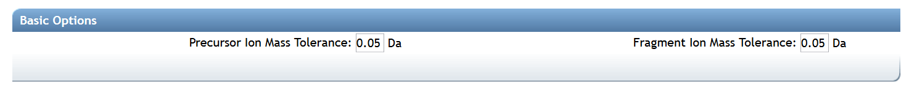

## Introduction

The Feature-Based Molecular Networking (FBMN) is a computational method that bridges popular mass spectrometry data processing tools for LC-MS/MS and molecular networking analysis on [GNPS](http://gnps.ucsd.edu). The tools supported are: [MZmine2](featurebasedmolecularnetworking-with-mzmine2.md), [OpenMS](featurebasedmolecularnetworking-with-openms.md), [MS-DIAL](featurebasedmolecularnetworking-with-ms-dial.md), [MetaboScape](featurebasedmolecularnetworking-with-metaboscape.md), and [XCMS](featurebasedmolecularnetworking-with-xcms3.md).

The main documentation for Feature-Based Molecular Networking is provided below.

The Feature-Based Molecular Networking workflow on [can be accessed here](https://gnps.ucsd.edu/ProteoSAFe/index.jsp?params=%7B%22workflow%22:%22FEATURE-BASED-MOLECULAR-NETWORKING%22,%22library_on_server%22:%22d.speclibs;%22%7D) (you need to be logged in GNPS first).

## Citations

This work builds on the efforts of our many colleagues, please make sure to cite the papers for their processing tools and the GNPS paper:

Wang, M. et al. [Sharing and community curation of mass spectrometry data with Global Natural Products Social Molecular Networking](https://doi.org/10.1038/nbt.3597). Nat. Biotechnol. 34, 828–837 (2016).

The citations from the mass spectrometry processing tools you used [[MZmine2](featurebasedmolecularnetworking-with-mzmine2.md), [OpenMS](featurebasedmolecularnetworking-with-openms.md), [MS-DIAL](featurebasedmolecularnetworking-with-ms-dial.md), [MetaboScape](featurebasedmolecularnetworking-with-metaboscape.md), and [XCMS](featurebasedmolecularnetworking-with-xcms3.md)].

## Mass Spectrometry Data Processing for the Feature Based Molecular Networking Workflow

In brief, mass spectrometry processing softwares have been adapted to export two files (*feature quantification table* and *MS/MS spectral file*) that can be used with the Feature Based Molecular Networking (FBMN) workflow on GNPS. These softwares and their main features are presented in the table below, along with a step-by-step documentation to use for FBMN on GNPS (FBMN Documnetation):

|  Processing tool | FBMN Documentation  | Interface  |  Platform | Code availability|Target user|
|---|---|---|---|---|---|
|[MZmine2](https://github.com/mzmine/mzmine2/)|[See documentation](featurebasedmolecularnetworking-with-mzmine2.md)|Graphical UI|Any|[Open source](https://github.com/mzmine/mzmine2/blob/master/LICENSE.txt)|Mass spectrometrists|
|[MS-DIAL](http://prime.psc.riken.jp/Metabolomics_Software/MS-DIAL/)|[See documentation](featurebasedmolecularnetworking-with-ms-dial.md) |Graphical UI|Windows|[Open source](http://prime.psc.riken.jp/Metabolomics_Software/MS-DIAL/)|Mass spectrometrists|
|[OpenMS](https://github.com/OpenMS/OpenMS/)|[See documentation](featurebasedmolecularnetworking-with-openms.md)|Commandline|Any|[Open source](https://github.com/OpenMS/OpenMS/blob/develop/License.txt)|Bioinformaticians and developers|
|[XCMS3](https://github.com/sneumann/xcms)|[See documentation](featurebasedmolecularnetworking-with-xcms3.md) |Commandline|Any|[Open source](https://github.com/sneumann/xcms)|Bioinformaticians and developers|
|[MetaboScape](https://www.bruker.com/products/mass-spectrometry-and-separations/ms-software/metaboscape/overview.html)|[See documentation](featurebasedmolecularnetworking-with-metaboscape.md)|Graphical UI|Windows|Proprietary code|Mass spectrometrists|

**IMPORTANT:** The software use for the LC-MS/MS data processing have to be configured and utilized as recommended by the software documentation.

### Mass Spectrometry Data Feature Detection with MZmine2 [RECOMMENDED]

Currently, we are recommending using the MZmine2 workflow, as it has been thoroughly tested. [See the documentation here](featurebasedmolecularnetworking-with-mzmine2.md) and the following [MZmine2 video tutorial:](tutorials/americangutmzmine.md)

## The Feature Based Molecular Networking Workflow in GNPS

There is a dedicated Feature-Based Molecular Networking workflow on GNPS that [can be accessed here](https://gnps.ucsd.edu/ProteoSAFe/index.jsp?params=%7B%22workflow%22:%22FEATURE-BASED-MOLECULAR-NETWORKING%22,%22library_on_server%22:%22d.speclibs;%22%7D) (you need to be logged in GNPS first).

You will need three items (test files for each software are accessible [here](https://github.com/CCMS-UCSD/GNPSDocumentation/tree/master/docs/tutorials/AG_tutorial_files)):

1. The *Feature Table* with the intensity of ion features (TXT or CSV format).
2. The *MS/MS spectral file* with the list of MS/MS spectra for the ion features (.MGF File).
3. [Optional] the *Metadata table* - described [here](networking.md#metadata)

## SuperQuick Feature Based Molecular Networking Workflow

A simplified interace for Super Quick web interace for FBMN [is available here](http://dorresteinappshub.ucsd.edu:5050/featurebasednetworking).

###Running the SuperQuick FBMN
1. Indicate your email and your GNPS Credentials.
2. Select the 'Feature Generation tool'.
3. Select the parameters preset.
4. Drag and drop your "feature quantification table" and "MS/MS spectral file" (.MGF). See the respective documentation for FBMN each tool. 
5. Optional. Drag and drop a [metadata table](networking.md#metadata).
6. Click on "Analyze Uploaded Files with GNPS Molecular Networking".

While this SuperQuick FBMN interface is convenient for quick analysis, we recommend using the standard FBMN workflow presented below that made possible to modify all the workflow parameters.

### Overview of the "standard" Feature Based Molecular Networking Workflow

#### Select the software used for the LC-MS/MS data processing

#### Molecular Networks Options

| Parameter  | Description          | Default |
| ------------- |-------------| -----|
| Precursor Ion Mass Tolerance (PIMT) | Parameter used for spectral library search. Specify the precursor ions mass tolerance, in Daltons. Note that the value of this parameters should be consistent with the capabilities of the mass spectrometer and the specific instrument method used to generated the MS/MS data. Recommended Values value is ± 0.02 Da for high-resolution instruments such q-TOF, or 0.01 for Q-Exactive, and ± 2.0 Da for low-resolution instruments (ion traps, QqQ).| 0.02 |
| Fragment Ion Mass Tolerance (FIMT)	      | Parameters used spectra pair-wise comparison in MS/MS molecular networking. This value specifies how much fragment ions can be shifted from their potential counter-parts found in the other MS/MS spectra Recommended Values value is ± 0.02 or 0.01 Da for high-resolution instruments (q-TOF, q-Orbitrap) and ± 0.5 Da for low-resolution instruments (ion traps, QqQ). | 0.02 |

#### Advanced Molecular Network Options

| Parameter        | Description          | Default | Notes |
| ------------- |-------------| -----| -----|
| Min Pairs Cos | Minimum cosine score that must occur between a pair of consensus MS/MS spectra in order for an edge to be formed in the molecular network  | 0.7 | Lower value will increase the size of the clusters by inducing the clustering of less related MS/MS spectra, higher value will limit do the opposite. |
| Minimum Matched Fragment Ion (Min Matched Peaks) | Parameters used for molecular networking. Is the minimum number of common fragment ions that are shared by two separate consensus MS/MS spectra in order to be connected by an edge in the molecular network | 6 | A low value will permit linkages between spectra of molecules with few similar fragment ions, but it will result in many more less-related spectra being connected to the network. An higher value will do the opposite. Default value is 6, but note that this parameters should be adjusted depending on the experimental conditions for mass spectra acquisition (such as mode of ionisation, fragmentation conditions, and the mobile phase,  ...), and the collision-induced fragmentation behavior of the molecules of interest within the samples. High molecular weight (MW) compounds, and compounds with more hetero-atoms will generally tend to produce more fragment ions. However, this rule cannot be systematized. For example, some lipids with high MW generate only few fragment ions. |
| Maximum shift between precursors | The maximum structure modification mass between two spectra to be considered direct neighbors in a molecular network | 500 | The maximum mass difference between two connected nodes in a molecular network. |
| Network TopK	| Maximum number of neighbor nodes for one single node  | 10 | The edge between two nodes are kept only if both nodes are within each other's ‘TopK’ most similar nodes.  For example, if this value is set at 20, then a single node may be connected to up to 20 other nodes.  Keeping this value low makes very large networks (many nodes) much easier to visualize. |
| Maximum Connected Component Size | Maximum size of nodes allowed in a single connected network  | 100 | Maximum size of nodes allowed in a single connected network. Nodes within a single connected molecular network will be separated by increasing cosine threshold for that specific connected molecular network. Default value is 100. Use 0 to allow an unlimited number of nodes in a single network. Note that with large datasets, or when a great number of related molecules are in the dataset, this value should be higher (or turn to 0) to retain as much information as possible. Downstream, these larger networks can be visualized using Cytoscape layout algorithms that can increase the intra-network clustering, allowing to visualize spectral groups in the network despite the number of nodes in the network. |

#### Advanced Spectral Library Search Options

| Parameter        | Description          | Default |
| ------------- |-------------| -----|
|Library Search Min Matched Peaks | Minimum number of common fragment ions that MS/MS spectra should contain in order to be considered for spectral library annotation. Default value is 6, but note that this parameters should be tuned depending of the molecule of interest, and the experimental conditions (such as the ionisation mode, and the fragmentation conditions, ...). For example, collision-induced fragmentation of some lipids produce only few fragment ions. A lower value will allow clustering of MS/MS spectra containing less  fragment ions, however it will also induce clustering of  MS/MS spectra from different molecular-type to be connected in one network. An higher value will do the opposite|6|
|Score Threshold |Minimum cosine score that MS/MS spectra should get in spectral matching with MS/MS spectral libraries in order to be considered an annotation.|0.7|
|Search Analogs|Will for library match in analog mode (precursor ion mass shifted up the mass difference specified, such as 100 Da) to library spectra|Don't Search|
|Maximum Analog Search Mass Difference|Maximum precursor ion mass shift between library and putative analog found| 100 (Da)|
|Top results to report per query|Number of matches to report for each feature| 1 |

#### Advanced Filtering Options (for Spectra)

| Parameter        | Description          | Default 
| ------------- |-------------| -----| 
| Minimum Peak Intensity | All fragment ions in the MS/MS spectrum below this raw intensity will be deleted.  By default, no filter. | 0  |
| Filter Precursor  Window | All peaks in a +/- 17 Da around precursor ion mass are deleted. By default, yes filter. This removes the residual precursor ion, which is frequently observed in MS/MS spectra acquired on qTOFs. | Filter | |
| Filter library | Apply peak filters to library | Filter | |
|Filter peaks in 50Da Window | Filter out peaks that are not top 6 most intense peaks in a +/- 50Da window | Filter | 

#### Advanced quantification options

There are additional normalization options specifically for the FBMN workflow:

| Parameter        | Description          | Default 
| ------------- |-------------| -----| 
| Normalization Per File | Total Ion Current (TIC) normalization can be applied to the ion intensities (LC-MS1 peak area) per sample (NOT RECOMMENDED AS DEFAULT) | No Norm  |
| Aggregation Method for Peak Abundances Per Group | The ion feature intensity (LC-MS1 peak area) can be aggregated by GROUPS from the metadatable with either a *Sum* or *Average* (RECOMMENDED, because more robust to the number of samples per GROUPS). | Average  |

## Dereplicator - Insilico Peptidic Natural Products Tool

The Insilico Peptidic Natural Products Dereplicator is a bioinformatic tool that allows the annotation of known peptidic natural products in MS/MS data using in silico fragmentation tree. This workflow is also included into the Feature Based Molecular Network workflow, then you have the option to use it by clicking into Advanced External tools. After your job is complete you can explore your results and even *clone* the Dereplicator job and modify the parameters.  

Check out the [**full documentation** for further description settings and **citations**](https://ccms-ucsd.github.io/GNPSDocumentation/dereplicator/).

### Video Tutorial - Analyze Feature Based Molecular Networking in GNPS

This video presents 
<iframe width="800" height="500" src="https://www.youtube.com/embed/NTkQ0fS1aug"> </iframe>

### Feature-Based Molecular Networking in Cytoscape

Cytoscape is an open source software platform used to visualize, analyze and annotate molecular networks from GNPS. [See the documentation here](featurebasedmolecularnetworking-cytoscape.md)

#### Demo GNPS job of Feature Based Molecular Networking
[Here is an example FBMN](https://gnps.ucsd.edu/ProteoSAFe/status.jsp?task=52a390c8eb654b7fa8d61a1c7a4aaab5) job with files resulting from MZmine2 processing of a subset of the [American Gut Project] (http://humanfoodproject.com/americangut/).

## Tutorials

See our [tutorial on using MZmine2](tutorials/americangutmzmine.md) for FBMN analysis of a cohort from the [American Gut Project] (http://humanfoodproject.com/americangut/), and our [tutorial on running a FBMN analysis on GNPS](tutorials/featurebasedgnps.md).

## Citation

This work builds on the efforts of our many colleagues, please make sure to cite the papers for their processing tools and the GNPS paper:

Wang, M. et al. [Sharing and community curation of mass spectrometry data with Global Natural Products Social Molecular Networking](https://doi.org/10.1038/nbt.3597). Nat. Biotechnol. 34, 828–837 (2016).

## Page contributors
Louis Felix Nothias (UCSD), Ming Wang (UCSD, Laura-Isobel McCall (University of Oklahoma), Mauricio Caravallo (UCSD)

## TO DO 
- here
