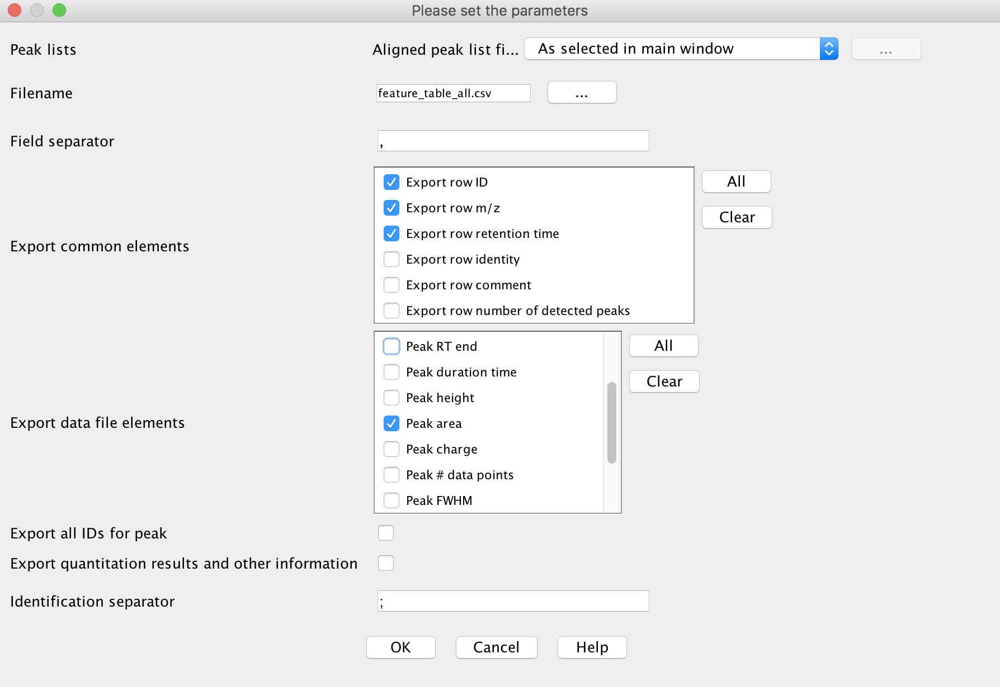
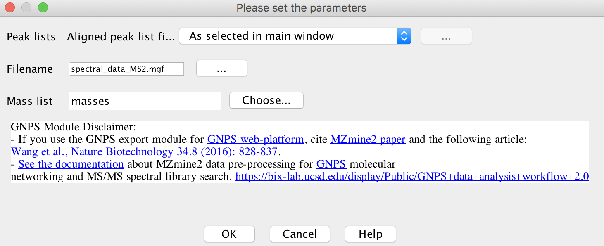
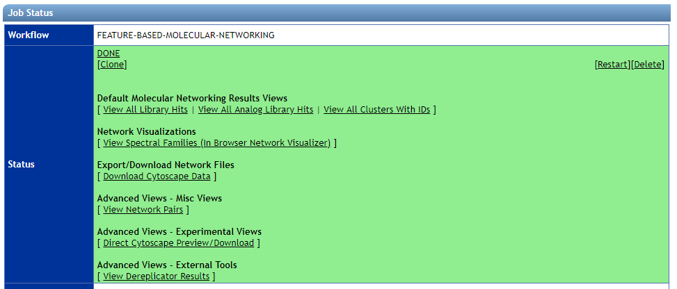
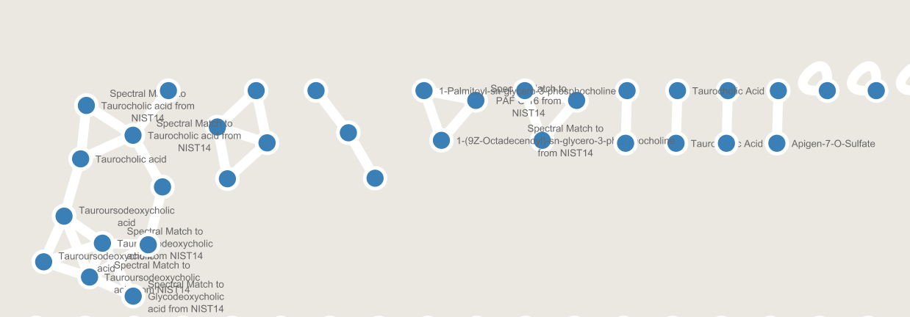
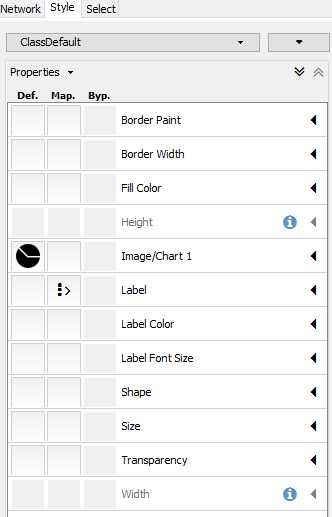
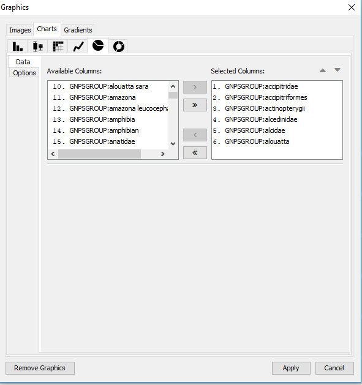
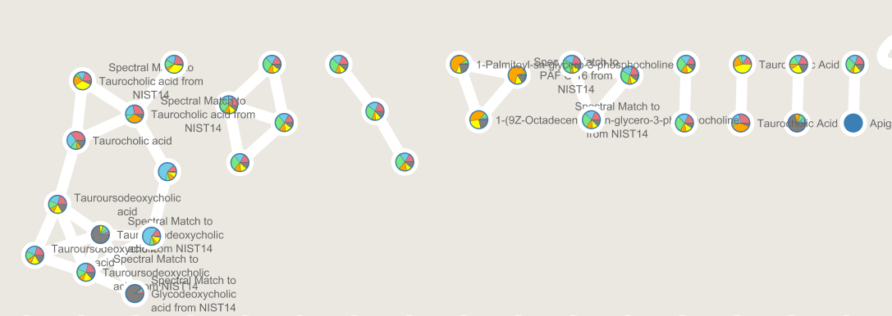

The Feature Finding Molecular Networking brings together LC-MS feature detection tools (e.g. MZmine2, OpenMS, MS-DIAL, MetaboScape), molecular networking (GNPS, http://gnps.ucsd.edu), and other in silico annotation tools, such as Sirius, CSI:FingerID, or Network Annotation Propagation.

## What is Feature Based Molecular Networking

Feature Based Molecular Networking is a new way to create molecular networks that utilizes feature detection tools to provide quantification information paired with molecular networking. This is in difference from [classic molecular networking](networking) that

## Why Feature Based Molecular Networking

The key improvements of the new Feature Finding Molecular Networking are:

1. Importing quantitative information derived from the feature detection tools into the molecular networks
2. Discriminate isomers by retention time and remove isotopic peak
3. Allows the annotation MS/MS of spectra with in silico tools and mapping in the molecular networks

## Feature Detection

In summary, these tools have been adapted by providing an .MGF export module for the result of LC-MS/MS feature detection.

1. The data have to be processed as recommended by the developers.
2. The spectral data from the aligned data can be exported as .MGF, the aligned quantification table has to be exported as well.
3. The .MGF file can be used as input for any GNPS tools. The aligned quantification table can be imported into Cytoscape.
3. The metadata table groups can be generated automatically with a dedicated workflow for MZmine2, or post-processed with other solutions (Jupyter notebooks, excel).

Currently, we are recommending using the MZmine2 workflow, as it has been thoroughly tested. See the documentation below.

### Mass spectrometry data Feature Detection with MZmine2

Download MZmine2 software (version MZmine v2.33 minimum) at [https://github.com/mzmine/mzmine2/releases](https://github.com/mzmine/mzmine2/releases).

See documentation and videos here: [http://mzmine.github.io/documentation.html](http://mzmine.github.io/documentation.html),
and [the video tutorial about Feature Based Molecular Networking.](tutorials/americangutmzmine/)

Please make sure your files are converted to mzXML or mzML.

### MZMine Batch Steps

In MZmine2, a sequence of steps must be performed. Here are several prototype for various instruments as a starting point:

| Instrument  | Gradient Length | Matrix Type | Sample Size | Download |
| ------------- |-------------| ----- | ----- | ----- |
| Bruker Maxis HD qTof | 10 Min | Stool | 20 | [Batch](static/maxis_12min_stool_20.xml) |

These batch files can be imported into MZMine2.

<!-- The prototype batch method for Bruker Maxis HD qTof can be [downloaded](static/qtof_batch.xml) and imported into MZmine2. -->

The steps required for data pre-processing with MZmine2 for GNPS are shown in the screen capture below.

See also the following [video tutorial](https://ccms-ucsd.github.io/GNPSDocumentation/tutorials/americangutmzmine/)
<iframe width="800" height="500" src="https://www.youtube.com/embed/5jjMllbwD-U"> </iframe>

Below is a walk through of all the steps

#### 1. Import Files

Menu: Raw data methods / Raw data import / "Select the files"

#### 2. Mass Detection

Perform mass detection on MS level 1: Menu: Raw data methods / Mass detection / Set filter : MS level 1

[IMPORTANT] Set a appropriate intensity threshold. You cam use the preview window to asses your data. As a rule of thumb, the value should at least correspond to the minimum value set for the triggering of the MS2 scan event. (Example: MAXIS-QTOF: 1E3, Q-Exactive 1E4)

Perform mass detection on MS level 2. The same masslist name must be used: Menu: Raw data methods / Mass detection / Set filter : MS level 2.

[IMPORTANT] Make sure to set an intensity threshold representative of noise level in the MS2 spectrum. This is typically lower than for MS1. Inappropriate intensity threshold could hamper the GNPS and Sirius export modules. (Example: MAXIS-QTOF: 1E2; Q-Exactive 1E3). If you have any doubt, set it to 0.

#### 3. Build Chromatogram

Menu: Raw data methods / Chromatogram builder

#### 4. Deconvolve the Chromatogram

Menu: Peak list methods / Peak detection / Chromatogram deconvolution

[IMPORTANT] tick both options "m/z range for MS2 scan pairing (Da)" and "RT range for MS2 scan pairing (min)". Define the values according to your experimental setup. This depends on your expected chromatographic peak width and the MS mass accuracy. (Example: MAXIS-QTOF, 10 min grdainet, 0.15 min, 0.02 m/z; Q-Eaxtive, 5 min gradient, 0.1 min, 0.01 m/z)

#### 5. Group isotopes and co-eluting ions

"Isotopic peaks grouper module" [recommended] or Camera module. Menu: Peak list methods / Isotopes / Isotopic peaks grouper.

[IMPORTANT]  This depends on your expected peak shapes, duty cycle time and the MS mass accuracy. (Example: MAXIS-QTOF, 10 min grdainet, 0.1 min, 0.02 m/z; Q-Eaxtive, 5 min gradient, 0.05 min, 0.01 m/z)

#### 6. Order the peaklists (Optional)

Menu: Peak list methods / Order peak lists.

This is to ensure reproducibility of results. Final output might change a little if this is not performed.

#### 7. Align Features

Menu: Peak list methods / Alignment / Join aligner

#### 8. Detect Missing Peaks / Gap filling (Optional)

Menu: Peak list methods / Gap filling / Peak finder

#### 9. Filter to MS/MS Peaks

Use both filters in the peaklist row filter module: 'Keep only peaks with MS2 scan (GNPS)". Menu: Peak list methods / Filtering / Peak list row filter

#### 10. Export Feature Abundances (filtered)

Export the feature table containing filtered peaks in .CSV format. Menu: Peak list methods / Export / Export to CSV file.
See an example of MZmine feature table [here](tutorials/AG_tutorial_files/MZmine-GNPS_AG_test_featuretable.csv).

The feature table must contain at least the row ID, the row m/z, and row retention time, along with the sample columns.
It is currently mandatory for the sample name headers string to have the following format: "filename Peak area". Depending on Note that depending on the steps used in MZmine the sample name header can be "filename baseline-corrected Peak area", but this has to changed back to "filename Peak area".

#### 11. Export MS/MS as MGF for GNPS

Export the .MGF file for GNPS. Menu: Peak list methods / Export / Export for GNPS.

See an example of MZmine .MGF file [here](tutorials/AG_tutorial_files/MZmine-GNPS_AG_test_GNPS.mgf).

### Feature Based Molecular Networking in GNPS

There is a special molecular networking workflow to handle MzMine2 features outputs. Try it out [here](https://gnps.ucsd.edu/ProteoSAFe/index.jsp?params=%7B%22workflow%22:%22FEATURE-BASED-MOLECULAR-NETWORKING%22,%22library_on_server%22:%22d.speclibs;%22%7D). You need to be logged in first!

You will need three items (test files are accessible [here](https://github.com/CCMS-UCSD/GNPSDocumentation/tree/master/docs/tutorials/featurebasedgnps)):

1. Feature Table from above
2. MGF for MS/MS from above
3. Metadata table - described [here](networking#metadata)

There are several additional normalization options specifically for feature detection. We can normalize the features per LC/MS run and aggregate by groups with either a sum or average (recommended).

Here is an example mzmine networking [job](https://gnps.ucsd.edu/ProteoSAFe/status.jsp?task=747b36ba08434f0cb478b920decfe4ce) from a subset of the American Gut Project.

#### Video Tutorial

**Running Feature Based Molecular Network at GNPS**

<iframe width="800" height="500" src="https://www.youtube.com/embed/NTkQ0fS1aug"> </iframe>

**Quick MZMine2 Export to GNPS Feature Based Molecular Networking**

<iframe width="800" height="500" src="https://www.youtube.com/embed/vFcGG7T_44E"> </iframe>

#### Results Tables

Once the molecular networking is finished, there are many views to explore the analysis. These views are very similar to classic molecular networking.

**Default Views to Explore Molecular Networks**

| View        | Description          |
| ------------- |-------------|
| [View All Library Hits](networkingviews.md#view-all-library-hits) | All spectral library matches between consensus MS/MS spectra and the selected libraries |
| View All Analog Library Hits | All spectral library matches between consensus MS/MS spectra and the selected libraries With Analog Search |
| [View All Clusters With IDs](networkingviews.md#view-all-clusters-with-ids) | All consensus MS/MS spectra created by Feature Detection Tool that were considered for library search and molecular networking. |

**Network Visualizations**

| View        | Description          |
| ------------- |-------------|
| [View Spectral Families (In Browser Network Visualizer)](networkingviews.md#view-spectral-families) | List of all Spectral Families (i.e. connected components in the network) as well as view the network visualized in the browser |

**Export/Download Network Files**

| View        | Description          |
| ------------- |-------------|
| Download Cytoscape Data | Download network files (graphML) for import into Cytoscape |

**Advanced Views - Experimental Views**

| View        | Description          |
| ------------- |-------------|
| Direct Cytoscape Preview/Download | Preview entire molecular network and download direct cys file to open in Cytoscape |

**Advanced Views - External Tools**

| View        | Description          |
| ------------- |-------------|
| View Dereplicator Results | View Dereplicator identification results |

#### Visualizing Abundances in Cytoscape as Pie Charts

To visualize different group average abundances in Cytoscape, we'll use pie charts between different groups we care about. Open up the Molecular Network in Cytoscape.

Initially, all nodes will be blue

Select the Style tab, and click the "Def." column under the Image/Chart 1 Row:

This brings up a panel to select which groups you would like to display in the pie charts:

Select the specific groups you want to compare (e.g. Case vs Control) and hit apply. Now the network will be colored with pies relevant to the groups you wanted to compare.

## Tutorials

See our [tutorial](tutorials/americangutmzmine) on using MZmine2 to produce quantification/ms2 files for Feature Based Molecular Networking in the American Gut Project sample.

See our [tutorial](tutorials/featurebasedgnps) on running Feature Based Molecular Networking within GNPS.

### Citation

This work builds on the efforts of our many colleagues, please check out their work:

[MZmine 2: Modular framework for processing, visualizing, and analyzing mass spectrometry-based molecular profile data. Pluskal et. al.](https://bmcbioinformatics.biomedcentral.com/articles/10.1186/1471-2105-11-395)
