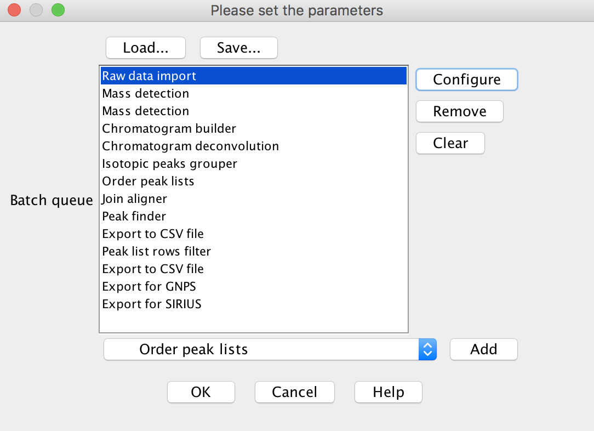
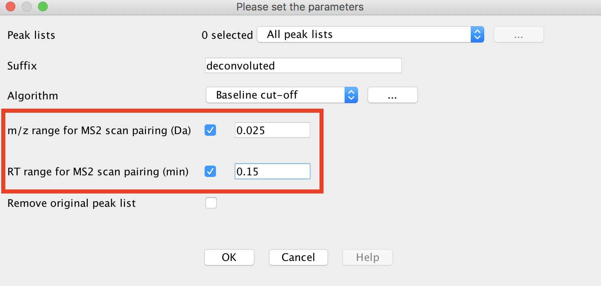

The Feature Finding Molecular Networking brings together LC-MS feature detection tools (e.g. MZmine2, OpenMS, MS-DIAL, MetaboScape), molecular networking (GNPS, http://gnps.ucsd.edu), and other in silico annotation tools, such as Sirius, CSI:FingerID, or Network Annotation Propagation.

The key improvements of the new Feature Finding Molecular Networking are:

1. Importing information derived from the feature detection tools into the molecular networks
2. Discriminate isomers by retention time and remove isotopic peak
3. Allows the annotation MS/MS of spectra with in silico tools and mapping in the molecular networks

## Feature Detection

In summary, these tools have been adapted by providing an .MGF export module for the result of LC-MS/MS feature detection.

1. The data have to be processed as recommended by the developers.
2. The spectral data from the aligned data can be exported as .MGF, the aligned quantification table has to be exported as well.
3. The .MGF file can be used as input for any GNPS tools. The aligned quantification table can be imported into Cytoscape.
3. The metadata table groups can be generated automatically with a dedicated workflow for MZmine2, or post-processed with other solutions (Jupyter notebooks, excel).

Currently, we are recommending using the MZmine2 workflow, as it has been thoroughly tested. See the documentation below.

### Mass spectrometry data Feature Detection with MZmine2

Download MZmine2 software (version MZmine v2.30 minimum) at [https://github.com/mzmine/mzmine2/releases](https://github.com/mzmine/mzmine2/releases).

See documentation and videos here: [http://mzmine.github.io/documentation.html](http://mzmine.github.io/documentation.html).

Please make sure your files are converted to mzXML or mzML.

### MZMine Batch Steps

In MZmine2, a sequence of steps must be performed. The prototype batch method (.XML format) can be downloaded and imported into MZmine2.

The steps required for data pre-processing with MZmine2 for GNPS are shown in the screen capture below (batch method) and described after.

Below is a walk through of all the steps

#### Import Files

Menu: Raw data methods / Raw data import / "Select the files"

#### Mass Detection

Perform mass detection on MS level 1: Menu: Raw data methods / Mass detection / Set filter : MS level 1

[IMPORTANT] Set a intensity threshold at value corresponding to the triggering of the MS2 scan event.

Perform mass detection on MS level 2. The same masslist name can be used: Menu: Raw data methods / Mass detection / Set filter : MS level 2.

[IMPORTANT] Make sure to set an intensity threshold representative of noise level in the MS2 spectrum. Inappropriate intensity threshold could hamper the GNPS and Sirius export modules. For that reason, set it as low as possible(Example: QTOF: 100). If you have any doubt, set it to 0.

#### Build Chromatogram

Menu: Raw data methods / Chromatogram builder

#### Deconvolve the Chromatogram

Menu: Peak list methods / Peak detection / Chromatogram deconvolution

[IMPORTANT] tick both options "m/z range for MS2 scan pairing (Da)" and "RT range for MS2 scan pairing (min)". Define the values according to your experimental setup.

#### Deconvolute co-eluting ions

"Isotopic peaks grouper module" [recommended] or Camera module. Menu: Peak list methods / Isotopes / Isotopic peaks grouper.

#### Order the peaklists

Menu: Peak list methods / Order peak lists.

#### Align Features

Menu: Peak list methods / Alignment / Join aligner

#### Detect Missing Peaks (Optional)

Menu: Peak list methods / Gap filling / Peak finder

#### Export Feature Abundances

Export the feature table containing all the peaks in .CSV format. Menu: Peak list methods / Export / Export to CSV file

[IMPORTANT] If any other filtering of the peaklist has been performed, make sure to before, reset the peak row number. Menu: Peak list methods / Filtering / Peak list row filter / Reset the peak number ID

[IMPORTANT] This feature table will not be used in further workflow. It is exported in order to do further statistical analysis.

#### Filter to MS/MS Peaks

Use both filters in the peaklist row filter module: 'Keep only peaks with MS2 scan (GNPS)". Menu: Peak list methods / Filtering / Peak list row filter

#### Export MS/MS as MGF for GNPS

Export the .MGF file for GNPS. Menu: Peak list methods / Export / Export for GNPS

### Feature Based Molecular Networking in GNPS

There is a special molecular networking workflow to handle MzMine2 features outputs. Try it out [here](https://gnps.ucsd.edu/ProteoSAFe/index.jsp?params=%7B%22workflow%22:%22METABOLOMICS-SNETS-MZMINE%22,%22library_on_server%22:%22d.speclibs;%22%7D).

You will need three items:

1. Feature Table from above
2. MGF for MS/MS from above
3. Metadata table - described [here](networking#metadata)

There are several additional normalization options specifically for feature detection. We can normalize the features per LC/MS run and aggregate by groups with either a sum or average (recommended).

### Citation

This work builds on the efforts of our many colleagues, please check out their work:

[MZmine 2 Data-Preprocessing To Enhance Molecular Networking Reliability. Olivon et al.](https://pubs.acs.org/doi/10.1021/acs.analchem.7b01563)

[MZmine 2: Modular framework for processing, visualizing, and analyzing mass spectrometry-based molecular profile data. Pluskal et. al.](https://bmcbioinformatics.biomedcentral.com/articles/10.1186/1471-2105-11-395)
