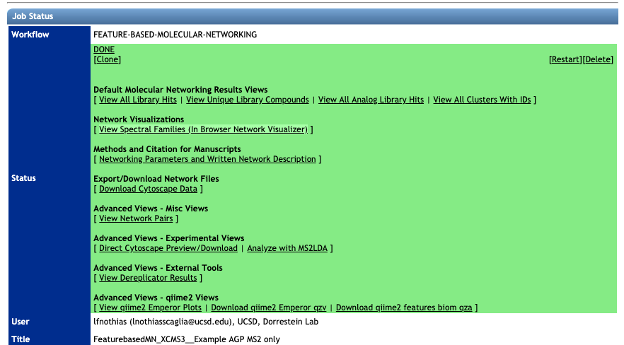

# Feature-Based Molecular Networking (FBMN)

## Introduction

[**NEW !!!**] The FBMN allows to generate molecular networks from MSE and Ion Mobility Spectrometry (IMS) data with MS-DIAL, or Progenesis QI, MetaboScape.

**Feature-Based Molecular Networking** (FBMN) is a computational method that bridges popular mass spectrometry data processing tools for LC-MS/MS and molecular networking analysis on [GNPS](http://gnps.ucsd.edu). The supported tools are: [MZmine](featurebasedmolecularnetworking-with-mzmine2.md), [OpenMS](featurebasedmolecularnetworking-with-openms.md), [MS-DIAL](featurebasedmolecularnetworking-with-ms-dial.md), [MetaboScape](featurebasedmolecularnetworking-with-metaboscape.md), [XCMS](featurebasedmolecularnetworking-with-xcms3.md), [Progenesis QI](featurebasedmolecularnetworking-with-progenesisQI.md), and the [mzTab-M format](featurebasedmolecularnetworking-with-mztab-m.md).

The main documentation for Feature-Based Molecular Networking is provided below. See [our preprint on bioaRxiv](https://www.biorxiv.org/content/10.1101/812404v1).

The Feature-Based Molecular Networking (FBMN) workflow is available on GNPS via:

- [The Superquick Start page for FBMN](http://dorresteinappshub.ucsd.edu:5050/featurebasednetworking). This page enables rapid submission of jobs with limited options. 

- [The standard GNPS interface page for FBMN](https://gnps.ucsd.edu/ProteoSAFe/index.jsp?params=%7B%22workflow%22:%22FEATURE-BASED-MOLECULAR-NETWORKING%22,%22library_on_server%22:%22d.speclibs;%22%7D) (you need to be logged in GNPS first).

- For programmatic access to FBMN, contact Mingxun Wang at <miw023@ucsd.edu>.

## Citations

This work builds on the efforts of our many colleagues, please make sure to cite the papers for their processing tools and the following GNPS papers:

Nothias, L.F. et al [Feature-based Molecular Networking in the GNPS Analysis Environment](https://www.biorxiv.org/content/10.1101/812404v1) bioRxiv 812404 (2019).

Wang, M. et al. [Sharing and community curation of mass spectrometry data with Global Natural Products Social Molecular Networking](https://doi.org/10.1038/nbt.3597). Nat. Biotechnol. 34, 828–837 (2016).

The citations from the mass spectrometry processing tools you used [[MZmine2](featurebasedmolecularnetworking-with-mzmine2.md), [OpenMS](featurebasedmolecularnetworking-with-openms.md), [MS-DIAL](featurebasedmolecularnetworking-with-ms-dial.md), [MetaboScape](featurebasedmolecularnetworking-with-metaboscape.md),[XCMS](featurebasedmolecularnetworking-with-xcms3.md), and [mzTab-M format](featurebasedmolecularnetworking-with-mztab-m.md)]. 

## Mass Spectrometry Data Processing for the FBMN

In brief, popular mass spectrometry processing programs have been adapted to export two files (*feature quantification table* and *MS/MS spectral summary*) files that can be used with the Feature Based Molecular Networking (FBMN) workflow on GNPS. Alternatively, the FBMN supports the mzTab-M format that can be inputted along witht the mzML file(s). The tools supported and their main features are presented in the table below along with a step-by-step documentation to use in FBMN on GNPS:

|  Processing tool | Doc.| Data supported | Interface | Platform | Code |Target user|
|---|---|---|---|---|---|---|
|[MZmine](https://github.com/mzmine/mzmine2/)|[See doc.](featurebasedmolecularnetworking-with-mzmine2.md) | Non-targeted LC-MS/MS | Graphical UI|Any|[Open source](https://github.com/mzmine/mzmine2/blob/master/LICENSE.txt)|Mass spectrometrists|
|[MS-DIAL](http://prime.psc.riken.jp/Metabolomics_Software/MS-DIAL/)|[See doc.](featurebasedmolecularnetworking-with-ms-dial.md) | Non-targeted LC-MS/MS, **MSE**, **Ion Mobility** | Graphical UI|Windows|[Open source](http://prime.psc.riken.jp/Metabolomics_Software/MS-DIAL/)|Mass spectrometrists|
|[OpenMS](https://github.com/OpenMS/OpenMS/)|[See doc.](featurebasedmolecularnetworking-with-openms.md)| Non-targeted LC-MS/MS |Commandline|Any|[Open source](https://github.com/OpenMS/OpenMS/blob/develop/License.txt)|Bioinformaticians and developers|
|[XCMS](https://github.com/sneumann/xcms)|[See doc.](featurebasedmolecularnetworking-with-xcms3.md) | Non-targeted LC-MS/MS |Commandline|Any|[Open source](https://github.com/sneumann/xcms)|Bioinformaticians and developers|
|[MetaboScape](https://www.bruker.com/products/mass-spectrometry-and-separations/ms-software/metaboscape/overview.html)|[See doc.](featurebasedmolecularnetworking-with-metaboscape.md)| Non-targeted LC-MS/MS, **Ion Mobility** |Graphical UI|Windows|Proprietary code|Mass spectrometrists|
|[Progenesis QI](http://www.nonlinear.com/progenesis/qi/)|[See doc.](featurebasedmolecularnetworking-with-progenesisQI.md)| Non-targeted LC-MS/MS, **MSE**, **Ion Mobility** |Graphical UI|Windows|Proprietary code|Mass spectrometrists|
|[mzTab-M](https://pubs.acs.org/doi/abs/10.1021/acs.analchem.8b04310)|[See doc.](featurebasedmolecularnetworking-with-mztab-m.md)| Non-targeted LC-MS/MS | Standardized format|Multi-systems|[Open source](https://github.com/lifs-tools/jmzTab-m)|All public|

**IMPORTANT:** The software used for the LC-MS/MS data processing has to be configured and utilized as recommended by its documentation.

## The FBMN Workflow in GNPS

There is a dedicated Feature-Based Molecular Networking workflow on GNPS that [can be accessed here](https://gnps.ucsd.edu/ProteoSAFe/index.jsp?params=%7B%22workflow%22:%22FEATURE-BASED-MOLECULAR-NETWORKING%22,%22library_on_server%22:%22d.speclibs;%22%7D) (you need to be logged in GNPS first).

### Requirement for the FBMN workflow
After processing your LC-MS/MS data with the prefered software, it is possible to export the results following two methods:

Three type of input files are needed (test files for each software are accessible [here](https://github.com/CCMS-UCSD/GNPSDocumentation/tree/master/docs/tutorials/AG_tutorial_files)):

**Option A (RECOMMENDED)** - Export the processing results using a feature table and an .MGF file:

1. A *feature table* with the intensities of LC-MS ion features (TXT or CSV format).

2. A *MS/MS spectral summary* file with a list of MS/MS spectra associated with the LC-MS ion features (.MGF File). (.MGF file format).

3. [Optional] *Metadata table* - described [here](networking.md#metadata)

4. [Optional] *"Supplementary Pairs"* of additional edges - described [here](#advanced-extras)

**Option B** - Export the processing results using an mzTab-M and mzML files:

1.  Export a single mzTab-M file from the processed data. See and cite this [publication](https://pubs.acs.org/doi/abs/10.1021/acs.analchem.8b04310).

2. Use the mzML file(s) associated with mzTab-M file.

3. [Optional] *Metadata table* - described [here](networking.md#metadata)
 	
 	
## SuperQuick Feature Based Molecular Networking Workflow

A simplified interace for Super Quick web interace for FBMN [is available here](http://dorresteinappshub.ucsd.edu:5050/featurebasednetworking).

### Running the SuperQuick FBMN
1. Indicate your email and your GNPS Credentials.
2. Select the 'Feature Generation tool'.
3. Select the parameters preset.
4. Option A. Drag and drop your "feature quantification table" and "MS/MS spectral file" (.MGF). See the respective documentation for FBMN each tool.
5. Optional. Drag and drop a [metadata table](networking.md#metadata).
6. Optional. Drag and drop a "Supplementary Pairs" csv file ([see format](#advanced-extras)) with additional edges
7. Click on "Analyze Uploaded Files with GNPS Molecular Networking".

While this SuperQuick FBMN interface is convenient for quick analysis, we recommend using the standard FBMN workflow. [**IMPORTANT**] The file uploaded along with the jobs submitted with Superquick start interface are deleted on monthly basis. Use the "standard" interface of the FBMN for persistant jobs and more options.

### Overview of the standard interface

#### Select the file source

### Molecular Networks Options
#### Basic Options

| Parameter  | Description          | Default |
| ------------- |-------------| -----|
| Precursor Ion Mass Tolerance (PIMT) | Parameter used for MS-Cluster and spectral library search expressed in Daltons. This value influences the aforementioned clustering of nearly-identical MS/MS spectra via MS-Cluster. Note that the value of this parameters should be consistent with the capabilities of the mass spectrometer and the specific instrument method used to generated the MS/MS data. Recommended Values value is ± 0.02 Da for high-resolution instruments (q-TOF, q-Orbitrap) and ± 2.0 Da for low-resolution instruments (ion traps, QqQ).| 0.02 |
| Fragment Ion Mass Tolerance (FIMT)	      | Parameters used for MS-Cluster, molecular networking, and MS/MS spectral library searches. For every group of MS/MS spectra being considered for clustering (consensus spectrum creation), this value specifies how much fragment ions can be shifted from their expected m/z values. Recommended Values value is ± 0.02 Da for high-resolution instruments (q-TOF, q-Orbitrap) and ± 0.5 Da for low-resolution instruments (ion traps, QqQ). | 0.02 |

#### Advanced Molecular Network Options

| Parameter        | Description          | Default | Notes |
| ------------- |-------------| -----| -----|
| Min Pairs Cos | Minimum cosine score for a pair of consensus MS/MS spectra in order for an edge to be formed in the molecular network  | 0.7 | Lower value will increase the size of the clusters by inducing the clustering of less related MS/MS spectra, higher value will do the opposite. |
| Minimum Matched Fragment Ion (Min Matched Peaks) | Parameters used for molecular networking. The minimum number of common fragment ions that are shared by two separate consensus MS/MS spectra in order to be connected by an edge in the molecular network | 6 | A low value will permit linkages between spectra of molecules with few similar fragment ions, but it will result in many more less-related spectra being connected to the network. An higher value will do the opposite. Default value is 6, but note that this parameters should be adjusted depending on the experimental conditions for mass spectra acquisition (such as mode of ionisation, fragmentation conditions, the mobile phase, etc.), and the collision-induced fragmentation settings of the molecules of interest within the samples. High molecular weight (MW) compounds and compounds with more hetero-atoms generally tend to produce more fragment ions. However, this rule cannot is not absolute. For example, some lipids with high MW generate only a few fragment ions. |
| Maximum shift between precursors | The maximum m/z difference between two precursors permitting their spectra to be considered as direct neighbors in a molecular network | 500 | The maximum mass difference between two connected nodes in a molecular network. |
| Network TopK	| Maximum number of neighbor nodes for one single node  | 10 | The edge between two nodes are kept only if both nodes are within each other's ‘TopK’ most similar nodes.  For example, if this value is set at 20, then a single node may be connected to up to 20 other nodes.  Keeping this value low makes very large networks (many nodes) much easier to visualize. |
| Maximum Connected Component Size | Maximum number of nodes allowed in a single connected network  | 100 | Nodes within a single connected molecular network will be separated by increasing cosine threshold for that specific connected molecular network. Default value is 100. Use 0 to allow an unlimited number of nodes in a single network. Note that with large datasets, or when a great number of related molecules are in the dataset, this value should be higher (or turn to 0) to retain as much information as possible. Downstream, these larger networks can be visualized using Cytoscape layout algorithms that can increase the intra-network clustering, allowing to visualize spectral groups in the network despite the number of nodes in the network. |

#### Advanced Spectral Library Search Options

| Parameter        | Description          | Default |
| ------------- |-------------| -----|
|Library Search Min Matched Peaks | Minimum number of common fragment ions that MS/MS spectra should contain in order to be considered for spectral library annotation. Default value is 6, but note that this parameters should be tuned depending on the molecules of interest, and the experimental conditions (such as the ionisation mode and the fragmentation conditions). For example, the collision-induced fragmentation of some lipids produce only a few fragment ions. A lower value will allow clustering of MS/MS spectra containing less  fragment ions, however it will also induce clustering of MS/MS spectra from different molecular types to be connected in one network. A higher value will do the opposite|6|
|Score Threshold |Minimum cosine score that MS/MS spectra should get in spectral matching with MS/MS spectral libraries in order to be considered an annotation.|0.7|
|Search Analogs|Whether to search data for analogs to library spectra| Don't Search|
|Maximum Analog Search Mass Difference|Maximum mass shift between the library and putative analogs found| 100 (Da)|
|Top results to report per query|Number of matches to report for each feature| 1 |

#### Advanced Filtering Options (for Spectra)

| Parameter        | Description          | Default
| ------------- |-------------| -----|
| Minimum Peak Intensity | All fragment ions in the MS/MS spectra below this raw intensity value will be deleted. By default, the filtering is disabled. | 0  |
| Filter Precursor  Window | All peaks in a +/- 17 Da around precursor ion mass are deleted. Enabled by default. This removes the residual precursor ion, which is frequently observed in MS/MS spectra acquired on qTOFs. | Filter | |
| Filter library | Apply peak filters to library | Filter | |
|Filter peaks in 50Da Window | Filter out peaks that are not in the top 6 most intense peaks in a +/- 50Da window | Filter |

#### Advanced quantification options

There are additional normalization options specifically for the FBMN workflow:

| Parameter        | Description          | Default
| ------------- |-------------| -----|
| Normalization Per File | Total Ion Current (TIC) normalization can be applied to the ion intensities (LC-MS1 peak area) per sample (NOT RECOMMENDED AS DEFAULT) | No Norm  |
| Aggregation Method for Peak Abundances Per Group | The ion feature intensity (LC-MS1 peak area) can be aggregated by GROUPS from the metadatable with either a *Sum* or *Average* (RECOMMENDED, because it is more robust to the difference in the number of samples per GROUPS). | Average  |

#### Advanced Extras

"Supplementary Pairs" is an option to add extra edges to the resulting feature-based molecular network. It was initially implemented for the Ion Identity Networking (IIN) workflow. However, this approach is designed to stimulate the development and testing of new workflows as the input is an edge file in a generic csv format. An edge is described by the following table:

| Header        | Description |
| ------------- |-------------|
| ID1 | Node ID 1 matching the row IDs |
| ID2 | Node ID 2 matching the row IDs |
| EdgeType | Any string describing the type of edge |
| Score | A numerical value for the score (cannot be empty) |
| Anntoation | A string annotation |

**Example of the Supplementary Pairs used in the Ion Identity Networking (IIN) workflow**

### Inspecting the Results of FBMN on GNPS

After the completion of the FBMN job (this will take from 10 to 10 hours depending on your number of samples and instrument), you will receive an email notification with a link to the results page (see example below).

#### Spectral Library Match and Network Topology Analysis
For more information about the inspection of the molecular networking results, please refer to [the main documentation page](networkingviews.md).

##### Web-browser Molecular Network Visualization
Here is an example of web-browser view of molecular networks. Click on the link to [view the interactive molecular networks](https://gnps.ucsd.edu/ProteoSAFe/result.jsp?view=network_displayer&componentindex=56&task=51ee77f5c6d74f878e873f0b1dfe0b5f#%7B%7D).

### Inspecting the Results of FBMN in Cytoscape

Cytoscape is an open source software platform used to visualize, analyze and annotate molecular networks from GNPS. [See the documentation here](featurebasedmolecularnetworking-cytoscape.md).

### Demo GNPS job of FBMN
[Here is an example FBMN](https://gnps.ucsd.edu/ProteoSAFe/status.jsp?task=52a390c8eb654b7fa8d61a1c7a4aaab5) job with files resulting from MZmine2 processing of a subset of the [American Gut Project] (http://humanfoodproject.com/americangut/).

### Running the DEREPLICATOR

The Insilico Peptidic Natural Products Dereplicator is a bioinformatic tool that allows the annotation of known peptidic natural products in MS/MS data using in silico fragmentation tree. This workflow is also included into the Feature Based Molecular Network workflow, then you have the option to use it by clicking into Advanced External tools. After your job has completed you can explore your results and even *clone* the Dereplicator job and modify the parameters.

If you use that tool, please cite the DEREPLICATOR papers. [See citations in the main DEREPLICATOR documentation](dereplicator.md).

### Running Network Annotation Propagation

It is possible to use the results of FBMN to run Network Annotation Propagation (NAP). NAP uses spectral networks to propagate information from spectral library matching, in order to improve in silico fragmentation candidate structure ranking. See the following [documentation for NAP](nap.md)

If you use that tool, please cite the NAP paper. [See citations in the main NAP documentation](nap.md).

### Running MS2LDA Substructure Discovery

**The results of FBMN can be directly analyzed with MS2LDA**. For this, on the result page click on "Advanced View" > "Analyze with MS2LDA". See the [MS2LDA documentation](ms2lda.md).

MS2LDA is a tool that decomposes molecular fragmentation data derived from large metabolomics experiments into annotated Mass2Motifs or discovers Mass2Motifs from experimental data. Mass2Motifs are fragmentation patterns of often co-occurring mass fragment peaks and/or neutral losses that often represent molecular substructures. Check out the MS2LDA website here where you can find more information, browse through data sets, and sign up for an account to run the Mass2Motif discovery on your own data. At GNPS, we are working with the MS2LDA team to integrate both workflows which allows users to map Mass2Motif occurrences in their Molecular Families.

If you use that tool, please cite MS2LDA papers. [See citations in the main MS2LDA documentation](ms2lda.md).

### Running MolNetEnhancer with FBMN

[MolNetEnhancer](https://www.mdpi.com/2218-1989/9/7/144) is a workflow that enables to combine the outputs from molecular networking, MS2LDA, in silico structure annotation tools (such as Network Annotation Propagation or DEREPLICATOR) and the automated chemical classification through ClassyFire to provide a more comprehensive chemical overview of metabolomics data whilst at the same time illuminating structural details for each fragmentation spectrum. For more information refer to the main MolNetEnhancer publication.

See the [main documentation of MolNetEnh](molnetenhancer.md) for informations about using it for FBMN. 

### Viewing the PCoA plot with EMPeror in Qiime2

EMPeror, is an open source and web browser enabled tool that allows researchers to perform rapid exploratory investigations of 3D visualizations of data. To view the PCoA plot (using Bray-Curtis dissimilarity metrics) with the EMPeror Qiime2 plugin, click on **"View qiime2 Emperor Plots"**.

**Citation for EMPeror**: Yoshiki Vázquez-Baeza, Meg Pirrung, Antonio Gonzalez, and Rob Knight. Gigascience, 2(1):16, 2013. [doi:10.1186/2047-217X-2-16](https://academic.oup.com/gigascience/article/2/1/2047-217X-2-16/2656132).

**Citation for Qiime2**: Bolyen, E. et al. QIIME 2: Reproducible, interactive, scalable, and extensible microbiome data science. (PeerJ Preprints, 2018). [doi:10.7287/peerj.preprints.27295v2](https://peerj.com/preprints/27295/)

### Video Tutorial - Analyze FBMN in GNPS

This video presents
<iframe width="600" height="400" src="https://www.youtube.com/embed/NTkQ0fS1aug"> </iframe>

## Tutorials

See our [tutorial on using MZmine2](tutorials/americangutmzmine.md) for FBMN analysis of a cohort from the [American Gut Project](http://humanfoodproject.com/americangut/), and our [tutorial on running a FBMN analysis on GNPS](tutorials/featurebasedgnps.md).

## Development

#### Source code
- The FBMN source code can be found on the [GNPS_Workflows GitHub repository](https://github.com/CCMS-UCSD/GNPS_Workflows/tree/master/feature-based-molecular-networking).

#### Input files requirements

##### Feature quantification table
The *feature quantification table* (.TXT or CSV file) needs to have unique *Feature IDentifier* (integer) for each LC-MS1 feature that must match the "SCANS=" header of the corresponding spectrum in the *MS/MS spectral summary* (.MGF file). Note that the number of LC-MS1 features in the *feature quantification table* can be larger than the number of LC-MS1 features with a spectrum in the *MS/MS spectral file*. And the *Feature IDentifier* does not have to be sequencial. As a result, the *feature quantification table* can contain LC-MS1 feature that doesn't have an associated MS/MS scan in the *MS/MS spectral file*. The PCoA generated with qiime2 EMPeror uses the entire content of *feature quantification table* provided.

##### MS/MS spectral summary
The format of the *feature quantification table* should be consistent with the representative *feature quantification tables* defined for each processing tool. See [this page for example files](https://github.com/CCMS-UCSD/GNPSDocumentation/tree/master/docs/tutorials/AG_tutorial_files). Note that internally, the *feature quantification table* file inputted by the user are converted to a standard internal format prior to FBMN analysis in GNPS. The python scripts used for the conversion *feature quantification Table* from various software [are available here](https://github.com/CCMS-UCSD/GNPS_Workflows/tree/master/feature-based-molecular-networking/tools/feature-based-molecular-networking/scripts). If you want to add support for another LC-MS processing tool, please contact us.

##### Support for mz-Tab-M format

The **mzTab-M** format is a standardized output designed for the report of metabolomics MS-data processing results. The FBMN workflow now supports the mzTab-M format (2.0, release 1.0.5). The **mzTab-M** file has to be inputed along with the related **mzML** files. 

Basically, the **mzTab-M** is used to retrieve for each LC-MS/MS feature:

- The abundance of the LC-MS/MS feature in each sample.
- The filename (**mzML**) and index of the associated MS/MS spectrum. 

More informations in the [FBMN with mzTab-M documentation](featurebasedmolecularnetworking-with-mztab-m.md).

### Citation

This work builds on the efforts of our many colleagues, please make sure to cite the papers for their processing tools and the GNPS paper:

Wang, M. et al. [Sharing and community curation of mass spectrometry data with Global Natural Products Social Molecular Networking](https://doi.org/10.1038/nbt.3597). Nat. Biotechnol. 34, 828–837 (2016).

### Join the GNPS Community !

- For feature request, or to report bugs, please open an "Issue" on the [*CCMS-UCSD/GNPS_Workflows* GitHub repository](https://github.com/CCMS-UCSD/GNPS_Workflows).
- To contribute to the GNPS documentation, please use GitHub by forking the [*CCMS-UCSD/GNPSDocumentation*](https://github.com/CCMS-UCSD/GNPSDocumentation) repository, and make a "Pull Request" with the changes.

## Page contributors
Louis Felix Nothias (UCSD), Ming Wang (UCSD), Laura-Isobel McCall (University of Oklahoma), Andrés Mauricio Caraballo Rodríguez (UCSD), Ivan Protsyuk (EMBL, Heidelberg, Germany), Robin Schmid (WWU, Münster, Germany).
