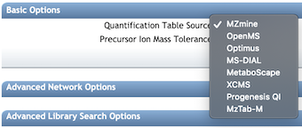

## Introduction

The Feature-Based Molecular Networking (FBMN) is a computational method that bridges popular mass spectrometry data processing tools for LC-MS/MS and molecular networking analysis on [GNPS](http://gnps.ucsd.edu). The supported tools are: [MZmine2](https://mzmine.github.io/), [OpenMS](https://www.openms.de/), [MS-DIAL](http://prime.psc.riken.jp/Metabolomics_Software/MS-DIAL/), [XCMS3](https://github.com/sneumann/xcms), and [MetaboScape4.0](https://www.bruker.com/products/mass-spectrometry-and-separations/ms-software/metaboscape/overview.html).

The main documentation for Feature-Based Molecular Networking [can be accessed here.](featurebasedmolecularnetworking)

The Feature-Based Molecular Networking workflow on GNPS [can be accessed here](https://gnps.ucsd.edu/ProteoSAFe/index.jsp?params=%7B%22workflow%22:%22FEATURE-BASED-MOLECULAR-NETWORKING%22,%22library_on_server%22:%22d.speclibs;%22%7D) (you need to be logged in GNPS first).

## Mass Spectrometry Data Processing for the Feature Based Molecular Networking Workflow

In brief, mass spectrometry processing tools have been adapted to export files that can be used with the Feature Based Molecular Networking workflow on GNPS. Their respective step-by-step documentation can be found below:

[Documentation for MZmine2](featurebasedmolecularnetworking-with-mzmine2) (advanced graphical user interface, Linux/Mac/Windows)

[Documentation for MS-DIAL](featurebasedmolecularnetworking-with-ms-dial) (advanced graphical user interface; Windows only)]

[Documentation for OpenMS](featurebasedmolecularnetworking-with-OpenMS) (advanced feature detection tool, mainly used as commandline; Linux/Mac/Windows)

[Documentation for XCMS](featurebasedmolecularnetworking-with-XCMS) (advanced feature detection tool, mainly used via R language; Linux/Mac/Windows)

[Documentation for MetaboScape](featurebasedmolecularnetworking-with-metaboscape) (Bruker data only, and requires a commercial licence)

**IMPORTANT:** The data have to be processed as recommended by the tool developers.

### Mass spectrometry data Feature Detection with MZmine2 [RECOMMENDED]

Currently, we are recommending using the MZmine2 workflow, as it has been thoroughly tested. [See the documentation here](#featurebasedmolecularnetworking-with-mzmine2) and the following [video tutorial:](https://ccms-ucsd.github.io/GNPSDocumentation/tutorials/americangutmzmine/)

<iframe width="700" height="400" src="https://www.youtube.com/embed/5jjMllbwD-U"> </iframe>

## The Feature Based Molecular Networking Workflow in GNPS

There is a dedicated Feature-Based Molecular Networking workflow on GNPS that [can be accessed here](https://gnps.ucsd.edu/ProteoSAFe/index.jsp?params=%7B%22workflow%22:%22FEATURE-BASED-MOLECULAR-NETWORKING%22,%22library_on_server%22:%22d.speclibs;%22%7D) (you need to be logged in GNPS first).

You will need three items (test files are accessible [here](https://github.com/CCMS-UCSD/GNPSDocumentation/tree/master/docs/tutorials/AG_tutorial_files)):

1. The Feature Table with the intensity of ion features (Peak Area Quantification Table).
2. The MGF file with the list of MS/MS spectra for the ion features (MS2 MGF File).
3. [Optional] the Metadata table - described [here](networking#metadata)

#### Overview of the Feature Based Molecular Networking Workflow

#### Select the software used for the LC-MS/MS data processing

#### Set the parameters as needed
Coming soon for each parameters.

##### Set the advanced quantification parameters

There are several additional normalization options specifically for feature detection. We can normalize the features per LC/MS run and aggregate by groups with either a sum or average (recommended).

#### Demo GNPS job of Feature Based Molecular Networking
[Here is an example FBMN](https://gnps.ucsd.edu/ProteoSAFe/status.jsp?task=52a390c8eb654b7fa8d61a1c7a4aaab5) job with files resulting from MZmine2 processing of a subset of the [American Gut Project] (http://humanfoodproject.com/americangut/).

## Tutorials

See our [tutorial on using MZmine2](tutorials/americangutmzmine) for FBMN analysis of a cohort from the [American Gut Project] (http://humanfoodproject.com/americangut/), and our [tutorial on running a FBMN analysis on GNPS](tutorials/featurebasedgnps).

## Citation

This work builds on the efforts of our many colleagues, please make sure to cite the papers for their processing tools and the GNPS paper:

Wang, M. et al. [Sharing and community curation of mass spectrometry data with Global Natural Products Social Molecular Networking](https://doi.org/10.1038/nbt.3597). Nat. Biotechnol. 34, 828–837 (2016).
