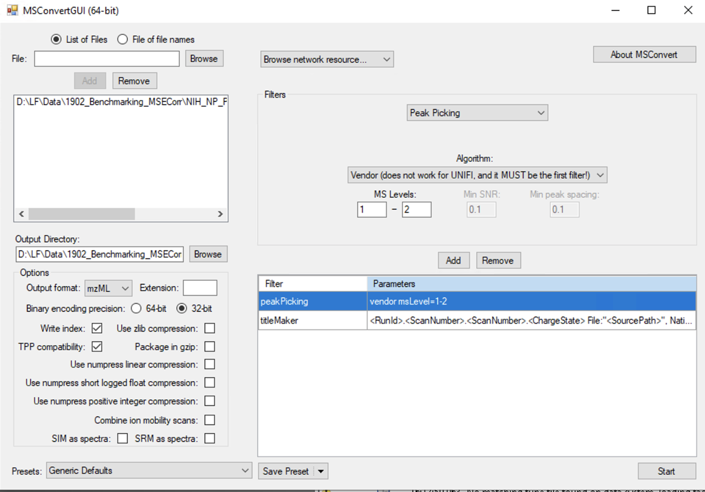

## Supported Formats at GNPS

At GNPS we support mzXML, mzML, and mgf formats for analysis. Our tools do NOT support mzData, xml, raw, RAW, wiff, scan, d, and cdf formats. If your files are in not supported, please use the following guide to convert them to an open format that is supported by GNPS.

## Data Conversion (Easy)

This is a complete package for Windows users to convert their vendor formats to GNPS compatible format (mzXML). It is as easy as putting files into a folder and batch converting it all without any installation (well nearly so).

1. Download the zip file [here](https://www.dropbox.com/s/41m88bh3fcr5uz9/GNPS_Vendor_Conversion.zip?dl=1)
2. Unzip contents onto a folder on your computer (e.g. Desktop)
3. Install windows libraries in "pwizLibraries-and-Installation" - Run appropriate program for 32-bit (32-Bit_Double-Click_To_Install.bat) or 64-bit system (64-Bit_Double-Click_To_Install.bat). To find out which type of OS you have please check [here](https://support.microsoft.com/en-us/help/15056/windows-7-32-64-bit-faq)
4. Put vendor formats in "Input_Files" not embedded in other folders
5. Double click on Double-Click_To-Convert.bit - Download zip includes demo files for major vendor formats as a test.
6. Wait patiently
7. Check all files converted in Output_Folder
8. If there are errors, please check log.txt or read on how to convert files in a more traditional manner.

## Data Conversion (Traditional)

For files to be operated on in the GNPS workflows, they must be in the correct format.  Only the following formats are acceptable: .mzXML, .mzML, and .mgf.

The .mzXML or .mzML format is strongly preferred and will be discussed in this tutorial for data conversion.

| Vendor        | Instrument Software           | File Format  | Recommended Converter | Notes |
| ------------- |-------------| -----| ----- | ----- |
| AB Sciex      | Analyst | .wiff | MSConvert | verified |
| Agilent      | MassHunter      |   .d | MSConvert | verified (with issues with scan number export) |
| Bruker | DataAnalysis/Compass      |   .d | CompassXport | This conversion is through the DataAnalysis software and is detailed [here](https://bix-lab.ucsd.edu/display/Public/Data+Conversion+to+GNPS+Compatible+Formats+-+.mzXML+and+.mzML#DataConversiontoGNPSCompatibleFormats-.mzXMLand.mzML-ConversionofBrukerData) |
| ThermoFisher | Xcalibur      |    .raw/.RAW | MSConvert | verified |
| Waters | MassLynx      |    .raw | MSConvert is for full scan/DDA datasets. [Symphony](http://www.waters.com/waters/en_US/informatics,-data_pipeline/nav.htm?cid=134893896&locale=en_US) is for other modes such as MSe/SONAR/HDMSe/HD-DDA | detailed instructions coming soon! |
| Shimadzu | | .lcd | MSConvert | |

For problems with MSConvert, please contact the ProteoWizard [developers](http://proteowizard.sourceforge.net/contact.shtml).

If you are a vendor and think there are better methods to convert your files to work with GNPS, let us know by [contacting us](contact.md).

### Conversion with MSConvert

Download and install ProteoWizard from [here](http://proteowizard.sourceforge.net/downloads.shtml).

**IMPORTANT:**: Make sure to choose the version Windows (includes vendor reader support). You must also have .NET [Framework 3.5 SP1](http://www.microsoft.com/en-us/download/details.aspx?id=22) and [4.0](http://www.microsoft.com/en-us/download/details.aspx?id=17851) installed.

After installation, from the Start Menu, click the ProteoWizard folder and open MSConvert.

- Click Browse and select file(s) for conversion. Then Click Add to add them to the MSConvert workflow.

- Choose an Output Directory

- Under Options, choose mzML (prefered) or mzXML for output format, 32-bit for binary encoding precision and uncheck Use zlib compression.

- Under filters, choose Peak Picking with Vendor checked, in order to centroid the data. Indicate MS-Levels 1-2. Click Add to add the filter. **IMPORTANT:** Move the PeakPicking filter to the first position (manually).

**CRITICAL !** Make sure the PeakPicking filter is the first filter in the list (top position), otherwise the conversion will not be centroided !

- Save the parameters for the next conversion. This will save you some time and prevent misconfiguration. In Presets (left bottom), click on Save Presets, and select "Save as default for the format".

- Click on Start.  Check your folder for the new .mzML/.mzXML files. Verify that these files open properly in Insilicos or [TOPP View (OpenMS)](http://www.openms.de/).

##### View of the MSConvert conversion parameters:

### Advanced Online Conversion with Proteowizard (MSConvert)

It is possible to convert spectrum files online at the sister site - MassIVE. This site is able to handle thermo RAW and Sciex Wiff files. Please check it out [here](http://proteomics.ucsd.edu/service/massive/documentation/submit-data/).
