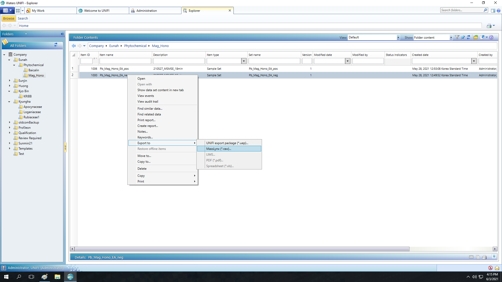
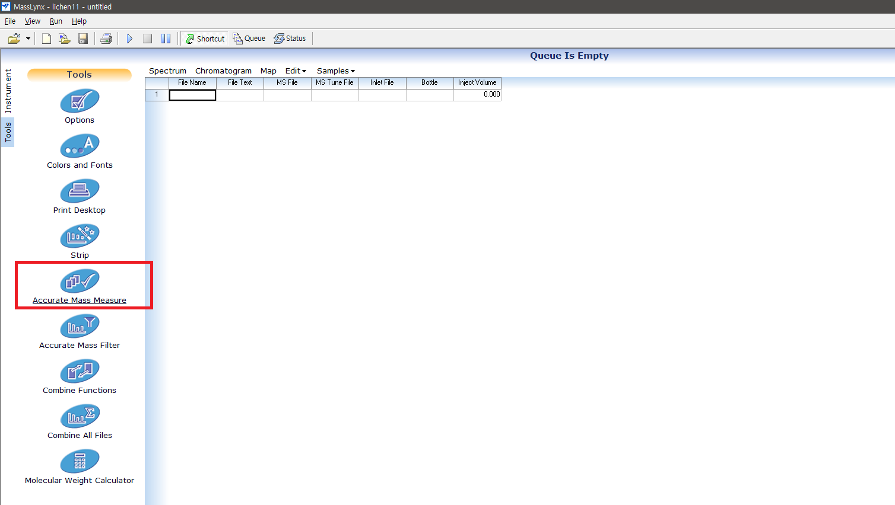
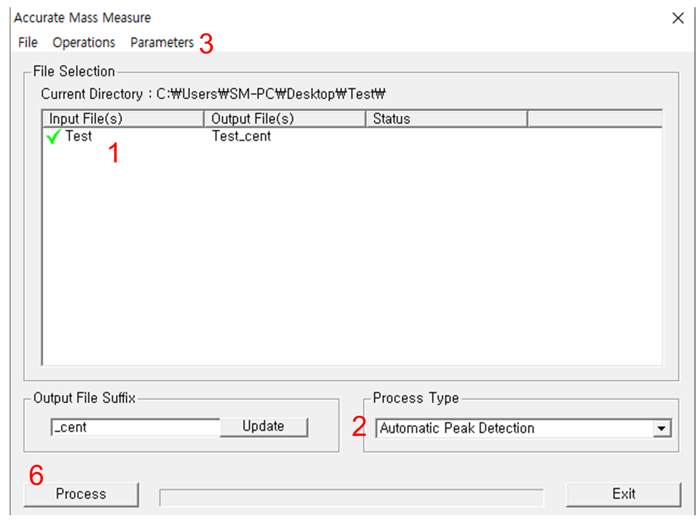
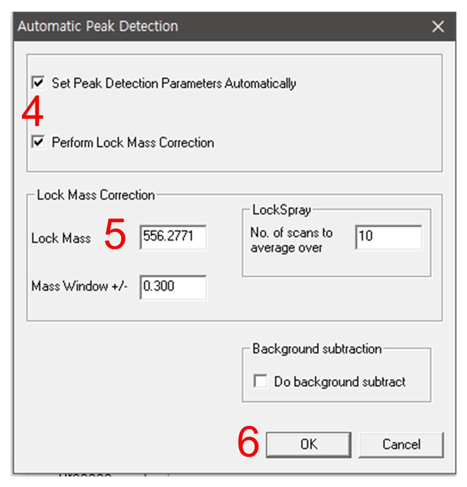

## 1. Introduction

This page describes how you can convert raw data from Waters machines.

One of the most frequent questions from Waters users is if they can use MSe data for molecular networking. 
Bascially, <b>MSe data is not available for classical molecular networking workflow</b>, because it is a type of data-independent acquisition method so does not include precursor ion information.
However, <b>MSe data can be deconvoluted</b> (currently MS-DIAL is the proper software for it) <b>and applied to the FBMN workflow</b>. You can find relevant information [here](https://ccms-ucsd.github.io/GNPSDocumentation/featurebasedmolecularnetworking-with-mzmine2/).

Currently, there are two different operating softwares for Waters machine, and they use entirely different file systems; thus, different data conversion pipelines are required.

If you are using Waters machines operated by UNIFI software, see 2. How to convert UNIFI data for molecular networking

If you have .Raw data files acquired by MassLynx software, see 3. How to convert Waters .Raw files to .mzML 

## 2. How to convert UNIFI data for molecular networking

UNIFI keeps spectral data in Oracle database architecture, so you cannot get your raw data by simple copy and paste.
Thus, as a first step of data conversion, you should export your data as MassLynx .Raw files. It can be done throught the file explorer, as shown below. Right-click on sample dataset will open the dropdown menu.

!!! info "Supported GNPS Workflow for Waters UNIFI Machines"
    There is a bug in the current version of UNIFI, so if you try to export DDA data as .Raw, precursor ion m/z values will disappear. Thus, as we know, the only option for building molecular networks with UNIFI-operated system is the MSDIAL-FBMN pipeline with MSe data. If anyone knows how to convert DDA data from UNIFI into mzML, let ue know.

If you open the exported .Raw files using MassLynx or other softwares, you will find that m/z values are weird. This happens, because Lockspray correction will not be applied to the exported .Raw files. Thus, Lockspray correction will be the next step of the conversion.

The Lockspray correstion can be done while you centroid your data, using MassLynx. UNIFI do not have any option for centroid mode acquisition, so your exported data will be continuum. You can perform both of centroiding and Lockspray correction via 'Accurate Mass Measure' module of MassLynx. You can find it here:

1. Select files by double-clicking, or Operations > Select. If you want to move to other directory, close the module window, and open any datafile in MassLynx. Then the working directory will be changed.

2. When files are selected, change the 'Process type' to 'Automatic Peak Detection'.

3. go to Parameters > Automatic Peak Detection Parameters, and select proper ion mode.

4. Check the both options 'Set Peak Detection Paramters Automatically' and "perform Lock Mass Correction' on.

5. Put a proper Lock Mass m/z value into the "Lock Mass" window. If you are using leucine enkephalin, 556.2771 for positive ion mode, and 554.2615 for negative ion mode.

6. Click 'OK' to close the parameter setting window, then click "Process".

Centroiding and Lock mass correction does not support multithreading, so this will take a long time. We recommend to run this on high-performanced workstations.

When the processing is finished, you are ready to apply the files into the FBMN with MS-DIAL workflow. You can find detailed guideline [here](https://ccms-ucsd.github.io/GNPSDocumentation/featurebasedmolecularnetworking-with-ms-dial/).

## 3. How to convert Waters .Raw files to .mzML

ProteoWizard msConvert has been updated several times, and the recent version resolved many problems known for Waters data conversion.

[Here](https://www.dropbox.com/s/lqrqrqjwc8ubj3k/GNPS_Vendor_Conversion.zip?dl=1) is an updated version (with Proteowizard Release 3.0.21120) of the double-click converter we provided in our [guideline](https://ccms-ucsd.github.io/GNPSDocumentation/fileconversion/). Convert files with 'Double-Click_To-Convert_waters.bat'.

There is a known issue on precursor ion m/z values when Waters .Raw data are converted to .mzML. The precursor ion fields of MS/MS scans will have m/z values of quadrupole isolation windows, instead of accurate mass values. Unfortunately, we do not have any solution for this issue. Thus, if you will use converted .mzML files directly for classical MN, remember that every m/z values are drifted from the original data.

If we will use the FBMN workflow, you can detour this issue by using .Raw files for MZmine processing, without converting them to .mzML files. However, the direct import of Waters .Raw into MZmine is not possible in MZmine ver 2.53 due to a bug; so try it with old releases.

## 4. Precursor m/z values drift problem
As mentioned before, m/z values of precursor ions in .mzML and .mzXML files can be different from the real value. The script that can actually fix this problem on .mzXML and .mzML files can be found [there](https://github.com/elnurgar/mzxml-precursor-corrector).

## Page Contributors

{{ git_page_authors }}
