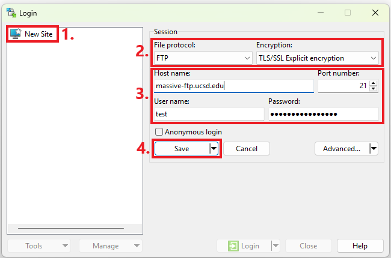
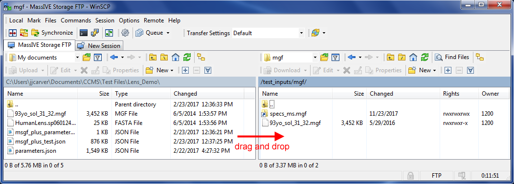
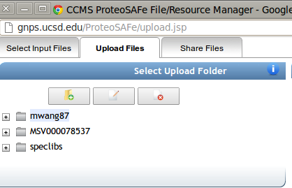
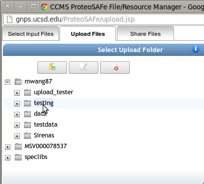
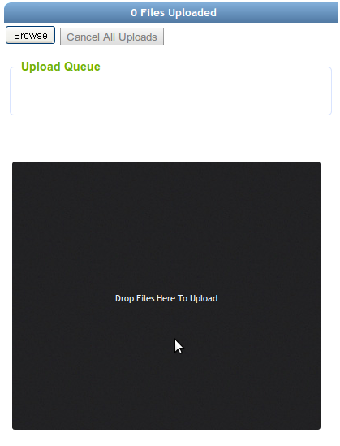

To upload files to GNPS for analysis, the preferred method is to use an FTP client. This provides a robust and batch manner to upload many files. The one big downside is that you have to have to install an FTP client if you don't already have one. We offer as an alternative an online browser drag and drop that is limited to small files.

If you are looking for making your dataset publicly available on MassIVe please check the [https://ccms-ucsd.github.io/GNPSDocumentation/datasets/](Create a Public Dataset) section

## FTP Batch File Uploads

To upload data, this requires you to have already created a GNPS account. If you have not yet done so please follow these [instructions](quickstart.md#create-a-gnps-account).

Once you have a GNPS  account, it is strongly recommended that you use FTP to upload your dataset files to your account, as opposed to the GNPS web interface. This is because the web-based upload interface is optimized for quick uploads of small files, whereas for the much larger files, FTP is much more stable and robust.

To connect to your GNPS user account via FTP, simply log on to the FTP server at massive.ucsd.edu, using the same username and password as your GNPS web account.

| GNPS FTP Server                   |
| ------------------------------------ |
| [massive.ucsd.edu](ftp://massive.ucsd.edu) |

!!! note
    On MacOS if you use Finder, make sure to connect with ```ftp://massive.ucsd.edu```

To do this, you will need to use your preferred FTP client program. There are many good free FTP clients, but a few of the more popular ones that have been tested with MassIVE include:

[WinSCP](https://winscp.net/eng/index.php) (recommended and used for the example illustrations below)  
[CoreFTP](http://www.coreftp.com/)  
[CoffeeCup Free FTP](http://www.coffeecup.com/free-ftp/)

!!! warning
    We no longer recommend FileZilla, since it was found to contain malware in a recent update.

Most FTP client programs use a similar interface. There is usually some sort of server or session management interface, allowing you to set up and store your connection information for a particular FTP server, and then re-connect to that server easily. For example, in WinSCP:



When setting up your FTP server connection, be sure to use plain FTP with no encryption. Then enter massive.ucsd.edu as the server or “host” name (port 21), followed by your GNPS username and password, and the client should connect you to your user file space.

From there, you can upload files by finding them on your computer (usually in the left panel) and then dragging them over to the server (usually in the right panel), or you can download files from the server to your computer by dragging them in the reverse direction.

You can also experiment with the FTP client interface to move and rename files and folders on the server, so as to reorganize your uploaded data in whatever manner you prefer.



**Important:**

In case you experience slow file upload speed on the massive/gnps side (not your own internet upload speed), you can increase the number of paralel uploads through your FTP client.
In WinSCP for exampel this can be doen by running uploads in background mode and increase the paralel uploads in the background preferences.


## Browser File Uploads

To upload files to GNPS using the browser, you can use our web drag and drop uploader.

!!! note
    This browser upload is limited to 20 MB for each size

This is not the recommended manner to upload files, but if you're in a hurry, we can't fault you.

Located under the upload tab



To select the folder to upload files into, click on a single folder in the file structure tree.



Now drag and drop your files into the Drag and Drop area to upload.




## Page Contributors

{{ git_page_authors }}
