# GC-MS data processing with MZmine

Below, we describe briefly how to perform processing GC-MS data. To do that, the following steps are required:

1. The detection of masses from the .mzML files to build extracted ion chromatograms

2. The detection of features/peaks from the built chromatograms

3. The spectral deconvolution can be done with one of the following algorithms:

   ​	- Hierarchical Clustering

   ​	- Multivariate Curve Resolution

5. The alignment of the peaklists

6. The missing peaks search

7. Exporting the files for GNPS

8. Uploading the files to GNPS and run a the GC-MS workflow

For detailed instructions and more information about parameters used in the steps 1/2/4, see the section of pre-processing LC-MS data, and for the step 3, see the section pre-processing GC-MS data available in [ADAP user manual](https://mzmine.github.io/ADAP_user_manual.pdf). At each step, click on "Help" to see how to fell out the parameters correctly. 

Before starting, it is recommended to convert the files to .mzML format, but note that MZmine can also accept .netCDF and several proprietary vendor format. 

### Conversion to mzML with MSConvert
The GC-MS data is in the profile mode, then it has to be centroided. To convert and centroid data, please see our[ conversion guide](https://ccms-ucsd.github.io/GNPSDocumentation/fileconversion/). 

### Installation of MZmine

Download the latest version of [MZmine](https://mzmine.github.io/documentation.html). Once you have your .mzML files and MZmine opened, **import your raw data files** into a project by following “Raw data methods / raw data import” and select your files. Your .mzML files are now in the “Raw data” window. 

**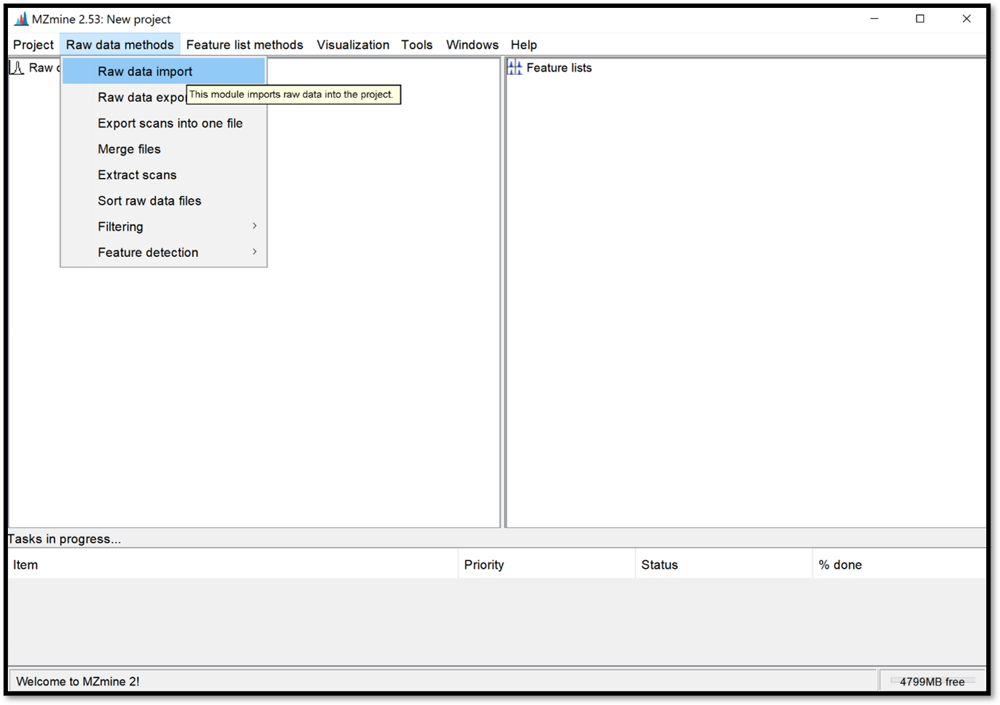**

**Save** your current project by clicking on “Project / Save project as”. It is important to save your project regularly and for future access to the processing results. 

**Reproducibility with the batch mode** After having optimised the parameters in the GUI, it is strongly recommended to consolidate the parameters used for MZmine processing in a batch file (batch mode). This will ensure reproducibility of your analysis. 

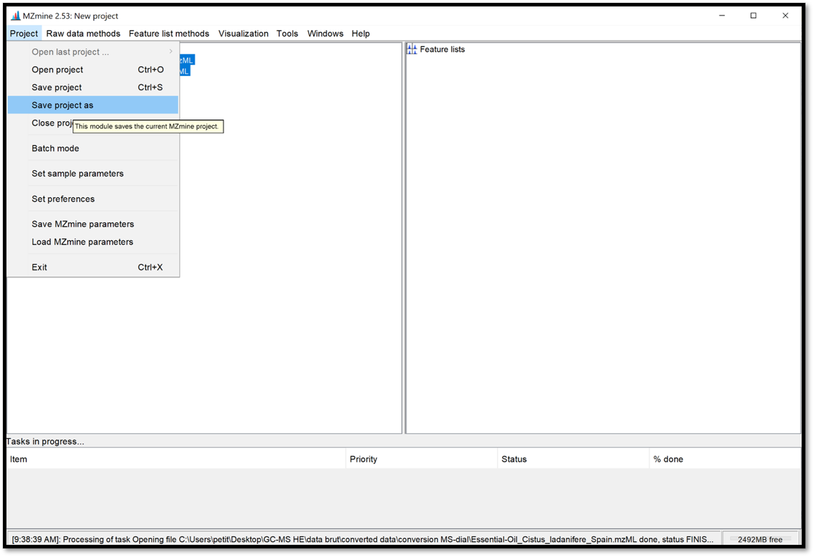

### Detection of masses

The **masses detection** is going to detect individual ions in each scan and to generate a mass list of each scan. Select your .mzML files of interest on the “Raw data” window, then go to “Raw data methods / Feature detection / Mass detection” and set a *Noise level* as shown in the following picture. Make sure your threshold is not too high by clicking on “Show preview”. Then click “ok” to process. 

**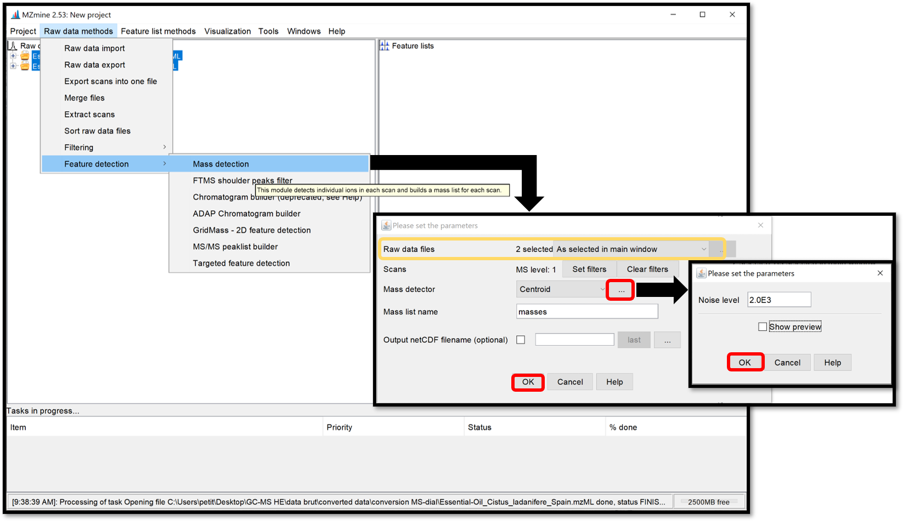**

### Detection of peaks

Open the **ADAP chromatogram builder** window by following “Raw data methods / Feature detection / ADAP Chromatogram builder”. This module is going to connect data points from the previously created mass lists of each scan and generate an extracted ion chromatograms. Set the parameters accordingly to the instrument used. Click “Help” at the bottom of the pop-up window, or go on each parameter to see the details and how to set the parameters properly. When it is finished, click “OK”.

**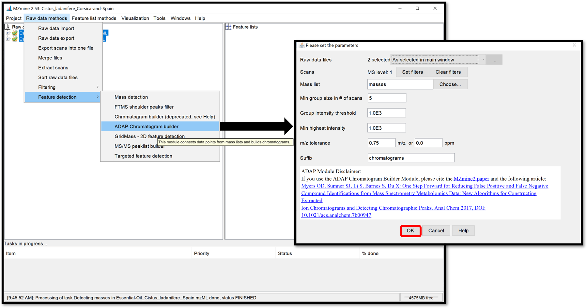**

### Chromatogram/Peak deconvolution

The **chromatogram deconvolution** consists of the detection and the separation of individual peaks in each chromatogram. After selecting your previously generated chromatograms in the “Feature lists” window, open the parameter window by following “Feature list methods / Feature detection / Chromatogram deconvolution”, then select *Wavelets (ADAP)* for the “Algorithm”. 

**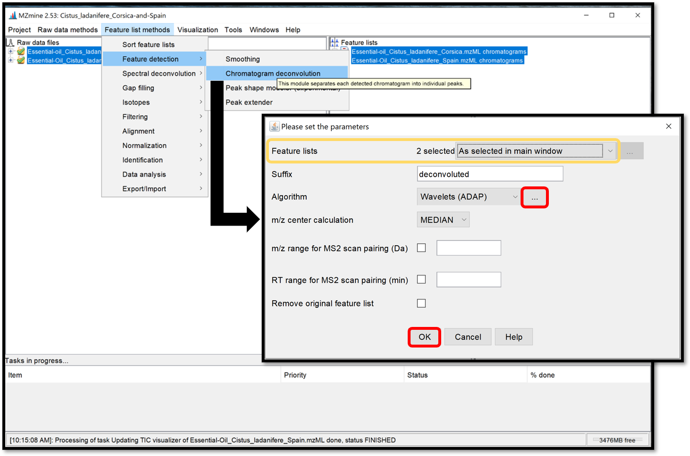**

Then, by clicking on the ellipse, a parameter window opens. Choose *Wavelet Coeff. SN* and set the parameters accordingly to the instrument used and previous parameters used to generate chromatograms.  The *RT wavelet range* parameter is chosen by looking at the peak-detection results when clicking on “Show preview”. By trying several different values, see when the picks-detection (colored picks) is optimal in some *Chromatogram* for each *Feature list*. Then click on the “ok” button. This step of peak-detection could take a while. 

**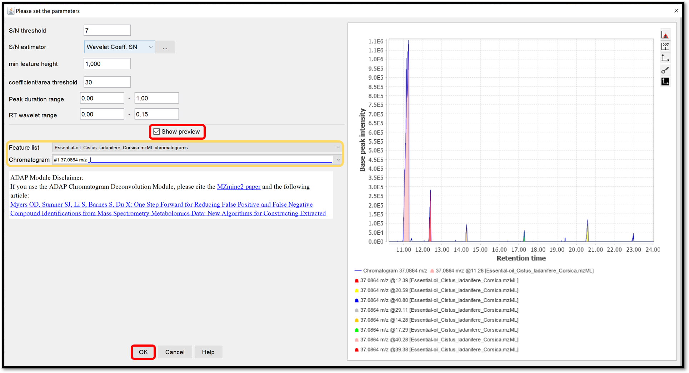**

### Spectral deconvolution

During the **spectral deconvolution**, similar peaks are combined and then, a pseudo fragmentation spectrum is built (also called deconvoluted spectrum), using peaks intensities. Two spectral deconvolution algorithms are available: **Hierarchical Clustering** and **Multivariate Curve Resolution**. 

​		The **Hierarchical Clustering** is fast but requires users to specify multiple parameters. It can be run by following “Feature list methods / Spectral deconvolution / Hierarchical Clustering” when your previously generated chromatograms deconvoluted are selected. Check the box “Show preview” to preview the first clustering parameters (top right) and peaks that passed the filter with the second clustering parameters (bottom right), by selecting *Cluster list* from your *Feature list*. The first parameters *Min cluster distance* / *Min cluster size* / *Min cluster intensity* refer to the ability to combine peaks based on the proximity of their retention times. The filtering parameters are *Find shared peaks* / *Min edge-to-height ratio* / *Min delta-to-height ratio* / *Min sharpness* / *Exclude m/z values*. The last parameter *Shape-similarity tolerance (0..90)*, involved in the second clustering step, refines the clusters by calculating the similarity of the peak’s shapes. Finally, the module “Model based on” allows us to take the highest *Sharpness* or *M/Z value* passed peaks to propose as a model peak. When each parameter are set properly, process the spectral deconvolution by clicking on “OK”.

**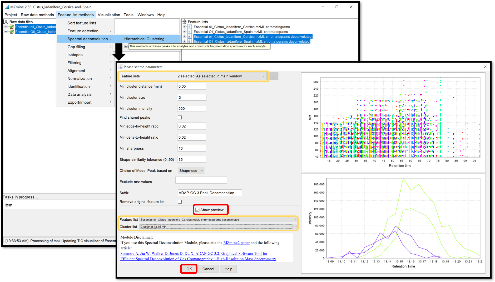**

​		The **Multivariate Curve Resolution** is slower but only a few parameters are used. Its model peaks that can have arbitrary shapes. Open the parameters window by following “Feature list methods / Spectral deconvolution / Multivariate Curve Resolution”. Because of the spectral deconvolution uses “Chromatograms” and detected “Peaks” previously generated, the user must select them using the “Specific feature lists” option for both, then click on the ellipsis button and check the boxes of the chromatograms and peaks list of interest, or using the “Feature list name pattern” option. After those parameters are set, click “Ok”.

**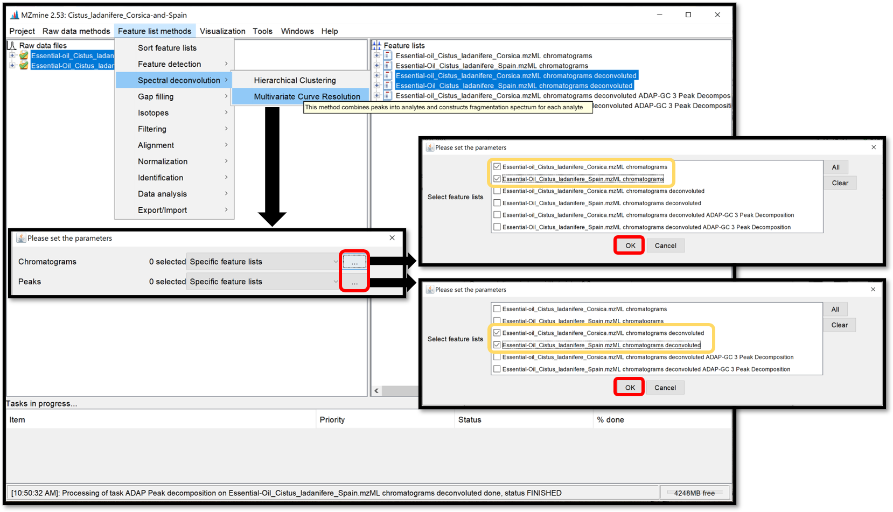**

When the selection is finished, crossing “Show preview” allows to see the influence of the parameters on the *Clusters* for each *Feature list*. Look at the preview plot (top right) for the *Deconvolution window tolerance width* parameter and the model peaks (right bottom) for *Retention time tolerance* and *Minimum Number of Peaks* parameters. Process the spectral deconvolution with the “Ok” button.

**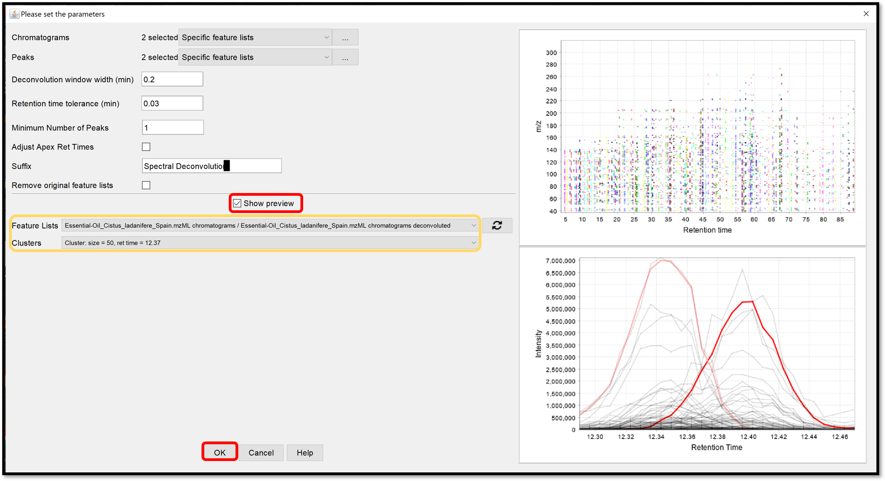**

### Alignment of the peak lists accross multiple samples

The **ADAP alignment** module calculates the similarity between fragmentation mass spectra to find the best alignment. When the previously generated spectral deconvolution lists are selected, set the alignment parameters in the window which opens when following “Feature list method / Alignment / ADAP Aligner (GC)”. Click “Ok”, then the aligned feature list appears in the “Feature lists” window. 

**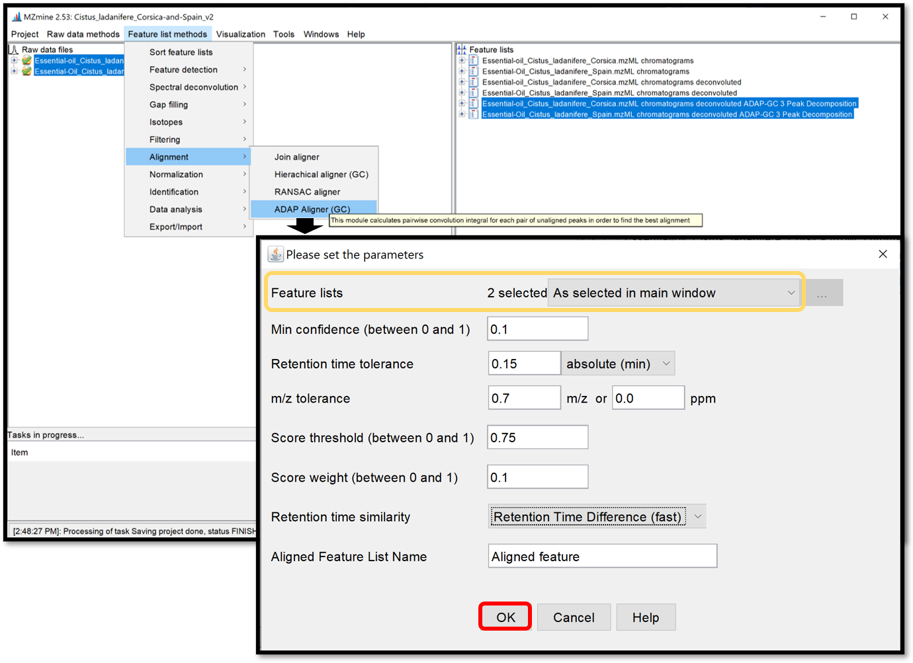**

### Missing peaks search

Finally, a module named “**Peak finder** (multithreaded)”, available in “Feature list methods / Gap filling / Peak finder (multithreaded)” is used to search and find missing peaks in the feature list previously generated from the peaks in the raw data. Select your aligned feature list, then apply peak finder parameters by clicking “Ok”.

****

Open the generated aligned table by double-clicking on it. Taking a look at this table can help to define if the used parameters are good enough. This table can, not only be ordered by the *ID*, giving information about the number of detected features, but also by the *m/z* or the *RT*.

**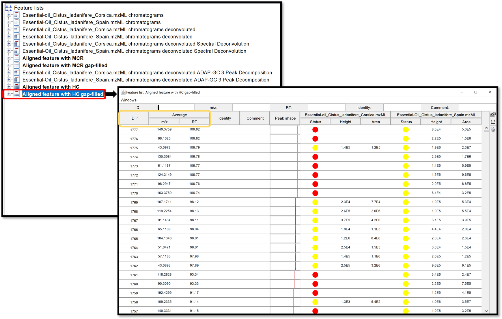**

### Export results 

A new module (introduced in MZmine 2.52) allows to export the GC-MS data processing results (feature quantification table as .CSV and a spectral summary file as .MGF) into the correct input format for the GNPS GC-MS library search workflow. The **export** module is available at “Feature list methods / Export / Import / Export to GNPS-GC-MS (with ADAP)”. In the open window, complete the *filename* and press “Ok”.

**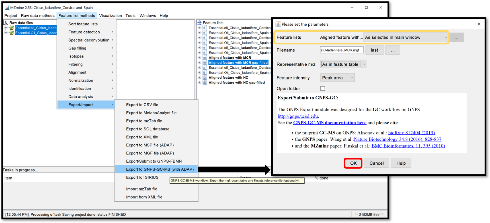**

The exported files are the .MGF file containing the deconvolved EI spectra and the .CSV feature quantification table. Those exported .MGF file and .CSV feature table can be used for the GNPS library search/molecular networking workflow directly, without any modifications. They need to be provided as input files by adding to the: “Deconvolved EI Spectra MGF File” and “Feature Quantification Table” correspondingly.

**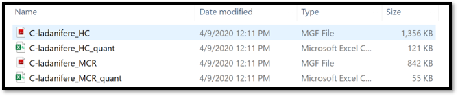**

### Uploading the files to GNPS and run a the GC-MS workflow
Please refer to the following page for more information on the [GC-GNPS workflow](gc-ms-library-molecular-network.md).

### Kovats RI marker file in MZmine
MZmine (version 2.52 and later) also offers the extraction of Kovats RI markers into the GNPS GC-MS file format.

See [tutorial video](https://youtu.be/XodHMJcuwnk) on Kovats RI marker file creation within MZmine.

## Citation

Jiang  W,  Qiu  Y,  Ni  Y,  Su  M,  Jia  W,  Du  X: [An  automated  data  analysis  pipeline  for GC-TOF-MS metabonomics studies.](https://pubs.acs.org/doi/abs/10.1021/pr1007703) J Proteome Res 2010, 9(11):5974-5981.

Ni Y, Qiu Y, Jiang W, Suttlemyre K, Su M, Zhang W, Jia W, Du X: [ADAP-GC 2.0:  deconvolution of coeluting metabolites from GC/TOF-MS data for metabolomics studies.](https://pubs.acs.org/doi/abs/10.1021/ac300898h) Anal Chem 2012, 84(15):6619-6629.

Ni Y, Su M, Qiu Y, Jia W, Du X: [ADAP-GC 3.0: Improved Peak Detection and De-convolution of Co-eluting Metabolites from GC/TOF-MS Data for Metabolomics Studies.](https://pubs.acs.org/doi/abs/10.1021/acs.analchem.6b02222) Anal Chem 2016, 88(17):8802-8811.

## Page contributors

Melissa Nothias-Esposito (UCSD), Louis Felix Nothias (UCSD), Aleksandr Smirnov (UNC Charlotte), Alexander Aksenov (UCSD)
