# GC-MS data processing with MS-DIAL

To convert the Vendor specific files, go [here](http://proteowizard.sourceforge.net/download.html) to download and use msConvert or the default GNPS File converter on [GNPS-quickstart](https://gnps-quickstart.ucsd.edu/conversion) (drag and drop).  

Browse the RAW files from Vendor into msConvert interface. Typically .mzML output format is chosen with binary code precision of 64 bit for high resolution spectra. Uncheck the “Use zlib compression” option and select msLevel 1. Also, .mzML format is amenable to MS-DIAL analysis. The msConvert window looks like:  

**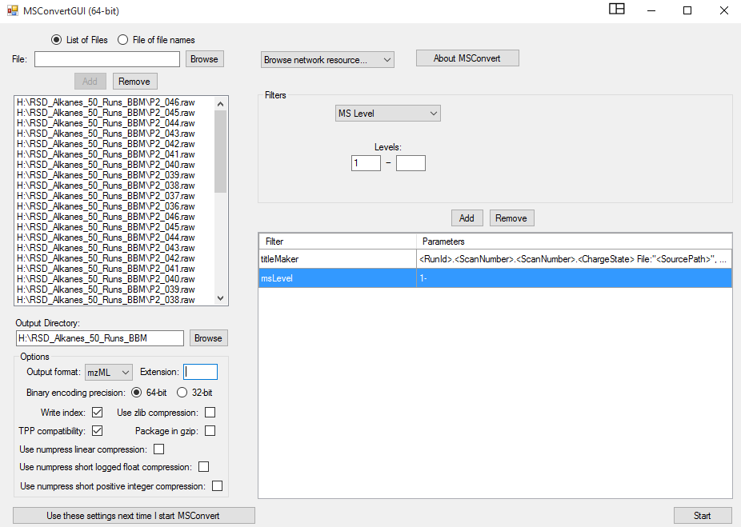**

Download the most updated version of [MS-DIAL](https://www.ncbi.nlm.nih.gov/pmc/articles/PMC4449330/) from RIKEN PRIMe site. MS-DIAL has an extensive tutorial  for step-by-step guidance [here](https://mtbinfo-team.github.io/mtbinfo.github.io/MS-DIAL/tutorial.html). Open MS-DIAL by clicking on the icon or shortcut.  

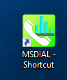

In the MS-DIAL software interface pops up, import your file by clicking on “File” option. As highlighted for the GC-EI-MS data, choose “Hard ionization” and then choose “Centroid” or “Profile” based on your mass-spec vendor data. You may add other information under the “Advanced” tag for more meta data.  

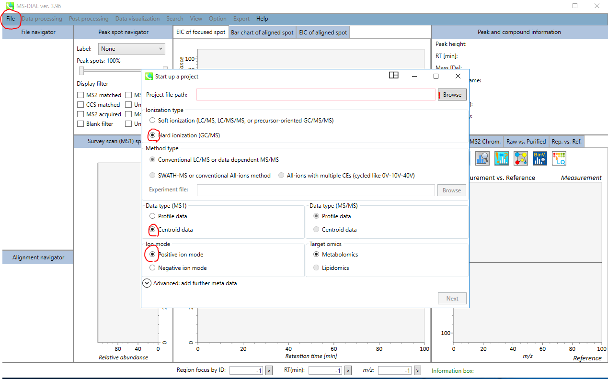

In this window, click on “Browse” to open the folders where the converted .mzML files are stored. The project file path and where the converted files need to sit have to be identical, and assigns a project ID with .mtd suffix.

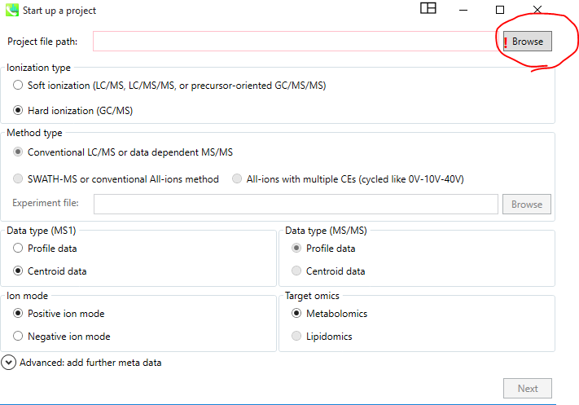

Hit “Next” to go to the next page.

On the next page, click “Browse” and choose the files that you need to analyze.

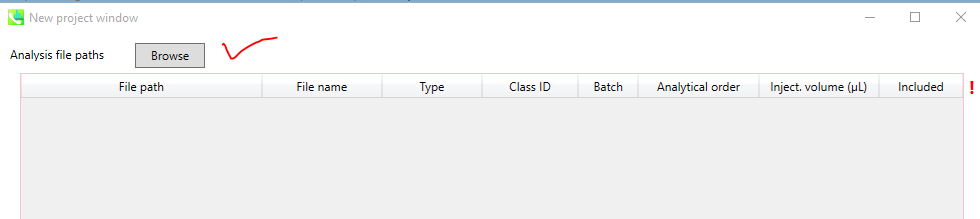

In this window, the user needs to associate correct File names with their types (standard, samples, QC, Blank etc...), and assign them a Class ID. Any analytical order information, various batches or different injection volume can be set if needed.  

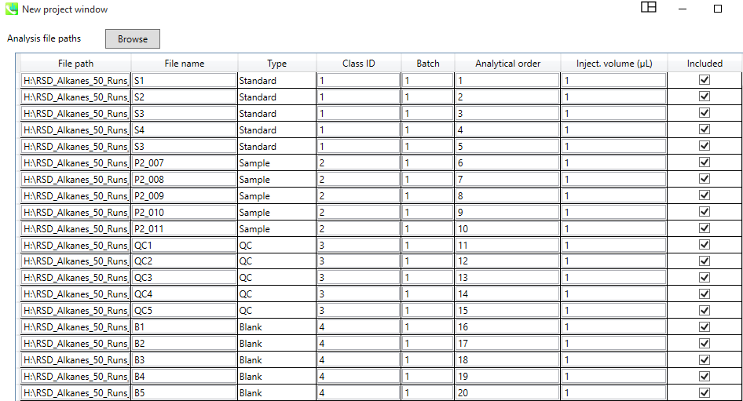

Then, hit next. In the new window, provide “**Data collection**” information such as *mass range begin* and *end*, depending on your data, *Retention time* (min), and *Number of threads* which could be left at the default value of 1.

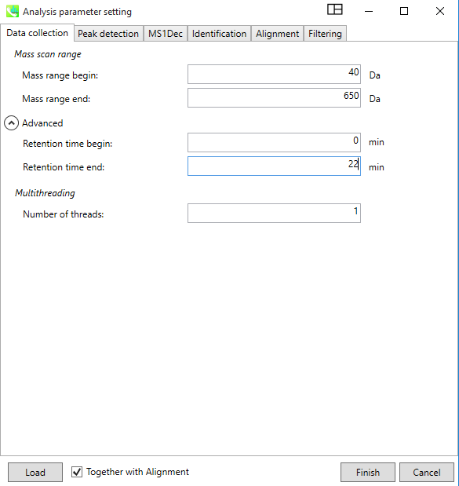

In the “**Peak Detection**” Window, provide the *Minimum peak height* information, which is typically 10,000 or higher for high resolution instruments like QEGC-Orbitrap-MS. For *accurate mass*, the box must be check, and provide same values for the *Mass slice width* and *Mass accuracy*. "Advanced" option can be left as default.

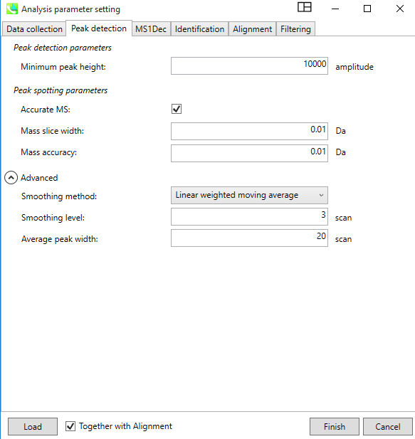

In the “**MS1Dec**” tab, the "Deconvolution parameters" can be set as shown in the picture. 

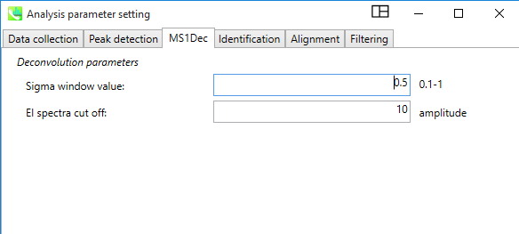

The “**Identification**” tab should not be completed as the library search is performed on GNPS. 

Click on the “**Alignment**” tab, a default “Result name” is given to the alignment table, but the user can change it. Alignment can be based on *RI* or *RT*. An additional *EI similarity tolerance* can be set during alignment as well. The advanced parameters can be optionally changed.

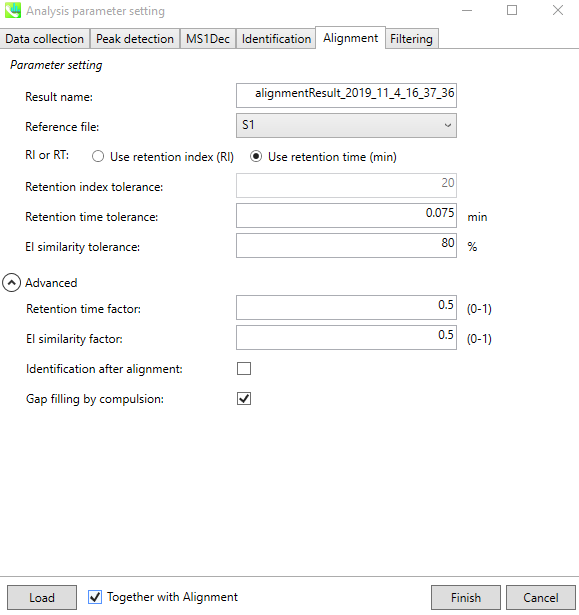

The last tab named “**Filtering**”, allows the user to set certain filters depending on the question in hand or ignore it. Once all Tabs are filled with user specific/default options, the user can click “Finish” to start the process. 

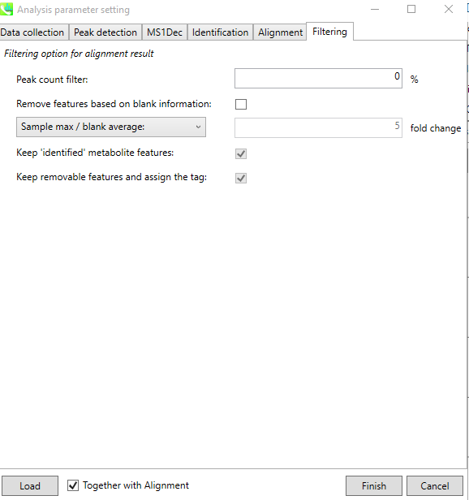

A successfully finished job window on MS-DIAL looks like:  

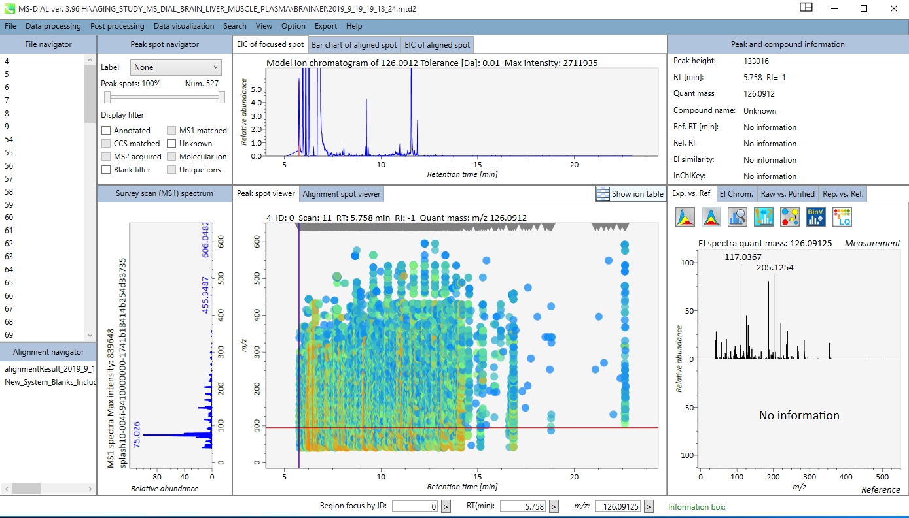

By clicking on the “Alignment navigator” panel (bottom left) on the specific alignment result file, user can see the generated alignment table. This table can be sorted by *ID*, *RT*, *RI*, *Quant mass*, *S/N*, and other statistical values, and/or filtered by *Metabolite name*, *m/z range*, or *RT range*. 

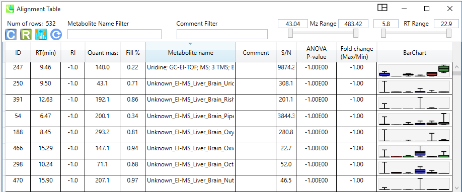

To export the generated tables, click on the “Export” tab, and chose “**Alignment Result export**”. In the Alignment window, chose a "Directory" to save the results, and select the correct “file” corresponding to your aligned table. The user should check *Raw data matrix* (Height and Area), *Normalized data matrix*, *Representative spectra*, *Parameters*, *Peak ID matrix*, *Retention time matrix*, *m/z matrix*, and *S/N matrix export* boxes. Spectra-type should be selected to ‘centroid’ and as “.mgf” format for the downstream GNPS analysis workflows. Then, the user can click “Export”. 

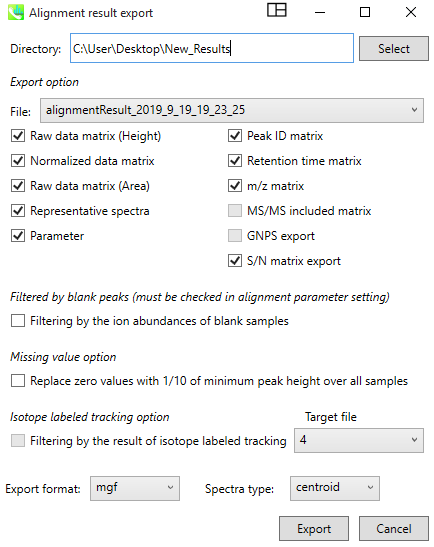

Finally, use your MS-DIAL generated .mgf and your Area.text table to lunch a GC-MS Spectral Library Search job on GNPS [here](https://gnps.ucsd.edu/ProteoSAFe/index.jsp?params=%7B%22workflow%22:%22MOLECULAR-LIBRARYSEARCH-GC%22%7D).

  

## Page contributors
Biswapriya Biswavas Misra (Wake Forest University), Melissa Nothias-Esposito (UCSD)
