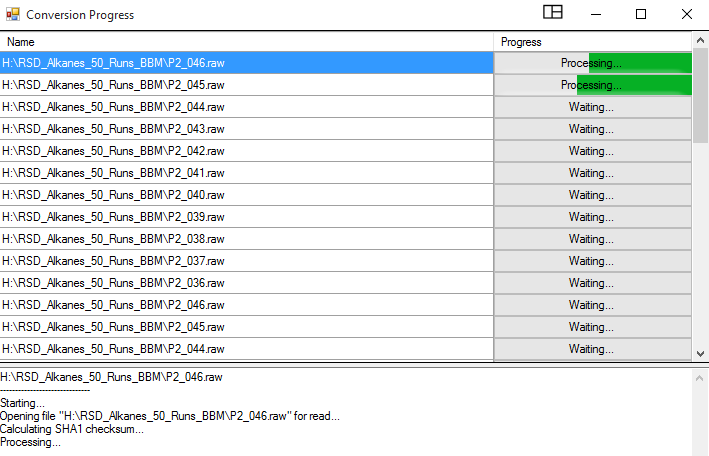
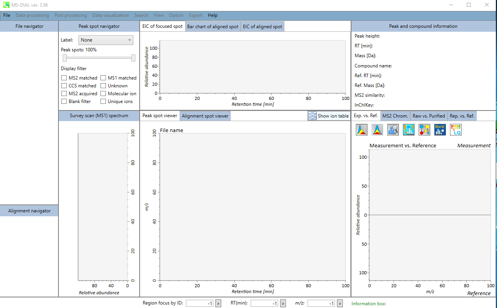

# GC-MS data processing with MS-DIAL

To convert the Vendor specific files, go [here](http://proteowizard.sourceforge.net/download.html) to download and use msConvert or the default GNPS File converter on [GNPS-quickstart](https://gnps-quickstart.ucsd.edu/conversion) (drag and drop).  

Browse the RAW files from Vendor into msConvert interface. Typically .mzML output format is chosen with binary code precision of 64 bit for high resolution spectra. Uncheck the “Use zlib compression” option and select msLevel 1. Also, .mzML format is amenable to MS-DIAL analysis. The msConvert window looks like:  

****

Conversion Process starts and the progress can be monitored.

****

Download the most updated version of [MS-DIAL](https://www.ncbi.nlm.nih.gov/pmc/articles/PMC4449330/) from RIKEN PRIMe site. MS-DIAL has an extensive tutorial  for step-by-step guidance [here](https://mtbinfo-team.github.io/mtbinfo.github.io/MS-DIAL/tutorial.html). Open MS-DIAL by clicking on the icon or shortcut.  

The MS-DIAL software interface pops up: 

Click on “File” option and this window opens. As highlighted for the GC-EI-MS data, choose “Hard ionization” and then choose “Centroid” or “Profile” based on your mass-spec vendor data. You may add other information under the “Advanced” tag for more meta data.  

In this window, using “Browse” go to the folders where the converted .mzML files are stored. Note: The project file path and where the converted files need to sit have to be identical.

Looks like (and assigns a project ID with .mtd suffix) and the name is editable.  

 Hit “Next” to go to the next page.

Click “Browse” on this window and choose the files that you need to analyze.

In this window, the user needs to assign/ choose correct File names, and choose their types, i.e., standard, samples, QC, Blank etc. and assign them a Class ID, and also if they were analyzed over various batches; any analytical order information, or if different injection volume. It looks:  

The hit next and in the new window, provide “Data collection” information such as mass range start and end, i.e., 40-650 Da or whatever the user has used. Same with Retention time (min) and Threads by default can be left at 1.

In the “Peak Detection” Window Provide the Minimum peak height information, which is typically 10,000 or higher for high resolution instruments like QEGC-Orbitrap-MS. For accurate mass or EI data uses must “check” the box and provide same values for the mass slice width and mass accuracy. Rest all can be left default.

In the Deconvolution “MS1Dec” the following parameters can be used:

In the “Identification” tab one can choose either “RI” or “RT”. Depending on that either one can just leave it for RT alignment (minutes) and no files need to be supplemented. However, for RI, one can choose either Alkanes or FAMEs. See the MS-DIAL instructional manual for setting up the FAME and n-Alkane retention time files. 

Depending on either FAMEs or Alkanes the user must supply a .txt file of the n-Alkane and FAME standard retention times corresponding to their Carbon numbers.

For example, a .txt file containing the FAME retention time can be generated like this:

A n-alkane series of RT standards containing .csv file looks like:

In the same window, the user needs to provide a “.msp” formatted spectral library file for compound/ metabolite identification. A RI and RT tolerance can be set, alongside m/z tolerance window, and EI similarity and identification score cut-offs based on user preferences and the dataset in hand.

In the same window, the users can specify if they want to use the retention time information for scoring and/ filtering; and whether to use the quant masses defined in the .msp (library) file for quantification purposes. The .msp library can be built from scratch using open source public spectral libraries as described [here](https://www.protocols.io/view/steps-for-building-an-open-source-ei-ms-mass-spect-8txhwpn) or the users can develop and generate their own in house libraries using authentic standards. 

In the “Alignment” tab, a default “Result name” is given to the alignment file; and the user can change it. User has the option to change the reference file to a pooled QC or a single Control sample if they wish to. Alignment can be based on RI or RT. An additional EI similarity tolerance can be set during alignment as well. This can be more stringent than the compound identification EI similarity scores. The advanced parameters can be left as such or customized as per the user needs. 

In the “Filtering” tab, the user can specify and set certain filters depending on the question in hand or ignore it as well. Once all Tabs are filled with user specific/ default options, the user can click “Finish” to start the process. 

A successfully submitted job looks like:  

A successfully finished job window on MS-DIAL looks like:  

Clicking on the “Alignment navigator” panel on the specific “alignment result” file will generate an Alignment Table. The Alignment Table can be “sorted” for ID, RT, RI, Quant mass, S/N, and other statistical values. And the Table can be filtered for Metabolite Name or m/z range or RT ranges. 

Once in the results window, the user can click on “Data visualization” and choose from Normalization, Principal Component Analysis, Partial Least Squares, Molecular Spectrum Networking and pathway Analysis. 

Before proceeding for any “quantitative metabolomics” data analysis, it is highly recommended to perform data “normalization” at the least. The tool allows, either to skip normalization, or do it on the basis of Internal Standard, LOWESS, TIC or mTIC. 

In the “View” window:

<!---  --->
_Missing Image_

The user can take a look at the TICs, EIC, BPC, and / retention time correction window. 

For results, the user needs to go to the “Export” tab. In this tab the user can just obtained the ‘Peak List’, or the entire ‘Alignment Results’ or proceed to export for Molecular spectrum networking. Other functionalities include copying the screenshot of the current view, exporting the run Parameters, as well as exporting the normalization results.

<!------>
_Missing Image_

In the “Export tab, the users may choose “Alignment Result” in the following window:  

In the Alignment window, the user gets to choose a Directory (and Folder) to save the results, and then choose the correct “Alignment file”, and select to export, the raw data, normalized data, raw data (Area), representative spectra, parameters used for the analysis, peak ID matrix, retention time matrix, m/z matric, GNPS export, S/N export among others. The export format can me .mgf, .msp, or .txt among others. Spectra-type should be selected to ‘centroid’ and as “.mgf” format for the downstream GNPS analysis workflows. Once the required boxes are checked, the user can click “Export” and the results are saved in the selected folder in the said directory via the specified path. The results folder saves all the files in the said formats:

Specifically for any given “Unknown spectrum”, the user can clock on the GNPS icon right above the spectrum, to initiative a Molecular-spectrum networking job as shown.

Depending on the spectrum in the hand, the molecular network would look like this:

The parameters for Molecular-spectrum networking can be changed accordingly. Hitting a “Run” with start the process.   

## Page contributors
Biswapriya Biswavas Misra (Wake Forest University).
