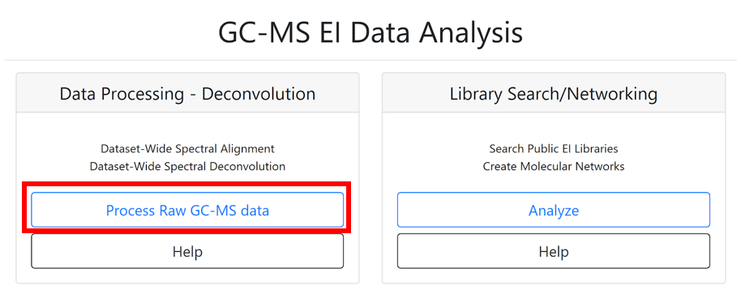
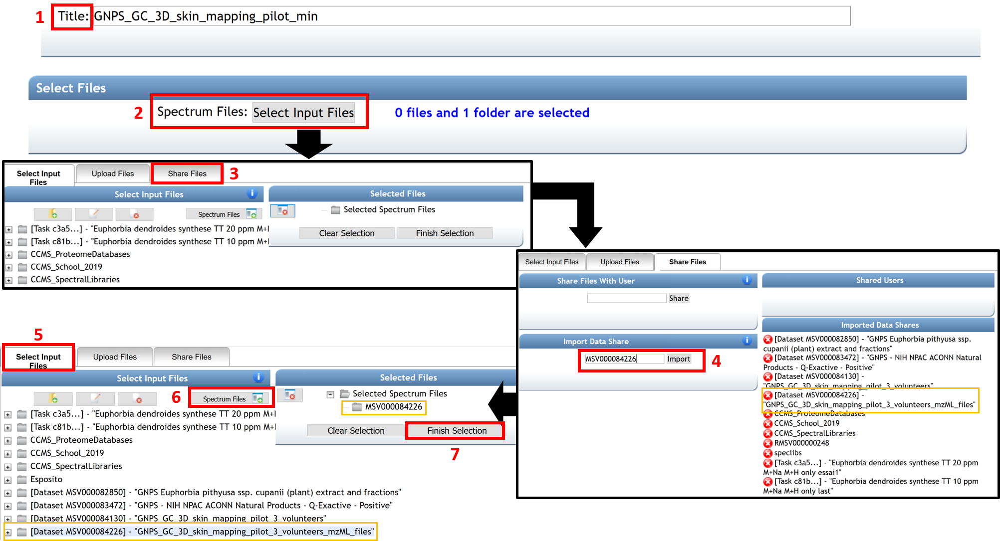
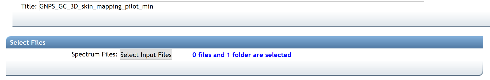
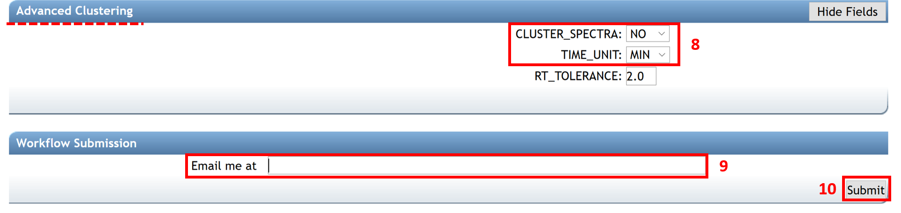
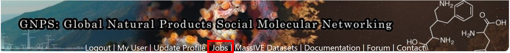
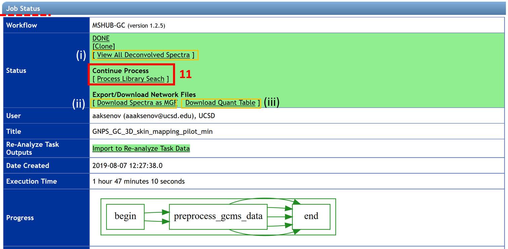
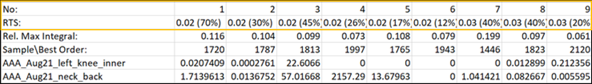
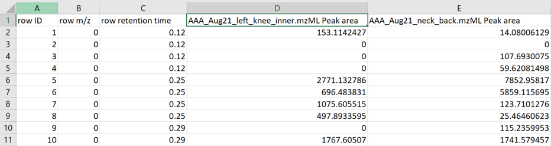

# GC-MS Deconvolution for GNPS

The GC-MS data have to be processed before performing the **spectral library search and molecular networking workflow**. [See more information here](gc-ms-library-molecular-network.md). Below, we describe how to use the GC-MS deconvolution workflow on GNPS that uses MS-Hub. Alternatively, [ADAP-MZmine](gc-ms-data-processing-MZmine2.md) or [MS-DIAL](gc-ms-data_processing_MS-DIAL.md) can be used.

## GC-MS Deconvolution Workflow on GNPS with MS-Hub

### Configure the Workflow
Log in to GNPS ([gnps.ucsd.edu](https://gnps.ucsd.edu/ProteoSAFe/static/gnps-splash.jsp)). If an account has to be created first, refer to GNPS documentation at the [quickstart](https://ccms-ucsd.github.io/GNPSDocumentation/quickstart/) banner. Before starting, files from GC-MS analysis must be converted from proprietary vendor formats to .mzML, or .CDF file formats. To convert, please see our [conversion guide](https://ccms-ucsd.github.io/GNPSDocumentation/fileconversion/). 

The GNPS home page includes two sections to launch GNPS GC-MS data analysis job, one for data processing - deconvolution and one for GC-MS library search/networking. By clicking on the **“Process Raw GC-MS data” icon**, a job page opens.

(1) Start by entering the title of your job. 

(2) The **“Select Files” section** allows importing existing or previously uploaded dataset(s) from MassIVE. Select the files that need to be processed by clicking on “Select Input Files”. A pop-up window appears with three tabs: “Select Input Files”, “Upload Files”, and “Share Files”. To upload files to GNPS using the browser (limited to 20MB), you can use our web drag and drop uploader in the “Upload Files” banner. See the documentation [here](https://ccms-ucsd.github.io/GNPSDocumentation/fileupload/) for more information. 

(3) Readers following the tutorial can go to the “Share Files” tab, enter the MassIVE accession number for the dataset (e.g. [MSV000084226](https://gnps.ucsd.edu/ProteoSAFe/result.jsp?task=671cd79ac3af4c4493e4025d62d161e1&view=advanced_view)) in the “Import Data Share” box.

(4) Then click on “Import”. 

(5) This specific dataset is now available directly in your GNPS user workspace at the “Select Input Files” section. 

(6) Select the input file, who appears highlighted in blue color, and click on “Spectrum files”. 

(7) When the selected files are visible in the “Selected Spectrum Files” box, click on the “Finish Selection” button.

**NOTE:** 

- All of the data used for the job must be collected using the same GC protocol (temperature program, column, injection mode). Multiple datasets could be combined as long as the data have been collected using the same protocol. 
- When creating a dataset on MassIVE ([massive.ucsd.edu](https://massive.ucsd.edu/ProteoSAFe/static/massive.jsp)), include “GNPS” and “GC” in the name (As GNPS_GC_Name of the GNPS-MassIVE dataset). See the documentation about [Dataset Creation/Sharing](https://ccms-ucsd.github.io/GNPSDocumentation/datasets/) and an example of a MassIVE dataset [MSV000084226](https://gnps.ucsd.edu/ProteoSAFe/result.jsp?task=671cd79ac3af4c4493e4025d62d161e1&view=advanced_view) for more information.
- An insufficient volume of data causes unstable deconvolution resulting in spurious low-quality spectra. It is recommended for datasets smaller than ~10 files to use alternative deconvolution solutions such as MZMine2/ADAP, MS-Dial or XCMS. Increasing the number of files, for example, could be done by co-analyzing multiple datasets obtained with the same experimental protocol. 
- MSHub generates the parameter that is termed “balance score”. The balance score quantifies reproducibility of the deconvoluted fragmentation patterns across the data (when it is high, the deconvoluted spectrum is consistent across different samples). The balance score also gives insight into how well the spectral feature is explained by the available data - a complete, fully characterized fragmentation pattern of a real compound would be the same in different measurements, while noisy spectra with missing or chimeric peaks would change randomly across files, resulting in a low balance score. The balance score is independent of the number of files in the dataset, and even when a compound is present in only a few samples in the dataset, as long as the spectral patterns, irrespective of compound abundances, are conserved across samples (e.g. not missing peaks or contaminated by spurious noise peaks), it would result in a high balance score.

(8) In the **“Advanced Clustering” section**, the cluster spectra have to be turned off (CLUSTER_SPECTRA = NO). The TIME_UNIT must be set as minutes or seconds, depending on the chromatography time units of your data (typically the default time units are seconds in NetCDF files and minutes in .mzML files). 

(9) Enter your email address.

(10) Finish by clicking “Submit”.

### Inspect the Results

When the job has been completed, you will receive a notification email and the status “DONE” appears on your GNPS job. All submitted jobs appear under the “jobs” link from the GNPS main menu. 

By selecting the job of interest and clicking on the “Done” button, the **“Job Status” window** opens with different options:

(i) Explore deconvolution results with the “View All Deconvolved Spectra” option.

(ii) Download/export quantification results and feature table by clicking on “Download Spectra as MGF”, “Download Feature Table” (MZmine formatted), "Download MSHub Data Integral Table", or "Download MSHub Spectra Data".

(iii) Continue the process with the “Search Spectral Library and Molecular Network” tool to conduct a library search and create a molecular network.

The first line of the MSHub data integral table indicates the retention time (in min.) with a balance score in parenthesis (in percentage). The “Rel. Max Integral” and “Sample\Best order” values relate to the relative proportion of each peak in the data and the ranking of the feature in terms of its size, correspondingly.

The feature table is formatted as a MZmine table output. 

## GC-MS data processing with ADAP-MZmine
Deconvolution of GC-EI-MS data can be performed within MZmine. User can follow the ADAP step-by-step documentation [here](gc-ms-data-processing-MZmine2.md) or refer to the [ADAP manual](https://mzmine.github.io/documentation.html) on the MZmine website for detailed instructions.

### Kovats RI marker file in MZmine
MZmine (version 2.52 and later) also offers the extraction of Kovats RI markers into the GNPS GC-MS file format for this particular input.

See [tutorial video](https://youtu.be/XodHMJcuwnk) on Kovats RI marker file creation within MZmine.

## GC-MS data processing with MS-DIAL

Deconvolution of GC-EI-MS data can be performed within MS-DIAL. User can follow the step-by-step documentation [here](gc-ms-data_processing_MS-DIAL.md) or refer to the [MS-DIAL documentation](https://mtbinfo-team.github.io/mtbinfo.github.io/MS-DIAL/tutorial.html) website for detailed introduction.

## Citation

Aksenov AA, Laponogov I, Zhang Z, Doran SL, Belluomo I, Veselkov D, Bittremieux W, Nothias LF, Nothias-Esposito M, Maloney KN, Misra BB. Auto-deconvolution and molecular networking of gas chromatography–mass spectrometry data. Nature Biotechnology. 2021 Feb;39(2):169-73. [Auto-deconvolution and molecular networking of gas chromatography–mass spectrometry data](https://www.nature.com/articles/s41587-020-0700-3?proof=t) 

https://doi.org/10.1038/s41587-020-0700-3

## Page Contributors

{{ git_page_authors }}
