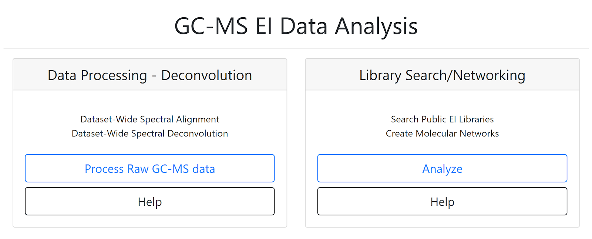
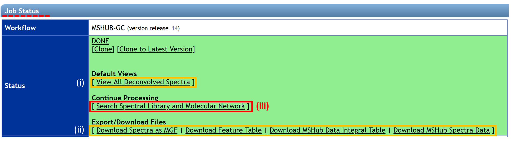

# GC-MS Deconvolution for GNPS

The GC-MS data have to be processed before performing the **spectral library search and molecular networking workflow**. [See more informations here]((gc-ms-gc-ms-library-molecular-network.md)). Below, we describe how to use the GC-MS deconvolution workflow on GNPS that uses MS-Hub. Alternatively, ADAP-MZmine or MS-DIAL can be used.

## GC-MS Deconvolution Workflow on GNPS with MS-Hub

### Configure the Workflow
**1)** Log in to GNPS  ([gnps.ucsd.edu](https://gnps.ucsd.edu/ProteoSAFe/static/gnps-splash.jsp)). If an account has to be created first, refer to GNPS documentation at the [quickstart](https://ccms-ucsd.github.io/GNPSDocumentation/quickstart/) banner. Before starting, files from GC-MS analysis must be converted from proprietary vendor formats to .mzML, or .CDF file formats. To convert, please see our [conversion guide](https://ccms-ucsd.github.io/GNPSDocumentation/fileconversion/). 

**2)** The GNPS home page includes two sections to launch GNPS GC-MS data analysis job, one for data processing - deconvolution and one for GC-MS library search/networking (**Fig. 1**) By clicking on “Process Raw GC-MS data” icon, a job page opens (**Fig. 2**). Start by entering the title of your job (1). Then, the “Select Files” section allows importing existing or previously uploaded dataset(s) from MassIVE. Select the files that need to be processed by clicking on “Select Input Files” (2). A pop-up window appears with three tabs: “Select Input Files”, “Upload Files”, and “Share Files”. To upload files to GNPS using the browser (limited to 20MB), you can use our web drag and drop uploader in the “Upload Files” banner. See the documentation [here](https://ccms-ucsd.github.io/GNPSDocumentation/fileupload/) for more information. Readers following the tutorial can go to the “Share Files” tab, enter the MassIVE accession number for the dataset (e.g. [MSV000084226](https://gnps.ucsd.edu/ProteoSAFe/result.jsp?task=671cd79ac3af4c4493e4025d62d161e1&view=advanced_view)) in the “Import Data Share” box (3), and click on “Import” (4). This specific dataset is now available directly in your GNPS user workspace at “Select Input Files” section (5). Select the input file, who appears highlighted in blue color, and click on “Spectrum files” (6). When the selected files are visible in the “Selected Spectrum Files” box, click on the “Finish Selection” button (7).

**NOTE:** All of the data used for the job must be collected using the same GC protocol (temperature program, column, injection mode). Multiple datasets could be combined as long as the data have been collected using the same protocol. When creating a dataset on MassIVE ([massive.ucsd.edu](https://massive.ucsd.edu/ProteoSAFe/static/massive.jsp)), include “GNPS” and “GC” in the name (As GNPS_GC_Name of the GNPS-MassIVE dataset). See the documentation about [Dataset Creation/Sharing](https://ccms-ucsd.github.io/GNPSDocumentation/datasets/) and an example of a MassIVE dataset [MSV000084226](https://gnps.ucsd.edu/ProteoSAFe/result.jsp?task=671cd79ac3af4c4493e4025d62d161e1&view=advanced_view) for more information. An insufficient volume of data causes unstable deconvolution resulting in spurious low-quality spectra. It is recommended for datasets smaller than ~10 files to use alternative deconvolution solutions such as MZMine2/ADAP, MS-Dial or XCMS. Increasing the number of files, for example, could be done by co-analyzing multiple datasets obtained with the same experimental protocol. 

**Fig. 1**

**Fig. 2**

**3)** The “Advanced MSHub Processing” section displays some automatic setting parameters (related to peak symmetry and baseline adjustment) determined internally by MSHub (**Fig. 3**). The user does not need to provide settings, although they can be set manually, should the user choose to do so. In the “Advanced Clustering” settings, be sure that cluster spectra are turned off (CLUSTER_SPECTRA = NO) (8). The TIME_UNIT must be set as minutes or seconds (8), depending on the chromatography time units of your data (typically the default time units are seconds in NetCDF files and minutes in .mzML files). Then, enter your email address at the bottom (9) and finish by clicking “Submit” (10).

**Fig. 3**

### Inspect the Results

**4)** When the job has been completed, you will receive a notification email and the status “DONE” appears on your GNPS job. All submitted jobs appear under “jobs” link from the GNPS main menu (**Fig. 4**). By selecting the job of interest and clicking on the “Done” button, the “Job Status” window opens with different options (**Fig. 5**) to (i) explore deconvolution results with the “View All Deconvolved Spectra” option, (ii) download quantification results and feature table by clicking on “Download Spectra as MGF” and “Download Quant Table”, or (iii) continue the process with “Process Library Search” tool (11).

**NOTE:** The first line of the feature/quantification table (**Fig. 6**) indicates the retention time (in min.) with a balance score in parenthesis (in percentage). The “Rel. Max Integral” and “Sample\Best order” values relate to the relative proportion of each peak in the data and the ranking of the feature in terms of its size, correspondingly.

**Fig. 4**

**Fig. 5**

**Fig. 6**

## GC-MS data processing with ADAP-MZmine
[to be completed]

## GC-MS data processing with MS-DIAL
[to be completed]

## Page contributors
Alexander Aksenov (UCSD), Melissa Nothias-Esposito (UCSD), Mabel C. Gonzales (UCSD).
