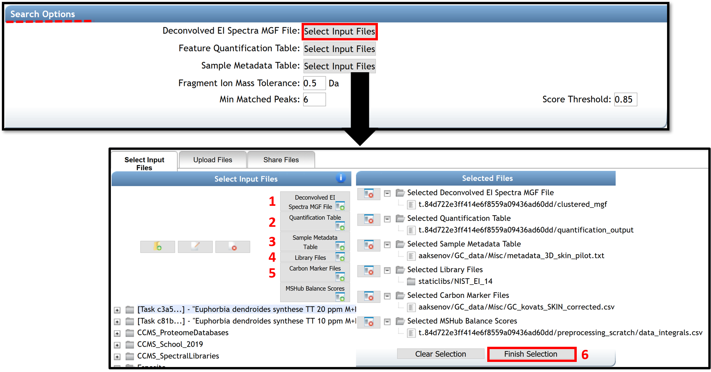
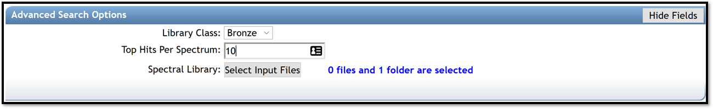
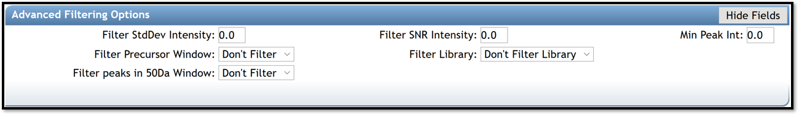
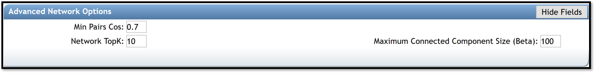
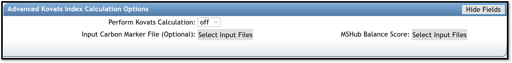

# GC-MS Spectral Library Search and Molecular Networking

## Configure the workflow
There are two options to open the job page for conducting a spectral library search and create a molecular network.

- By clicking on the link “Search Spectral Library and Molecular Network” from the deconvolution job page status. See *GC-MS Deconvolution for GNPS* documentation. 
- By clicking on the “Analyze” icon from the GNPS home page.

****

The **"Search Option" section** in the job window allows importing files needed for the spectral library search and the molecular networking generation. By clicking on "select Input Files", a pop-up window appears, allowing to select every needed file.

(1), (2) The .mgf file containing the deconvolved EI spectra and the .csv feature quantification table automatically (with balance score) adds if the spectral library search is launched from the deconvolution job performed with MS-Hub. Otherwise, they can be added by the user from others processing software (MS-DIAL, MZmine2, etc...). The quantification table is formatted as the MZmine2 output table with a "raw ID", "row m/z", "row retention time" columns, and all the peak area values for all .mzML files.

(3) Select your metadata table formatted as a tab-separated .txt file. To create your metadata table properly, see the documentation [here](metadata.md). 

(4) Public Libraries files are selected by default. However, user could add their libraries on GNPS by following the instructions [here](batchupload.md), or by uploading them in .mgf format (drag and drop on “Upload File” section). If the libraries are curated and could be shared with the community, it is encouraged to upload them to GNPS. 

(5) The carbon marker table should be added. This table must be formatted as a comma separated values (.csv) file in the following headers: Compound_Name - name of the compound (string), Carbon_Number - number of carbons (integer), RT - retention time in seconds (float). [Example File](static/gc_kovats_skin.csv). The file can also be created from the raw experimental chromatograms of the RI marker compounds using MZMine2 as described in this [video tutorial](https://youtu.be/XodHMJcuwnk). 

(6) Click on the "Finish selection" button to close the pop-up window. 

**Search Options** 

- *Fragment Ion Mass Tolerance* is the maximum mass deviation between the observed fragments and the ions selected within the libraries. The mass tolerance setting is related to the accuracy of the mass analyzer. Default value is ± 0.025 Da for high-resolution mass spectrometers (q-TOF, q-Orbitrap) while ± 2.0 Da is recommended for low-resolution MS/MS instruments (ion traps, triple-quadrupole/QqQ).
- *Min Matched Peaks* is the minimum number of common fragment ions that should share a spectra to be considered as a spectral library annotation. This parameter should be tuned depending on the molecules of interest and experimental conditions. It is recommended to perform several jobs modifying this parameter for testing possible outcomes variations in annotations. Typically high quality features contain more than 15 ions in EI data.
- *Score Threshold* is the minimum cosine score to be considered as an annotation in spectral library search. 0.85 value is set as default. This value has been determined to effectively delineate subclasses and Levels 6 and 7, and it usually performs well with data obtained through experiments without derivatization, but that will depend on the quality of the mass spectra obtained. For derivatized compounds, the cosine value for good matches is generally lower by ~0.1 due to an inferior quality of the EI spectra.

The **job window** proposed four fields of advanced search, filtering, network, and Kovats index calculation options. Click on the “Show Fields” button to show advanced options. The default parameters recommended for obtaining good results have been determined and pre-populated as described in the table Parameters for Library Search. However, users are encouraged to adjust the settings as appropriate for their analysis. 

(7) Enter your email address.

(8) The job can be launched by clicking on the “Submit” button.

**Advanced Search Options**

- *Library Class* is the level of library to include hits. Keep default of “Bronze” to include all possible hits from libraries.
- *Top Hits Per Spectrum* is how many top hits ranked by the cosine score to be included into the results. It is recommended to keep this number relatively high (for example, 10 to include top 10 matches) to increase the possibility to have a correct annotation if it is not in the first top hit.
- *Spectral Library* allows to select spectral libraries to include in the search. 

**Advanced Filtering Options**

- *Filter StdDev Intensity* , *Filter Precursor Window* and *Filter Library* are used for tandem MS data.  Leave defaults parameters, "0" and "Don’t Filter", respectively.  
- *Filter SNR Intensity* and *Min Peak Int.* allow to delete all ions with a signal to noise ratio (SNR) or with  a signal, in the EI spectrum, below this value raw intensity. If raw intensities of your data are very low, use a default value of 0.  
- *Filter peaks in 50Da Window* removes peaks that are not on the top 6 most intense within a +/- 50 Da window. If fragmentation patterns contain a large number of small peaks, this filtering should be turned off, as it may filter out relevant peaks that could be signal.

**Advanced Network Options**

- *Min Pairs Cos* is the minimum cosine score required for an edge to be formed between nodes. Lower value will increase the size of the clusters by inducing the clustering of less related spectra, while higher value will be more restrictive. The value set as default is 0.7. This value has been determined to effectively delineate subclasses and Levels 6 and 7, and usually performs well with data obtained through experiments without derivatization. For derivatized compounds, the cosine value for good matches is generally lower due to an inferior quality of the EI spectra.
- *Network TopK* is the maximum of neighbor nodes for one single node. The edge between two nodes are kept only if both nodes are within each other's TopK most similar nodes. 
- *Maximum Connected Component Size* is the maximum number of nodes that can be connected in a single sub-network of a molecular network. This process iteratively breaks up large ‘hairball’ networks (of false positives) by removing the lowest scoring alignments (by cosine score) first until the resulting pieces fall below the maximum size.

**Advanced Kovats Index Calculation Options**

- *Perform Kovats Calculation* is turn on if the user need to calculate Kovats RIs for the compounds during library search.
- *Input Carbon Marker File (Optional)* allows to import your carbon marker file, use for retention index estimation, if needed.
- *MSHub Balance Score* allows to import your file that contains information for the balance score. The balance score is an estimation of mass spectrum patterns reproducibility across the entire dataset only available if deconvolution is conducted using MSHub, if needed. 

**Advanced Dereplicated Options**

These options are only relevant if/when the parent mass information is available, so it is strongly recommended to leave the default values.

## Inspect the Results

After the job has been completed, the **job status page** gives access to several molecular networking results views:

(i) “ View All Library Hits” opens the interface that allows visualization of spectral matches to the reference database from selected libraries. It will display all of the top matches for each feature to different libraries and relevant information including retention time. 

- The displayed columns could be edited by clicking the “Select columns” link in the upper left corner. The possible annotations could be sorted by their cosine value to aid in selecting the best annotation using the researcher's judgment. The “Scan” field corresponds to the feature number in the .mgf file generated at the feature detection step and corresponds to the “No” field listed in the feature table. 
- Clicking on the spectrum icon at the left side of the screen will show a mirror plot comparison between the query spectrum and the reference spectrum. This allows assessing the quality of matches between the deconvolution and the reference spectra. 
- The results can be sorted by the *match score*, *balance score*, *number of shared peaks* in the spectrum (can also be set when launching the job), *TIC*, *Kovats RI* (if enabled by user), and *used library(ies)*. To filter the results, type upper and/or lower boundary values in the text field underneath the corresponding column header and hit "Enter" or click "Filter" button on the left. Cosine and balance score can be jointly used as filters for processing of the final results: the highest quality annotations would require to pass thresholds for both metrics. To ensure highest quality/lowest FDR of the top match, we recommend using the cosine of >0.9 and >60% correspondingly. Alternatively, poor match scores can also be considered if they pass a conservative balance score value of >80% . Note that the high match score simply reflects that a library spectrum exists that is highly similar to the query spectrum (an occurrence that is likely for large libraries and sparse patterns), while a high balance score is reflective of the high confidence in deconvolution of the spectral pattern. Higher values of both metrics would improve quality of matches, but the “optimal” thresholds are data-specific and may be dependent on the circumstances. However, we recommend to use the above values as a good starting point.

(ii) The “View Top Hits” option accesses the list of: top hits (Compound_Name) with the corresponding Scan (feature number), matched library class, cosine, number of shared peaks between library entry and the spectral pattern, abundance as TIC, retention time given in units used in input raw files, and information from the reference library entry, for all annotated spectra.

(iii) The "View All Spectra With Annotations" option gives access to all annotated spectra with the same information listed. In addition, the balance score and Kovats RI values are also listed (if available) to allow including this information into making decisions for feature annotations.

The displayed columns could be edited by clicking the "Select columns" link and selecting/deselecting columns as needed. 

**NOTE**: Clicking the "Download" link in ether view would allow downloading the results as a table will all the associated information for each library hit (including InChi, SMILES and CAS, whenever available); the file with the name "MOLECULAR-LIBRARYSEARCH-GC*.tsv" is in the root of the downloadable compressed folder.

The button at the top of the page “Back to status page” allows going back. To visualize molecular networks generated, the user has to download the input network files from the “Download Cytoscape Data” link, save the folder, and unzip it.

In the job status page, some advanced views are available to visualized qiime2 emperor plots or bi-plots, and to download the associated tables. For more information, follow this [link](https://ccms-ucsd.github.io/GNPSDocumentation/molnetenhancer/#view-qiime2-emperor-plots).

### Cloning a job
If the same analysis needs to be repeated, it is possible to clone the job by clicking “clone” on the job status page. Cloning a job allows users to view all parameters and files that were used and rerun the job with the same, or adjusted parameters and files. Note that if data were imported from private user workspace and not from within MassIVE, other users will not have access to the data and consequently will not be able to rerun or reproduce the GNPS job.  

### Sharing data
The analysis conducted on GNPS as well as the deposited raw data could be shared as a hyperlink to the GNPS job(s) and the MassIVE accession number, correspondingly. GNPS stores data inputs and setting used for the analyses of the data, so the analysis could be shared and reproduced. [See the documentation](datasets.md).

### Adding/Curating reference spectra
High confidence spectra from experimental data or pure standards could be added as a reference spectrum to GNPS for future reference. [See documentation](spectrumcuration.md). If the user wishes to upload >50 reference spectra to GNPS, a batch upload should be used to as detailed in the [online help](batchupload.md). The compliance of the file format can be verified using an online workflow.

## Visualization

### Network Visualization in Cytoscape

The network can be visualized in an external software such as Cytoscape [1], an open-source software platform used to visualize, analyze, and annotate molecular networks from GNPS. Cytoscape is available for download from[ here](http://www.cytoscape.org/). This software allowed to encode any property of the network (i.e. node shape or color, edge thickness) with a metadata category (i.e. cohort, cosine score, compound family). An online tutorial, created with Cytoscape 3.7, used for molecular networking generated with LC-MS/MS data, can be accessed [here](featurebasedmolecularnetworking-cytoscape.md). Many of these steps could be reproduced in the same way for molecular networking from GC-MS data. 

[1] Shannon, P., et al. (2003). Cytoscape: a software environment for integrated models of biomolecular interaction networks. *Genome Res, 13*(11), 2498-2504. doi:10.1101/gr.1239303

**(A)** Here we show an example of molecular networks visualizing in Cytoscape, generated from a study of volatiles related to aging of IPA beer ([GNPS link](https://gnps.ucsd.edu/ProteoSAFe/status.jsp?task=1b300f711b404a3a8a9325352974adcd)). In Cytoscape, the different aging times (0, 1, 2, 3, 4, 5, 6, 8, 12, and 20 days) are represented by different colors, and the metabolites present in the beer (each node) can be mapped on the molecular networks. The size of each node represents the total abundance of the feature and the colors in the pie chart shows the proportions of the compound at different aging duration times (gradient from green to yellow to red). 

**(B)** Zoom in a cluster of terpenes annotated with compounds name is shown as an example. Networking can facilitate the interpretation of data by visualizing chemical changes. In this example, the annotated compounds E-nerolidol and alpha-limonene-diepoxide, framed in pink, appear to be present only in fresh beer (0 days) and disappear as the beer ages. 

**(C)** Other information can be mapped onto the network, for example, the same zoom with cosine values between nodes is shown instead of compound name annotations.

**NOTE**: The name of the node corresponds to the best match of the spectral pattern to the library across the entire dataset. Consequently, for some nodes the top match is not selected as the node's name as there exists other spectral pattern in the data that has better match to the same compound in the library. In such cases, the next best matching annotation is used. 

### Molecular mapping in ili

Spatial distribution of different chemical features could be visualized in 2D or 3D using ili, a visualization app for 3D molecular cartography [2]. ‘ili could be used either on the [website](http://ili.embl.de/) or as a [Chrome extension](https://goo.gl/3KAA8U). For mapping, two files need to be uploaded (DRAG AND DROP): an image for 2D (PNG or JPG format) or model for 3D (STL format), and a .cvs file with the coordinates of the spots on the model that corresponds to the sampled locations. Examples of mapping applications are available on ‘ili [website](https://ili.embl.de/). Here it is demonstrated how to map the volatile data on the same model as shown in the “Human skin metabolome” example. 

[2] Protsyuk, I., et al. (2018). 3D molecular cartography using LC–MS facilitated by Optimus and'ili software. *Nature protocols*, *13*(1), 134.https://doi.org/10.1038/nprot.2017.122

To create the .csv table, download the quantification table from GNPS deconvolution (example [GNPS job](https://gnps.ucsd.edu/ProteoSAFe/status.jsp?task=9127bd48c09b4087ab0fd9a1407b3da1)) output and add four columns with the x, y, z, and radius coordinates from the different sampling points as described [2].  For ease of navigation, the rows with feature descriptors could be deleted. The detailed instructions on creating the correctly formatted table with coordinates are given [here](https://github.com/alexandrovteam/Optimus/blob/master/Obtaining coordinates of sampling spots.md). 

To create chemical maps, drag and drop the example [volatilome table](https://github.com/aaksenov1/Human-volatilome-3D-mapping-) human 3D model. Different parameters can be set such as the spots, the mapping color, or the angles of visualization. To display different features, click on the feature identifier value listed above the color scale on the bottom right corner of the screen and select features to display. To annotate molecular features of interest, refer to the GNPS library search job for the matching features.

## Citation

Aksenov, A. A. et al  [Algorithmic Learning for Auto-deconvolution of GC-MS Data to Enable Molecular Networking within GNPS.](https://www.biorxiv.org/content/10.1101/2020.01.13.905091v1) 

doi: https://doi.org/10.1101/2020.01.13.905091

## Page contributors

Alexander Aksenov (UCSD), Melissa Nothias-Esposito (UCSD), Mabel C. Gonzalez (Universidad de los Andes, UCSD), Louis Felix Nothias (UCSD).

