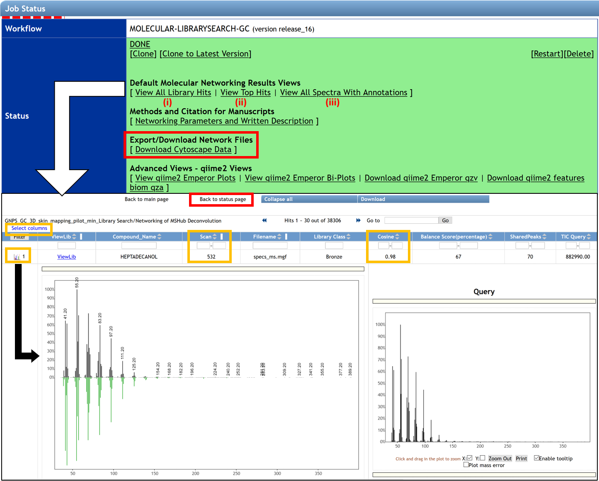

# GC-MS Spectral Library Search and Molecular Networking

## Configure the workflow
There are two options to open the job page for conducting a spectral library search and create a molecular network.

- By clicking on the link “Search Spectral Library and Molecular Network” from the deconvolution job page status. See *GC-MS Deconvolution for GNPS* documentation. 
- By clicking on the “Analyze” icon from the GNPS home page.

****

The **"Search Option" section** in the job window allows importing files needed for the spectral library search and the molecular networking generation. By clicking on "select Input Files", a pop-up window appears, allowing to select every needed file.

(1), (2) The .mgf file containing the deconvolved EI spectra and the feature quantification table automatically adds if the spectral library search is launched from the deconvolution job performed with MS-Hub. Otherwise, they can be added by the user. The quantification table has to include the balance score and is formatted as the MZmine output table.

(3) Select your metadata table formatted as a tab-separated .txt file. To create your metadata table properly, see the documentation [here](metadata.md). 

(4) Library files have to be added. Each user should add their libraries on GNPS by following the instructions [here](batchupload.md), or by uploading them in .mgf format (drag and drop on “Upload File” section). 

(5) The carbon marker table has to be added. This table must have one “Compound_Name” column that includes the name and the number of carbon into parentheses, and another column named “RT_Query” with the retention time in seconds. Readers following the tutorial can use the following carbon marker table file [GC_Covats_SKIN](static/gc_kovats_skin.csv).

 

The **job window** proposed four fields of advanced search, filtering, network, and Kovats index calculation options. Click on the “Show Fields” button to show advanced options. The default parameters recommended for obtaining good results have been determined and pre-populated as described in the table Parameters for Library Search. However, users are encouraged to adjust the settings as appropriate for their analysis. 

(7) Enter your email address.

(8) The job can be launched by clicking on the “Submit” button.

**Table: Parameters for Library Search**

| ***Search Options***                                         |                                                              |                                                              |
| ------------------------------------------------------------ | ------------------------------------------------------------ | ------------------------------------------------------------ |
| **Fillable Field**                                           | **Definition**                                               | **Recommended User Input**                                   |
| Spectrum Files                                               | Selection of files needed to analyze.                        | The deconvoluted files usually are directly included into the Library search/Networking job. Allowed file formats are .mzML or .CDF. |
| FORCE_EXACT_MATCH                                            |                                                              | Keep default value of 1.                                     |
| Precursor Ion Mass Tolerance                                 | Maximum mass deviation between the observed precursor ion and the ions selected within the libraries included in the search. | The choice of the precursor mass tolerance setting usually is influenced directly by the accuracy of the mass analyzer being used to measure the precursor spectra in LC-MS analysis, but modification of this parameter are not meaningful for EI data because there is no precursor ion. 20000 is the default value to encompass all ions. |
| Min Matched Peaks                                            | Minimum number of common fragment ions that should share a spectra to be considered as a spectral library annotation. | Default value is 6, but note that this parameter should be tuned depending on the molecules of interest and experimental conditions. It is recommended to perform several jobs modifying this parameter for testing possible outcomes variations in annotations. Typically high quality features contain more than 15 ions in EI data. |
| Fragment Ion Mass Tolerance                                  | Maximum mass deviation between the observed fragments and the ions selected within the libraries included in the search. | The choice of the precursor mass tolerance setting is influenced directly by the accuracy of the mass analyzer being used to measure the precursor spectra. Default value is ± 0.025 Da for high-resolution mass spectrometers (q-TOF, q-Orbitrap). For low-resolution MS/MS instruments (e.g. , ion traps, triple-quadrupole/QqQ), a PIMT ion mass tolerance of ± 2.0 Da is recommended. Note that this parameters should be tuned depending on data. |
| Score Threshold                                              | Minimum cosine score to be considered as an annotation in spectral library search. | 0.85 value is set as default. This value has been determined to effectively delineate subclasses and Levels 6 and 7 and usually performs well with data obtained through experiments without derivatization, but that will depend on the quality of the mass spectra obtained. For derivatized compounds the cosine value for good matches is generally lower by ~0.1 due to an inferior quality of the EI spectra. |
| ***Advanced Search Options***                                |                                                              |                                                              |
| **Fillable Field**                                           | **Definition**                                               | **Recommended User Input**                                   |
| Library Class                                                | The level of library to include hits from.                   | Keep default of “Bronze” to include all possible hits from libraries. |
| Top Hits Per Spectrum                                        | How many top hits ranked by the cosine score to be included into the results. | The default of 1. It is recommended to keep this number relatively high (for example, 10 to include top 10 matches) to allow for correct annotation selection if it is not a top hit. |
| Spectral Library                                             | Selection of spectral libraries to include in the search.    | Select all appropriate EI libraries by selecting them and clicking “Library Files”. Click “Finish Selection” when completed. Any of the user’s own libraries could be included into the search as long as they are converted into .mgf format. If the libraries are curated and could be shared with the community, it is encouraged to upload them to GNPS as described [here](batchupload.md). |
| Search Analogs                                               | Used for tandem MS data.                                     | Keep default of “Don’t Search”. This option is used for LC-MS data. |
| Maximum Analog Search Mass Difference                        | Used for tandem MS data.                                     | Disabled when above option is set at “Don’t Search”.         |
| ***Advanced Filtering Options***                             |                                                              |                                                              |
| **Fillable Field**                                           | **Definition**                                               | **Recommended User Input**                                   |
| Filter StdDev Intensity                                      | Used for tandem MS data.                                     | It is highly recommended to use a default value of 0 so that no filter is applied. |
| Filter precursor window                                      | Used for tandem MS data.                                     | “Don’t Filter” is set as default for the EI data because there is no precursor ion. |
| Filter peaks in 50 Da window                                 | Removes peaks that are not one of the top 6 most intense within a +/- 50 Da window. | Depending on the deconvolution results, this could be turned on or off: if fragmentation patterns contain a large number of small peaks, this filtering should be turned off, as it may filter out relevant peaks that could be signal. |
| Filter SNR Intensity                                         | All ions with a signal to noise ratio (SNR) in the EI spectrum below this value raw intensity will be deleted. | Use a default value of 0 so that no filter is applied, especially if the raw intensities of your data are very low. This value can be modified by the user for excluding background ions and just include the mass spectra of certain quality. |
| Filter library                                               | Used for tandem MS data.                                     | Don’t Filter is set as default for the EI data because there is no precursor ion. |
| Min Peak Int                                                 | All ions with a signal in the EI spectrum below this raw intensity will be deleted. | Use a default value of 0 so that no filter is applied, especially if the raw intensities of your data are very low. |
| ***Advanced Network Options***                               |                                                              |                                                              |
| **Fillable Field**                                           | **Definition**                                               | **Recommended User Input**                                   |
| Meta-table (Optional)                                        | Selection of metadata to include in the search.              | The metadata file describes the samples properties and allows more flexibility for data analysis and visualization. It is an alternative way to assign groups when selecting data input files within the workflow of GNPS, see an example [here](metadata.md). |
| Min pairs cos                                                | Minimum cosine score required for an edge to be formed between nodes. Lower value will increase the size of the clusters by inducing the clustering of less related spectra, higher value will limit do the opposite. | 0.7 value is set as default. This value has been determined to effectively delineate subclasses and Levels 6 and 7 and usually performs well with data obtained through experiments without derivatization, but that will depend on the quality of the mass spectra obtained. For derivatized compounds the cosine value for good matches is generally lower due to an inferior quality of the EI spectra. |
| Network TopK                                                 | Pairs of nodes are reported only if they are found to be best matches in the topK in both directions that are above the minimum cosine score. | Default is set to 10. This value enables the network to be more or less complex. |
| Quant-table (Optional)                                       | Table including feature ID, retention time (in min.) with balance score, Rel. Max Integral and Sample\Best order. | The quantification table usually is directly included into the Library search/Networking job or can be imported externally. External deconvolution tools do not provide balance score and it will not be available in the search results. |
| Maximum shift between precursors                             | The maximum allowed difference in precursor m/z differences. | Must be set to the higher m/z expected in the analysis for EI data since no precursor information is available (default value of 500) |
| Maximum Connected Component Size                             | Maximum number of nodes that can be connected in a single sub-network of a molecular network. This process iteratively breaks up large ‘hairball’ networks (of false positives) by removing the lowest scoring alignments (by cosine score) first until the resulting pieces fall below the maximum size. | Default setting is 100 – this value can be set to 0 to allow for an unlimited number of nodes or a higher setting can be used for larger data sets or for data sets containing many structurally-related molecules. Low value encourages breaking up the “hairball” clusters but increases the chance that some nodes become disconnected and fall out of the network. |
| ***Advanced Kovats Index Calculation Options***              |                                                              |                                                              |
| Perform Kovats Calculation                                   | Whether to perform calculation of Kovats retention index.    | If the user need to calculate Kovats RIs for the compounds during library search this parameter should be selected. (i) The Input Carbon Marker File could be provided for Kovats markers, but it must be conducted with identical protocol as the rest of the experiment. (ii) The Carbon Marker File is not provided, so the Kovat’s RIs will be estimated based on dataset-wide annotations and perform a polynomial fitting to generate satisfactory regression based in the annotations with higher Cosine and its Kovats RIs (experimental feature, may not be suitable for all datasets). |
| Input Carbon Marker File (Optional)                          | If provided, this information will be used for RI estimation. | The RI markers information should be submitted as a comma separated values (.csv) file in the following format (header followed by names or available reference compounds and their retention times in seconds). |
| Cosine Threshold for Kovats Filter (Can be left blank, experimental feature) | The minimal value of cosine score for the library match to be used for Kovats RI values assignment. | Default value is set at 0.9 to limit inclusion of erroneous annotations that may introduce errors into the calculation. This value can be lower (0.85) for experiments with derivatization because the variation between experimental and theoretical Kovats RIs usually is higher. |
| Kovats Retention Index Filtering Window (+/- %) (Can be left blank, experimental feature) | The allowable error window for the calculated/assigned Kovats RI for the annotation to be retained. | Default of +/-10%. This value can be higher according to the quality of the mass spectra or for experiments with derivatization because the variation between experimental and theoretical Kovats RIs usually is higher. Have in mind that all of the annotations will be shown when exploring results in the browser after completing the job. |
| Retention time window starts/ends (mins) (Can be left blank, experimental feature) | The portion of chromatogram across the dataset to be used for selecting annotations for Kovats RI assignment. | Select values according to the specifics of experiment. The front end portion of chromatogram that contains dead volume elution, solvent delay, solvent peak or otherwise is unusable, as well as back end portion after all of the meaningful compounds have eluted (e.g. bakeout ramp, column bleeding) should be excluded. |

## Inspect the Results

After the job has been completed, the **job status page** gives access to three different views:

(i) “View All Spectra DB” opens the interface that allows visualization of spectral matches to the reference database from selected libraries. It will display all of the top matches for each feature to different libraries and relevant information including retention time. 

- The displayed columns could be edited by clicking the “Select columns” link in the upper left corner. The possible annotations could be sorted by their cosine value to aid in selecting the best annotation using the researcher's judgment. The “Scan” field corresponds to the feature number in the .mgf file generated at the feature detection step and corresponds to the “No” field listed in the feature table. 

- Clicking on the spectrum icon at the left side of the screen will show a mirror plot comparison between the query spectrum and the reference spectrum. This allows assessing the quality of matches between the deconvolution and the reference spectra. 

(ii) The “View All Compounds” option accesses the list of top hits (Compound_Name) with the corresponding cosine and the balance score for all annotated spectra.

(iii) The link “View Kovats Calculation Result” shows Kovats calculation results for each spectrum if selected when launching the job.

The button at the top of the page “Back to status page” allows going back. To visualize molecular networks generated, the user has to download the input network files from the “Download GraphML” link, save the folder, and unzip it.

**NOTE:** The Kovats estimation feature is experimental. When clicking on “View Kovats Calculation Result”, if the following error is displayed: “There was an error retrieving the result data for block ‘main’ of workflow type ‘MOLECULAR-LIBRARYSEARCH-GC’”, this is an indication that the dataset does not contain a sufficient number of reference points for polynomial fitting to generate satisfactory regression (it does not pass internal quality check), because the information for RI reference markers is necessary to generate Kovats estimates for the submitted data. You just need to increase the number of files.

### Cloning a job
If the same analysis needs to be repeated, it is possible to clone the job by clicking “clone” on the job status page. Cloning a job allows users to view all parameters and files that were used and rerun the job with the same, or adjusted parameters and files. Note that if data were imported from private user workspace and not from within MassIVE, other users will not have access to the data and consequently will not be able to rerun or reproduce the GNPS job.  

### Sharing data
The analysis conducted on GNPS as well as the deposited raw data could be shared as a hyperlink to the GNPS job(s) and the MassIVE accession number, correspondingly. GNPS stores data inputs and setting used for the analyses of the data, so the analysis could be shared and reproduced. [See the documentation](datasets.md).

### Adding/Curating reference spectra
High confidence spectra from experimental data or pure standards could be added as a reference spectrum to GNPS for future reference. [See documentation](spectrumcuration.md). If the user wishes to upload >50 reference spectra to GNPS, a batch upload should be used to as detailed in the [online help](batchupload.md). The compliance of the file format can be verified using an online workflow.

## Visualization

### Network Visualization in Cytoscape

The network can be visualized in an external software such as Cytoscape [1], an open-source software platform used to visualize, analyze, and annotate molecular networks from GNPS. Cytoscape is available for download from[ here](http://www.cytoscape.org/). This software allowed to encode any property of the network (i.e. node shape or color, edge thickness) with a metadata category (i.e. cohort, cosine score, compound family). An online tutorial, created with Cytoscape 3.7, used for molecular networking generated with LC-MS/MS data, can be accessed [here](featurebasedmolecularnetworking-cytoscape.md). Many of these steps could be reproduced in the same way for molecular networking from GC-MS data. 

[1] Shannon, P., et al. (2003). Cytoscape: a software environment for integrated models of biomolecular interaction networks. *Genome Res, 13*(11), 2498-2504. doi:10.1101/gr.1239303

**(A)** Here we show an example of molecular networks visualizing in Cytoscape, generated from a study of volatiles related to aging of IPA beer ([GNPS link](https://gnps.ucsd.edu/ProteoSAFe/status.jsp?task=1b300f711b404a3a8a9325352974adcd)). In Cytoscape, the different aging times (0, 1, 2, 3, 4, 5, 6, 8, 12, and 20 days) are represented by different colors, and the metabolites present in the beer (each node) can be mapped on the molecular networks. The size of each node represents the total abundance of the feature and the colors in the pie chart shows the proportions of the compound at different aging duration times (gradient from green to yellow to red). 

**(B)** Zoom in a cluster of terpenes annotated with compounds name is shown as an example. Networking can facilitate the interpretation of data by visualizing chemical changes. In this example, the annotated compounds E-nerolidol and alpha-limonene-diepoxide, framed in pink, appear to be present only in fresh beer (0 days) and disappear as the beer ages. 

**(C)** Other information can be mapped onto the network, for example, the same zoom with cosine values between nodes is shown instead of compound name annotations.

### Molecular mapping in ili

Spatial distribution of different chemical features could be visualized in 2D or 3D using ili, a visualization app for 3D molecular cartography [2]. ‘ili could be used either on the [website](http://ili.embl.de/) or as a [Chrome extension](https://goo.gl/3KAA8U). For mapping, two files need to be uploaded (DRAG AND DROP): an image for 2D (PNG or JPG format) or model for 3D (STL format), and a .cvs file with the coordinates of the spots on the model that corresponds to the sampled locations. Examples of mapping applications are available on ‘ili [website](https://ili.embl.de/). Here it is demonstrated how to map the volatile data on the same model as shown in the “Human skin metabolome” example. 

[2] Protsyuk, I., et al. (2018). 3D molecular cartography using LC–MS facilitated by Optimus and'ili software. *Nature protocols*, *13*(1), 134.https://doi.org/10.1038/nprot.2017.122

To create the .csv table, download the quantification table from GNPS deconvolution (example [GNPS job](https://gnps.ucsd.edu/ProteoSAFe/status.jsp?task=9127bd48c09b4087ab0fd9a1407b3da1)) output and add four columns with the x, y, z, and radius coordinates from the different sampling points as described [2].  For ease of navigation, the rows with feature descriptors could be deleted. The detailed instructions on creating the correctly formatted table with coordinates are given [here](https://github.com/alexandrovteam/Optimus/blob/master/Obtaining coordinates of sampling spots.md). 

To create chemical maps, drag and drop the example [volatilome table](https://github.com/aaksenov1/Human-volatilome-3D-mapping-) human 3D model. Different parameters can be set such as the spots, the mapping color, or the angles of visualization. To display different features, click on the feature identifier value listed above the color scale on the bottom right corner of the screen and select features to display. To annotate molecular features of interest, refer to the GNPS library search job for the matching features.

## Page contributors
Alexander Aksenov (UCSD), Melissa Nothias-Esposito (UCSD), Mabel C. Gonzales (UCSD), Louis Felix Nothias (UCSD).

