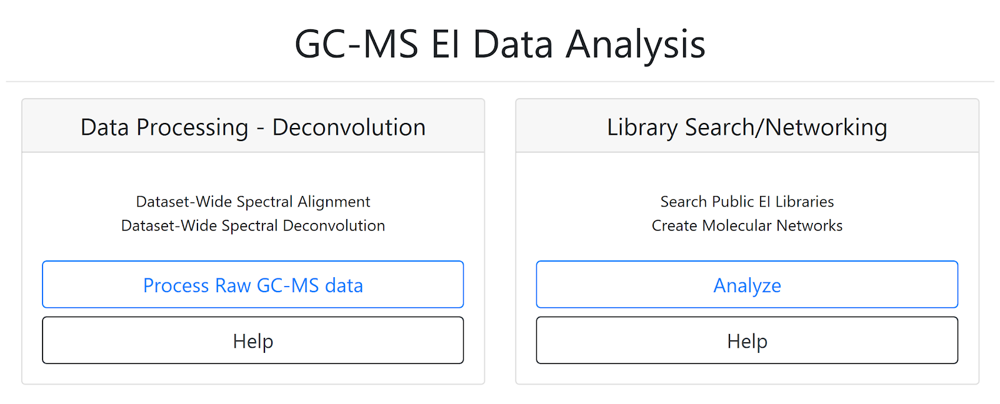

# GC-MS EI Data Analysis

## Introduction

GNPS now offers support for GC-MS data. Two workflows are available.

## GC-MS Deconvolution Workflow

More information **GC-MS online deconvolution workflow** with MS-Hub, or ADAP-MZmine, or MS-DIAL. [See here](gc-ms-deconvolution.md) .

## GC-MS Library Search and Molecular Networking Workflow

More information on the **GC-MS spectral library search and molecular networking workflow** from MS-Hub, MS-DIAL, and ADAP-MZmine results. [See here for more information](gc-ms-library-molecular-network.md). 

## Share Data, Clone Job, and Add Reference Spectra

### Cloning a job
If the same analysis needs to be repeated, it is possible to clone the job by clicking “clone” on the job status page. Cloning a job allows users to view all parameters and files that were used and rerun the job with the same, or adjusted parameters and files. Note that if data were imported from private user workspace and not from within MassIVE, other users will not have access to the data and consequently will not be able to rerun or reproduce the GNPS job.  

### Sharing data
The analysis conducted on GNPS as well as the deposited raw data could be shared as a hyperlink to the GNPS job(s) and the MassIVE accession number, correspondingly. GNPS stores data inputs and setting used for the analyses of the data, so the analysis could be shared and reproduced. [See the documentation](datasets.md).

### Adding/Curating reference spectra
 High confidence spectra from experimental data or pure standards could be added as a reference spectrum to GNPS for future reference. [See documentation](spectrumcuration.md). If the user wishes to upload >50 reference spectra to GNPS, a batch upload should be used to as detailed in the [online help](batchupload.md). The compliance of the file format can be verified using an online workflow.

## Page contributors
Alexander Aksenov (UCSD), Melissa Nothias-Esposito (UCSD), Mabel C. Gonzalez (UCSD), Louis Felix Nothias (UCSD).
