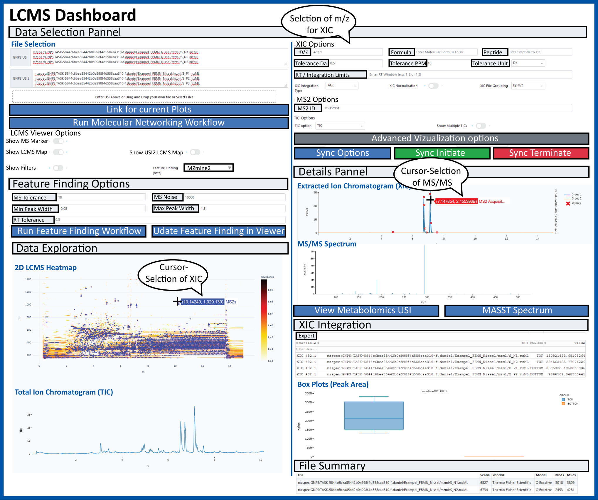
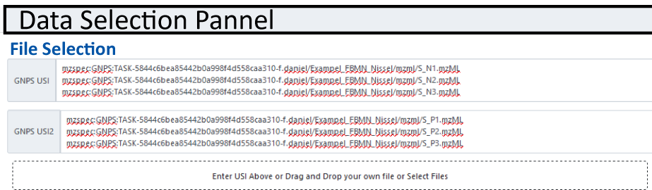
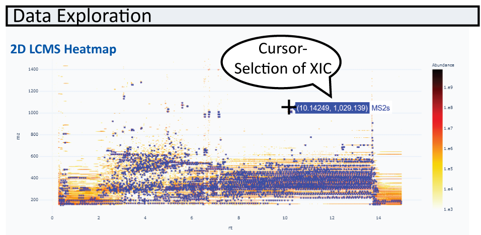
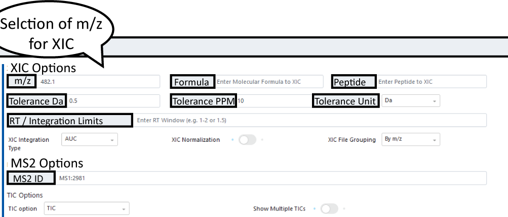
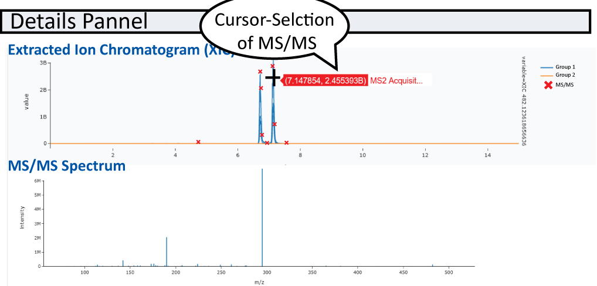
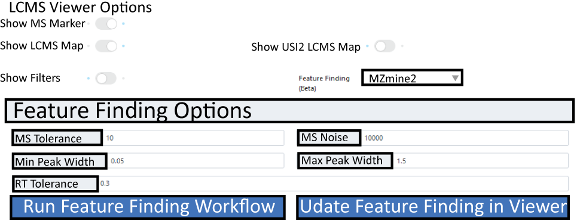

# GNPS Dashboard

The GNPS Dashboard Interface is designed to enable easy collaborative visualization of mass spectrometry data files directly in the browser.

Broadly the data can come from the following sources:

1. MassIVE Public Datasets
1. GNPS Public Datasets
1. Metabolights Public Datasets
1. Metabolomics Workbench Public Datasets
1. GNPS Analysis Data Files (LC and GC)
1. GNPS Quickstart Conversion
1. PRIDE Proteomics Public Datasets
1. ProteomXchange Public Datasets
1. Manual data upload via Drag and Drop

!!! note
    To get a file list for a public dataset or GNPS task, checkout out the [GNPS Dataset Explorer Tool](https://gnps-explorer.ucsd.edu). 
    
We aim to enable the visualization without having users download a single file and to easy share visualizations as a url with all settings preserved and saved. The high level capabilities are:

1. 2D mz vs RT Heatmap
1. XIC/EIC Plots of single and multiple files
1. TIC Plots of single and multiple files
1. Box Plots of XIC/EIC integration between two cohorts of samples
1. Interactive Feature Finding with MZmine2 and Dinosaur
1. Visualization of MS1/MS2 spectra within mass spec files

## Selecting Input Data

### Supported Input Data File Types

1. mzML
1. mzXML
1. CDF
1. Thermo RAW

### Loading your Data

Data must be specified as a universal spectrum identifier. This again can be sourced through several locations as mentioned above. The easiest ways are:

1. Using [GNPS Dataset Explorer](https://gnps-explorer.ucsd.edu/) that enables selecting public datasets
1. Direct links from GNPS analyses 
1. User uploads via the Drag and Drop

A filled in USI selection can be seen below. 

!!! warning
    If you upload your files via the drag and drop, they will be periodically removed after a few months. If you woudl like your data to be more permenant, please make a public MassIVE dataset. Checkout how to do that [here](datasets.md).

## 2D m/z RT Heatmap

Once data is loaded, the first file is visualized as a 2D heatmap in USI1 on the left. When zooming in, the zoomed in data will sharpen.

MS/MS events are indicated as blue crosses (and can be turned off). Feature finding results are marked as green boxes in the heatmap and can be overlayed with other information such as peak areas in gray circles.

!!! note "Showing Two Heatmaps Side By Side"
    Put a second USI in the GNPS USI2 field and then enable the "Show USI2 LCMS Map" toggle to show a second side by side. 

### Heatmap Interactivity

You may navigate around this heatmap interactively. You can zoom in and the visualization will automatically sharpen. Additionally, if you click on "Advanced Visualization Options" it will allow you to set the bounds of the zoom box manually. 

If you click on any of the MS2 markers, it will show the MS2 spectrum as well as add the precursor m/z to the XIC list to be visualized. 

Finally, if you click on any cell in the heatmap, it will add that m/z value to the XIC list to be visualized. 

??? note "Changing Color Scales"
    You may change the color scales by clicking on "Advanced Visualization Options" and selecting the color scales you want to change. 

??? note "Changing Quantization Map"
    You may change the quantization level by clicking on "Advanced Visualization Options". 

??? note "Changing MS2 Marker Visualization"
    You may change the ms2 marker visualization by clicking on "Advanced Visualization Options". 

## TIC Plots

For every LCMS File that is selected, the LCMS Viewer shows the total ion current for the entire LCMS run. Here we have the option of choosing the sum (TIC) or base peak intensity (BPI). 

!!! note 'Multiple TIC for multiple files'
    This is possible by turning on the multiple TIC option. 

!!! note "Interactivity"
    If you click on a point in the TIC plot, we will attempt to find the closest MS1 spectrum and display it in the spectrum panel to the right. 

## XIC/EIC Plots
Obtain single or multiple XIC/EIC plots for one or more files. Masses and mass windows can be specified in the following field:

!!! note
    Default integration type is AUC but options MS1 Sum or MAXPEAKHEIGHT exist under XIC Integration Type dropdown menu

After you specified m/z or multiple m/z separated by ";" under XIC Options, XIC(s) will be plotted. MS/MS events will be displayed in the XIC (if only one file is selected) and can be displayed below the XIC plot. 

Additionally to these XIC plots, we draw XIC heatmap plots. This helps when there are many files for a given XIC value. 

### Teaching Mass Spectrometry Data/Analysis

We think this tool might be a good tool for teaching LC/MS visualization. The Leader/Follower options are a way for students to follow along to get started. Once the initial setup and instruction are done, they can stop syncing and build upon the visualization. We have tested this tool to scale up to a few dozen concurrent followers. If you do intend to use this for a class, please let us know so that we do not do maintenance during your class. 

## Collaborative Visualization

You can share visualizations as URLs and interactively Collaborate. There are several ways to collaboratively view data:

1. Visualize data and send others the visualization link
1. Creating a follower/leader session where you may lead and others may follow (mirror) your activity
1. Creating a fully interative sychronized session (think Google Docs for Mass Spec analysis)

### Sychronized Leader/Follow Visualization Session

To create a visualization as a leader, you will need to do the following

1. Click on Sychronization Options ("Sync Options") to bring up the sychronization modal pop up
1. Select Under Teaching Sychronization (Beta), select LEADER
1. Click Get Token (this protects your session so others cannot hijack being leader)
1. Copy the link under "Follower URL" and send to others to follow your work (Or have followers scan the QR Code)

To initiate following a visualization, you will need to do the following

1. Get a follower URL from your collaborator who will function as the leader (Or scan the QR Code)
1. Watch for updates from your leader

The synchronization will start automatically if you are a follower with the appropriate link.

You may also stop syncing as a follower by clicking the "Sync Terminate" so that you do not receive any more updates. Then you may build upon the visualiation that has been done by the leader. 

### Fully Sychronized Visualization Session

To create a fully sychronous visualization you can do it in the following ways

1. Click on Sychronization Options ("Sync Options") to bring up the sychronization modal pop up
1. Select Under Teaching Sychronization (Beta), select COLLAB and click "Set Sychronization"
1. Copy the Collab URL and send it to your collaborators

Alternatively, if you click on this [link](https://gnps-lcms.ucsd.edu/?synchronization_type=COLLAB), which will
automatically initiate a new sychronization session. You can follow the following steps:

1. Click on Sychronization Options
1. Copy the Collab URL and send it to your collaborators

## Sharing Visualizations

**Individual Images**

Once you are happy with the XIC or MS/MS plots you can export your XIC and spectra as vector graphics (.svg) and view and export values under XIC Integration. 

**Full Visualization**

To share the interactive LCMS-Dashboard view, simply click "Link to these plots" botton on the left and copy the new url. This link saves all the settings in your visualization. If you open it up, it will keep all the data and settings exactly the same. 

## Saving Visualizations

You may save the settings in several ways:

1. Saving the "Link to these plots" as a url 
1. Clicking the "Advanced Import Options" and saving the JSON version of all the settings
1. Clicking the "Advanced Import Options" and downloading the JSON version of all the settings as a file

### Loading Visualization

Conversely you can load settings in multiple ways, and in many ways the opposite of the above for save

1. Clicking on url you saved
1. Clicking the "Advanced Import Options" and update the JSON version of all the settings and clicking "Manual Import"
1. Clicking the "Advanced Import Options" and dragging and dropping the JSON file of all the settings and clicking "Manual Import"

## Box Plots

Integratuion results of XIC(s) for all samples specified in the file selection section are automatically plotted as box-plots between the two default groups (USI1 and USI2)

## Integrated Feature Finding

The GNPS LCMS-Dashbaord, also offers live feature finding options for the first sample selected. To enable the feature finding option, simply select an feature finding tool in the "Feature Finding (Beta)" field. Once selcted a box should expand in which different parameters, such as MS tolerance, noise level and RT tolerance can be specified. 

Once parameters are selcted hit the run/update feature finding botton. Once processed, features will be displayed in teh heatmap as green boxes.
If you are happy with teh setting, there is a direct link for a GNPS workflow to run feature finding with the same settings for full datasets which is directly integrated into the Feature-based Molecular Networking Workflow.

## Integrated Data Overlays

It is possible to overlay any information over the 2D MS Heatmap. The source of the data requires several inputs:

1. A universal data identifier (UDI) - This currently sources data out of GNPS/MassIVE (e.g. mzspec:GNPS:TASK-c95481f0c53d42e78a61bf899e9f9adb-spectra/specs_ms.mgf)
1. Column for the m/z
1. Column for the retention time
1. Optional - Column for the size
1. Optional - Column for the color

### Citation

Soon we'll have a preprint and hopefully a more appropriate publication citation!

!!! cite "Recommended Citation"
	[Mingxun Wang, Jeremy J. Carver, Vanessa V. Phelan, Laura M. Sanchez, Neha Garg, Yao Peng, Don Duy Nguyen et al. "Sharing and community curation of mass spectrometry data with Global Natural Products Social Molecular Networking." Nature biotechnology 34, no. 8 (2016): 828. PMID: 27504778](https://www.nature.com/articles/nbt.3597)

## Page Contributions

{{ git_page_authors }}
