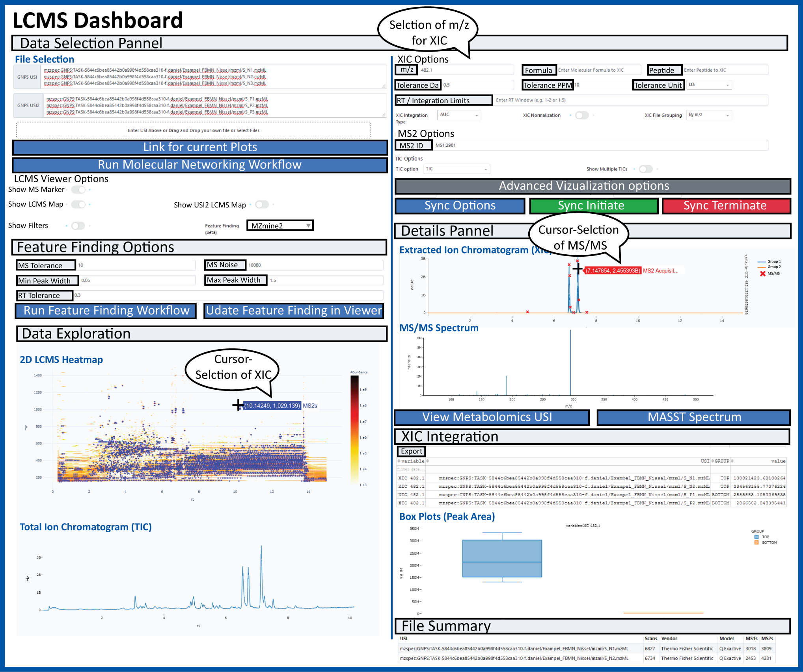
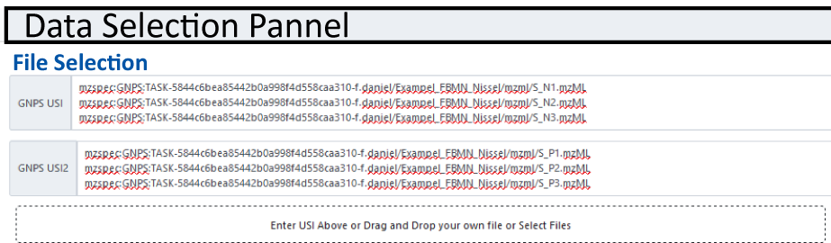
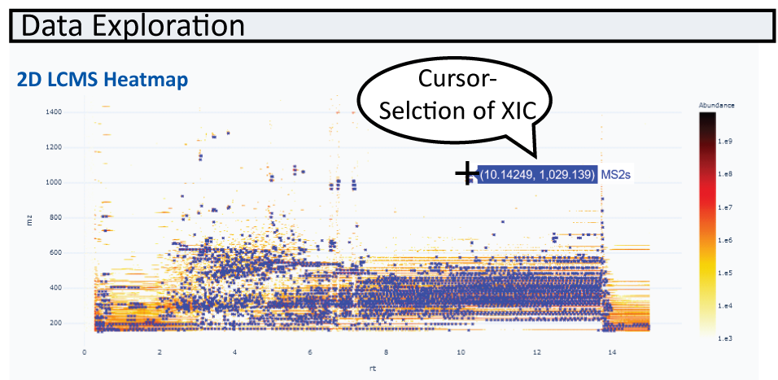
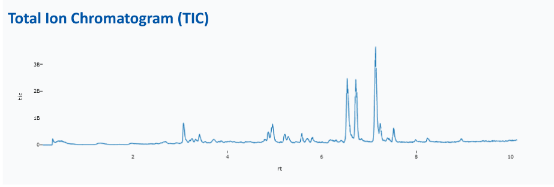
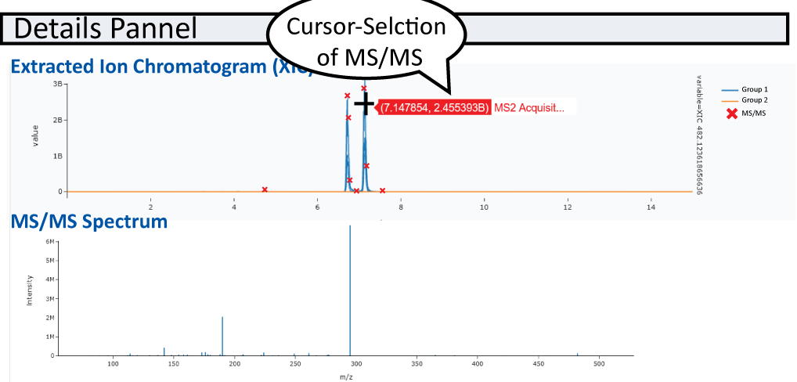
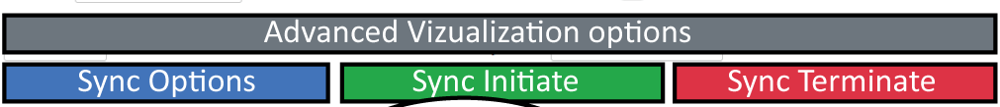
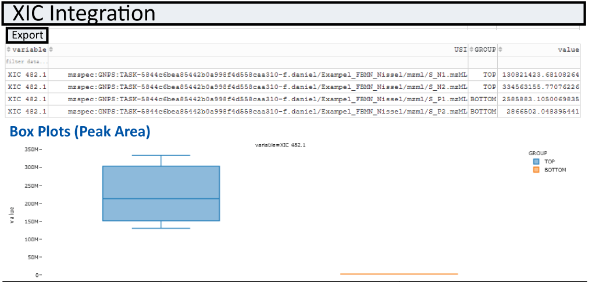

# GNPS LCMS Dashboard

The GNPS LCMS Dashboard Interface is designed to enable easy visualization of mass spectrometry data files directly in the browser.

Broadly the data can come from the following sources:

1. MassIVE Public Datasets
1. GNPS Public Datasets
1. Metabolights Public Datasets
1. Metabolomics Workbench Public Datasets
1. GNPS Analysis Data Files (LC and GC)
1. PRIDE Proteomics Public Datasets
1. ProteomXchange Public Datasets

We aim to enable the visualization without having users download a single file and to easy share visualizations as a url with all settings preserved and saved. The high level capabilities are:

1. 2D mz vs RT Heatmap
1. XIC/EIC Plots of single and multiple files
1. TIC Plots of single and multiple files
1. Box Plots of XIC/EIC integration between two cohorts of samples
1. Interactive Feature Finding with MZmine2 and Dinosaur
1. Visualization of MS1/MS2 spectra within mass spec files

## Selecting Input Data

### Supported Input Data File Types

1. mzML
1. mzXML
1. CDF
1. Thermo RAW

### Loading your Data

Data can be loaded through a repository USI directly in the data selction pannel as showm below, or alternatively thorugh the Dataset Explorer.

## 2D m/z RT Heatmap

Once data is loaded. Teh first file is vizaualized as a 2D heatmap. MS/MS events are indicated as blue crosses. Alternativley Feature finding results can be marked as green boxes in the heatmap and can be overlayed with other information such as peak areas.

## TIC Plots

For every LCMS File that is selected, the LCMS Viewer shows the total ion current for the entire LCMS run. Here we have the option of choosing the sum (TIC) or base peak intensity (BPI). 

!!! note 'Multiple TIC for multiple files'
    This is possible by turning on the multiple TIC option. 

## XIC/EIC Plots
Obtain single or multiple XIC/EIC plots for one or more files. Masses and mass windows can be specified in the following field:

!!! note
    Default integration type is AUC but options MS1 Sum or MAXPEAKHEIGHT exist under XIC Integration Type dropdown menu

After you specified m/z or multiple m/z separated by ";" under XIC Options, XIC(s) will be plotted. MS/MS events will be displayed in the XIC (if only one file is selected) and can be displayed below the XIC plot. 

### Teaching Mass Spectrometry Data/Analysis

We think this tool might be a good tool for teaching LC/MS visualization. The Leader/Follower options are a way for students to follow along to get started. Once the initial setup and instruction are done, they can stop syncing and build upon the visualization. We have tested this tool to scale up to a few dozen concurrent followers. If you do intend to use this for a class, please let us know so that we do not do maintenance during your class. 

## Collaborative Visualization

You can share visualizations as URLs and interactively Collaborate. There are several ways to collaboratively view data:

1. Visualize data and send others the visualization link
2. Creating a session where you may lead and others may follow (mirror) your activity

### Sychronized Leader/Follow Visualization

To create a visualization as a leader, you will need to do the following

1. Click on Sychronization Options
1. Create a session id, this can be anything, random numbers or your name/class
1. Select Under Teaching Sychronization (Beta), select LEADER
1. Click Get Token (this protects your session so others cannot hijack being leader)
1. Copy the link under "Follower URL" and send to others to follow your work

To initiate following a visualization, you will need to do the following

1. Get a follower URL from your collaborator who will function as the leader
1. Click "Sync Initiate"
1. Watch for updates from your leader

You may also stop syncing as a follower by clicking the "Sync Terminate" so that you do not receive any more updates. Then you may build upon the visualiation that has been done by the leader. 

## Sharing Visualizations

Once you are happy with teh XIC or MS/MS plots you can export your XIC and spectra as vector graphics (.svg) and view and export values under XIC Integration  
To share teh interactive LCMS-Dashbaord view, simply click "Link to these plots" botton on the left and copy the new url. 

## Box Plots

Integratuion results of XIC(s) for all samples specified in the file selection section are automatically plotted as box-plots between the two default groups (USI1 and USI2)

## Integrated Feature Finding

The GNPS LCMS-Dashbaord, also offers live feature finding options for the first sample selected. To enable the feature finding option, simply select an feature finding tool in the "Feature Finding (Beta)" field. Once selcted a box should expand in which different parameters, such as MS tolerance, noise level and RT tolerance can be specified. 

Once parameters are selcted hit the run/update feature finding botton. Once processed, features will be displayed in teh heatmap as green boxes.
If you are happy with teh setting, there is a direct link for a GNPS workflow to run feature finding with the same settings for full datasets which is directly integrated into the Feature-based Molecular Networking Workflow.

## Repositories Supported

1. MassIVE Public Datasets
1. GNPS Public Datasets
1. Metabolights Public Datasets
1. Metabolomics Workbench Public Datasets
1. GNPS Analysis Data Files (LC and GC)
1. PRIDE Proteomics Public Datasets
1. ProteomXchange Public Datasets

!!! note
    To get a file list for a dataset, checkout out [GNPS Dataset Explorer Tool](https://gnps-dataset-explorer.herokuapp.com/). 
    

## Page Contributions

{{ git_page_authors }}
