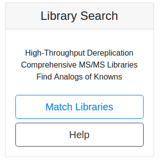

## Spectral Library Search

One of the major limitations in discovering new chemical entities is determining which metabolites are known compounds within complex biological samples. A way to overcome this limitation is to compare the MS2 spectra of the unknown metabolite with a library of MS/MS spectra generated from structurally characterized metabolites. Herein, this comparison is based upon the similarity cosine scoring of MS/MS spectra.  

See [Legacy Documentation](https://bix-lab.ucsd.edu/display/Public/Dereplication+Documentation)

### Dereplication Workflow

From the main [GNPS page](https://gnps.ucsd.edu/ProteoSAFe/static/gnps-splash.jsp), click the ["Match Search"](https://gnps.ucsd.edu/ProteoSAFe/index.jsp?params=%7B%22workflow%22:%22MOLECULAR-LIBRARYSEARCH%22,%22library_on_server%22:%22d.speclibs;%22%7D) button.

This will bring you to the workflow input to start library searching your data.

### Selecting Input Files

Please refer to the file selection [documentation](networking.md#selecting-files-to-analyze) from networking.

### Selecting Spectral Libraries to Search

By default all the public spectral libraries are selected under the folder "speclibs". This includes many different spectral libraries. You can read about and browse these libraries on [GNPS](https://gnps.ucsd.edu/ProteoSAFe/libraries.jsp).

NOTE: Do not change the selection of libraries unless you are an advanced user. Proteomics Spectral libraries will not work with GNPS and cause problems.

### Parameters Walkthrough

#### Search Options

| Parameter  | Description          | Default |
| ------------- |-------------| -----|
| Parent Mass Tolerance | Parent mass peak tolerance  | 2.0 |
| Ion Tolerance | MS2 peak tolerance | 0.5 |
| Score Threshold | Cosine score threshold to make a match | 0.5 |
| Min Matched Peaks | Minimum matched peaks to make a match | 6 |

#### Advanced Search Options

| Parameter  | Description          | Default |
| ------------- |-------------| -----|
| Library Class	| Minimum Library Class to Consider in Search | Bronze |
| Top Hits Per Spectrum | Number of results to return per query spectrum | 1 |
|Search Analogs|Will search data for analogs to library spectra|Don't Search|
|Maximum Analog Search Mass Difference|Maximum mass shift between library and putative analog found| 100 (Da)|

#### Advanced Filtering Options

| Parameter        | Description          | Default | Notes|
| ------------- |-------------| -----| -----|
| Filter stdDev Intensity | Deprecated | 0 | Not recommended to change |
| Minimum Fragment Ion Intensity | All fragment ions in the MS/MS spectrum below this raw intensity will be deleted.  By default, no filter. | 0 | Reduce to 0 if your data's raw intensities are very low. |
| Filter Precursor Ion Window | All peaks in a +/- 17 Da around precursor ion mass are deleted. By default, yes filter. This removes the residual precursor ion, which is frequently observed in MS/MS spectra acquired on qTOFs. | Filter | |
| Filter library | Apply peak filters to library | Filter | |
|Filter peaks in 50Da Window | Filter out peaks that are not top 6 most intense peaks in a +/- 50Da window | Filter | Turn off if your data is very small molecules as it might filter out a lot peaks in the lower mass ranges that might be signal. |

## Exploration of Results

To access your data, either click the link in the email or click the DONE link under Status on the jobs menu page.

| View        | Description          |
| ------------- |-------------|
| View All Spectra Hits | View all library matches |
| View Top Hits | View only top hit per query spectrum |
| View All Compounds | Unique set of compounds in matches |
