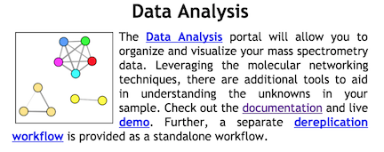

## Spectral Library Search

One of the major limitations in discovering new chemical entities is determining which metabolites are known compounds within complex biological samples. A way to overcome this limitation is to compare the MS2 spectra of the unknown metabolite with a library of MS/MS spectra generated from structurally characterized metabolites. Herein, this comparison is based upon the similarity cosine scoring of MS/MS spectra.  

See [Legacy Documentation](https://bix-lab.ucsd.edu/display/Public/Dereplication+Documentation)

### Dereplication Workflow

From the main [GNPS page](https://gnps.ucsd.edu/ProteoSAFe/static/gnps-splash.jsp), click the ["Dereplication"](https://gnps.ucsd.edu/ProteoSAFe/index.jsp?params=%7B%22workflow%22:%22MOLECULAR-LIBRARYSEARCH%22,%22library_on_server%22:%22d.speclibs;%22%7D) link.

This will bring you to the workflow input to start library searching your data.

### Selecting Input Files

Click any of the "Select Input Files" buttons.

### Selecting Spectral Libraries to Search

By default all the public spectral libraries are selected under the folder "speclibs". This includes many different spectral libraries. You can read about and browse these libraries on [GNPS](https://gnps.ucsd.edu/ProteoSAFe/libraries.jsp).
