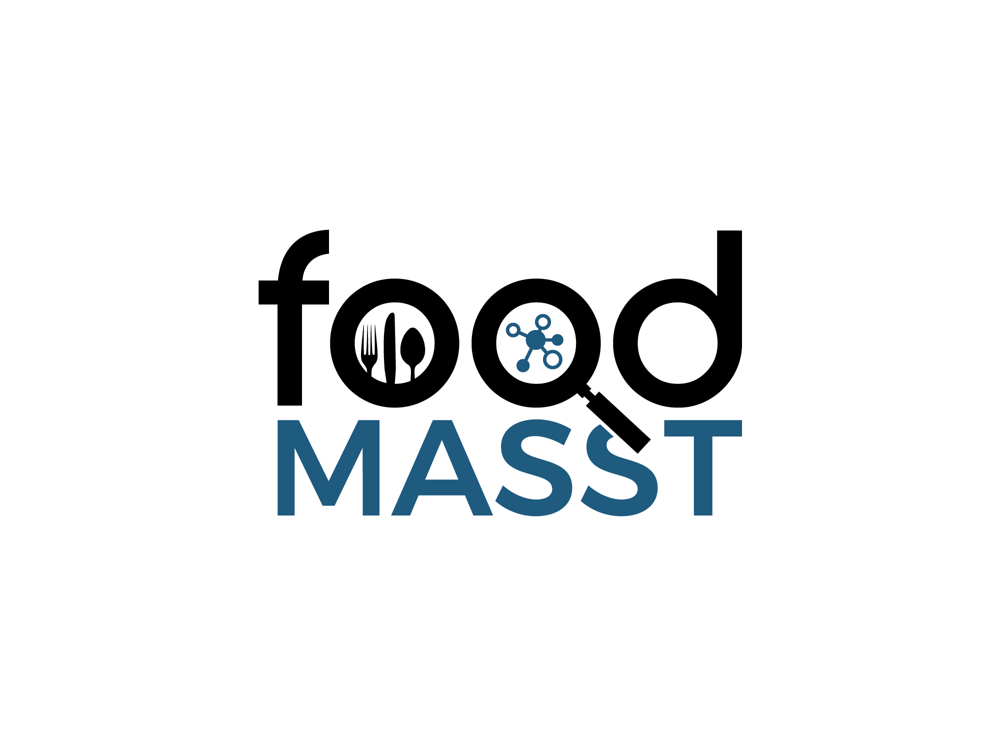

Feel free to use any of the following logos for your presentations. The following logos are licensed as [CC BY](https://creativecommons.org/licenses/by/4.0/).

## GNPS Logo

PNG with white background

PNG with transparent background

PNG with URL

Animated

## MASST Logo

## Global Foodomics

## ReDU Logo

## MolNetEnhancer Logo

## ChemDir Logo

## GNPS Dashboard Logo

## Food MASST

## GNPS FBMN

## MassQL 

Find the full documentation for MassQL [here](https://mwang87.github.io/MassQueryLanguage_Documentation/)!

## Logos for Zoom Background

## Page Contributors

{{ git_page_authors }}
