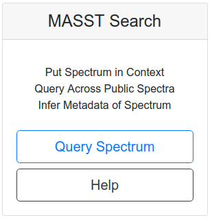
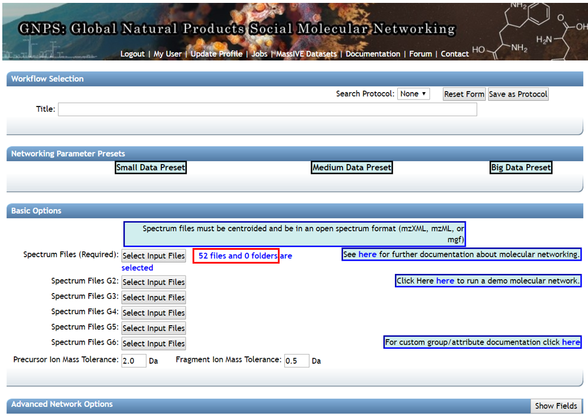

## Overview

Query a single MS/MS spectrum across all public GNPS datasets. The mass spectrometry equivalent of NCBI BLAST helps to put the query spectrum in context of where else it occurs (including sample information) as well as search a single MS/MS spectrum against all public spectral libraries.

## Workflow Selection

To search a single spectrum to see where it occurs in all public GNPS datasets, there are three ways to populate the search.

### 1. MASST Web Interface

Click [here](https://proteosafe-extensions.ucsd.edu/masst) for the standalone MASST search interface:

### 2. Manual Workflow Entering

From the main [GNPS page](https://gnps.ucsd.edu/ProteoSAFe/static/gnps-splash.jsp), click the ["Query Spectrum"](https://gnps.ucsd.edu/ProteoSAFe/index.jsp?params=%7B%22workflow%22:%22SEARCH_SINGLE_SPECTRUM%22,%22library_on_server%22:%22d.speclibs;%22%7D) button.

### 3. From Molecular Networking

In analyzing your molecular networks, you can click the "Search Spec" button on the [View ALL Clusters With IDs](networkingviews.md#view-all-clusters-with-ids) link to pre-populate parent mass and peaks.

## Parameters

The query parameters are similar library search, however, users are required to enter the precursor m/z and peaks.

The peaks input requires a peak per line with mass followed my intensity, separated by a space or a tab. See an [demonstration](https://gnps.ucsd.edu/ProteoSAFe/index.jsp?task=fc961b77a34942408a832fd94da7dbd3) input spectrum.

### Search Options

| Parameter  | Description          | Default |
| ------------- |-------------| -----|
| Parent Mass Tolerance | Parent mass peak tolerance  | 2.0 |
| Ion Tolerance | MS2 peak tolerance | 0.5 |
| Score Threshold | Cosine score threshold to make a match | 0.7 |
| Min Matched Peaks | Minimum matched peaks to make a match | 6 |

### Advanced Search Options

| Parameter  | Description          | Default |
| ------------- |-------------| -----|
| Library Class	| Minimum Library Class to Consider in Search | Bronze |
| Top Hits Per Spectrum | Number of results to return per query spectrum | 1 |
|Search Analogs|Will search data for analogs to library spectra|Don't Search|
|Maximum Analog Search Mass Difference|Maximum mass shift between library and putative analog found| 100 (Da)|

### Advanced Filtering Options

| Parameter        | Description          | Default | Notes|
| ------------- |-------------| -----| -----|
| Filter stdDev Intensity | Deprecated | 0 | Not recommended to change |
| Minimum Fragment Ion Intensity | All fragment ions in the MS/MS spectrum below this raw intensity will be deleted.  By default, no filter. | 0 | Reduce to 0 if your data's raw intensities are very low. |
| Filter Precursor Ion Window | All peaks in a +/- 17 Da around precursor ion mass are deleted. By default, yes filter. This removes the residual precursor ion, which is frequently observed in MS/MS spectra acquired on qTOFs. | Filter | |
| Filter library | Apply peak filters to library | Filter Library | |
|Filter peaks in 50Da Window | Filter out peaks that are not top 6 most intense peaks in a +/- 50Da window | Filter | Turn off if your data is very small molecules as it might filter out a lot peaks in the lower mass ranges that might be signal. |

## Results

Query results are separated into two categories, spectral library search and GNPS dataset queries. Spectral library search results are presented in a similar fashion as the batch library search workflow, please refer to that [documentation](librarysearch.md).

The top scoring match to public GNPS datasets are listed in the "Dataset Matches".

The quality of the match can be inspected by clicking the "plotting" icon at the left of each row. Further, we can drill down to the exact files within each dataset that spectrum matched to by clicking "View File Matches in Dataset".

This view provides the full file path for all the files from each dataset along with the associated metadata for each file.

## Re-analysis of found files

Clicking on [Analyze Files Found With Molecular Networking] will select all of the individual files identified through the single spectrum search and place them into a group. 

## Citation

Preprint available at: https://www.biorxiv.org/content/10.1101/591016v1 
For the time being, please cite the GNPS publication.
