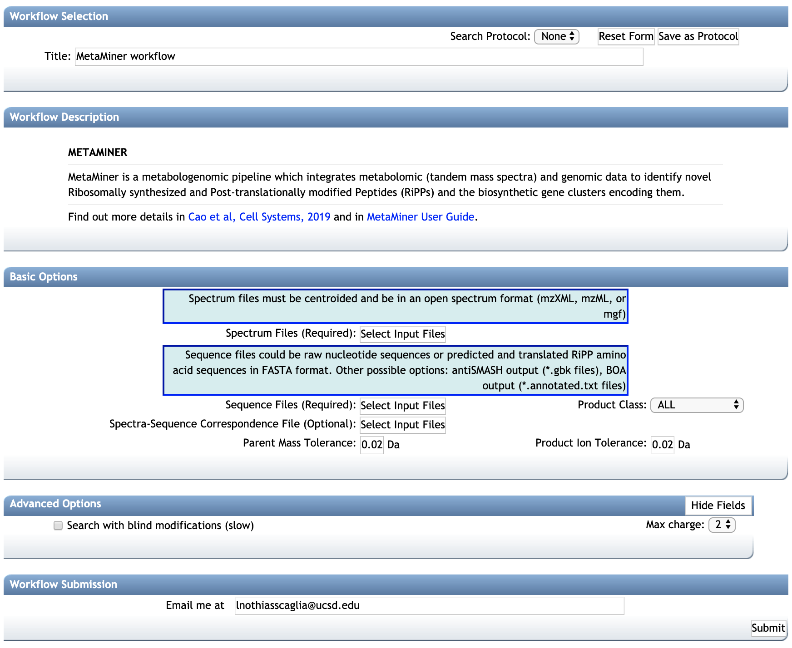

# MetaMiner

## Introduction

**MetaMiner** is a metabologenomic pipeline which integrates metabolomic (tandem mass spectra) and genomic data to identify novel Ribosomally synthesized and Post-translationally modified Peptides (RiPPs) and the biosynthetic gene clusters encoding them. See Cao et al, *Cell Systems*, In press (2019) [https://doi.org/10.1016/j.cels.2019.09.004](https://www.sciencedirect.com/science/article/abs/pii/S2405471219303126) for more informations.

**MetaMiner** is developed in collaboration of [Carnegie Mellon University](http://mohimanilab.cbd.cmu.edu), [Saint Petersburg State University](http://cab.spbu.ru) and the University of California San Diego (CA, USA) under the Apache 2.0 License. 

The detailed documentation of MetaMiner can be accessed 
[here](https://github.com/ablab/npdtools/blob/master/docs/MetaMiner.md).

Below we are describing how to use **MetaMiner** on GNPS.

## Manuscripts and Citations

If you used **MetaMiner**, please cite the corresponding manuscripts:

**MetaMiner**: Cao et al, *Cell Systems*, In press (2019) [https://doi.org/10.1016/j.cels.2019.09.004](https://www.sciencedirect.com/science/article/abs/pii/S2405471219303126).

**DEREPLICATOR**: Mohimani et al., Dereplication of Peptidic Natural Products Through Database Search of Mass Spectra, *Nature Chemical Biology*, 13, 30–37 (2017). [https://doi.org/10.1038/nchembio.2219](https://doi.org/10.1038/nchembio.2219).

## Development

The standalone version of **MetaMiner** and the latest version is available in the Natural Product Discovery toolkit (NPDtools) at [https://github.com/ablab/npdtools](https://github.com/ablab/npdtools).

## Accessing the MetaMiner Workflow on GNPS

The **MetaMiner** workflow is available on GNPS on the [in silico tools page](https://gnps.ucsd.edu/ProteoSAFe/static/gnps-theoretical.jsp).

#### STEP 1: Go to GNPS
Go to [http://gnps.ucsd.edu](https://gnps.ucsd.edu/ProteoSAFe/static/gnps-splash.jsp), and create/login to your account.

#### STEP 2: Access MetaMiner
Find the "In Silico Tools" box and click on "Browse Tools".

Open the MetaMiner workflow.

#### STEP 3: SELECT YOUR FILES

**Select the Spectrum Files (Required)**:
Select the tandem mass spectra file(s). The input format accepted are mzML/mzXML/MGF. Note that have the option to import an existing GNPS dataset (by clicking on "Share Files") or upload your own data (by clicking on "Upload Files"). See the corresponding GNPS documentation for FTP upload [here](fileupload.md). After getting done with selecting files, click on Finish Selection.

**Select the Sequence File (Required)**: Select the sequence file(s) or a directory with multiple sequence files inside. In the latter case, NPDtools recursively walks through the directory and picks up all files with appropriate extensions (.fna, .fasta, or .fa for nucleotide or amino acid FASTA files, .gbk for antiSMASH output, .txt for BOA output). You can specify an unlimited number of input sequence files/directories, they will be processed independently (see also --correspondence option below). We determine sequence file type by its extension. For separating between nucleotide and amino acid FASTA files, the content of a few first entries is analysed. At least one sequence file is required unless correspondence file with RefSeq IDs is specified. 

**Select the Correspondence File**: 
Path to a file describing correspondence between sequence and spectra files. The file should be tab-separated and has two columns listing basenames of spectra and sequence files. Sequence column may include RefSeq IDs prefixed with `#RefSeq:`. In the latter case, the corresponding references are automatically downloaded from NCBI. 

Note that if a correspondence file not provided, the all-vs-all analysis is performed between the spectrum and sequences files.

#### STEP 4: CONFIGURE
**Configure the parameters for the MetaMiner job**:
Select a title for your job, and adjust parameters depending on your data and the mass spectrometer used.

##### BASIC OPTIONS:

  -- **Parent Mass Tolerance**:  This value specifies how much fragment ions can be shifted from their expected m/z values. Default value is ± 0.02 Da for high-resolution instruments (q-TOF, q-Orbitrap) and ± 0.5 Da for low-resolution instruments (ion traps, QqQ).

  -- **Product Ion Tolerance**: This value specifies how much fragment ions can be shifted from their expected m/z values. Default value is ± 0.02 Da for high-resolution instruments (q-TOF, q-Orbitrap) and ± 0.5 Da for low-resolution instruments (ion traps, QqQ).

  -- **Product Class**: MetaMiner can search for multiple class of RIPPS. Select the class of interest or search for all class by selecting "ALL". 

##### ADVANCED OPTIONS:

  -- **Search blind modification (slow)**: By default is deactivated. If activated will search for new post translational modifications with arbitrary mass shifts. The computation will slower but will generally produce more annotations.

  -- **Max charge**: Maximum charge allowed.

#### STEP 5: VIEW RESULTS
**See the MetaMiner job status**:

The status of the job can be vizualized in your account job list, and through the link in provided in email you will received when the job is done.

The job can be *Cloned*, for further parameters modifications. Summary Statistics and Workflow Parameters can be consulted on the respective links. The job can also be cloned to the latest workflow version with "Clone to the Latest Version"

##### Significant Matches
Clic on *View Unique Peptides* (recommended), to have get the list of peptide-to-spectrum annotation.

Clic on the *View All PSM* (Peptide-Spectrum Match) to have detailed view of the peptides-to-spectrum annotations.

#### STEP 6: Explore the MetaMiner annotations:
Each MetaMiner annotation is presented as row in the results table.
Annotations can be sorted using various column (usually the score or the p-value), or a compound name can be searched with the filter function.

The proposed peptide sequence is indicated "FragmentSeq" column. If you searched for blind modifications, the "ModifiedSeq" will display the amino acids that are modified and the modification. fragments table, lists the ion fragments that matched with the fragmentation tree, along with their mass error, charge and intensities.

The score and p-value indicates the significance of the peptide-to-spectrum annotation. Significant annotations are found in *View Unique Peptides*. Unreliable annotations can be found in *View All Matches (Including Unreliable Ones)*.

#### STEP 7: VALIDATE
**Validate a MetaMiner annotation**:
MetaMiner uses both the genome mining and tandem mass spectra annotation. This corresponds to a level 2 annotation based on Metabolomics Standard  Initiative, since the stereochemistry of peptide is uncharacterized. Nevertheless, the annotation should be supported by additional informations.

##### Validating a MetaMiner annotation to MSI level 1.

- A level 1 MSI identification can be achieved of the reference material is available for the compound, by ordering the compound and analyzing it with the same method LC-MS/MS. The MS/MS spectrum and retention time should be identical between the observed and reference MS/MS spectra (co-injection can be done to verify retention time).

##### Annotation with the MetaMiner (MSI level 2 or 3),:
- The MS/MS spectrum from the raw file must be inspected (consistency, noise level, ...)

- The adducts detected must be confirmed using the MS1 spectrum (mono-charged, di-charged ?, protonated adduct ?, ...). This can be done with MZmine or other feature detection software.

- The molecular formula must be verified. [Sirius](https://bio.informatik.uni-jena.de/software/sirius/) can be used for that (only for single-charged compounds).

- Look at the biological source(s) (species) for the peptidic natural product (Google scholar, Dictionnary of Natural Products, AntiMarin, MarinLit, ...), to see if it is consistent with the species analyzed.

#### STEP 8 (Optional): Mapping MetaMiner Annotation on Molecular Networks
Mapping MetaMiner Annotation on Molecular Networks is not trivial if multiple spectrum sequence files are used.

When one sequence file is used, it is possible to use either the classical or feature-based molecular networking workflows as indicated below:

**[Option 1 - Classical Molecular Networking]**

1. Run a classical molecular networks with the spectral data (Files format can be mzML/mzXML/MGF). [See the following documentation](networking.md).

2. Download the molecular networks clustered data (.MGF file). Click on *Download Clustered Spectra as MGF*.

**[Option 2 - Feature-Based Molecular Networking]**

1. Run a feature-based molecular networking workflow. [See the following documentation](featurebasedmolecularnetworking.md).

2. Export the .MGF file to GNPS for MetaMiner analysis.

3. Upload the .MGF file to GNPS, and run a MetaMiner job (see present documentation).

4. When the job is completed click on *View Unique Peptides*.

5. In the *View unique Peptide* page, download the .TSV annotation file. Click on download with Download button and unzip the file.

6. Open the molecular networks with Cytoscape. [See documentation here](cytoscape.md), and here for [Feature-Based Molecular Networking](featurebasedmolecularnetworking-cytoscape.md)

7. In Cytoscape, import the .TSV table as attribute table. In Cytoscape go to *File / Import / Table / File* and select the .TSV annotation file for the dereplicator (see above).

8. In the preview window, click on the *Scan* header to set the meaning to *Key*.

9. Select/Unselect column as needed, and eventually change the name for table header if they are already in the molecular networks (otherwise, they will be replaced with the new table imported).

## Page contributors
Alexey Gurevich (Saint Petersburg University), Hosein Mohimani (Carnegie Mellon Univ.), Louis Felix Nothias (UCSD).

## Contribute to the Documentation

- For informations/feature request, please open an "Issue" on the [*CCMS-UCSD/GNPSDocumentation*](https://github.com/CCMS-UCSD/GNPSDocumentation) GitHub repository.
- To contribute directly to the GNPS documentation, fork the [*CCMS-UCSD/GNPSDocumentation*](https://github.com/CCMS-UCSD/GNPSDocumentation) repository, and make a "Pull Request".
