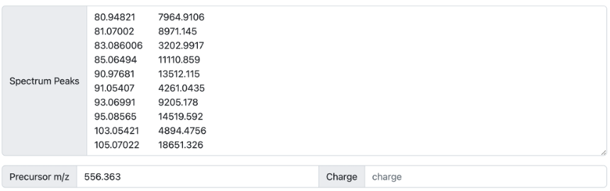

# microbeMASST

[MicrobeMASST](https://masst.gnps2.org/microbemasst/) is a domain-specific MASST that allows users to search for one or multiple MS/MS spectra against a reference database of MS/MS data acquired from bacterial and fungal monocultures that have been deposited and made publicly available on GNPS-Massive (current version is updated to July 2022).

Users are able to search for both known and unknown MS/MS spectra. 

## INPUT

The input to any MASST search is a MS/MS spectrum. If the users want to search for already known molecules, which spectra have been deposited in the [GNPS libraries](https://library.gnps2.org/), they can simply enter the known library spectrum associated with them (Figure 1). As of January 2023, the GNPS libraries contain ~600K spectra. 

**Figure 1**

Another way users can search for an MS/MS spectrum using an Universal Spectrum Identifiers (USI) is to deposit their data in Massive and inspect it using the [GNPS Dashboard](https://dashboard.gnps2.org/). Using the example already provided in the Dashboard (mzspec:MSV000084494:GNPS00002_A3_p), we can inspect a MS2 scan (54) and click on “View Metabolomics USI” (Figure 2A). A new prompt will open that allows to inspect the spectrum (Figure 2B). Under Spectrum USI is possible to retrieve the USI of the spectrum which can be then copied and pasted into microbeMASST for the search (Figure 2C).

**Figure 2A**

**Figure 2B**

**Figure 2C**

Finally, users can search for MS/MS spectra by manually providing a list of ions and their intensities (Figure 3). In this case, the m/z of the precursor ion of interest must be specified while the charge is not required.

**Figure 3**

## SEARCH

Default search parameters are provided (Figure 4). These include a 0.05 Da tolerance for both the parent mass (precursor m/z) and the fragment ions. A cosine threshold of minimum 0.7 and at least 3 matching peaks. These parameters can be modified by the users. Users can also decide to include analogs in their search (default is analog search OFF) by providing delta mass boundaries for the precursor mass. 

Users will have to click on “Search microbeMASST by USI” if they provided a USI for the search or “Search microbeMASST by Spectrum Peaks” if they provided a list of fragment ions and their intensities for the search. The search job setting can be shared with other users by clicking on “Copy Link”, making each job reproducible. Finally, by clicking on “Open External MASST Search Results” a new [fastMASST webpage](https://fasst.gnps2.org/) that will search for the spectrum of interest against the whole GNPS repository and report all samples in which that specific spectrum was found.

**Figure 4**

## OUTPUT

The primary output of the microbeMASST search consists of an interactive taxonomic tree (Figure 5).  All bacterial or fungal samples in which the spectrum of interest was found are categorized according to their taxonomy. By default, the tree is showing information up to Species level. This can be modified by changing the “Show level” parameter. Taxonomic ranks from Phylum to Species can be represented. The “Minimum matches” parameter indicates how many matches must be found for a specific node to be visualized. We advise to keep this to 1 since microbeMASST is intended to be a discovery tool, allowing the formation of hypothesis rather than unambiguous results. The full tree information can also be visualized by changing the “Tree” setting from Matched to Full.

**Figure 5**

By moving the cursor on each node, the contained information can be visualized (Figure 6). This includes not only the name of the taxon, but also its NCBI ID, its taxonomic rank, and the number of samples of this specific taxon that presented the MS/MS spectrum of interest. The total number of available samples for that specific taxon in the reference database is also reported. This information allows to calculate an occurrence ratio, which is also visualized in the form of the pie chart.

**Figure 6**

By clicking the “Library matches” tab, a list of matching metabolites present in the GNPS libraries can be visualized (Figure 7). In this example case, we used the MS/MS spectrum of phenylalanine – cholic acid (Phe-CA) and obtained a near perfect match to the Phe-CA spectrum deposited in the GNPS library. Interactive links allow to further investigate the molecule. Moreover, the annotation process utilizes the also the GNPS Suspect Library, maximizing annotation rates when unknown molecules are investigated. It is worth noting that annotations from the GNPS Suspect Library are generally less reliable than matches to the classic libraries since they are predictions. Finally, result tables can be copied or exported in Excel.

**Figure 7**

The “Dataset matches” tab contains a table summarizing all matching samples (Figure 8). Here, not only the name, NCBI ID, and taxonomic rank of the taxon can be found but also the number of matching fragments. Raw files can be directly opened in the GNPS Dashboard by clicking "Open file" for further investigation. When the MS/MS spectrum of interest has been searched through USI of deposited samples in GNPS-Massive, a mirror plot between the matching spectra can be visualized following the link in the USI column.

**Figure 8**

Finally, the “Taxa matches” tab returns a list of all the matching taxa at every taxonomic level (Figure 9). In this example, Phe-CA has been found in 18 samples out of the 44,836 bacterial samples present in microbeMASST, with an occurrence ratio of 0.0004. Nevertheless, when looking at sample acquired from *Bifidobacterium adolescentis* cultures, 4 out of the 15 deposited samples presented Phe-CA, giving an occurrence ratio of 0.2667

**Figure 9**

## Page Contributors

{{ git_page_authors }}
